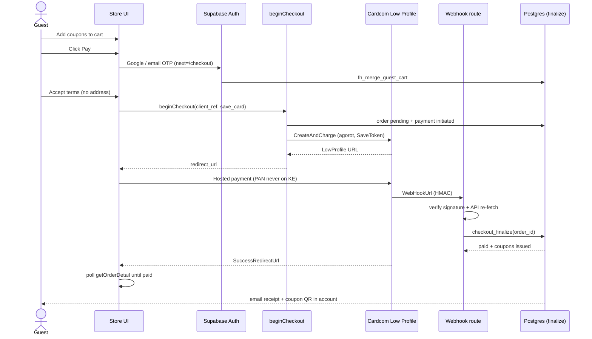
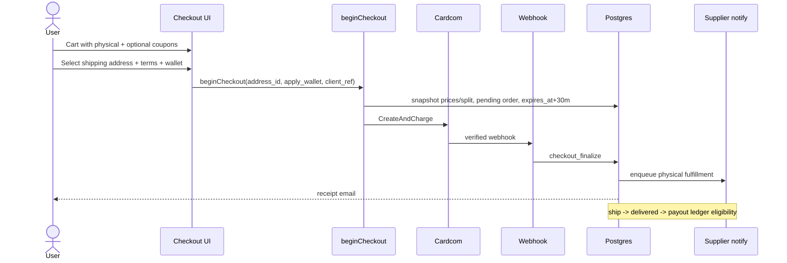
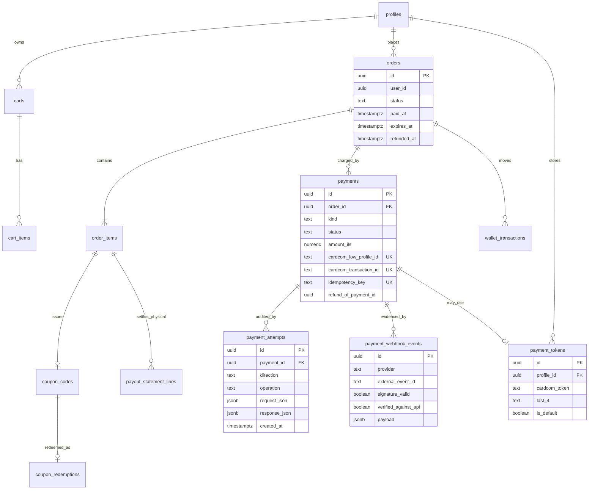
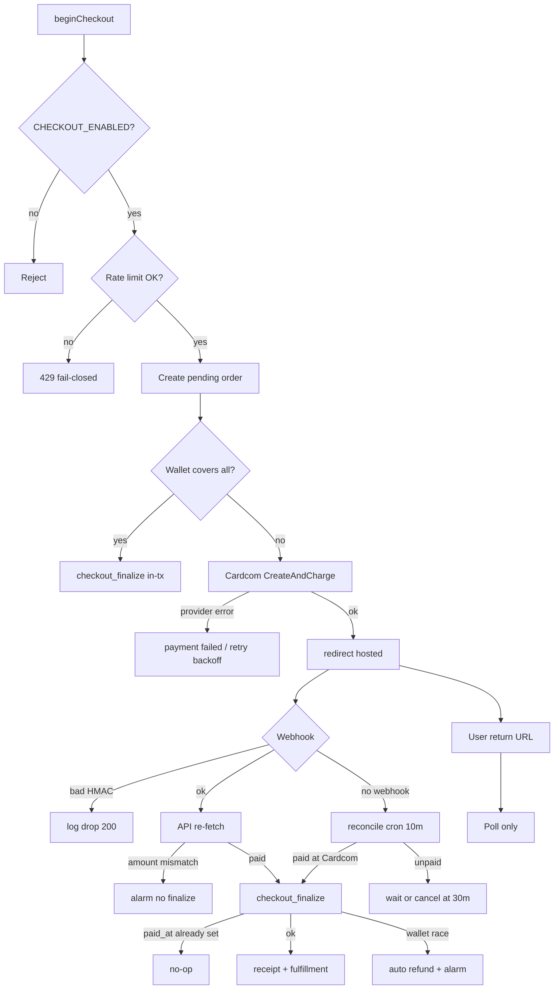

# Checkout + Payment Engine: System Architecture

Status: DESIGN ONLY. Zero implementation in this document.
Date: 2026-07-20. Branch: `phase5/homepage`.

## Authority and companions

| Document | Role vs this doc |
|---|---|
| `docs/ARCHITECTURE-COMMERCE.md` | Money model, split snapshot, wallet ledger, order/payment/coupon state machines (base) |
| `docs/ARCHITECTURE-API-CONTRACTS.md` Domain D | Wire contracts for beginCheckout, webhook, refund |
| `docs/ARCHITECTURE-SECURITY.md` §1.3, SEC-08 | Webhook forgery, rate limits, PCI SAQ-A |
| `docs/ARCHITECTURE-LEGAL-COMPLIANCE.md` §2 | Cancellation windows, refund-to-card vs wallet |
| `docs/ARCHITECTURE-ACCOUNT-IDENTITY.md` | Google/OTP at pay click, merge guest cart, payment_tokens hardening |
| `docs/ARCHITECTURE-SUPPLIER-REDEMPTION.md` | Physical settlement + coupon redeem |
| `ARCHITECTURE-CART-CHECKOUT.md` | **Missing as of this date.** Cart UX and cart→checkout handoff intended there; this doc owns payment onward and references COMMERCE for cart schema |

**Precedence on payment pipeline conflicts:** SECURITY (controls) > LEGAL (refund rights) > this document > COMMERCE / API-CONTRACTS for checkout-payment lifecycle detail. Business split rules stay in COMMERCE / BUSINESS-MODEL.

**Single PSP, decided:** Cardcom is the only payment rail. Tokenization is Cardcom only (`payment_tokens.cardcom_token`). No second PSP is planned and no other provider appears anywhere in this design.

---

## 0. One-sentence model

Customer pays on a Cardcom-hosted Low Profile page (or via a saved Cardcom token). Our servers never see PAN. A verified webhook (or synchronous token-charge result) is the only event that may call `checkout_finalize(order_id)`, which flips `paid_at`, issues coupons / notifies suppliers, moves wallet money, and enqueues receipt + fulfillment. Redirect URLs are cosmetic.

---

## 1. Checkout state machine

### 1.1 End-to-end pipeline

```
[CART]
   |
   |  guest browse / add (no auth)
   v
[IDENTITY GATE]  ---- Google OAuth or email OTP ----+
   |  (triggered only on "Pay")                     |
   |  merge guest cart via fn_merge_guest_cart      |
   v                                                |
[CHECKOUT SESSION]                                  |
   |  coupon-only: email + terms                    |
   |  physical (auth user): shipping address        |
   |  optional: apply wallet credit (validate only) |
   |  CSRF + rate limit begin_checkout 10/min       |
   v                                                |
[ORDER SNAPSHOT]                                    |
   orders.status = pending                          |
   expires_at = now() + 30 minutes                  |
   payments.status = initiated -> redirected        |
   |                                                |
   |  Cardcom Low Profile CreateAndCharge           |
   |  (or wallet-covers-all: skip Cardcom)          |
   v                                                |
[HOSTED PAYMENT]  Cardcom domain / iframe (PCI)     |
   |                                                |
   +-- SuccessRedirectUrl --> /checkout/return (poll, no writes)
   +-- FailedRedirectUrl  --> /checkout/failed  (poll, no writes)
   +-- WebHookUrl         --> POST /api/payments/cardcom/webhook
   |                                                |
   v                                                |
[WEBHOOK HANDLER]                                   |
   1. log raw payload (payment_attempts + webhook_events)
   2. verify HMAC signature
   3. server-to-server re-fetch amount/status
   4. call checkout_finalize(order_id)
   v                                                |
[ORDER FINALIZED]  paid_at set, valuable side effects
   |
   +-- coupon lines  --> issue codes + QR, email, account
   +-- physical lines --> supplier notify, ship track, delivered
   +-- receipt email + personal area
   +-- fulfillment / payout eligibility queue
```

### 1.2 Order status (header)

Canonical enum (COMMERCE / API-CONTRACTS):

```
pending
  --(checkout_finalize success)------------------> paid
  --(expires_at cron OR all lines cancelled)-----> cancelled

paid
  --(some physical shipped/delivered; coupons issued)--> partially_fulfilled
  --(all lines terminal: delivered | coupon issued)----> fulfilled

paid | partially_fulfilled | fulfilled
  --(admin / legal refund path complete)----------> refunded
```

Invariants:
- `pending` holds **no** wallet debit, **no** coupon codes, **no** stock decrement.
- `paid_at IS NULL` until `checkout_finalize` succeeds exactly once.
- Browser success/fail redirects never mutate order or payment status.

### 1.3 Payment status (per attempt row)

```
initiated --(Low Profile URL created)--> redirected
redirected --(verified success)-------> succeeded
redirected --(verified decline / abandon + expiry)--> failed
initiated | redirected --(user cancel before charge)--> cancelled
succeeded --(refund payment row confirmed)----------> refunded  (original row)
```

Separate `payments` row for each charge / token_charge / refund (`kind`).

### 1.4 Order item status (`item_status`, not "line_status")

```
pending (at order create)
  --(finalize, coupon product)--> issued
  --(finalize, physical)-------> pending (awaits supplier) then shipped -> delivered
  --(refund / cancel)----------> refunded | cancelled
```

Refund path sets `item_status = 'refunded'` for affected lines (LEGAL + COMMERCE).

### 1.5 Checkout session UX states (app-level, not DB enum)

| State | Who | Required inputs | Next |
|---|---|---|---|
| `cart_ready` | guest or user | non-empty cart | identity gate or checkout |
| `identity_required` | guest at Pay | Google / email OTP | merge cart |
| `address_required` | user, cart has physical | owned `address_id` | create order |
| `ready_to_pay` | user | terms accepted, wallet amount validated | beginCheckout |
| `awaiting_provider` | user | Cardcom hosted | webhook / return poll |
| `payment_pending_ui` | user (timeout / network) | none | email when confirmed |
| `complete` | user | order `paid`+ | receipt / coupons / shipping |

---

## 2. Guest flow

### 2.1 Rules

1. Guest may browse and hold a cart (`session_id` cookie, httpOnly). Cart stores ids + qty only (no prices).
2. Guest checkout of **coupon-only** carts: no shipping address. Email comes from the auth identity created at the Pay gate (Google or OTP). There is no "pay without account" path in v1: Pay always forces identity (ACCOUNT-IDENTITY + `proxy.ts` on `/checkout*`).
3. Guest checkout of **physical** carts: after login, shipping address is mandatory before `beginCheckout`.
4. On login: `fn_merge_guest_cart(p_session_id)` (advisory lock, quantity sum, cap 99, delete guest cart).
5. Cardcom `SaveToken=true` (default on first successful charge when `save_card`): webhook writes `payment_tokens` via service role only. Token is available on next login for `chargeWithToken` one-click.
6. Guest never writes `orders` / `payments` / `payment_tokens` under RLS; service role / SECURITY DEFINER only.

### 2.2 Sequence: guest coupon purchase



### 2.3 Sequence: authenticated physical purchase



---

## 3. Cardcom integration (Low Profile)

### 3.1 Binding decisions

| Topic | Decision |
|---|---|
| PSP | Cardcom only (Israeli). Single rail, no alternate provider |
| Hosted UI | Low Profile (redirect or iframe). SAQ-A: PAN never on our origin |
| Amount | Integer **agorot** (1/100 ILS). Same scale as "cents". Convert to Cardcom's expected unit at the adapter boundary; never float |
| Create | Low Profile create / CreateAndCharge equivalent in the official API |
| Token | `SaveToken` flag on create; token returned on success webhook / GetLpResult |
| Charge later | `chargeWithToken` server action (kind=`token_charge`), same finalize path |
| Split at Cardcom | **Not used.** Physical supplier share settles via `payout_statements` after delivery (COMMERCE supersedes skill Multi-Account-at-charge) |
| All HTTP | Only from `src/server/actions/payments/*` and the webhook/cron route handlers. Never from client components |

### 3.2 CreateAndCharge request (logical fields)

Adapter maps our order to Cardcom:

| Field | Source |
|---|---|
| Terminal / API credentials | server env (`CARDCOM_*`) |
| Amount | `payments.amount_ils` as agorot integer |
| Currency | `ILS` |
| `SaveToken` | `beginCheckout.save_card` (default true on first purchase path) |
| `SuccessRedirectUrl` | `{APP_URL}/checkout/return?order_id=...` |
| `FailedRedirectUrl` | `{APP_URL}/checkout/failed?order_id=...` |
| `WebHookUrl` | `{APP_URL}/api/payments/cardcom/webhook` |
| Indicator / ReturnValue | our `payments.id` or `idempotency_key` for correlation |
| Description | order number (Hebrew-safe, length-capped) |

Response stores:
- `payments.cardcom_low_profile_id` (UNIQUE)
- `payments.status = redirected`
- full raw JSON in `payment_attempts` (outbound + inbound)

### 3.3 Webhook security

1. **HMAC signature** using `CARDCOM_WEBHOOK_SECRET` (header or payload field per Cardcom current spec; pin in adapter).
2. Invalid signature: INSERT `payment_webhook_events` with `signature_valid=false`, INSERT `security_events`, return **200**, change nothing (do not teach attackers with 401).
3. Valid signature: still **server-to-server re-fetch** by `low_profile_id` / transaction id. Trust **only** that response for amount and success (`verified_against_api=true`).
4. Amount must match `payments.amount_ils` (agorot equality). Mismatch: alarm, no finalize.
5. Dedup: `UNIQUE (provider, external_event_id)` on `payment_webhook_events`. Replay = no-op 200.
6. `payments.cardcom_transaction_id UNIQUE`: one Cardcom txn settles one payment row ever.

### 3.4 Cardcom retry strategy (outbound)

When **we** call Cardcom (create Low Profile, GetLpResult, refund, token charge):

| Attempt | Backoff |
|---|---|
| 1 | immediate |
| 2 | 2s |
| 3 | 8s |
| 4 | 32s |
| then | give up; mark payment/provider error; rely on webhook + reconcile cron |

Idempotency keys on our side (`lp:<client_ref>`, `tok:<order_id>:<client_ref>`, `ref:<payment_id>:<n>`) prevent duplicate creates on retry. Cardcom Low Profile id uniqueness is the provider-side backstop.

Inbound webhooks: Cardcom retries on non-2xx. We always 200 after persist so Cardcom stops; unfinished finalize is recovered by **our** reconcile cron (not by returning 500 forever).

### 3.5 Kill switch

`CHECKOUT_ENABLED` (server env, default true):
- `beginCheckout` / `chargeWithToken` refuse new attempts when false.
- Webhook + `checkout_finalize` for **already charged** payments still run.

---

## 4. Order lifecycle after payment

`checkout_finalize` is the single writer of the valuable transition. Side effects by product type:

### 4.1 Coupon lines

```
finalize
  -> generate 8-digit coupon_codes (status=issued)
  -> Ed25519 QR token (qr_token / qr_key_id)
  -> snapshot face / platform_paid / collect_at_business
  -> item_status = issued
  -> notification_events: order_paid + coupon delivery
  -> appear in /account coupons
  -> expiry cron: issued -> expired (+ legal refund_credit path per LEGAL)
  -> redeem at business: issued -> used (redeem_coupon RPC only)
```

No supplier payout from platform for coupon on-site charge (platform keeps commission; remainder paid at business).

### 4.2 Physical lines

```
finalize
  -> stock decrement (no reservation at pending; oversell -> refund path)
  -> item stays pending until supplier acts
  -> notify supplier (notification / supplier portal queue)
  -> supplier: shipped (tracking) -> delivered
  -> after delivered + return window (LEGAL / COMMERCE O2, typically 14d):
       eligible for payout_statements line (supplier_due snapshot)
  -> ledger / payout row created by settlement generator (not at charge time)
```

### 4.3 Receipt and queues

On successful finalize (same DB transaction where feasible; notifications via outbox):
1. Set `orders.paid_at`, status `paid`.
2. Wallet spend (if applied) + cashback earn (if rule passes), both idempotent keys.
3. Persist Cardcom token if SaveToken and profile has no conflicting default policy.
4. Emit `order_paid:<order_id>` into notification fanout (email receipt + disclosure doc).
5. Enqueue fulfillment work (coupon issue already in-tx; physical notify outbox).
6. Analytics derived purchase uses `paid_at` (no double-write of money into analytics).

---

## 5. Idempotency layer: `checkout_finalize(order_id)`

### 5.1 Contract

```
checkout_finalize(p_order_id uuid) RETURNS jsonb
  LANGUAGE plpgsql
  SECURITY DEFINER
  SET search_path = public
```

- `REVOKE ALL FROM PUBLIC, anon, authenticated`
- `GRANT EXECUTE TO service_role` only
- Called from: verified webhook handler, synchronous token-charge success path, admin manual-trigger / reconcile cron (same function)

### 5.2 Guard (first statement, single-writer)

```
SELECT ... FROM orders WHERE id = p_order_id FOR UPDATE;

IF paid_at IS NOT NULL THEN
  RETURN already_finalized payload;  -- pure no-op success
END IF;

-- require a succeeded payment (or wallet-covers-all marker) matching order totals
-- else RAISE / return rejected
```

Then, in **one** transaction:
1. Mark payment `succeeded` (if not already), set `cardcom_transaction_id`.
2. Set `orders.status='paid'`, `paid_at=now()`.
3. Debit wallet if `wallet_applied_* > 0` via `fn_wallet_transfer` with key `order:<id>:spend`.
4. Issue coupon codes for coupon lines (deterministic per `order_item_id` so retry cannot double-issue: UNIQUE or idempotency on `order_item_id`).
5. Decrement stock for physical lines.
6. Award cashback if qualified: key `order:<id>:cashback`.
7. Save token row if applicable (UNIQUE constraints / one default).
8. Write audit + notification_events with dedupe keys.

### 5.3 What cannot double

| Asset | Guard |
|---|---|
| Order paid | `paid_at IS NULL` + row lock |
| Wallet spend / cashback | `wallet_transactions.idempotency_key UNIQUE` |
| Coupon codes | one code set per `order_item_id` (UNIQUE / upsert) |
| Payment success | `cardcom_transaction_id UNIQUE` |
| Webhook processing | `payment_webhook_events (provider, external_event_id) UNIQUE` |
| Payout lines later | `order_item_id UNIQUE` on payout line tables |

### 5.4 Wallet-covers-all

If applied wallet equals chargeable total: no Cardcom call. `beginCheckout` invokes `checkout_finalize` in the same server transaction (service role). Same function, same guards.

---

## 6. Refund flow

### 6.1 Triggers

| Trigger | Who | When |
|---|---|---|
| User-initiated (consumer cancel) | User via `/cancel` or account; **admin executes money move** | Within LEGAL windows; admin button / approval queue |
| Admin-initiated | Admin (`refundPayment`, recent re-auth) | Support / goodwill / defect |
| Auto stale **pending** | Cron | `orders.expires_at` (~30 min): `pending -> cancelled`. **Not a card refund** (nothing captured, or capture never finalized) |
| Auto recovery refund | System | Rare: card charged but finalize cannot complete (e.g. wallet race). Documented path: Cardcom refund + alarm |

Clarify: the **30 minute** timer cancels unpaid pending orders. It does **not** auto-refund a successfully paid order. Paid refunds follow LEGAL windows (14 days etc.).

### 6.2 Money and state reverse

For each refunded line / payment:

1. Create `payments` row `kind='refund'`, `refund_of_payment_id`, idempotency `ref:<payment_id>:<n>`.
2. Call Cardcom refund API for the **card** portion.
3. Reverse wallet spend with compensating transfer (`refund_credit` / reverse spend keys). Wallet portion returns to wallet, never to card (LEGAL LEG-10), unless customer explicitly chose wallet-for-card goodwill (audited).
4. Set affected `order_items.item_status = 'refunded'`.
5. Coupons still `issued` -> `refunded` (blocks scan). `used` coupons: `STATE_INVALID` for consumer refund via platform.
6. Reverse cashback if already earned (up to balance; debt table if overdrawn per growth rules).
7. Append ledger / audit; notification `order_refunded`.
8. If physical already in a **paid** payout: compensating adjustment on next payout period (payouts immutable once paid).

### 6.3 Sequence: admin refund

```mermaid
sequenceDiagram
  actor A as Admin
  participant SA as refundPayment
  participant CC as Cardcom Refund API
  participant DB as Postgres

  A->>SA: refundPayment(payment_id, amount?, reason)
  SA->>DB: lock order + payment; validate state
  SA->>DB: insert payments kind=refund
  SA->>CC: Refund API
  CC-->>SA: success
  SA->>DB: item_status=refunded; coupon issued->refunded
  SA->>DB: wallet compensating txn; order status if fully refunded
  SA->>DB: ledger/audit/notify
```

---

## 7. Payment attempts audit

### 7.1 Why a dedicated table

`payments.raw_response` holds a summary. `payment_webhook_events` is inbound-only with replay uniqueness. Operators and the webhook replay harness need **every round-trip** (create, GetLpResult, charge token, refund, webhook body) with timestamps and raw JSON.

### 7.2 Schema (design)

```
payment_attempts (
  id                    uuid PK,
  payment_id            uuid NULL REFERENCES payments(id),  -- nullable if create failed before row
  order_id              uuid NULL REFERENCES orders(id),
  direction             text NOT NULL CHECK (direction IN ('outbound','inbound')),
  operation             text NOT NULL,
    -- 'low_profile_create' | 'low_profile_get' | 'token_charge'
    -- | 'refund' | 'webhook' | 'reconcile_poll'
  http_status           int,
  success               boolean,
  request_json          jsonb NOT NULL DEFAULT '{}',
  response_json         jsonb NOT NULL DEFAULT '{}',
  error_message         text,
  duration_ms           int,
  created_at            timestamptz NOT NULL DEFAULT now()
)
```

Indexes: `(payment_id, created_at DESC)`, `(order_id, created_at DESC)`, `(operation, created_at DESC)`.

RLS: admin SELECT; no client write; service role INSERT only. Retention: align with financial record retention (7 years) or archive cold storage after 13 months online (OPS decision; see Q5).

### 7.3 Webhook replay harness (testing)

- Fixture store of real sandbox payloads (redacted secrets) keyed by `external_event_id`.
- Harness POSTs to local webhook route with valid/invalid HMAC.
- Matrix W1 to W10 (TESTING-CICD): replay, forged signature, amount mismatch, out-of-order, unknown payment, double finalize, token present/absent, decline, partial fields, delayed reconcile.
- Never hits production Cardcom from PR CI (fake adapter). Nightly may use sandbox.

---

## 8. Error recovery

| Failure | User sees | System does |
|---|---|---|
| Network timeout after redirect to Cardcom | "התשלום בבדיקה, נשלח מייל כשיאושר" (`payment_pending_ui`) | Return page polls; webhook or reconcile cron finalizes |
| Webhook delayed | same | Cardcom retries; we 200 after log; reconcile cron polls GetLpResult for `redirected` > 10 min |
| Webhook permanently failing processing | pending until expiry or manual | `v_money_alarms` + admin alert; admin **manual trigger** calls `checkout_finalize` after verified GetLpResult |
| Signature invalid flood | no UX | security_events + alarm; no state change |
| Card declined | failed checkout page | payment `failed`; order stays pending until 30m cancel |
| Finalize fails after capture | pending UI + email | auto refund path + page admin; never leave silent capture |
| Wallet race on finalize | support path | second finalize fails balance CHECK; auto refund card charge |

**Rule:** SuccessRedirectUrl alone never shows "paid" goods. UI may show "processing" until `paid_at` is set.

---

## 9. Security checklist (binding)

| Control | Design |
|---|---|
| CSRF on checkout form | Server Action origin checks + per-session CSRF token on pay form (double-submit or signed cookie). Webhook exempt (no cookies) |
| Webhook HMAC | Required before any mutate; always log first |
| API re-verify | Required even when HMAC valid |
| Rate limit `/checkout` + beginCheckout | **10 / minute / user**, fail-CLOSED (`check_my_rate_limit`). SEC-08 code task |
| PCI | Zero PAN/CVV in our DB or logs. Only Cardcom token + last4 + brand + expiry. Column revoke on `cardcom_token` (029). SAQ-A |
| Price tampering | No client money fields; server snapshot at beginCheckout |
| Redirect forgery | Redirects are read-only |
| Admin refund | `requireAdminSession` + recent auth; full audit |
| Secrets | `CARDCOM_*`, `CARDCOM_WEBHOOK_SECRET` only in Vercel server env |

---

## 10. ER diagram (payment slice)



---

## 11. State transitions (summary tables)

### 11.1 Order

| From | To | Trigger |
|---|---|---|
| pending | paid | `checkout_finalize` |
| pending | cancelled | expiry cron / admin cancel |
| paid | partially_fulfilled | subset of physical progress |
| paid / partial | fulfilled | all lines done |
| paid / partial / fulfilled | refunded | refund flow complete |

### 11.2 Payment

| From | To | Trigger |
|---|---|---|
| initiated | redirected | Low Profile created |
| redirected | succeeded | verified webhook / token charge |
| redirected | failed | decline / abandon+expiry |
| succeeded | refunded | refund row confirmed (original) |

### 11.3 Coupon code

| From | To | Trigger |
|---|---|---|
| (none) | issued | finalize |
| issued | used | `redeem_coupon` |
| issued | expired | expiry job |
| issued | refunded | refund flow |

---

## 12. Error paths (diagram)



---

## 13. Component map (implementation later, not now)

| Piece | Planned location |
|---|---|
| beginCheckout | `src/server/actions/payments/checkout.ts` |
| chargeWithToken | `src/server/actions/payments/token-charge.ts` |
| refundPayment | `src/server/actions/payments/refunds.ts` |
| Cardcom adapter | `src/server/payments/cardcom/` (HTTP boundary + fake) |
| Webhook | `src/app/api/payments/cardcom/webhook/route.ts` |
| Reconcile cron | `src/app/api/cron/payments-reconcile/route.ts` |
| `checkout_finalize` | migration SQL (commerce hardening / follow-on to 026+042) |
| Replay harness | `tests/integration/cardcom-webhook-replay.*` |

---

## 14. Open questions

| ID | Question | Default if undecided |
|---|---|---|
| Q1 | RESOLVED: the "tokens" in the brief are Cardcom tokens. Single PSP. | Cardcom only |
| Q2 | `ARCHITECTURE-CART-CHECKOUT.md` still missing: own cart UX doc, or absorb cart handoff into COMMERCE + this file? | Absorb handoff here; cart UI stays in components until a short cart doc exists |
| Q3 | Low Profile embed: full redirect vs iframe on `/checkout`? | Full redirect (simpler CSP / SAQ-A story) |
| Q4 | Exact Cardcom HMAC header/field name and canonical string-to-sign (vendor docs drift)? | Pin in adapter against current Cardcom doc at implement time; dual-secret rotation window |
| Q5 | `payment_attempts` online retention vs cold archive? | 13 months hot, then archive; financial summary stays on `payments` |
| Q6 | Guest email-only without Google: magic link only, or also phone OTP at Pay gate? | Email OTP + Google; phone OTP if ACCOUNT-IDENTITY already ships it |
| Q7 | Mixed cart (coupon + physical): one Cardcom charge, two fulfillment tracks (confirmed here). Any UX split into two checkouts? | Single checkout, single charge |
| Q8 | Auto-refund on finalize failure: full automatic vs admin approval first? | Automatic reverse of capture + alarm (customer must not be charged for unfinalized order) |
| Q9 | Should root `ARCHITECTURE-CHECKOUT-PAYMENT.md` move under `docs/` per MASTER convention, with a root pointer? | Keep root copy as requested this session; add pointer later if MASTER enforcement requires |
| Q10 | Migration number for `checkout_finalize` + `payment_attempts` (042 exists as commerce_core draft)? | Allocate next free number after `ls supabase/migrations/` at implement time; do not overload 042 without review |

---

## 15. Explicit non-goals (this design)

- No PAN storage, no card form on KenyonExpress origin.
- No client-callable wallet mint/spend.
- No trusting SuccessRedirectUrl for fulfillment.
- No Cardcom Multi-Account split at charge time (settlement after delivery for physical).
- No implementation code, adapters, or applied migrations in this change set.
