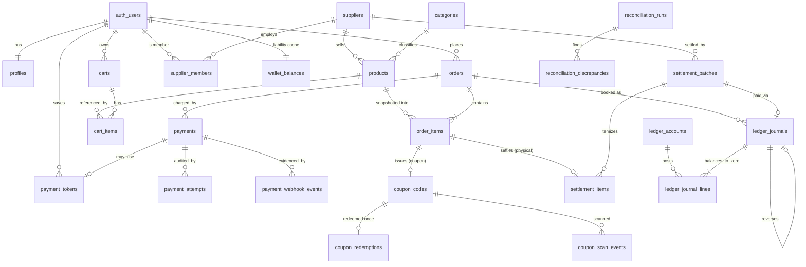

# COMPLETE-SYSTEM-ARCHITECTURE

kenyonexpress.co.il. Branch `phase6/complete-architecture`. **Design only. No UI files.**

This document is the single integration point for three prior bodies of work:

| Source | Contributes |
|---|---|
| `MASTER-ARCHITECTURE.md` (v2, `arch/master-v2`) | Binding owner money model, domain ERD, enums, RBAC, caching, jobs, risk register |
| `LEDGER-DESIGN.md` (`arch/money-ledger`) | Double-entry ledger, posting rules per event, 17% VAT, settlement, reconciliation |
| `ARCHITECTURE-CHECKOUT-PAYMENT.md` | Cardcom Low Profile pipeline, webhook contract, `checkout_finalize`, refunds |
| Migrations `042`, `046`–`056` | The applied-file reality this document must match |

Where any domain doc conflicts with the owner money model, the **owner model wins** (per MASTER Authority table). Nothing here re-adopts coupon escrow.

---

## 0. Binding decisions (money)

Reproduced from MASTER v2 so this file is self-contained. These are non-negotiable and drive every table, migration, and invariant below.

| ID | Decision | Why |
|---|---|---|
| D-MONEY-1 | Integer **agorot** (`integer`/`bigint`) is the sole money type end to end. No `numeric` money, no floats. | Float and `numeric(12,2)` round-trips corrupt money; matches Cardcom minor units. |
| D-MONEY-2 | Coupon: customer pays on-site `round_half_up(face * platform_bp / 10000)`. 100% of that charge is platform revenue. **No escrow.** Supplier receives **0** from the platform for coupon lines; the remainder is collected in cash at the merchant when the coupon is scanned. | Owner model. |
| D-MONEY-3 | Physical: customer pays 100% on-site. `supplier_due = face - commission`; paid only via a **settlement batch** after `delivered + 14d`. No Cardcom Multi-Account at charge. | Return window; supplier is not a Cardcom sub-merchant. |
| D-PERCENT | Every rate (`platform_percent`, cashback) is stored as **integer basis points** (`_bp`): 10% = 1000 bp, 100% = 10000 bp. | Same integer discipline as money. |
| D-SNAPSHOT | `platform_bp` and all amount fields are **snapshotted into `order_items` at purchase** and frozen after `paid_at`. Settlement and ledger **never** re-read live `products.platform_percent`. | A later admin price/rate edit must not change historical settlement. Enforced by trigger `trg_order_items_snapshot_lock` (054). |
| D-LEDGER | **Hybrid model:** true double-entry for internal wallet + revenue + VAT + supplier payable; conserved custody + nightly Cardcom reconcile for external card cash. | Cardcom is the external system of record for card money; the wallet is the only pure internal liability. |
| D-PSP | **Cardcom Low Profile** is the production Israeli PSP (SAQ-A). Stripe is an out-of-scope experiment; production cutover requires an explicit ADR. | Israeli cards + hosted page, PAN never on our origin. |
| D-EXPIRY | Expired unused coupons are **breakage**: the platform keeps the on-site fee; no auto wallet refund. | Owner: coupon "expires". Revenue was already recognized at payment. |
| D-VAT | Platform issues a tax invoice **only on its own commission**. Commission is gross-inclusive; extract `net = round(gross * 10000 / 11700)`, `vat = gross - net`, booked to `vat_output`. Amounts the supplier collects are the supplier's VAT obligation, not the platform's. | Israeli 17% VAT, cash-basis recognition at payment. |

---

## 1. Full ERD

### 1.1 Legend

- **[U]** user-facing (RLS allows owner/member read, limited write)
- **[S]** server-only (service_role / SECURITY DEFINER writes; default-deny client)
- **[A]** append-only (immutability trigger and/or no UPDATE/DELETE policy)

### 1.2 Entity diagram (money + identity core)



### 1.3 Table registry (26 core tables)

Money columns are integer agorot; rate columns are integer basis points, unless noted.

| # | Table | Class | Key money/rate columns | Primary FKs |
|---|---|---|---|---|
| 1 | `profiles` | U | — | `id -> auth.users` |
| 2 | `suppliers` | U/S | — | — |
| 3 | `supplier_members` | U | — | `supplier_id`, `user_id` |
| 4 | `categories` | U | — | `parent_id -> categories` |
| 5 | `products` | U | `platform_bp` (NOT NULL for active), `price_agorot` | `supplier_id`, `category_id` |
| 6 | `carts` | U/S | — | `user_id` / `session_id` |
| 7 | `cart_items` | U/S | qty only (no price) | `cart_id`, `product_id` |
| 8 | `orders` | U/S | `subtotal_agorot`, `total_agorot`, `wallet_applied_agorot` | `user_id` |
| 9 | `order_items` | U/S | `platform_bp`, `face_value_agorot`, `unit_price_agorot`, `total_price_agorot`, `paid_on_site_agorot`, `commission_agorot`, `supplier_due_agorot`, `balance_due_at_business_agorot` | `order_id`, `product_id`, `supplier_id` |
| 10 | `payments` | S | `amount_agorot` | `order_id`, `refund_of_payment_id` |
| 11 | `payment_attempts` | A | — | `payment_id`, `order_id` |
| 12 | `payment_webhook_events` | A | — | `payment_id` |
| 13 | `payment_tokens` | S | — | `user_id` |
| 14 | `coupon_codes` | U/S | `platform_bp`, `face_value_agorot`, `paid_on_site_agorot`, `balance_due_at_business_agorot` | `order_item_id`, `supplier_id` |
| 15 | `coupon_redemptions` | A | — | `coupon_code_id` (UNIQUE), `redeemed_by_merchant_user_id` |
| 16 | `coupon_scan_events` | A | — | `coupon_code_id` |
| 17 | `wallet_balances` | U/S | `balance_agorot` (cache) | `user_id` |
| 18 | `wallet_entries` | U/S | `amount_agorot` | `user_id`, `order_id` |
| 19 | `ledger_accounts` | S | — | `supplier_id`, `user_id` (nullable by kind) |
| 20 | `ledger_journals` | A | `vat_rate_bp` | `order_id`, `order_item_id`, `payment_id`, `coupon_code_id`, `reverses_journal_id` |
| 21 | `ledger_journal_lines` | A | `amount_agorot` (bigint, signed; +debit/−credit) | `journal_id`, `account_id` |
| 22 | `settlement_batches` | S | `gross_agorot`, `commission_agorot`, `net_due_agorot` | `supplier_id`, `journal_id` |
| 23 | `settlement_items` | S | `platform_bp`, `gross_agorot`, `commission_agorot`, `net_agorot` | `batch_id`, `order_item_id` (UNIQUE) |
| 24 | `reconciliation_runs` | A | counters | — |
| 25 | `reconciliation_discrepancies` | A | `expected_agorot`, `actual_agorot`, `diff_agorot` | `run_id` |
| 26 | `idempotency_keys` | S | — | — |

**Supporting tables (not counted in the 26):** `audit_log` [A], `user_addresses` [U], `user_rate_limits` / `rate_limits` [S], `hero_slides` [U], `product_images` / `product_variants` [U].

**Deprecated / runoff:** `escrow_holds` and `split_executions` (047) are **legacy in runoff** — no new writes; drained by business events; archived by a future migration (LEDGER §11). `payout_statements` / `supplier_payout*` drafts are superseded by `settlement_batches` / `settlement_items` (054). `coupons` (pre-008) is non-canonical; `coupon_codes` is the source of truth.

### 1.4 Enums (canonical)

| Enum | Values | Terminal states |
|---|---|---|
| `user_role` | customer, content_uploader, vendor, support, admin, super_admin | — |
| `product_type` | coupon, physical, service | — |
| `order_status` | pending, paid, partially_fulfilled, fulfilled, cancelled, refunded | cancelled, refunded |
| `order_item_status` | pending, issued, shipped, delivered, cancelled, refunded | cancelled, refunded |
| `coupon_status` | issued, used, expired, refunded | used, expired, refunded |
| `payment_kind` | charge, token_charge, refund | — |
| `payment_status` | initiated, redirected, succeeded, failed, cancelled, refunded | failed, cancelled, refunded |
| `wallet_reason` | cashback_earn, order_spend, expire, refund_credit, referral_bonus, manual_adjust | — |
| `supplier_member_role` | owner, manager, scanner | — |
| `scan_result` | success, not_found, already_used, expired, refunded, wrong_supplier, unauthorized, rate_limited | — |
| `ledger_account_kind` | cardcom_clearing, platform_revenue, vat_output, supplier_payable, customer_wallet | — |
| `ledger_event` | order_paid, coupon_issued, coupon_redeemed, coupon_expired, physical_settled, refund, chargeback, wallet_cashback_earned, wallet_spent, wallet_expired, reversal | — |
| `settlement_batch_status` (054) | draft, pending_approval, approved, paid, cancelled | paid, cancelled |
| `recon_run_status` (055) | running, succeeded, failed | succeeded, failed |
| `recon_severity` (055) | info, warning, critical | — |

The legacy escrow-era `settlement_status` (047) enum (pending, split_executed, escrow_held, escrow_released, redeemed, refunded, cancelled) is **runoff only**; new settlement uses `settlement_batch_status`.

### 1.5 Audit trail

Every money mutation leaves three independent, append-only trails so no single failure hides a loss:

1. **Operational audit** — `audit_log` (actor, role, action, entity, before/after) for admin/financial forensics; written through one helper (`src/lib/admin/audit.ts`).
2. **Accounting audit** — `ledger_journals` + `ledger_journal_lines`, immutable, corrections only by reversal journal (`reverses_journal_id`).
3. **External evidence** — `payment_attempts` (every HTTP round-trip) + `payment_webhook_events` (raw inbound, replay-unique). Retained per financial record rules.

---

## 2. Money flow (end to end)

The canonical path: **order paid → `platform_bp` snapshot → ledger posting → supplier settlement → reconciliation.**

### 2.1 Order paid → snapshot

`beginCheckout` writes `orders` (pending) and `order_items` with the **snapshot** of `products.platform_bp` and computed amounts. After `paid_at` is set, `trg_order_items_snapshot_lock` (054) rejects any UPDATE to the snapshot columns. This freeze is the linchpin of D-SNAPSHOT and is checked by INV-3.

**Coupon line** (charge on-site is a fraction of face):
```
face_agorot      = unit_face_agorot * qty
paid_on_site     = round(face_agorot * platform_bp / 10000)   -- half-up
balance_at_biz   = face_agorot - paid_on_site                 -- cash at merchant
commission       = paid_on_site                               -- entire on-site charge
supplier_due     = 0
```

**Physical line** (charge full face on-site):
```
face_agorot      = unit_face_agorot * qty
paid_on_site     = face_agorot
commission       = round(face_agorot * platform_bp / 10000)   -- half-up
supplier_due     = face_agorot - commission
balance_at_biz   = 0
```

### 2.2 Ledger posting (at `order_paid`)

`checkout_finalize` posts exactly one balanced `order_paid` journal (`event_key = order:<order_id>:paid`). Commission is gross-inclusive; VAT is extracted per D-VAT. `P` = on-site charge, `W` = wallet applied.

**Coupon line** (`P = round(F * platform_bp / 10000)`):
```
D cardcom_clearing   (P - W)
D customer_wallet     W
C platform_revenue    net(P)
C vat_output          vat(P)
```

**Physical line** (`F` full, `comm = round(F * platform_bp / 10000)`):
```
D cardcom_clearing   (F - W)
D customer_wallet     W
C supplier_payable   (F - comm)
C platform_revenue    net(comm)
C vat_output          vat(comm)
```

Balance check (INV-1): coupon F=10000, bp=1000 → P=1000 → `+1000 −855 −145 = 0`. Physical F=10000, comm=1000 → `+10000 −9000 −855 −145 = 0`. Every journal sums to zero, enforced by the deferred constraint trigger `trg_ledger_lines_balanced` (050).

Cashback (if the rule qualifies) is a separate journal `wallet_cashback_earned` (`order:<id>:cashback`): `D platform_revenue B; C customer_wallet B` (contra-revenue; the marketing incentive reduces net revenue). Coupon issue / redeem / expiry post **no money lines** — the money was fully recognized at `order_paid`.

### 2.3 Supplier settlement (physical only)

Physical `order_items` become eligible `delivered + 14d`. `fn_build_settlement_batch(supplier_id, period)` creates a `settlement_batches` row and one `settlement_items` row per eligible item, copying `platform_bp`, `gross_agorot`, `commission_agorot`, `net_agorot` **exclusively from `order_items`** (no join to `products`; `net_agorot = gross - commission` CHECK). `settlement_items.order_item_id` is UNIQUE, so an item can never enter two batches.

Batch lifecycle: `draft → pending_approval → approved → paid`. `mark_settlement_batch_paid` is super_admin only and gated on Cardcom reconciliation passing. Payment posts a `physical_settled` journal (`settlement:<batch_id>:paid`): `D supplier_payable S; C cardcom_clearing S`, which retires the payable the `order_paid` journals accrued.

### 2.4 Reconciliation

Nightly and pre-deploy jobs (055) run the executable checks in `INVARIANTS.md`. Each run inserts a `reconciliation_runs` row; every violating row becomes a `reconciliation_discrepancies` row (`entity_table`, `entity_id`, `expected_agorot`, `actual_agorot`, `diff_agorot`, severity). Key reconciliations:

| Check | run_type | Severity |
|---|---|---|
| Every journal sums to zero | `ledger_balance` | critical |
| Wallet cache = ledger balance | `wallet_drift` | critical |
| Snapshot frozen after paid | `snapshot_drift` | high |
| Coupon redeemed ≤ once | `coupon_single_use` | high |
| Settlement totals = item shares | `settlement_totals` | high |
| Cardcom deposit file = `payments` | `cardcom_deposits` | medium |
| `supplier_payable` = open settlement items | `supplier_payable` | high |

---

## 3. State machines

Terminal states are absorbing: no transition leaves them.

### 3.1 Order (`order_status`)

```
pending --checkout_finalize(verified)--> paid
pending --expiry cron | all lines cancelled--> cancelled        [terminal]
paid    --subset of physical progresses--> partially_fulfilled
paid|partially_fulfilled --all lines terminal--> fulfilled
paid|partially_fulfilled|fulfilled --refund complete--> refunded [terminal]
```
Illegal: `cancelled -> paid`; `refunded -> *`; any browser redirect as the paid trigger; any money write from a client role. Invariant: `pending` holds no wallet debit, no coupon codes, no stock decrement, `paid_at IS NULL`.

### 3.2 Payment (`payment_status`)

```
initiated --Low Profile URL created--> redirected
redirected --verified success--> succeeded
redirected --decline | abandon+expiry--> failed                [terminal]
initiated|redirected --user cancel pre-charge--> cancelled     [terminal]
succeeded --refund row confirmed--> refunded                   [terminal on original]
```
Each charge / token_charge / refund is a separate `payments` row (`kind`).

### 3.3 Coupon (`coupon_status`)

```
(none) --finalize--> issued
issued --redeem_coupon (CAS)--> used        [terminal]
issued --expiry job--> expired              [terminal]
issued --refund flow--> refunded            [terminal]
```
Illegal: `used -> issued`; redeem of `expired`/`refunded`; second redeem of `used`. Enforced by the CAS UPDATE + `coupon_redemptions.coupon_code_id` UNIQUE + a transition-guard trigger blocking any exit from a terminal state (053).

### 3.4 Refund

Not a status enum — an orchestrated reversal. Admin `refundPayment` → new `payments` row `kind=refund` (`ref:<payment_id>:<n>`) → Cardcom refund API for the card portion → wallet portion returns to wallet only (LEG-10), never to card, unless explicitly consented → affected `order_items.item_status = refunded` → unused coupons `issued -> refunded` → `refund` reversal journal → if a physical item was already settled/paid, a negative adjustment lands on the supplier's next batch (paid batches are immutable).

### 3.5 Settlement batch (`settlement_status`)

```
draft --items attached--> pending_approval
pending_approval --admin approve--> approved
approved --mark_paid (super_admin, reconcile gate)--> paid  [terminal]
draft|pending_approval|approved --cancel--> cancelled       [terminal]
```
`paid` posts the `physical_settled` journal and is immutable; corrections are negative adjustment lines on a future batch.

### 3.6 Wallet (double-entry, no status enum)

```
Earn:   D platform_revenue     C customer_wallet   (cashback_earn)
Spend:  D customer_wallet      (inside order_paid) (order_spend)
Expire: D customer_wallet      C platform_revenue  (expire, future policy)
Refund: C customer_wallet      (refund_credit)
```
Never: `customer_wallet -> bank/card`. There is no posting rule for withdrawal by design (non-withdrawable, D-MONEY). Non-negative balance is enforced; the operational cache (`wallet_balances`) must equal the ledger sum (INV-2).

---

## 4. Auth + RBAC

### 4.1 Roles and hierarchy

`customer < vendor < content_uploader < admin < super_admin`. `support` is out-of-hierarchy (read-mostly, own `is_support()` policies; D3/D8). Supplier authorization is **not** the coarse `vendor` role — it is real membership in `supplier_members` (owner/manager/scanner).

### 4.2 Capability matrix

| Capability | guest | customer | scanner | manager | owner | support | admin | super_admin |
|---|:-:|:-:|:-:|:-:|:-:|:-:|:-:|:-:|
| Read catalog | Y | Y | Y | Y | Y | Y | Y | Y |
| Write cart | Y\* | Y | | | | | | |
| beginCheckout | | Y | | | | | | |
| Redeem coupon | | | Y | Y | Y | | | |
| Ship / fulfill | | | | Y | Y | | | |
| Supplier bank details | | | | | Y | | | |
| Read money tables (audit) | | | | | | Y | Y | Y |
| Refund | | | | | | | Y | Y |
| Approve settlement batch | | | | | | | Y | Y |
| `mark_settlement_batch_paid` | | | | | | | | Y |
| Role elevation | | | | | | | | Y |

\*Guest cart writes go through **service_role** only (SEC-09). Money tables have **no client write policies** for any role; service_role / SECURITY DEFINER only.

### 4.3 Guest → Google → saved card

```
1. Browse + hold cart as guest (httpOnly ke_session_id cookie, 30d).
2. Click Pay -> /login?next=/checkout (identity gate; no "pay without account" in v1).
3. Google OAuth PKCE (email OTP backup) -> fn_merge_guest_cart(session_id) (advisory lock, sum qty, cap 99).
4. beginCheckout re-prices every line from the DB; never trusts client prices (rejects PRICE_CHANGED).
5. First Cardcom success with save_card -> webhook writes payment_tokens (service role) -> one-click chargeWithToken next time.
```

### 4.4 Session and RLS rules

- Always `getUser()` server-side; never trust `getSession()` alone.
- Owner predicate: `user_id = auth.uid()`. Supplier: `is_supplier_member(supplier_id)`. Admin: `is_admin()`. Support: `is_support()` (SELECT only).
- Server-only tables: RLS enabled with **zero** anon/authenticated policies; service_role bypasses RLS. Immutability of ledger/webhook tables is enforced by triggers that fire **even for service_role** (RLS alone cannot stop service_role).

---

## 5. Caching + ISR

### 5.1 Profiles

| Profile | stale | revalidate | expire |
|---|---|---|---|
| home | 300 | 300 | 86400 |
| catalog | 300 | 3600 | 86400 |
| coupons | 300 | 300 | 3600 |

### 5.2 Tag taxonomy — `revalidateTag` per table change

| Table write | Tags invalidated |
|---|---|
| `products` INSERT/UPDATE/DELETE | `products`, `product:<id>`, `category:<category_id>` |
| `categories` | `categories`, `category:<id>` |
| `coupon_deals` | `coupons`, `deals` |
| `hero_slides` | `hero` |
| `suppliers` (public display fields) | `product:<id>` for each linked product (supplier block on PDP) |

Wiring: Supabase Database Webhooks on those tables `POST /api/revalidate` with `x-revalidate-secret` → `revalidateTag`/`revalidatePath` by `{table, id}`.

### 5.3 Never cached

Search, filters, `page > 1`, cart, checkout, account, admin, supplier portal, and **any surface where a displayed price is the amount that will be charged**. PDP display price may use catalog ISR **only because** `beginCheckout` always re-snapshots from the DB and rejects a stale price with `PRICE_CHANGED`. Prefer short catalog revalidate (≤1h) plus on-demand `updateTag` on admin price edits.

---

## 6. Background jobs

Scheduler: Vercel Cron → `CRON_SECRET` route for anything touching external APIs or app logic; `pg_cron` for pure-SQL sweeps only.

| Job | Freq | Idempotency | Alert |
|---|---|---|---|
| Cancel expired pending orders | 10 min | `expires_at` + status CAS | SEV3 overdue pending |
| Cardcom payment reconcile (stuck `redirected`) | 10 min | provider re-verify via GetLpResult | SEV2 at ≥5 stuck |
| `expire_coupons` (issued → expired) | daily | status CAS, idempotent | SEV3 overdue unswept |
| Wallet ledger drift (INV-2) | nightly | re-derive from ledger | **SEV1** on any drift |
| Ledger balance / snapshot / settlement checks (INV-1,3,5,8) | nightly + pre-deploy | read-only | SEV1/high |
| Build settlement batches (`delivered + 14d`) | daily | `settlement_items.order_item_id` UNIQUE | SEV3 |
| Cardcom settlement/deposit ingest | on file / daily | txn id UNIQUE | unmatched SEV3 |
| Notifications outbox worker | 1 min | outbox dedupe | dead-letter SEV3 |
| Rate-limit + idempotency-key cleanup | hourly | prune by `expires_at` | quota |
| DB backup `pg_dump` (GHA) | daily | n/a | DR drill monthly |

---

## 7. Third-party app model (future Wolt / Gett)

The system is being designed so a future third-party consumer app (e.g. Wolt or Gett reselling Kenyon coupons/products) can integrate **without re-plumbing money**. What must exist **now** for that future to be safe:

1. **Snapshot economics, not live rates.** Because `platform_bp` and all amounts are frozen into `order_items` at purchase (D-SNAPSHOT), a partner-originated order settles on the terms captured at sale even if the partner's contract or the product price later changes. No retro-active money movement is possible.
2. **`orders.source` / channel attribution.** Reserve a channel/source column on `orders` (and a `partners` registry) so partner-originated orders are distinguishable for settlement and reporting. Partners never get write access to money tables — they call a **server action / signed API**, and `checkout_finalize` remains the single valuable writer.
3. **Idempotency is generic, not Cardcom-specific.** `idempotency_keys (scope, key)` (052) already lets a partner API be replay-safe under its own scope (`partner:<id>:<ref>`) independent of the PSP.
4. **Ledger already models multi-party custody.** A partner's take could be modeled as an additional `ledger_account_kind` (e.g. `partner_payable`) and posting rule without touching the sum-zero invariant — the ledger is the extension point, not the checkout code.
5. **Signed coupon QR (Ed25519) is verifiable offline by anyone we trust.** A partner scanning app can validate a coupon locally with the public key, but redemption still requires the online `redeem_coupon` CAS — so a partner cannot double-spend.

Non-goal now: building the partner API surface itself. Requirement now: never make a design choice (live-rate settlement, PSP-coupled idempotency, client-writable money) that a partner integration would later have to unwind.

---

## 8. Risk register (money loss ranked)

Ranked by expected money impact; each has a designed mitigation already reflected in migrations/invariants.

| # | Risk | Impact | Mitigation | Enforced by |
|---|---|---|---|---|
| R1 | Live coupon escrow pays suppliers (contradicts owner model) | Direct loss per coupon | No escrow; supplier_due=0 on coupon lines; 047 escrow in runoff | LEDGER §11, posting rules §2.2 |
| R2 | Trusting browser redirect as "paid" | Goods/coupons released unpaid | Only verified webhook / reconcile sets `paid_at`; redirects are read-only | Checkout §0, `checkout_finalize` guard |
| R3 | Double finalize / webhook replay | Double coupons, double wallet | `paid_at IS NULL` row-lock guard; `(provider, external_event_id)` UNIQUE; per-item UNIQUE issue | INV-6, migration 052/047 |
| R4 | Weak payment idempotency | Duplicate charges | `payments.idempotency_key` + `cardcom_transaction_id` UNIQUE | 042/046 |
| R5 | Wallet mint via client-callable transfer | Unlimited fake credit | `fn_wallet_transfer` service_role only; no client write policy | RBAC §4.2, 056 |
| R6 | Snapshot drift (settlement re-reads live rate) | Wrong supplier payout | Freeze trigger + settlement reads only `order_items` | INV-3, 054 |
| R7 | Payout before return window | Pay then refund, unrecoverable | `delivered + 14d` eligibility gate | Settlement §2.3 |
| R8 | Unmatched Cardcom deposits | Cash we think we hold but don't | Reconcile gate before `mark_settlement_batch_paid` | INV-8, §6 |
| R9 | Wallet cache drift vs ledger | Silent liability error | Nightly re-sum, SEV1 | INV-2 |
| R10 | Amount mismatch on webhook | Pay wrong amount | Server-to-server re-fetch; agorot equality check; alarm, no finalize | Checkout §3.3 |
| R11 | Ledger tampering by service_role | Undetectable loss | Immutability triggers fire for service_role; corrections by reversal only | 050, LEDGER §3.2 |
| R12 | Forgeable coupon QR (SHA-256) | Free redemptions | Ed25519 signed QR; redeem still needs online CAS | MASTER §3.1 |
| R13 | Role escalation | Refund/mark-paid abuse | `WITH CHECK` + privilege trigger; super_admin-only money finalizers | 035/049 |
| R14 | `SERVICE_ROLE_KEY` in client bundle | Total compromise | CI grep + import fence | Deployment gate |
| R15 | Coupon single-use race (two scanners) | Double redemption | CAS UPDATE + `coupon_redemptions` UNIQUE + partial unique on `(code) WHERE used` | INV-4, 053 |

---

## 9. Document map

| Need | Read |
|---|---|
| This integration | `COMPLETE-SYSTEM-ARCHITECTURE.md` (here) |
| Checkout / Cardcom sequence | `CHECKOUT-COMPLETE.md` |
| Migration set 040–050 (files 042, 046–056) | `MIGRATIONS-040-050.md` |
| Executable integrity checks | `INVARIANTS.md` |
| Ship / secrets / recovery | `DEPLOYMENT.md` |
| Ledger posting rules detail | `LEDGER-DESIGN.md` |
| Owner money model + full risk narrative | `MASTER-ARCHITECTURE.md` |

End of COMPLETE-SYSTEM-ARCHITECTURE.
