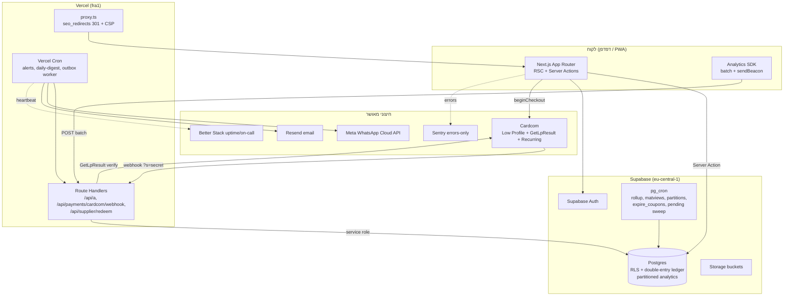

# MASTER ARCHITECTURE v2: המסמך המאוחד (business-model-first)

> **מהדורה: 2026-07-24. ענף: `feat/analytics-bi` (worktree של `phase5/homepage`).**
> מסמך זה מאחד את כל 12 מסמכי הארכיטקטורה של KenyonExpress סביב **המודל העסקי
> המחייב** (סעיף 1), ומוסיף עליהם תרשים מערכת, סכמות, flows, סדר מיגרציות סופי,
> סדר phases עד production, ורשימת הסתירות + ההכרעות.

## 0. סמכות ומקורות

### 0.1 סדר סמכות (בסתירה, מלמעלה למטה)

1. **המודל העסקי** (סעיף 1 כאן, וכן `docs/BUSINESS-MODEL.md`) - דורס הכל בענייני כסף.
2. **אבטחה** - `docs/ARCHITECTURE-SECURITY.md`.
3. **דין וציות** - `docs/ARCHITECTURE-LEGAL-COMPLIANCE.md`.
4. **הכרעות הסתירות** - `docs/CONTRADICTIONS.md` (C1-C11).
5. **מסמך האב v3** - `docs/MASTER-ARCHITECTURE.md` (הכרעות 1.1-1.57, R1-R40).
6. מסמכי הדומיין.

מסמך v2 זה עקבי עם v3 ועם `CONTRADICTIONS.md`, ומוסיף עליהם שכבה אחת: **המודל
העסקי כשכבה עליונה שדורסת כל נוסח כספי סותר**, כולל הכרעת C11 (סעיף 1.4).

### 0.2 12 מסמכי המקור המאוחדים

| # | מסמך מקור | דומיין | מיגרציה |
|---|---|---|---|
| 1 | `ARCHITECTURE-COMMERCE.md` (docs) | עגלה, checkout, Cardcom, ארנק double-entry | 026 |
| 2 | `ARCHITECTURE-SUPPLIER-REDEMPTION.md` (docs) | ספקים, מימוש, payout | 027 |
| 3 | `ARCHITECTURE-AI-AGENTS.md` (root+docs) | סוכני AI, בסיס + runtime | 028, 039 |
| 4 | `ARCHITECTURE-ACCOUNT-IDENTITY.md` (docs) | חשבון, זהות, מחיקה, טוקנים | 029 |
| 5 | `ARCHITECTURE-CATALOG-SEARCH-SEO.md` (docs) | קטלוג, חיפוש עברי, SEO | 030 |
| 6 | `ARCHITECTURE-NOTIFICATIONS-MARKETING.md` (docs) | התראות, הסכמה, שיווק | 031 |
| 7 | `ARCHITECTURE-WP-DATA-MIGRATION.md` (docs) + `ARCHITECTURE-WP-MIGRATION.md` (root) | ייבוא WordPress | 032 |
| 8 | `ARCHITECTURE-ANALYTICS-BI.md` (root+docs) | אנליטיקה + BI | 033, 034, 053 |
| 9 | `ARCHITECTURE-SECURITY.md` (docs) | מודל איומים SEC-01..17 | 035 |
| 10 | `ARCHITECTURE-TESTING-CICD.md` (root+docs) | בדיקות ו-CI/CD (D1-D22) | אין |
| 11 | `ARCHITECTURE-CHECKOUT-PAYMENT.md` (root) + `ARCHITECTURE-PERFORMANCE-SEO.md` (root) | pipeline תשלום, ביצועים | 038 |
| 12 | `ARCHITECTURE-SUPPLIER-PORTAL.md` (root) | פורטל הספקים | 027/036 |

מסמכי דומיין נוספים ב-`docs/` (משפטי 037, תפעול, observability 040, growth 041,
API-contracts, mobile-superapp) נבלעים בהכרעות הרוחב של סעיף 6. **אין stub חסר:**
כל 12 המקורות קיימים בעץ; שניים מהם (Testing-CICD, WP) הם מצביעים בשורש אל
המסמך המלא ב-`docs/`.

---

## 1. המודל העסקי המחייב (השכבה שדורסת הכל)

מקור: `docs/BUSINESS-MODEL.md` + הכרעת Ofir. **כל נוסח כספי סותר בכל מסמך אחר בטל.**

### 1.1 קופון (Coupon) - המוצר החי היום

- האדמין קובע בדף המוצר את **`coupon_price` המוחלט** ששולם באתר (למשל דיל 100 ש"ח, קופון 10 ש"ח).
- הלקוח משלם באתר **רק את `coupon_price`** דרך Cardcom.
- את היתרה (`total_deal_price - coupon_price`) הלקוח משלם **בבית העסק** במעמד המימוש.
- **כל תשלום הקופון נשאר בפלטפורמה. הספק מקבל 0 מהתשלום באתר** (גובה את היתרה במזומן בעסק).
- **אין Escrow חיצוני ואין J5.** ה-"held" הוא רישום פנימי ב-ledger בלבד, נסגר במימוש.
- בעל העסק סורק את הקופון (QR או קוד ידני) -> הקופון **פג (`used`)**.
- קופון שפג בלי מימוש -> **זיכוי מלא לארנק הלקוח** (`refund_credit`, תוקף 5 שנים), לא הפקעה.

### 1.2 מוצר פיזי (Physical) - שלב עתידי

- הלקוח משלם **100% מהמחיר** באתר דרך Cardcom.
- פיצול: **`platform_percent` (פר-מוצר, חובה, בלי ברירת מחדל)** נשאר בפלטפורמה; היתרה עוברת לספק.
- **snapshot ל-`order_items` בזמן הקנייה** (immutable): `platform_percent`, חלק הפלטפורמה, חלק הספק.
- העברה לספק: ידנית בהתחלה, אוטומטית בהמשך (payout T+3 ימי עסקים, מינימום 100 ש"ח).

### 1.3 מנוי (Subscription) - מחוץ להיקף

חיוב חוזר דרך Cardcom Recurring Token. **מחוץ לרצף 026-053** עד threat model
ומיגרציה ייעודית (`subscriptions`). שום קובץ קיים לא נוגע בזה.

### 1.4 תזרים כסף (מקור אמת יחיד; מכריע את C11)

| סוג | לקוח משלם באתר | נשאר בפלטפורמה | לספק (מהתשלום באתר) | היתרה |
|-----|----------------|-----------------|---------------------|--------|
| **קופון** | `coupon_price` בלבד | **100% מ-`coupon_price`** | **0** | מזומן בעסק במימוש |
| **פיזי** | מחיר מלא | `platform_percent` | `100% - platform_percent` | אין |
| **מנוי** | `recurring_amount`/חודש | `platform_percent` | היתרה, פר חיוב | אין |

> **הכרעת C11 (הייתה פתוחה, מוכרעת כאן ע"י המודל העסקי):** גרסה **(א)** - הפלטפורמה
> שומרת 100% מ-`coupon_price`, הספק מקבל 0. זו ההתנהגות הקיימת בקוד
> (`027_suppliers.sql`: שורות `coupon_redemption` עם `payout_ils = 0`) והמודל העסקי
> מאשר אותה. **מסקנה מחייבת:** `platform_percent` על שורת קופון הוא **תצוגה/דיווח
> בלבד**; C5 ("עמלה על המקדמה בלבד") מתקיים טריוויאלית כי כל המקדמה היא העמלה.

### 1.5 אינווריאנטים כספיים לשורת קופון (CHECK של 026, לא משתנה)

```
charged_on_site_ils        = coupon_price
platform_fee_ils           = charged_on_site_ils      (כל התשלום באתר של הפלטפורמה)
supplier_due_ils           = 0
balance_due_at_business_ils = total_deal_price - coupon_price
```
snapshot על `coupon_codes`: `face_value_ils = total_deal_price`,
`platform_paid_ils = coupon_price`, `collect_amount_ils = ההפרש`.

### 1.6 אילוצים חוצי-מערכת מהמודל

- **Guest cart:** גלישה והוספה לעגלה כאורח (`ke_session_id`, httpOnly); **login נאכף רק בלחיצת תשלום**.
- **ארנק פנימי בלבד:** double-entry ב-Postgres; אין ארנק חיצoni; `fn_wallet_transfer` = service_role בלבד.
- **אין `tenant_id` ואין multi-tenancy.** מופע יחיד. הפרדת ספקים דרך `supplier_members` + RLS, לא דרך tenant.
- **ספקים מאושרים בלבד:** Cardcom (סליקה) + Vercel (הרצה) + Supabase (DB). אין Stripe/Payoneer/Cloudways.

---

## 2. תרשים המערכת



**עקרונות התרשים:**
- **דפדפן לעולם לא משנה state כספי.** ה-webhook + `GetLpResult` בצד שרת הם מקור האמת לתשלום.
- **שני מישורים באנליטיקה:** כסף נקרא מטבלאות האמת (orders/payments/ledger); התנהגות מ-`analytics_events`. אסור לסכם כסף מאירועים.
- **split crons:** pg_cron ל-SQL טהור פנימי; Vercel cron לכל מה שנוגע ברשת (מיילים, התראות).

---

## 3. מודל הנתונים (ERD טקסטואלי)

סימון: `-> B` = FK אל B. `(L)` = legacy. `(P)` = מתוכנן. המספר = המיגרציה המגדירה.

```
זהות וחשבון (029)
  auth.users (Supabase)
  profiles (001/003)              -> auth.users; role user_role; supplier_id (L, sync, מקובע 035)
  user_addresses (009)            -> auth.users
  payment_tokens (001, מוקשח 029) -> profiles; cardcom_token חסום לדפדפן; audit ייעודי
  account_deletion_requests (029)
  carts (001, הידוק 035)          -> profiles | session_id; items jsonb עד cutover
  cart_items (026)                -> carts, products, product_variants
  rate_limits (002) [IP]; user_rate_limits (019); check_my_rate_limit (035)

קטלוג, חיפוש, SEO (030)
  categories (005/012, +030)      עץ עומק 2
  suppliers (005, מורחבת 027)     <- כל הכסף מפנה לכאן
  vendors (001/013) (L)           רק coupon_deals; מוקפאת ב-036
  products (005/014/016, +026, +030) -> suppliers, categories; platform_percent חובה; search_vector
  product_variants, product_images
  coupon_deals (015, +026, +036)  platform_price = coupon_price [1.1]; original_price = total_deal_price
  hero_slides (017); search_synonyms, search_queries (030, 6 חודשים)
  seo_redirects (030)             301/410; נאכף ב-proxy.ts

הזמנות ותשלומים (026)
  orders (007, +026, +attribution 033/053) -> auth.users, user_addresses; expires_at
  order_items (007, +026 snapshot, +027 shipping)  snapshot immutable:
       platform_percent, platform_fee_ils, supplier_due_ils,
       charged_on_site_ils, balance_due_at_business_ils
       (בפועל בסכימה החיה: עמודות אגורות 046/047, ראו §7.3 של ANALYTICS-BI)
  payments (026)                  -> orders, payment_tokens; cardcom_transaction_id UNIQUE
  payment_webhook_events (026)    UNIQUE(provider, external_event_id)

ארנק double-entry (026)
  wallet_accounts (026)           -> auth.users | code פלטפורמה (cashback_reserve/revenue/adjustments)
  wallet_transactions (026)       append-only; שורות פתיחה legacy_opening; service_role בלבד
  wallet_balances, wallet_transactions_legacy (006) (L, read-only)

קופונים ומימוש (027)
  coupon_codes (008, +027)        snapshot + qr_token (Ed25519), qr_key_id
  coupon_redemptions (026, policy 027)  -> coupon_codes UNIQUE; רשומת אמת (payout_ils=0)
  coupon_scan_events (027)        append-only; 90 יום

ספקים והתחשבנות (027)
  supplier_applications, supplier_members (מקור ההרשאה), supplier_bank_accounts (audit מסתיר),
  payout_statements (PS-######), payout_statement_lines, supplier_disputes,
  cardcom_settlements (027)

הפניות ושותפים (010): referrals; affiliates (self-update הוסר 035)

AI Agents (028): agent_prompts, agent_runs, agent_run_steps (90 יום), agent_flags,
  listing_drafts, agent_escalations; fn_log_agent_run service_role בלבד

התראות ושיווק (029+031): user_notification_preferences, notifications_outbox (dedupe UNIQUE),
  notification_events, notification_templates, consent_events (לנצח), channel_suppressions,
  notification_delivery_events (90 יום), notification_conversions

אנליטיקה ו-BI (033+034+053):
  analytics_event_definitions; analytics_events (partition חודשי, 13 חודשים, source_app);
  analytics_daily (לנצח, source_app); analytics_identity_links (053)
  views: v_owner_dashboard, v_money_alarms, v_revenue_daily, v_funnel_daily (+checkout_steps 053),
         v_repeat_purchase_monthly (053), v_web_vitals_daily (053), v_channel_revenue_weekly,
         v_supplier_* (security_invoker), v_take_rate_monthly, v_coupon_expiry_liability
  matviews (service_role): mv_cohort_retention_monthly, mv_take_rate_monthly

אבטחה (035): security_events; triggers enforce_role_change_privilege / enforce_supplier_member_role;
  check_my_rate_limit; assert_seeds_allowed

ציות משפטי (037 P): cancellation_requests, invoices, legal_document_versions;
  orders.terms_version/terms_accepted_at

WP import schema (032): staging + id_map + v_reconciliation (service_role, לא חשוף ל-PostgREST)

תפעול: audit_log (011/025, לנצח); storage buckets; drift: coupons (טבלה חיה בפרודקשן)

מתוכנן (אין קובץ): 036 vendors_unification, 037 legal, 038 performance,
  039 agents_v2, 040 observability, 041 growth; push_subscriptions, subscriptions
```

---

## 4. ה-Flows המרכזיים

### 4.1 קנייה (Purchase)

```
1. אורח מוסיף לעגלה (ke_session_id httpOnly; carts.session_id). אין login עדיין.
2. בלחיצת "תשלום": requireUserSession() נאכף. אורח -> login/signup, ואז callback:
   fn_merge_guest_cart + linkAnalyticsIdentity, ומחיקת עוגיית האורח.
3. beginCheckout (server action, טרנזקציה אחת, service client):
   a. rate limit begin_checkout 10/דקה, fail-CLOSED.
   b. ולידציית עגלה מהשרת (validateCartView). מחירים נבנים בשרת בלבד.
   c. snapshot פר שורה: לקופון charged_on_site=coupon_price, platform_fee=coupon_price,
      supplier_due=0; לפיזי פיצול platform_percent (חובה, זורק בלי אחוז).
   d. INSERT orders(status=pending, expires_at=+30דק') + order_items(snapshot אגורות).
   e. ארנק מכסה הכל -> finalizeOrder בלי סבב לספק.
   f. אחרת: INSERT payments(initiated) -> Cardcom createLowProfile ->
      status=redirected + redirect_url. webhookUrl נושא ?s=<secret>.
   g. analytics: stampOrderAttribution + trackServerEvent('begin_checkout'). בולעים שגיאות.
4. הלקוח מופנה ל-Cardcom hosted page ומשלם.
5. webhook (/api/payments/cardcom/webhook?s=secret):
   a. סוד ב-URL = שער אותנטיות (Cardcom לא חותם). timingSafeEqual.
   b. log first, dedup על (provider, external_event_id). replay -> 200 no-op.
   c. GetLpResult server-to-server = מקור האמת היחיד לסכום/סטטוס/טוקן.
   d. טרנזקציית paid: payments=succeeded, orders.paid_at, הנפקת coupon_codes +
      חתימת QR Ed25519, זיכוי cashback לארנק, עדכון מלאי, audit.
6. redirect return page. הדפדפן אף פעם לא קובע paid.
```

### 4.2 מימוש קופון (Redemption)

```
1. הלקוח מציג QR (חתום Ed25519) או קוד ידני בבית העסק.
2. חבר צוות של הספק סורק דרך /api/supplier/redeem (PWA):
   a. אימות חברות: is_supplier_member(supplier_id). אין עקיפת אדמין.
   b. rate limit coupon_scan 30/דקה, fail-CLOSED.
   c. redeem_coupon (027) - נקודת המימוש היחידה, טרנזקציה:
      - אימות חתימת QR + תוקף + סטטוס issued + שיוך לספק הנכון.
      - מעבר issued -> used (used_at).
      - INSERT coupon_redemptions (UNIQUE על coupon_code -> מחסום replay שני),
        amount_collected_ils = collect_amount_ils, payout_ils = 0 [C11-(א)].
      - INSERT coupon_scan_events (כל ניסיון, כולל כשל).
3. הלקוח משלם את היתרה (balance_due_at_business) במזומן/אשראי בעסק. לא עובר דרכנו.
4. אין תזרים כסף לספק מהמימוש: הפלטפורמה כבר החזיקה 100% מ-coupon_price.
```

### 4.3 החזר (Refund / Cancellation)

```
1. מנוע ביטול צרכני (LEG-01, חוסם checkout): בקשה ב-/cancel, rate limit 5/24ש.
2. fn_request_cancellation (037) - חישוב זכאות בשרת:
   - זכות ביטול 14 יום (מכר מרחוק 14ג).
   - דמי ביטול: עד 5% מהעסקה או 100 ש"ח, הנמוך, ובכפוף לסיבה.
3. ניתוב ההחזר לפי אמצעי התשלום (LEG-10, 14ה):
   - החלק ששולם בכרטיס -> חוזר לכרטיס דרך Cardcom refund (payments kind=refund).
   - החלק ששולם מארנק -> חוזר לארנק (wallet_transactions).
   - החזר כרטיס->ארנק דורש הסכמה אקטיבית מתועדת.
4. קופון: ביטול לפני מימוש -> refunded; החזר לפי אמצעי התשלום.
5. reconcile_cardcom_settlement מתאים דרך payments.cardcom_transaction_id.
6. v_refunds_daily רושם שורה שלילית ביום ההחזר; ימי מכירה עבר לא נכתבים מחדש.
```

### 4.4 קאשבק (Cashback)

```
1. בזמן paid (בטרנזקציית ה-webhook): זיכוי ארנק לפי כלל הצבירה:
   - קופון: 10% מ-charged_on_site_ils. פיזי: 1% מ-charged_on_site_ils.
   - תקרה: 25% מ-platform_fee (גדר תקציב הטבות 12% מהכנסת פלטפורמה ב-v_money_alarms).
2. double-entry: debit platform:cashback_reserve -> credit wallet של המשתמש,
   reason cashback. אירוע analytics: wallet_earn (נגזר, נקרא מ-wallet_transactions).
3. שימוש בארנק ב-checkout: apply_wallet_ils, מוגבל ליתרה ולחיוב באתר. reason wallet_spend.
4. פקיעת הטבות: cashback/referral אחרי 24 חודשים, פר שורת צבירה FIFO
   (wallet_transactions.expires_at). refund_credit של קופון שפג: 5 שנים.
5. אין פקיעה גורפת של יתרה. v_wallet_liability + v_wallet_ledger_drift מנטרים חוב אמיתי ו-drift.
```

---

## 5. סדר המיגרציות הסופי

### 5.0 חוק ההחלה

**רק דרך Supabase MCP `apply_migration`, קובץ = טרנזקציה, אחרי אישור מפורש לכל קובץ.
לעולם לא `supabase db push`.** לפני החלה מרוחקת: harness apply-twice ירוק על stack
נקי (D6). אחרי הרצף: `generate_typescript_types`.

### 5.1 בסיס 001-025 (מוחל על dev)

```
001 initial_schema  -> profiles, carts, payment_tokens, set_updated_at()
002 auth_rate_limits -> rate_limits, check_rate_limit
003 rbac            -> CREATE TYPE user_role; has_role(); is_admin()   <-- מגדיר את מודל התפקידים
004 storage_buckets -> buckets + policies; משתמש ב-has_role()          <-- חייב לרוץ אחרי 003
005 products_schema -> suppliers, categories, products; policies is_admin() <-- חייב לרוץ אחרי 003+004
006 wallet (L) | 007 orders | 008 coupons | 009 addresses | 010 referrals/affiliates
011 audit_log | 012 categories_v2 | 013 vendors_v2 | 014 products_v2 | 015 coupon_deals
016 products_code_sync | 017 hero_slides | 018 seed_categories | 019 user_rate_limits
020 storage_admin | 021 buckets | 022-024 seeds | 025 consolidation
```

#### פתרון 003/005 (מפורש)

הסתירה הקלאסית היא שרשרת התלות בין תפקידים, storage ו-products:

1. **003 הוא הבעלים היחיד** של `user_role`, `has_role()`, `is_admin()`. אף קובץ אחר
   לא יוצר מחדש את ה-enum או את פונקציות התפקיד.
2. **004 (storage) חייב לרוץ אחרי 003** כי ה-policies שלו קוראים ל-`has_role('content_uploader')`.
   הרצה של 004 לפני 003 מפילה את יצירת ה-policies (הפונקציה לא קיימת).
3. **005 (products) חייב לרוץ אחרי 003+004** כי כל ה-policies שלו קוראים ל-`is_admin()`,
   וה-bucket `product-images` (004) הוא היעד של תמונות המוצר.
4. **ניקוי ה-policies המצטברים** של 003/005/012/001 (FOR ALL שמתרחבים ב-OR, SEC-06)
   מתבצע פעמיים בכוונה: מיידית על ה-DB החי דרך **035**, וקנונית בקבצים דרך **036**.
   בלי הניקוי, policy ישן ב-OR עם חדש מרחיב הרשאה במקום לצמצם.
5. **הרצף על הדיסק כבר נכון** (003 -> 004 -> 005), ולכן על DB נקי אין בעיה; הבעיה
   היחידה היא drift מ-policies שנוצרו בגלים שונים על ה-DB החי, וזה מה ש-035/036 סוגרים.

### 5.2 דומיין 026-053 (טיוטות + עריכות)

| # | קובץ | פעולה | תלות | סטטוס |
|---|---|---|---|---|
| 035 | security_hardening | מוכן, מגונן-קיום | אין | **החלה מיידית** על DB חי ב-025 (SEC-02/03/04/06/09/17) |
| 026 | commerce | עריכות 2.2 (v3) | 001-025 | חסום עד עריכה |
| 027 | suppliers | עריכות 2.3 (v3) | 026 | חסום עד עריכה |
| 028 | agents | עריכה (enum agent_key 6 ערכים) | 027 | חסום עד עריכה |
| 029 | accounts | עריכה (enum notification_status 6) | בסיס | חסום עד עריכה |
| 030 | catalog | עריכה קטנה | בסיס | חסום עד עריכה |
| 031 | notifications | עריכה (הסרת ADD VALUE) | 029 | חסום עד עריכה |
| 032 | wp_import_staging | אין | עצמאי | מוכן |
| 033 | analytics | **ראו הערה קריטית** | 026, 027 | **חסום: guard דורש עמודות שלא קיימות** |
| 034 | analytics_bi | אין | 026, 027, 033 | חסום עד 033 |
| 035 | (הרצה חוזרת) | אין | סוף הרצף | מפעיל SEC-01/10/11/12 |
| 053 | analytics_v3 | מוכן | 033 | חסום עד 033 |
| 036 | vendors_unification (P) | קובץ חדש | 027 | חסום עד כתיבה |
| 037 | legal_compliance (P) | קובץ חדש | 026,027,029,031,036 | חסום; **חוסם checkout** |
| 038 | performance_indexes (P) | קובץ חדש | 030 | חסום עד query plans |
| 039 | agents_v2 (P) | קובץ חדש | 028,034,037 | חסום עד כתיבה |

> **הערה קריטית (ממצא 2026-07-24):** ל-`order_items` בסכימה החיה **אין** את עמודות
> ה-`_ils` שמיגרציות 033/034 מניחות (`platform_fee_ils` וכו'). יש עמודות אגורות
> מ-046/047. ה-guard של 033 יזרוק:
> `033_analytics requires 026_commerce (order_items.platform_fee_ils missing)`.
> **לפני החלת 033/034/053 חייבים להכריע:** או להתאים את 033/034 לעמודות האגורות,
> או להחיל את 026/027 המלאות קודם. הדשבורד ב-`/admin/analytics` כבר קורא את
> העמודות האמיתיות ולכן עובד בלי הרצף.

**מיגרציות runtime שכבר הוחלו (checkout/payments):** 042-051 (commerce_core,
carts, checkout_runtime, settlement, content_fields, media_assets,
platform_percent_required 050, payout_terms 051). 050/051 **טרם הוחלו על המרוחק**
עד שטופס האדמין חושף `platform_percent` + `coupon_expiry_days`.

**המספר הפנוי הבא: 054.** 052 שמור ל-`052_product_page_fields.sql`; 053 נתפס ע"י analytics_v3.

### 5.3 חוק enum

ערך enum חסר = מיגרציית `ADD VALUE` ייעודית ונפרדת **לפני** הקובץ הצורך, לעולם לא
בתוך קובץ רגיל (R22). enum שלם נוצר תמיד ב-`CREATE TYPE` אחד.

---

## 6. סדר ה-Phases עד production ב-Vercel

מצב פתיחה: Phase 5 (דף בית 1:1) סגור; checkout/payments runtime קיים (042-051);
אנליטיקה מומשה (`feat/analytics-bi`); 033-041 טיוטות/מתוכננות; אפס תשלום אמיתי.

| Phase | תוכן | חוסם |
|---|---|---|
| **0. אבטחה + חזית** | החלת 035 על DB חי (SEC-02/03/04/06/09/17); בדיקות קדם; כתיבת 037 + אישור עו"ד | - |
| **1. תשתית סכימה** | עריכות 026-031; פתרון עמודות 033 (§5.2); harness apply-twice; החלת 026->034->053; 036-039 לפי תנאי | חוסם checkout חי |
| **2. עגלה** | server actions ל-`cart_items`; `fn_merge_guest_cart` | - |
| **3. checkout + Cardcom** | 037 חלה; מנוע ביטול/חשבוניות/גילוי/legal; מודול כסף טהור `src/lib/money/`; env.ts zod + CSP; rate limit fail-closed; observability בסיסי; beginCheckout+webhook+refund; crons; CHECKOUT_ENABLED; Supabase Pro + פרויקט prod | **חוסם תשלום אמיתי** |
| **4. אזור אישי** | orders, wallet, payment-methods (אחרי 029), profile+הסכמה, coupons v1, privacy+crons | - |
| **C. קטלוג/חיפוש/SEO** | `/products/[slug]` + 301 ב-proxy; חיפוש; listing; JSON-LD/sitemaps; אדמין | במקביל 3-4 |
| **A. אנליטיקה** | **מומש**: SDK + /api/a + באנר + dashboard. נותר: crons בפועל, Speed Insights, digest | - |
| **5א. ספקים** | onboarding; פורטל (views 034); סריקה PWA; דוחות+מחלוקות; reconcile+expire_coupons | דורש 036 |
| **5ב. AI Agents** | enrichment-first, 6 סוכנים, 039, eval harness; אף סוכן לא כותב כסף | - |
| **5ג. שיווק** | עגלה נטושה, ייחוס, WhatsApp (Meta Cloud), retention cron, growth 041 | - |
| **W. WP import + cutover** | 032; staging+curation; הקרנה; אימות; הקפאות; DNS TTL 300, WP חי שבועיים | **חוסם שיגור** |

### שער השיגור (כולם ירוקים)

1. SEC-01..06 מוחלים; CSP headers; אין טוקן אמיתי לפני 029; SEC-08 סגור.
2. Supabase Pro + גיבוי יומי + תרגיל restore.
3. CI ירוק חוסם merge; harness ירוק פעמיים.
4. reconciliation + v_money_alarms מחוברים להתראת אדמין (cron 15 דק').
5. עסקת אמת אחת ב-Cardcom prod.
6. באנר הסכמה מאושר משפטית; sitemap+robots+redirects חיים.
7. LEG-01..03 סגורים (ביטול, חשבוניות/גילוי, נגישות); כל עמודי legal + הסכם ספק מאושרי עו"ד.
8. תקציבי ביצועים ירוקים ב-Lighthouse ו-k6.

### Deploy

Vercel (fra1) + Supabase (eu-central-1). מיגרציה לפני קוד (expand/contract, D21);
DB forward-only; rollback = Vercel Instant Rollback + DNS. פרויקט prod חדש מקבל את
הרצף המלא 001->039 ככל שנכתב ואושר, דרך MCP בלבד.

---

## 7. רשימת הסתירות + ההכרעות

### 7.1 הכרעות עסקיות C1-C11 (מ-`docs/CONTRADICTIONS.md`)

| # | הסתירה | ההכרעה |
|---|---|---|
| C1 | עמלה: 5%/10% במקורות שונים | **אין ברירת מחדל.** `products.platform_percent` חובה פר-מוצר, NOT NULL בלי DEFAULT |
| C2 | שתי עמודות אחוז | **עמודה אחת: `platform_percent`.** `commission_percent` מת כידית פיצול |
| C3 | Escrow חיצוני / J5 | **אין.** held = רישום פנימי ב-ledger, נסגר במימוש |
| C4 | מחיר קופון: אחוז מול שדה | **`coupon_price` פר-מוצר**, משולם באתר; יתרה בעסק |
| C5 | על מה מחושבת העמלה | **על המקדמה בלבד** (הסכום באתר) |
| C6 | קופון שפג | **קרדיט לארנק** (refund_credit, 5 שנים) |
| C7 | תוקף קופון | `coupon_expiry_days` פר-מוצר, רצפה 4 חודשים |
| C8 | payout לספק | **T+3 ימי עסקים + מינימום 100 ש"ח**; מתחת לסף מתגלגל |
| C9 | ספקי סליקה/אחסון | **Cardcom + Vercel + Supabase בלבד** |
| C10 | snapshot אחוז | `platform_percent` מצולם ל-`order_items` בקנייה |
| **C11** | מי מקבל את מחיר הקופון | **מוכרע כאן: (א) הפלטפורמה 100%, הספק 0** (§1.4). `platform_percent` על קופון = תצוגה בלבד |

### 7.2 הכרעות רוחב מרכזיות (מ-v3, R1-R40)

| נושא | הכרעה |
|---|---|
| settlement | מנוע `payout_statements` (027); `supplier_payouts` נמחק מ-026 |
| `payout_status` | 5 ערכים, בעלים 027 בלבד |
| ישות ספק | `suppliers` קנונית; `vendors` מוקפאת; איחוד ב-036 |
| הרשאת ספק | `supplier_members` בלבד; `profiles.supplier_id` sync, מקובע ב-035 |
| מימוש | `redeem_coupon` (027) יחיד + שורת `coupon_redemptions` |
| QR | Ed25519 `qr_token`, רוטציה `qr_key_id`; חד-פעמיות = DB |
| ארנק | double-entry; `fn_wallet_transfer` service_role; append-only |
| שמות אירועי ארנק | `wallet_earn`/`wallet_spend`; `wallet_credit` כינוי עסקי בלבד |
| זהות עסקה | `payments.cardcom_transaction_id` UNIQUE |
| webhook | חתימה + GetLpResult; browser redirect לא משנה state |
| RBAC | super_admin בלבד מעניק admin+; כסף יוצא = super_admin |
| rate limits | fail-closed לכסף ול-auth; `check_my_rate_limit` ללקוח |
| הסכמה | מצב = העדפות; ראיה = `consent_events`; opt-in בלבד (30א) |
| WhatsApp | Meta Cloud API ישיר |
| redirects | `seo_redirects` + `proxy.ts` 301; אין `next.config` redirects |
| URL מוצר | `/products/[slug]` רבים |
| מובייל | React Native + Expo (monorepo), Phase 6; PWA גשר |
| מנויים | מחוץ להיקף עד threat model |
| מספור | רצף רציף; הבא הפנוי 054 |

### 7.3 סתירות שנמצאו בין הקבצים במהלך האיחוד הזה

| מקום | הסתירה | ההכרעה שנלקחה |
|---|---|---|
| C11 | `BUSINESS-MODEL`/027 (ספק=0) מול רמז C5 (ספק=יתרה) | **(א) ספק=0**, לפי המודל העסקי המחייב (§1.4) |
| 033/034 מול סכימה חיה | ה-views מניחים עמודות `_ils` שלא קיימות; החי הוא אגורות (046/047) | הדשבורד נכתב מול האגורות; 033/034 חסומות עד התאמה (§5.2) |
| מיגרציה 052 | גם `product_page_fields` וגם analytics_v3 תכננו 052 | analytics_v3 עבר ל-**053**; 052 שמור ל-product_page |
| שבוע התחלה | `v_channel_revenue_weekly` היה ISO (שני) מול דשבורד (ראשון) | **ראשון**; 053 מיישרת את ה-view |
| `ARCHITECTURE.md` שורש מול `docs/MASTER` | השורש הוא מצביע ("אינו מקור אמת") | מסמך v2 זה חי בשורש כאיחוד, ומצביע ל-`docs/` כמקור המפורט |

---

## 8. מה פתוח (למעקב)

1. **C11 עוגן כאן ל-(א)** אך CONTRADICTIONS.md עדיין מסמן אותו "פתוח" - יש לעדכן שם באישור.
2. **033/034/053 לא ניתנות להחלה** עד התאמת העמודות (§5.2).
3. **050/051 טרם הוחלו** על המרוחק (חסר טופס אדמין ל-`platform_percent`/`coupon_expiry_days`).
4. **037 המשפטית** טרם נכתבה; חוסמת checkout ותשלום ראשון (LEG-01/02/03).
5. **036 איחוד vendors** טרם נכתב; חוסם פורטל ספקים (5א).
6. מנועי payout/ביטול בצד האפליקציה טרם נבנו.

---

*מסמך זה הוא איחוד design. אינו נוגע בקוד. מקור מפורט לכל דומיין: `docs/ARCHITECTURE-*.md`
ו-`docs/MASTER-ARCHITECTURE.md` (v3). בסתירה כספית - המודל העסקי (§1) גובר.*
