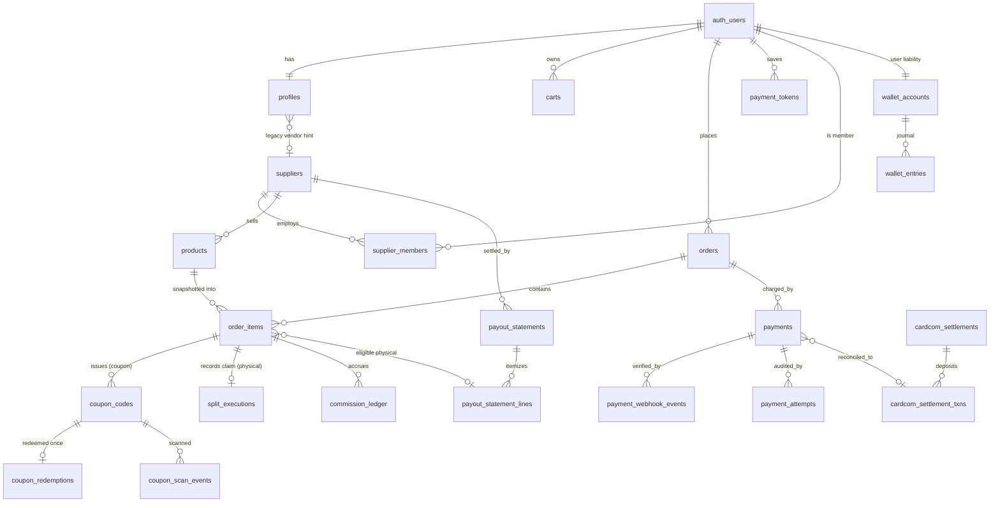

# MASTER-ARCHITECTURE v2

kenyonexpress.co.il. Branch `arch/master-v2`. **Design only.** No UI files.

Supersedes earlier drafts on this branch that still modeled coupon **escrow**.
This revision is binding to the product-owner business model below.

## Authority

| Source | Role |
|---|---|
| **Owner business model (this §)** | Binding for money |
| `ARCHITECTURE-SECURITY.md` | Controls / RLS / secrets |
| `ARCHITECTURE-LEGAL-COMPLIANCE.md` | Refund rights / invoices |
| This file | Money + runtime convergence |
| Domain docs (COMMERCE, CHECKOUT, SUPPLIER, ACCOUNT, PERF) | Detail; lose on conflict with owner model |
| `.claude/skills/cardcom-payments` | Stale on commission/Multi-Account; do not follow |

**Owner business model (binding):**

1. **Coupon:** customer pays a **% on site** (`products.platform_percent`); remainder is paid **at the merchant** when the coupon is scanned; coupon then **expires**. **NO escrow.** Platform keeps the on-site %. Supplier receives **0** from the platform for coupon lines.
2. **Physical:** customer pays **100% on site**. Platform takes per-product `platform_percent`; remainder settles to the supplier via bank payout after fulfillment eligibility.
3. **`platform_percent`** is set **per product by admin** and **MUST be snapshotted** into `order_items` at purchase. Settlement **never** re-reads live `products.platform_percent`.
4. Every product page shows **supplier details** (coupon and physical alike).
5. **Wallet** is internal cashback only, spendable on site, **never withdrawable**.

**Central decisions:**

| ID | Decision | Justification |
|---|---|---|
| D-MONEY-1 | Integer **agorot** is the sole money type end to end | Floats and `numeric(12,2)` round-trips corrupt money |
| D-MONEY-2 | Coupon on-site charge = `round_half_up(face * platform_percent / 100)`; 100% of that charge is platform revenue; **no escrow table in target** | Owner model; merchant collects remainder in cash |
| D-MONEY-3 | Physical: full charge on site; supplier claim = `face - commission`; paid only via `payout_statements` after `delivered + 14d` | Return window; no Cardcom Multi-Account at charge |
| D-LEDGER | **Hybrid:** double-entry for wallet; conserved custody tables + nightly Cardcom reconcile for external cash | Cardcom is external SoT for card money; wallet has no external arbiter |
| D-PSP | **Cardcom** Low Profile is production IL PSP (SAQ-A). Stripe foundation on `phase6/checkout-foundation` is a parallel experiment; production cutover needs an explicit ADR | Israeli cards + hosted page |
| D-EXPIRY | Expired unused coupons = **breakage** (platform keeps on-site fee); no auto wallet refund | Owner: "expires"; LEGAL may later require credit note path without changing scan/settlement |
| D-SCALE | Agorot integers in DB; display formats ₪X.XX | Matches Stripe/Cardcom minor units |

Live code that still books coupon escrow / supplier release is **defect R1** and is corrected by migration plan §9 (050), not by this doc re-adopting escrow.

---

## 1. DOMAIN MODEL

### 1.1 Classification

- **[U] user-facing** — RLS allows owner/member read (and limited write)
- **[S] server-only** — service_role / SECURITY DEFINER writes; default-deny client write
- **[A] audit** — append-only

### 1.2 ERD (target money path — no escrow)



### 1.3 Table registry (money + identity core)

| Table | Class | Purpose / key FKs |
|---|---|---|
| `profiles` | U | Role, name, phone, optional `supplier_id` hint |
| `suppliers` | U/S | Business entity; legal/bank via related tables |
| `supplier_members` | U | Real supplier authz: owner/manager/scanner |
| `products` | U | Catalog; `platform_percent` NOT NULL for `active`; `supplier_id` NOT NULL |
| `product_variants` / `product_images` / `categories` | U | Catalog |
| `carts` / `cart_items` | U/S | Ids+qty only; prices never stored as truth |
| `orders` | U/S | Header; agorot totals; `paid_at` / `expires_at` |
| `order_items` | U/S | Snapshots: `platform_percent`, `face_value_agorot`, `paid_on_site_agorot`, `commission_agorot`, `supplier_due_agorot`, `balance_due_at_business_agorot` |
| `payments` | S | Cardcom attempt; `idempotency_key` UNIQUE NOT NULL |
| `payment_attempts` | A | Full HTTP round-trip audit |
| `payment_webhook_events` | A | UNIQUE `(provider, external_event_id)` |
| `payment_tokens` | S | Cardcom token; raw column revoked from browser roles |
| `coupon_codes` | U/S | 8-digit + signed QR; statuses issued/used/expired/refunded |
| `coupon_redemptions` | A | One successful scan; UNIQUE `coupon_code_id` |
| `coupon_scan_events` | A | Every attempt including failures |
| `split_executions` | S | Physical claim record: `face = commission + supplier` CHECK |
| `commission_ledger` | S | Accrual/reversal recognition |
| `wallet_accounts` / `wallet_entries` | U/S | Double-entry internal liability |
| `payout_statements` / `payout_statement_lines` | U/S | Canonical supplier settlement (**wins over** draft `supplier_payouts`) |
| `cardcom_settlements` / `cardcom_settlement_txns` | S | PSP deposit reconcile |
| `supplier_bank_accounts` / `supplier_disputes` | S/U | Payout banking + disputes |
| `audit_log` | A | Admin/financial forensics |
| `user_addresses` | U | Shipping |
| `user_rate_limits` / `rate_limits` | S | Abuse |

**Intentionally absent from target:** `escrow_holds` (owner: no escrow). Live 047 rows are drained/nulled by migration 050 and the table is deprecated.

**Drift:** live `coupons` table (pre-008) is non-canonical; `coupon_codes` is SoT.

### 1.4 Enums (canonical)

| Enum | Values |
|---|---|
| `user_role` | customer, content_uploader, vendor, admin, super_admin |
| `product_type` | coupon, physical, service |
| `order_status` | pending, paid, partially_fulfilled, fulfilled, cancelled, refunded |
| `order_item_status` | pending, issued, shipped, delivered, cancelled, refunded |
| `coupon_status` | issued, used, expired, refunded |
| `payment_kind` | charge, token_charge, refund |
| `payment_status` | initiated, redirected, succeeded, failed, cancelled, refunded |
| `wallet_reason` | cashback_earn, order_spend, expire, refund_credit, referral_bonus, manual_adjust |
| `supplier_member_role` | owner, manager, scanner |
| `payout_status` | draft, pending_approval, approved, paid, cancelled |
| `scan_result` | success, not_found, already_used, expired, refunded, wrong_supplier, unauthorized, rate_limited |
| `settlement_match_status` | unmatched, matched, amount_mismatch |

### 1.5 State machines

#### Order (`order_status`)

```
pending --PAYMENT_CONFIRMED (webhook finalize)--> paid
pending --EXPIRE|CANCEL------------------------> cancelled
paid    --partial line progress----------------> partially_fulfilled
paid|partial --all lines terminal--------------> fulfilled
paid|partial|fulfilled --REFUND complete-------> refunded
```

**Illegal:** `cancelled -> paid`; `refunded -> *`; browser redirect as PAYMENT_CONFIRMED; any money write from client.

**Invariants:** `pending` has no wallet debit, no coupon codes, no stock decrement. Only verified webhook / reconcile may set `paid_at`.

#### Payment (`payment_status`)

```
initiated -> redirected -> succeeded | failed
initiated|redirected -> cancelled
succeeded -> refunded   (plus new row kind=refund)
```

#### Coupon (`coupon_status`)

```
(none) --finalize--> issued
issued --redeem----> used
issued --expire----> expired
issued --refund----> refunded
```

**Illegal:** `used -> issued`; redeem of `expired`/`refunded`; second redeem of `used`.

#### Physical item settlement (claim, not escrow)

```
pending --PAYMENT_CONFIRMED--> paid
paid    --EXECUTE_SPLIT------> split_recorded   (split_executions row; no bank move)
split_recorded --ship/deliver--> (item_status shipped/delivered)
delivered+14d --> payout_eligible --> on statement -> paid_out
* --REFUND--> refunded
```

#### Refund

Admin `refundPayment` -> new `payments` kind=refund -> Cardcom API for card portion -> wallet credit only if consented / already wallet-paid -> coupons `issued->refunded` if unused -> physical already paid_out becomes negative `adjustment` on next statement.

#### Wallet transaction (double-entry)

Earn: debit `platform:cashback_reserve` -> credit user  
Spend: debit user -> credit `platform:revenue`  
Expire: debit user -> credit reserve  
Never: user -> bank / card (non-withdrawable).

---

## 2. MONEY FLOW

### 2.1 Ledger model

**Hybrid (D-LEDGER).**

- **External card cash:** `payments` + `payment_webhook_events` + Cardcom settlement files. Conservation via UNIQUE txn ids and amount checks on finalize.
- **Physical supplier claim:** `split_executions` CHECK `face = commission + supplier`; paid later via `payout_statements`.
- **Platform revenue recognition:** `commission_ledger` accrual/reversal.
- **Internal wallet:** true double-entry `wallet_accounts` + `wallet_entries` with UNIQUE `idempotency_key` and non-negative user balance CHECK.

Not a full general ledger. Justification: Cardcom is external SoT; wallet is the only pure internal liability.

### 2.2 Coupon flow (no escrow)

On-site % = snapshotted `platform_percent`.

```
face_agorot     = unit_face * qty
paid_on_site    = round_half_up(face_agorot * platform_percent / 100)
balance_due     = face_agorot - paid_on_site   # collected at merchant in cash
commission      = paid_on_site                 # entire on-site charge
supplier_due    = 0
```

| Step | Recorded where |
|---|---|
| `beginCheckout` | `orders` pending; `order_items` snapshots; `payments` initiated with `idempotency_key=lp:<ref>` |
| Webhook finalize | `orders.paid_at`; `coupon_codes` issued (8-digit + QR); `commission_ledger` accrual; `item_status=issued`; optional cashback wallet credit `order:<id>:cashback` |
| Scan | `coupon_codes issued->used`; `coupon_redemptions` insert; `coupon_scan_events`; accrual `-> earned`. **No platform→supplier money move.** |
| Expiry | `issued->expired`; breakage (D-EXPIRY). Optional credit-note accounting for tax later without wallet mint. |

### 2.3 Physical flow

```
face_agorot     = unit_face * qty
paid_on_site    = face_agorot
commission      = round_half_up(face_agorot * platform_percent / 100)
supplier_due    = face_agorot - commission
balance_due     = 0
```

| Step | Recorded where |
|---|---|
| Charge | Full card amount; snapshots include `platform_percent` from product at purchase |
| Finalize | `split_executions` claim row; stock--; commission accrual pending |
| Ship/deliver | `update_shipping_status` only path; accrual -> earned on deliver |
| Settlement | Eligible after `delivered + 14d`; monthly `payout_statements`; mark_paid = super_admin after Cardcom reconcile gate |

### 2.4 Wallet

Internal cashback only. Applied at checkout reduces **card charge only**; split math runs **before** wallet (platform absorbs wallet discount). Keys: `order:<id>:spend`, `order:<id>:cashback`. `fn_wallet_transfer` is **service_role only** (SEC-01).

### 2.5 Idempotency keys (every money op)

| Op | Key |
|---|---|
| Low Profile create | `lp:<client_ref>` UNIQUE on `payments` |
| Token charge | `tok:<order_id>:<client_ref>` |
| Webhook | `(provider, external_event_id)` UNIQUE |
| Wallet cashback / spend | `order:<id>:cashback` / `order:<id>:spend` |
| Commission accrual/reversal | `commission:accrual:<item>` / `commission:reversal:<item>` |
| Refund | `ref:<payment_id>:<n>` |
| Split | UNIQUE `split_executions.order_item_id` |
| Redeem | UNIQUE `coupon_redemptions.coupon_code_id` |

`finalizeOrder` is the single valuable writer; replay is a no-op when `paid_at` already set.

### 2.6 Webhook replay

1. Persist raw body to `payment_webhook_events` first.
2. Verify HMAC; on fail mark `signature_valid=false`, still 200 after log (no state change).
3. UNIQUE conflict on `external_event_id` => 200 no-op.
4. Server-to-server re-fetch amount/status from Cardcom before finalize.
5. Amount mismatch => do not pay; open alarm.

### 2.7 Reconciliation job

| Check | Detection | Surface |
|---|---|---|
| Stuck `redirected` > 10m | Cron polls GetLpResult | Auto-finalize or fail payment |
| Deposit file vs `payments.cardcom_transaction_id` | `reconcile_cardcom_settlement` | `matched` / `amount_mismatch` / `unmatched` |
| Wallet cache vs journal | Nightly re-sum `wallet_entries` | `v_wallet_ledger_drift` SEV1 |
| Payout period incomplete reconcile | Gate in `mark_payout_statement_paid` | Block pay |

### 2.8 Chargebacks and partial refunds

Chargeback => unmatched/negative settlement line + dispute/adjustment. Partial refund: card first (LEG-10), wallet only with consent. Refund after supplier paid => negative `adjustment` on next statement.

---

## 3. COUPON SCANNING

### 3.1 Identifiers

1. **8-digit code** `^[0-9]{8}$` for manual entry.
2. **Signed QR** `KE1.<payload>.<sig>` Ed25519; payload `{v,cid,c,sid,exp}`; private key server-only; `qr_key_id` for rotation.

Live unkeyed SHA-256 QR is **R2**; replace with Ed25519 (migration 052).

### 3.2 Redemption path

`POST /api/supplier/redeem` → membership check → rate limit 30/min → resolve code → RPC `redeem_coupon`:

```sql
UPDATE coupon_codes
SET status = 'used', used_at = now()
WHERE code = $1
  AND supplier_id = $scanner_supplier
  AND status = 'issued'
  AND expires_at > now()
  AND deleted_at IS NULL
RETURNING *;
-- then INSERT coupon_redemptions (UNIQUE coupon_code_id)
-- then INSERT coupon_scan_events
```

**Race safety:** row lock on UPDATE + UNIQUE redemption. Loser gets `already_used`.

**Anti-enum:** `wrong_supplier` and `not_found` both return generic `not_found` to client; true reason in `coupon_scan_events`.

### 3.3 Offline

PWA verifies Ed25519 locally and shows pending-sync. **Do not hand goods** until online `redeem_coupon` succeeds. Client never writes coupon status.

### 3.4 Expiry job

Daily `expire_coupons()`: `issued -> expired` where `expires_at <= now()`. Breakage (D-EXPIRY). Idempotent.

---

## 4. AUTH + RBAC

### 4.1 Roles

| Role | Scope |
|---|---|
| guest | Browse + cart via `ke_session_id`; no identity |
| customer | Own account/orders/wallet |
| vendor | Coarse `/supplier` gate only |
| supplier_members.owner/manager/scanner | Real supplier authz |
| content_uploader | Catalog staff |
| admin | Admin panel, refunds, payout approve |
| super_admin | mark_paid, role elevation |

Hierarchy: customer < vendor < content_uploader < admin < super_admin.

### 4.2 Permission themes

| Capability | guest | customer | scanner | manager | owner | admin | super |
|---|---|---|---|---|---|---|---|
| Read catalog | Y | Y | Y | Y | Y | Y | Y |
| Write cart | Y* | Y | | | | | |
| beginCheckout | | Y | | | | | |
| Redeem coupon | | | Y | Y | Y | | |
| Ship order | | | | Y | Y | | |
| Bank details | | | | | Y | | |
| Refund | | | | | | Y | Y |
| mark_payout_paid | | | | | | | Y |

\*Guest cart writes via **service_role** only (SEC-09).

Money tables: **no client write policies**.

### 4.3 Session

- Always `getUser()` server-side, never trust `getSession()` alone.
- Cookie `ke_session_id` httpOnly SameSite=Lax 30d for guest cart only.
- Google OAuth PKCE primary; email magic-link backup; no SMS OTP.

### 4.4 Guest → Google at Pay

1. Browse/cart without login.
2. Pay click → `/login?next=/checkout`.
3. OAuth callback → `fn_merge_guest_cart` (race-safe).
4. `beginCheckout` re-prices from DB; never trusts client prices.
5. First Cardcom success → tokenize for one-click later.

### 4.5 RLS predicates (patterns)

- Owner: `user_id = auth.uid()` / `profile_id = auth.uid()`
- Supplier: `is_supplier_member(supplier_id)` / role checks
- Admin: `is_admin()`
- Catalog public: `status = 'active' AND deleted_at IS NULL`
- Server-only tables: RLS on, **zero** policies for anon/authenticated (service_role bypass)

---

## 5. DATA ACCESS

### 5.1 Drizzle vs supabase-js

| Layer | Tool |
|---|---|
| Runtime (Vercel) | **supabase-js / @supabase/ssr only** |
| Schema / Kit | Drizzle in `src/db/schema/*` (types + migrations assist) |
| Scripts / local | `postgres` + drizzle-kit OK |

Forbidden on Vercel functions: drizzle query runtime / raw `postgres` pools (PERF D-10).

### 5.2 Clients

| Client | File | When |
|---|---|---|
| Public anon | `src/lib/supabase/public.ts` | `use cache` catalog (no cookies) |
| User session | `src/lib/supabase/server.ts` | Account, cart merge identity |
| Browser | `src/lib/supabase/client.ts` | Interactive UI only |
| Admin service | `src/lib/supabase/admin.ts` | Webhook, finalize, guest cart write, crons |

`SUPABASE_SERVICE_ROLE_KEY` never in `"use client"` or browser bundles (CI grep).

### 5.3 Hot path queries

| Surface | Pattern | Notes |
|---|---|---|
| PDP | `getProductBySlug` + supplier join | Must include supplier display fields |
| Category | page-1 cached; filters/search uncached | |
| Cart | ids+qty; price at render via pricing fn | |
| Checkout | service-role snapshot + payment create | |
| Order history | owner RLS select | |
| Admin lists | server pagination + `is_admin` | |

### 5.4 Index plan (minimum)

- `orders (user_id, created_at DESC)` partial `deleted_at IS NULL`
- `orders (expires_at)` partial `status='pending' AND paid_at IS NULL`
- `order_items (order_id)`, `(supplier_id, item_status)`
- `payments (idempotency_key)` UNIQUE, `(cardcom_transaction_id)` UNIQUE
- `coupon_codes (code)` UNIQUE, `(supplier_id, status, expires_at)`
- `coupon_redemptions (coupon_code_id)` UNIQUE
- `wallet_entries (idempotency_key)` UNIQUE
- `products (slug)` UNIQUE active, `(supplier_id)`, GIN `search_vector`
- `payment_webhook_events (provider, external_event_id)` UNIQUE

---

## 6. CACHING + ISR

### 6.1 Profiles (`cacheLife`)

| Profile | stale | revalidate | expire |
|---|---|---|---|
| home | 300 | 300 | 86400 |
| catalog | 300 | 3600 | 86400 |
| coupons | 300 | 300 | 3600 |

### 6.2 Tag taxonomy

| Tag | Invalidated by |
|---|---|
| `products` | any product write |
| `product:<id>` | that product |
| `category:<id>` | category or its products |
| `categories` | category tree |
| `coupons` / `deals` | deal/coupon catalog admin |
| `hero` | hero slides |

### 6.3 Never cached

Search, filters, `page>1`, cart, checkout, account, admin, supplier, anything with live **price** as the paid amount.

**Why prices must not be stale:** checkout re-snapshots from DB; a stale PDP can show a wrong number and destroy trust. PDP display price may use catalog ISR **only if** `beginCheckout` always re-reads and rejects mismatch (`PRICE_CHANGED`). Prefer short catalog revalidate (≤1h) + `updateTag` on admin price edits.

### 6.4 Revalidate webhook (ops)

`POST /api/revalidate` with `x-revalidate-secret` → `revalidateTag` / `revalidatePath` by `{ table, id }`. Supabase Database Webhooks on `products`, `categories`, `coupon_deals` UPDATE/INSERT/DELETE.

---

## 7. BACKGROUND JOBS

**Scheduler:** Vercel Cron → `CRON_SECRET` route (external APIs / app logic). pg_cron for pure SQL only.

| Job | Freq | Idempotency | Alert |
|---|---|---|---|
| Cancel expired pending orders | 10 min | `expires_at` + status guard | SEV3 if overdue pending |
| Cardcom payment reconcile | 10 min | provider verify | SEV2 stuck redirected ≥5 |
| `expire_coupons` | daily | status CAS | SEV3 overdue unswept |
| Wallet ledger integrity | nightly | re-derive | SEV1 drift |
| Cardcom settlement ingest | on file / daily | txn UNIQUE | unmatched SEV3 |
| Notifications worker | 1 min | outbox dedupe | dead-letter SEV3 |
| Abandoned cart journey | daily | journey dedupe | KPI |
| Rate-limit cleanup | hourly | prune | quota |
| DB backup `pg_dump` | daily GHA | n/a | DR drill monthly |

Sitemap: ISR + on-demand tags, not cron.

---

## 8. PRODUCT PAGE SUPPLIER DISPLAY

Required on every PDP (owner §4): supplier display name, city, phone or WhatsApp if public, business hours if set, link to supplier public profile when exists. Data from `suppliers` (+ future geo columns). Cached under `product:<id>`; invalidated with product.

---

## 9. MIGRATIONS (forward)

Live remote ≈ 001–025 (+ data 043/044) with partial later applies. Drafts 026–035/042 must not be applied verbatim if they reintroduce escrow economics.

| # | Purpose |
|---|---|
| **050** | Money convergence: remove coupon escrow economics; agorot columns SoT; harden `payments` UNIQUE keys; wallet double-entry reasons; deprecate `escrow_holds` |
| **051** | Legal: invoices, terms evidence, cancellation |
| **052** | Ed25519 QR |
| **053** | Performance indexes |
| **054** | Reconciliation views/fns |
| **055** | Notifications activation |
| **056** | Attribution |
| **057** | Verticals registry |

Apply via approved MCP/`apply_migration` only — never `db push`.

---

## 10. RISK REGISTER

1. **R1** Live coupon escrow pays suppliers — contradicts owner model → 050
2. **R2** Forgeable QR SHA-256 → 052 Ed25519
3. **R3** Weak payment idempotency → NOT NULL + UNIQUE txn id
4. **R4** Schema fork (ils vs agorot, dual payout tables) → 050 + Drizzle resync
5. **R5** Wallet mint if `fn_wallet_transfer` executable by authenticated → service_role only
6. **R6** Payout before return window → `delivered+14d` gate
7. **R7** Trusting browser redirect → webhook/reconcile only
8. **R8** Unmatched Cardcom deposits → reconcile gate before mark_paid
9. **R9** Wallet cache drift → nightly SEV1
10. **R10** Role escalation → WITH CHECK + privilege trigger
11. **R11** service_role in client → CI grep + import fence
12. **R12** Dual PSP (Stripe experiment vs Cardcom) without ADR → D-PSP until cutover ADR
13. **R13** Legal invoices missing → 051 launch gate
14. **R14** Free-tier no backups → GHA pg_dump

---

## 11. OPEN QUESTIONS (decided defaults until reversed)

| Q | Default in this master |
|---|---|
| Expired coupon money | Breakage (D-EXPIRY) |
| Production PSP | Cardcom (D-PSP); Stripe stays experimental |
| Coupon on-site basis | `% of face` via `platform_percent`, not free `coupon_price` |
| Cashback rule | Configurable server-side; skill "every 5th / 5%" is launch config not schema |
| `vendors` vs `suppliers` | `suppliers` canonical; vendors legacy until unification migration |

---

## 12. DOC MAP

| Need | Read |
|---|---|
| This convergence | `MASTER-ARCHITECTURE.md` (here) |
| Security controls | `docs/ARCHITECTURE-SECURITY.md` |
| Legal | `docs/ARCHITECTURE-LEGAL-COMPLIANCE.md` |
| Checkout sequence | `ARCHITECTURE-CHECKOUT-PAYMENT.md` (Cardcom path; ignore escrow if present) |
| Supplier scan UI contracts | `docs/ARCHITECTURE-SUPPLIER-REDEMPTION.md` |
| Cache tags | `ARCHITECTURE-PERFORMANCE-SEO.md` |
| Identity | `docs/ARCHITECTURE-ACCOUNT-IDENTITY.md` |

End of MASTER-ARCHITECTURE v2.
