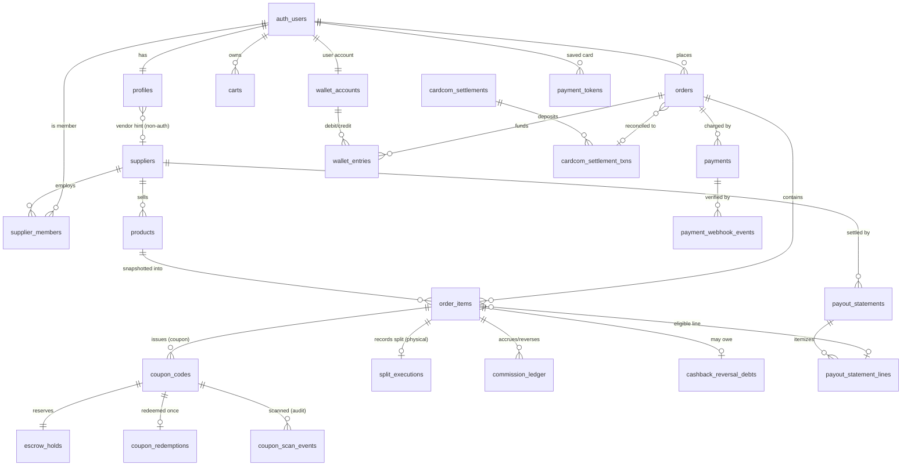

# MASTER-ARCHITECTURE (v2)

kenyonexpress.co.il. Branch `arch/master-v2`. Design only. This file does not
replace `docs/MASTER-ARCHITECTURE.md` (v3), which stays the historical master;
v2 is the money-and-runtime convergence spec built from the live code plus the
canonical domain docs. Where v2 and the live code disagree, v2 states the target
and the correction migration. Where v2 and a domain doc disagree, the resolution
is written inline with a one-line justification.

Precedence on conflict (inherited from the doc hierarchy): security
(`ARCHITECTURE-SECURITY`) > legal (`ARCHITECTURE-LEGAL-COMPLIANCE`) > this
master > domain docs > code.

Money unit everywhere: integer agorot (ILS/100). The `numeric(12,2)` `*_ils`
columns that exist today are a compatibility projection and are deprecated in
favor of agorot integers (see D-MONEY-1 and migration 050).

---

## 0. State of the world (why this document exists)

The commerce layer was built in two uncoordinated tracks, and they diverged:

- **Canonical design track (docs + drafts 026/027/042):** coupon on-site charge
  is 100% platform revenue; physical is a full charge settled to the supplier by
  manual bank transfer via `payout_statements`; wallet is double-entry; money is
  integer agorot; commission is recognized in an append-only `commission_ledger`.
  Drafts 026-035 are written but were never applied to the live DB.
- **Live runtime track (applied 007 base + 045/046/047, wired to checkout):**
  orders carry `*_ils` numeric money; `payments`, `coupon_codes`,
  `wallet_accounts`, `wallet_entries` exist in a weaker shape than the draft;
  and, critically, `settlement.ts` splits the coupon on-site charge into
  `commission + escrowReleaseToSupplier` and pays the supplier on redemption.

The second behavior contradicts `BUSINESS-MODEL.md`, the declared single source
of truth, which says coupon money stays 100% with the platform and the supplier
receives 0. That contradiction is live, tested, and losing roughly 95% of coupon
revenue to suppliers. It is risk R1 and the reason a convergence migration (050)
is the first thing that must ship.

The rest of this document is the target architecture and the ordered path to it.

Central decisions, one line each:

- **D-MONEY-1:** Integer agorot is the sole money type end to end. Justify: the
  settlement engine already computes in agorot; `numeric(12,2)` round trips are
  pure conversion risk.
- **D-MONEY-2:** Coupon on-site charge is 100% platform revenue; supplier gets 0
  from the platform. Justify: `BUSINESS-MODEL.md` is authoritative and the
  merchant collects the remainder in cash at redemption.
- **D-MONEY-3:** Physical is charged in full, held, and paid to the supplier only
  at settlement (bank transfer, `delivered + 14d`), never split at Cardcom. Justify:
  the platform must not pay for a still-cancellable item, and Cardcom multi-account
  is not configured.
- **D-LEDGER:** Not a full general-ledger double-entry. Internal wallet credit is
  double-entry (`wallet_accounts` + one journal); external money is recorded in
  purpose-built conserved custody tables (`payments`, `escrow_holds`,
  `split_executions`) plus an append-only recognition ledger (`commission_ledger`),
  reconciled nightly against Cardcom settlement files. Justify: Cardcom is the
  external source of truth; conservation `CHECK`s plus reconciliation give the same
  guarantee as a general ledger at a fraction of the complexity, and the wallet
  (a pure internal liability with no external arbiter) is the one place that needs
  true double-entry.

---

## 1. DOMAIN MODEL

### 1.1 Classification legend

- **[U] user-facing:** readable and/or writable by an end user through RLS with
  the anon key plus session.
- **[S] server-only:** written exclusively by the service-role client or a
  `SECURITY DEFINER` function; no client write policy exists (default-deny).
- **[A] audit:** append-only; `INSERT`/`UPDATE`/`DELETE` blocked for every role
  including admin; written only by `SECURITY DEFINER` functions or triggers.

### 1.2 Core commerce ERD (money path)



### 1.3 Table registry (every table, classification, key FKs)

Commerce and money:

- **`orders` [U/S]** (007; +050 agorot). PK `id`. FK `user_id -> auth.users`
  (RESTRICT). Money agorot: `subtotal_agorot`, `discount_agorot`,
  `wallet_applied_agorot`, `customer_pays_now_agorot`. Lifecycle stamps
  `paid_at`, `cancelled_at`, `refunded_at`, `expires_at`. `invoice_number` UNIQUE.
  `terms_version`, `terms_accepted_at` (051). `attribution jsonb` (056).
  `vertical text` (057). Read own via RLS; written only server-side.
- **`order_items` [U/S]** (007; +047 settlement; +050). PK `id`. FKs
  `order_id -> orders` (CASCADE), `product_id -> products` (SET NULL),
  `supplier_id -> suppliers` (RESTRICT, NOT NULL). Snapshot agorot:
  `unit_price_agorot`, `face_value_agorot`, `paid_on_site_agorot`,
  `commission_agorot`, `supplier_immediate_agorot`, `escrow_held_agorot`,
  `escrow_release_agorot`, `balance_due_agorot`, `cashback_amount_agorot`.
  Snapshot percents `upfront_percent`, `commission_percent_snapshot`,
  `platform_percent`, `cashback_percent`. `item_status` (`order_item_status`),
  `settlement_status` (`settlement_status`).
- **`products` [U/S]** (005/014; +many). PK `id`. FK `supplier_id -> suppliers`
  (RESTRICT, NOT NULL). `type product_type`, `price_ils`, nullable
  `platform_percent`, `commission_percent` (default 5), `cashback_percent`,
  `coupon_expiry_days`, `stock_quantity`, `approval_status`, `search_vector`.
  Public read active rows; staff write.
- **`product_variants` [U]**, **`product_categories` [U]** (030, PK
  `(product_id, category_id)`), **`categories` [U]**, **`coupon_deals` [U/S]**
  (015; admin deals catalog, separate from issued `coupon_codes`).
- **`carts` [U/S]**, **`cart_items` [U/S]** (026; target normalized store).
  UNIQUE partial `carts(profile_id)`. Guest rows keyed by cookie, server-written.
- **`payments` [S]** (canonical = 026 shape, hardened by 050). PK `id`. FKs
  `order_id -> orders` (RESTRICT), `token_id -> payment_tokens` (SET NULL),
  `refund_of_payment_id -> payments` (RESTRICT). `kind payment_kind`,
  `status payment_status`, `amount_agorot`, `wallet_applied_agorot`,
  `idempotency_key` NOT NULL UNIQUE, `cardcom_low_profile_id` UNIQUE,
  `cardcom_transaction_id` UNIQUE, `raw_response jsonb`.
- **`payment_webhook_events` [A]** (026/046). UNIQUE `(provider, external_event_id)`,
  `signature_valid`, `verified_against_api`, FK `payment_id -> payments` (SET NULL).
- **`payment_tokens` [S]** (046/029-hardened). FK `profile_id -> profiles`
  (CASCADE). Stores `cardcom_token`, `last_4`, `card_brand`, expiry only. Raw
  column access revoked; owner may read non-token columns and delete.
- **`escrow_holds` [S]** (047). One row per purchased coupon code. FK
  `coupon_code_id -> coupon_codes` UNIQUE (RESTRICT), plus `order_id`,
  `order_item_id`, `supplier_id`. `held_agorot`, `commission_agorot`,
  `release_agorot`, `status escrow_status`, `release_idempotency_key` UNIQUE.
  `CHECK held = commission + release`. Repurposed by D-MONEY-2 as a
  platform-side refund reserve (see section 2).
- **`split_executions` [S]** (047). One row per physical order item. FK
  `order_item_id -> order_items` UNIQUE (RESTRICT), `order_id`, `supplier_id`,
  `payment_id` (SET NULL). `face_value_agorot`, `commission_agorot`,
  `supplier_agorot`. `CHECK face = commission + supplier`. Settlement-eligibility
  record, not a money movement (D-MONEY-3).
- **`commission_ledger` [A]** (042). Append-only revenue recognition. FKs
  `order_id`, `order_item_id`, `supplier_id` (RESTRICT), `product_id` (SET NULL),
  `reversal_of_id -> commission_ledger` (RESTRICT). `event commission_ledger_event`,
  `status commission_ledger_status`, bps and agorot columns, `idempotency_key`
  NOT NULL UNIQUE. `CHECK` reversal shape.
- **`cashback_reversal_debts` [S]** (042). FK `user_id` (RESTRICT),
  `order_item_id` UNIQUE (RESTRICT). `amount_agorot`, `status`
  (`outstanding`/`settled`).

Wallet:

- **`wallet_accounts` [U-read/S-write]** (canonical = 026 shape). One per user
  plus seeded platform accounts. `owner_type` (`user`/`platform`), `user_id`
  UNIQUE, `code` UNIQUE. `balance_agorot` is a cache, not truth. Platform codes:
  `platform:cashback_reserve`, `platform:revenue`, `platform:adjustments`.
- **`wallet_entries` [A]** (canonical journal, live name from 046, upgraded by
  050 to carry `reason wallet_reason` enum and `related_order_item_id`).
  `debit_account`, `credit_account` (RESTRICT), `amount_agorot > 0`,
  `idempotency_key` NOT NULL UNIQUE, `CHECK debit <> credit`.
- **`wallet_transactions_legacy` [A]**, **`wallet_balances` [A]** (006). Frozen
  read-only history.

Coupons:

- **`coupon_codes` [U/S]** (canonical = 008 constraints + 027/046 snapshot cols).
  `code` UNIQUE `CHECK ~ '^[0-9]{8}$'`. FKs `product_id`, `order_item_id`
  (CASCADE), `user_id -> auth.users` (RESTRICT), `supplier_id`. `status
  coupon_status`, `expires_at`, `qr_token`, `qr_key_id`, snapshot
  `face_value_agorot`/`platform_paid_agorot`/`collect_amount_agorot`,
  `used_at`, `used_by_supplier_user_id`, `used_scan_method`.
- **`coupon_redemptions` [S]** (026). FK `coupon_code_id` UNIQUE (RESTRICT). The
  single-use arbiter under concurrency.
- **`coupon_scan_events` [A]** (027). Every scan attempt, success or fail.

Suppliers and settlement:

- **`suppliers` [U/S]**, **`supplier_applications` [U/S]**,
  **`supplier_members` [U/S]** (authorization source of truth, UNIQUE
  `(supplier_id, user_id)`), **`supplier_bank_accounts` [S]** (owner+admin only,
  masking audit trigger), **`payout_statements` [U-read/S-write]**,
  **`payout_statement_lines` [U-read/S-write]**, **`supplier_disputes` [U/S]**
  (all 027).
- **`cardcom_settlements` [S]**, **`cardcom_settlement_txns` [S]** (027).
  Reconciliation input, matched on `payments.cardcom_transaction_id`.

Identity, catalog, notifications, analytics, security (summarized; full DDL in
the domain docs and migrations):

- **`profiles` [U/S]**, **`user_addresses` [U]**, **`user_notification_preferences`
  [U]**, **`account_deletion_requests` [U/S]**, **`payment_tokens`** (above).
- **`attribute_definitions` [U]**, **`category_attributes` [U]**,
  **`search_synonyms` [S]**, **`seo_redirects` [S]**, **`search_queries` [A]**.
- **`notifications_outbox` [U-read-read_at/S-write]**, **`notification_events`
  [A]**, **`notification_templates` [S]**, **`notification_delivery_events` [A]**,
  **`channel_suppressions` [S]**, **`consent_events` [A]**,
  **`notification_conversions` [S]** (029/031).
- **`analytics_events` [A]** (partitioned), **`analytics_daily` [S]**,
  **`analytics_event_definitions` [S]** (033/034).
- **`audit_log` [A]** (011/025), **`security_events` [A]** (035),
  **`rate_limits`/`user_rate_limits` [S]** (002/019).

Legal (051, expand-only): **`invoices` [S]**, **`cancellation_requests` [U/S]**,
**`legal_document_versions` [S]**.

Future (057, expand-only): **`verticals` [S]**, per-vertical detail tables
(`delivery_jobs`, `ride_details`), **`push_subscriptions` [U/S]**.

### 1.4 Enum registry (name: ordered values)

- `product_type`: coupon, physical, service.
- `order_status`: pending, paid, partially_fulfilled, fulfilled, cancelled, refunded.
- `order_item_status`: pending, issued, shipped, delivered, cancelled, refunded.
- `settlement_status` (047, the money engine): pending, paid, split_executed,
  escrow_held, escrow_released, redeemed, refunded, cancelled.
- `escrow_status`: held, released, refunded.
- `payment_kind` (canonical): charge, token_charge, refund.
- `payment_status` (canonical): initiated, redirected, succeeded, failed,
  cancelled, refunded.
- `coupon_status`: issued, used, expired, refunded.
- `scan_result` (027): success, not_found, already_used, expired, refunded,
  wrong_supplier, unauthorized, rate_limited.
- `wallet_reason`: cashback_earn, order_spend, expire, refund_credit,
  referral_bonus, manual_adjust.
- `commission_ledger_event`: accrual, reversal. `commission_ledger_status`:
  pending, earned, reversed.
- `user_role`: customer, content_uploader, vendor, admin, super_admin, support.
- `supplier_status`: active, suspended, closed. `supplier_application_status`:
  pending, approved, rejected. `supplier_member_role`: owner, manager, scanner.
- `payout_status` (027, canonical): draft, pending_approval, approved, paid,
  cancelled. `payout_line_type`: physical_delivery, coupon_redemption, adjustment.
- `dispute_status`: open, in_review, resolved_accepted, resolved_rejected.
- `settlement_match_status`: unmatched, matched, amount_mismatch.
- `notification_status`: queued, sent, failed, cancelled, dead, skipped.
- `audit_action`: created, updated, deleted, restored, login, logout,
  permission_change, status_change, manual_override.
- `product_approval_status`: draft, pending, approved, rejected.
- `deletion_request_status`: pending, cancelled, completed.
- Planned (051): `cancellation_reason` (remorse, defect, not_delivered,
  not_as_described), `cancellation_status` (submitted, approved, rejected,
  refunded, closed), `invoice_kind` (platform_receipt, supplier_sale, commission,
  credit_note).

### 1.5 State machines (every legal transition)

**Order (customer-facing, `orders.status`).** This is the coarse view; the money
truth is the per-item settlement machine below, rolled up by `deriveOrderStatus`.

```
pending --PAYMENT_CONFIRMED--> paid
pending --EXPIRE/CANCEL------> cancelled
paid    --(all items fulfilled)--> fulfilled
paid    --(some fulfilled)------> partially_fulfilled
paid | partially_fulfilled | fulfilled --REFUND--> refunded
```

**Settlement (per `order_items.settlement_status`, the money engine).** Exact
legal transitions, product-type-gated:

```
pending        --PAYMENT_CONFIRMED--> paid
pending        --CANCEL------------> cancelled
paid (physical)--EXECUTE_SPLIT-----> split_executed
paid (coupon)  --HOLD_ESCROW-------> escrow_held
paid           --REFUND------------> refunded
escrow_held    --REDEEM (coupon)---> redeemed
escrow_held    --REFUND------------> refunded
redeemed       --RELEASE_ESCROW----> escrow_released
split_executed --REFUND------------> refunded
escrow_released, refunded, cancelled = terminal
```

Rule enforced in `state-machine.ts`: `REFUND` is illegal from `redeemed` and
`escrow_released` (after redemption the platform no longer holds the money).
Order rollup: least-advanced active line wins while any line is active; once all
lines are terminal, `escrow_released` dominates `split_executed` (the coupon leg
settles last in a mixed order).

**Coupon (`coupon_codes.status`), one-way terminal:**

```
issued --redeem_coupon()------> used
issued --expire_coupons() cron-> expired
issued --admin refund/cancel--> refunded
used, expired, refunded = terminal
```

**Escrow (`escrow_holds.status`):**

```
held --redeem (guarded UPDATE)--> released   (to platform:revenue, per D-MONEY-2)
held --expire/cancel/refund-----> refunded   (to customer wallet)
```

**Payment (`payments.status`):**

```
initiated --provider hosted page--> redirected
redirected --verified webhook/API succeeded--> succeeded
initiated | redirected --provider fail/timeout--> failed
initiated | redirected --user abort--> cancelled
succeeded --refund confirmed--> refunded
```

Only a server-to-server verify (webhook or reconcile) may drive
`redirected -> succeeded`. The browser redirect is cosmetic (R12).

**Refund (composite, not a single column).** A refund is a new `payments` row
`kind='refund'` with `refund_of_payment_id` set; the original flips
`succeeded -> refunded` only after Cardcom confirms. Downstream: the item's
`settlement_status -> refunded`, any `escrow_holds -> refunded` (money to
customer wallet), coupon `issued -> refunded`; a paid `payout_statement` is
corrected by a negative `adjustment` line in the next period.

**Wallet transaction.** Rows are immutable (append-only); there is no per-row
state machine. The "machine" is the account balance, moved only by
`fn_wallet_transfer` with a `wallet_reason`:

```
cashback_earn   : platform:cashback_reserve -> user
order_spend     : user -> platform:revenue
refund_credit   : platform:adjustments -> user
expire          : user -> platform:cashback_reserve
referral_bonus  : platform:cashback_reserve -> user
manual_adjust   : platform:adjustments <-> user
```

Corrections are compensating entries, never edits. Commission recognition runs a
parallel status machine on `commission_ledger`:
`pending -> earned` (on fulfillment/redemption) and `pending|earned -> reversed`
(on refund/cancel), reversal always as a new row pointing at `reversal_of_id`.
`cashback_reversal_debts`: `outstanding -> settled`.

---

## 2. MONEY FLOW

### 2.1 Ledger model (decision and justification)

**Decision: single-entry conserved custody tables + reconciliation for external
money; double-entry for the internal wallet.** Justification in one line: Cardcom
holds the real cash and is reconciled as the external arbiter, so purpose-built
tables whose columns satisfy a conservation `CHECK` give a general ledger's
guarantee without its overhead, while the wallet (a pure internal liability) has
no external arbiter and therefore must be double-entry.

Conservation invariants (all enforced by `CHECK`, all agorot):

- `payments.amount_agorot` is the card charge; `payment_webhook_events` proves it.
- `escrow_holds`: `held = commission + release`.
- `split_executions`: `face = commission + supplier`.
- `wallet_entries`: every row moves one amount from one account to another, and
  no user account may go negative; total cashback liability is exactly the
  balance of `platform:cashback_reserve`.
- `commission_ledger`: accrual and reversal rows net to recognized revenue.

### 2.2 Coupon flow (corrected per D-MONEY-2)

Business shape: the customer pays only `coupon_price` (a free per-deal price set
in the product page, not a percentage of face) on the site; the merchant collects
the remaining `collect_amount = total_deal_price - coupon_price` in cash at
redemption. The on-site charge is 100% platform revenue.

What is recorded at each step:

1. **On-site charge (`beginCheckout`).** Pending `orders` + `order_items`
   snapshot; a `payments` row `kind='charge'`, `idempotency_key = lp:<client_ref>`.
   `paid_on_site_agorot = coupon_price * qty`, `balance_due_agorot =
   collect_amount * qty`. Commission booked equals `paid_on_site_agorot` (the
   whole on-site charge), not `commission_percent` of it. This is the correction:
   today `settlement.ts` books only `commission` and assigns the remainder to the
   supplier; 050 sets `commission_agorot = paid_on_site_agorot`,
   `escrow_release_agorot = 0` for coupons, `supplier_due = 0`.
2. **Coupon issued (verified webhook, `finalizeOrder`).** For each unit: a
   `coupon_codes` row (`status='issued'`, 8-digit code, signed `qr_token`), and
   an `escrow_holds` row now acting as a platform refund reserve
   (`held = paid_on_site`, `release = 0`, funds earmarked to `platform:revenue`).
   `commission_ledger` accrual row keyed `commission:accrual:<item>`.
   `settlement_status -> escrow_held`, `item_status -> issued`. Cashback (if any)
   credited from `platform:cashback_reserve` to the user, keyed
   `order:<id>:cashback`.
3. **Scan at merchant (`redeem_coupon`).** Single-use `UPDATE issued -> used`;
   `coupon_redemptions` row (UNIQUE arbiter); `escrow_holds held -> released` to
   `platform:revenue` (the reserve is no longer needed), keyed `rel:<coupon>`;
   `commission_ledger` accrual `pending -> earned`; `settlement_status ->
   redeemed`, then `escrow_released` when the item's last voucher clears.
4. **Expiry (`expire_coupons` cron).** `issued -> expired`;
   `fn_refund_expired_coupon` credits the customer wallet the full
   `platform_paid_agorot` as `refund_credit` valid 5 years, issues a credit note,
   keyed `expired_refund:<coupon>`; `escrow_holds held -> refunded`.

### 2.3 Physical flow (per D-MONEY-3)

1. **Full charge.** Customer pays 100% on the site. `payments` `kind='charge'`.
   `order_items` snapshot: `platform_percent` from
   `product_platform_percent(product_id)` (product override, else supplier
   default, else 10), `commission_agorot = round_half_up(face * pp/100)`,
   `supplier_immediate_agorot = face - commission` (a claim, not yet paid).
2. **Split recorded (finalize).** `split_executions` row conserves
   `face = commission + supplier`; stock decremented; `commission_ledger` accrual.
   No money leaves the platform here.
3. **Fulfillment.** Supplier marks shipped then delivered via
   `update_shipping_status` (the only supplier write path to `order_items`);
   `commission_ledger` accrual `-> earned`; cashback credited on `shipped`.
4. **Settlement (`payout_statements`).** After `delivered + 14d` (aligned to the
   consumer return window) the item becomes eligible for the supplier's monthly
   statement. `generate_payout_statement -> pending_approval -> approve ->
   mark_paid` (super_admin, bank details frozen into `bank_snapshot`). Payout is a
   manual bank transfer; the platform issues the supplier a commission tax invoice
   on `platform_fee` per period.

### 2.4 Wallet and cashback

Every 5th purchase earns 5% cashback (snapshot `cashback_amount_agorot`), credited
at finalize from `platform:cashback_reserve` to the user. Wallet credit is
internal only and never cashes out. At checkout, applied wallet reduces the card
charge only (`cardCharge = paidOnSite - walletApplied`), moving user ->
`platform:revenue` keyed `order:<id>:spend`. Wallet money is bounded by the
non-negative user-account `CHECK` (the double-spend floor) and serialized by
`fn_wallet_transfer` locking both accounts in uuid order.

### 2.5 Idempotency keys (every money op)

- `payments.idempotency_key = lp:<client_ref>` (NOT NULL UNIQUE): dedups
  checkout submits.
- `payment_webhook_events (provider, external_event_id)` UNIQUE: dedups webhooks.
- `wallet_entries.idempotency_key` (NOT NULL UNIQUE): `order:<id>:cashback`,
  `order:<id>:spend`, `expired_refund:<coupon>`, `legacy_opening:<user>`.
- `commission_ledger.idempotency_key`: `commission:accrual:<item>`,
  `commission:reversal:<item>`.
- `escrow_holds.release_idempotency_key = rel:<coupon>` (UNIQUE).
- `split_executions.order_item_id` UNIQUE: one split per item.
- `coupon_redemptions.coupon_code_id` UNIQUE: one redemption per code.

Rule R33: every money move carries a named idempotency key and returns
`ActionResult<T>` from a 16-code taxonomy. `finalizeOrder` is the single writer
of the valuable transition; it is a no-op on replay (guarded by
`orders.paid_at`, per-item status filters, and the UNIQUE constraints above).

### 2.6 Reconciliation

Nightly and on settlement-file arrival: ingest the Cardcom deposit file into
`cardcom_settlements` (+ `cardcom_settlement_txns`, one row per txn), then
`reconcile_cardcom_settlement` JOINs each txn to `payments.cardcom_transaction_id`
(the canonical external identity; `orders.cardcom_payment_id` is write-through
only). Outcomes: `matched`, `amount_mismatch`, `unmatched` (a pipeline hole).
Operational rule: never mark a `payout_statement` paid for a period whose
reconciliation is incomplete, and a `disputed` statement cannot be paid (enforced
inside `mark_payout_statement_paid`, not just the UI). A second nightly job
re-derives wallet balances from `wallet_entries` and alerts on any drift
(`v_wallet_ledger_drift`); drift is SEV1.

### 2.7 Chargebacks and partial refunds

- **Chargeback:** appears as an `unmatched`/negative reconciliation line and a
  provider webhook; opens a `supplier_disputes` or adjustment workflow. If the
  supplier was already paid, recovery is a negative `adjustment` line on the next
  statement.
- **Partial refund:** `refundPayment(card_agorot, wallet_agorot)`. Card portion
  goes back to the card via Cardcom first (LEG-10: refund the way it was paid);
  overflow or consented compensation goes to the wallet as `refund_credit`.
  Card -> wallet is allowed only with explicit, recorded consumer consent.

---

## 3. COUPON SCANNING (end to end)

### 3.1 Token format

Two identifiers per coupon:

1. **8-digit numeric code** (`coupon_codes.code`, `CHECK ~ '^[0-9]{8}$'`) for
   manual entry. The `10^8` space is protected by the redemption rate limit.
2. **Signed QR token** (`qr_token`, `qr_key_id`). Target format:
   `KE1.<base64url(payload)>.<base64url(sig)>` where payload is
   `{v, cid, c, sid, exp}` and `sig` is **Ed25519** over the payload. The private
   key `SUPPLIER_QR_SIGNING_KEY` is server-only; the public key ships in the
   scanner PWA so verification is offline; `qr_key_id` enables rotation.

Correction (R2): the live code signs with an unkeyed SHA-256
(`KE|code|orderItemId|expiresUnix|userId|sha256[:32]`). That is not a signature
(anyone who knows the format forges it); migration 052 replaces it with Ed25519.
Until then the only real defense is the DB check plus rate limit.

### 3.2 Redemption path and single-use safety

`POST /api/supplier/redeem` -> resolve supplier from `supplier_members` ->
rate limit `check_my_rate_limit(uid, 'coupon_scan', 30, 60)` -> resolve short code
(direct, or out of a verified QR payload) -> canonical RPC
`public.redeem_coupon(code, method)`.

Single use is enforced twice:

- **Atomic conditional update:** `UPDATE coupon_codes SET status='used' ...
  WHERE code=? AND supplier_id=<scanner> AND status='issued' AND expires_at>now()
  AND deleted_at IS NULL RETURNING *`. A concurrent second scan re-evaluates after
  the row lock and updates 0 rows.
- **Hard barrier:** `coupon_redemptions.coupon_code_id` UNIQUE. The loser of a
  double scan fails the insert and gets `already_used`.

Escrow release is a separate guarded `UPDATE ... WHERE status='held'` keyed
`rel:<coupon>`, so money moves exactly once even under retry.

Anti-enumeration: `wrong_supplier` and `not_found` both return generic
`not_found`; the true reason is logged to `coupon_scan_events` (append-only,
90-day retention). Supplier binding in the WHERE clause makes a leaked code
useless at another business.

### 3.3 Offline fallback

The scanner PWA verifies the Ed25519 signature locally and shows a yellow
"pending sync" banner when offline. Business rule: do not hand over goods before
online confirmation. The scan enters a local `redeem_intents` queue drained by
the service worker when back online; money is collected only after the online
`redeem_coupon` succeeds. The server is always the arbiter; the client never
writes coupon status.

### 3.4 Expiry job

`expire_coupons()` (service-role, daily): `issued -> expired` for
`expires_at <= now()`, then `fn_refund_expired_coupon` per coupon (wallet credit,
credit note, `escrow_holds -> refunded`). Idempotent status transition plus
`expired_refund:<coupon>` key make reruns safe. Alert if any overdue coupon is
left unswept (SEV3).

---

## 4. AUTH + RBAC

### 4.1 Roles and hierarchy

`profiles.role user_role`. Hierarchy (least to most, via `has_role`):
`customer < vendor < content_uploader < admin < super_admin`. `support` (049) is
orthogonal: a read-only tier gated by `is_support()`, outside the hierarchy, with
explicit SELECT-only policies and no money or role-mutation access.

Critical rule: `role='vendor'` is only a routing hint. Supplier authorization is
never the enum; it is an active row in `supplier_members` with a `member_role`
(`owner`/`manager`/`scanner`), checked by `is_supplier_member()` /
`is_supplier_owner()`.

### 4.2 Permission matrix (role x capability)

| Capability | guest | customer | supplier scanner | supplier owner | content_uploader | admin | super_admin | support |
|---|---|---|---|---|---|---|---|---|
| Browse catalog, guest cart | yes | yes | yes | yes | yes | yes | yes | yes |
| Checkout, own orders/wallet | no | yes | yes | yes | yes | yes | yes | read |
| Scan/redeem coupon | no | no | yes | yes | no | no | no | no |
| Manage supplier members/bank | no | no | no | yes | no | via admin | via admin | no |
| Edit catalog (products/categories) | no | no | no | no | own rows | yes | yes | read |
| Approve products/suppliers | no | no | no | no | no | yes | yes | no |
| Payments/refunds view | no | own | no | no | no | yes | yes | read |
| Mark payout paid, grant admin roles | no | no | no | no | no | no | yes | no |
| Read audit/security log | no | no | no | no | no | yes | yes | no |

### 4.3 Enforcement (4 layers)

1. **Middleware** (`proxy.ts`): coarse routing; `/admin*` reads `profiles.role`
   authoritatively (never stale `app_metadata`); `/checkout*` requires a session.
2. **Server-action guards** (`src/lib/admin/rbac.ts`): `requireUserSession`,
   `requireStaffSession`, `requireAdminSession`, `requireSupplierMember(minRole)`,
   `requireRecentAuth(15)` for money-out and role grants.
3. **RLS**: `is_admin()`, `is_supplier_member()`, `is_support()`, owner-scoped
   `auth.uid()` policies, with WITH CHECK on every writable table.
4. **DB triggers** (deepest): `enforce_role_change_privilege` (only super_admin
   grants/revokes admin tiers, nobody elevates self),
   `enforce_supplier_member_role` (non-admins cannot mint an `owner`),
   `enforce_product_approval` (non-admin writes forced to `pending`).

### 4.4 Session strategy

Single source of truth: httpOnly + Secure + SameSite=Lax cookies managed by
`@supabase/ssr`; JWT ~1h with refresh-token rotation and reuse detection. Iron
rule: the server always calls `supabase.auth.getUser()`, never `getSession()`
(the latter trusts the cookie JWT without server verification). `signOutAll` uses
`scope: global`.

### 4.5 Guest cart -> Google login -> saved card token

- **Guest cart:** a cookie (`ke_cart_sid`, httpOnly, SameSite=Lax, 30d, random
  UUID) keys a server-written `carts` row. Cart carries ids and quantities only,
  never prices or PII. (Contradiction flagged: `ke_session_id` vs `ke_cart_sid`
  across docs; v2 fixes the name to `ke_cart_sid`.)
- **Login:** Google OAuth (PKCE) is the gate, required only when the customer
  clicks pay. Fallbacks: email/password and magic link. No SMS OTP. Open-redirect
  guard via `safeNext()`.
- **Cart merge:** at `/auth/callback` after `exchangeCodeForSession`, the user
  client calls `fn_merge_guest_cart(session_id)` (SECURITY DEFINER):
  `pg_advisory_xact_lock(hash(uid))`, `SELECT ... FOR UPDATE` both carts, atomic
  claim or jsonb merge by `product_id::variant_id` (quantities summed, capped 99),
  delete the guest cart in the same transaction. A partial UNIQUE index on
  `carts(profile_id)` prevents duplicates. Failures log to `security_events` and
  never block login.
- **Saved card:** after the first successful Cardcom charge, the verified webhook
  (service role) writes `payment_tokens` (`cardcom_token`, `last_4`, brand,
  expiry). Never the client, never the raw PAN. Future one-click uses
  `chargeWithToken`.

---

## 5. DATA ACCESS

### 5.1 Drizzle vs supabase-js (decision)

**Runtime data access is PostgREST only, through `@supabase/ssr` /
`supabase-js`.** The direct Postgres driver (`postgres`, `drizzle-orm`) is
forbidden in Vercel functions and allowed only in local scripts and migration
authoring. Justification: PostgREST is the pooling strategy (no serverless
connection ceiling to burn), and RLS is applied uniformly. Drizzle stays as the
schema-authoring and type source (`src/db/schema`), not a runtime client. Note:
the Drizzle schema currently models the unapplied 026/042 world
(`commission_ledger`, agorot orders) and must be re-synced to the live schema
after migration 050 so types match reality.

### 5.2 Four clients and when service_role is legitimate

- `src/lib/supabase/server.ts` (user, cookies): every customer and admin screen.
- `src/lib/supabase/client.ts` (browser): client components.
- `src/lib/supabase/public.ts` (anon, no cookies): cached catalog reads inside
  `use cache`.
- `src/lib/supabase/admin.ts` (service role, RLS bypass, the crown jewel):
  legitimate only for guest-cart writes (guests have no DB identity), verified
  webhook writes to `payments`/`payment_tokens`, `beginCheckout` writing
  `orders`/`order_items`/`payments` (no client INSERT policy exists),
  `adminAdjustWallet` calling `fn_wallet_transfer`, and cron/service RPCs.

Forbidden: service role in any customer-facing screen; any client write to
`orders`, `order_items`, `payments`, `wallet_*`, `coupon_codes`,
`coupon_redemptions`, or the audit/security tables. Every financial mutation goes
through a `SECURITY DEFINER` function; financial tables have zero client-facing
write policies (default-deny is correct). CI greps that
`SUPABASE_SERVICE_ROLE_KEY` never reaches the client bundle.

### 5.3 Query patterns per surface

- **Product page** (`/products/[slug]`): RSC direct select via the public client,
  cached (`catalog`). `getProductBySlug` (single embed select) plus
  `getRelatedProducts` (RPC `related_products`), 2 parallel round-trips.
  `generateMetadata` reuses the same cached functions with `React.cache` dedup.
- **Category page** (`/category/[slug]`): page-1-no-filters is RSC cached; filtered
  / sorted / page>=2 is dynamic RSC in Suspense, no cache, via `filter_products`
  and `category_facets` in parallel, offset pagination, `count: 'exact'`, page 24.
- **Cart:** server actions; user client for authenticated (owner-ALL policy),
  admin client keyed by cookie for guests; prices resolved live at read.
- **Checkout:** `beginCheckout` server action; reads with the user client, writes
  `orders`/`order_items`/`payments` with the admin client in one transaction;
  prices computed server-side only; cache is forbidden from touching checkout
  prices.
- **Order history** (`/account/orders`): RSC or server actions
  (`listMyOrders`/`getOrderDetail`), user client end to end, RLS own-rows.
- **Admin:** server actions under `src/server/actions/admin/`, user client so
  admin RLS applies, fully dynamic, `requireAdminSession` every request.
- **Supplier portal:** RSC dashboard reads over `security_invoker` views; scanner
  redeem is the one route handler that uses cookies.

### 5.4 Index plan

- **Catalog/search (030):** GIN on `products.search_vector` (weighted tsvector),
  GIN trigram on `products.name_he` (typo + autocomplete), GIN `jsonb_path_ops`
  on `products.attributes`; same pattern on `coupon_deals`.
- **Listings (050/053):** `products(created_at desc) WHERE active`,
  `products(category_id, created_at desc) WHERE active`,
  `products(category_id, kenyon_price) WHERE active`.
- **Unindexed FKs to fix:** `order_items(variant_id)`, `payments(token_id)`,
  `payments(refund_of_payment_id)`, `notification_conversions(outbox_id)`,
  `coupon_codes(product_id)`.
- **Money identity UNIQUEs (double as indexes):** `payments.idempotency_key`,
  `payments.cardcom_transaction_id`, `payments.cardcom_low_profile_id`,
  `payment_webhook_events(provider, external_event_id)`,
  `wallet_entries.idempotency_key`, `commission_ledger.idempotency_key`,
  `coupon_redemptions.coupon_code_id`, `split_executions.order_item_id`,
  `payout_statement_lines.order_item_id`.
- **Hot paths:** `orders(user_id, status)`, `order_items(order_id)`,
  `order_items(supplier_id)`, `coupon_codes(expires_at) WHERE status='issued'`
  (cron), `commission_ledger(supplier_id, status, created_at desc)`.
- **Explicit non-index:** no category name-sort index (under 30k products,
  in-memory sort is cheaper). No PostGIS yet; `coupon_deals.lat/lng` sort is
  in-memory until geo volume justifies it.
- Governance: monthly `get_advisors` + `pg_stat_statements`; drop any index
  unused 60 days.

---

## 6. CACHING + ISR

Model: Next 16 Cache Components + PPR (`cacheComponents: true`), static skeleton
from the CDN with dynamic streamed holes. Every cached data function is also
wrapped in `React.cache` for same-render dedup. Reads inside `use cache` use the
cookieless public client.

### 6.1 cacheLife profiles

- `home`: stale 300, revalidate 300, expire 86400.
- `catalog`: stale 300, revalidate 3600, expire 86400 (product, category, tree).
- `coupons`: stale 300, revalidate 300, expire 3600 (short, because deals expire
  by `valid_until`).

### 6.2 Tag taxonomy

Flat tags: `hero`, `products`, `deals`, `categories`, `coupons`. Parameterized:
`product:<id>`, `category:<id>`, `coupon:<id>`.

| Data function | cacheLife | tags |
|---|---|---|
| `getHomeFeed()` | home | hero, products, deals |
| `getProductBySlug(slug)` | catalog | product:<id>, products |
| `getRelatedProducts(id, catId)` | catalog | category:<id>, products |
| `getCategoryWithChildren(slug)` | catalog | categories, category:<id> |
| `getCategoryProductsPage1(catId)` | catalog | category:<id>, products |
| `getActiveCouponDeals()` | coupons | coupons |
| `getCategoryTree()` | catalog | categories |
| filtered / search / page>1 / facets | none | dynamic |
| cart, checkout, account, admin | none | fully dynamic |

### 6.3 Invalidation (which change invalidates which tag)

- Admin product create/update/delete -> `product:<id>`, `products`,
  `category:<id>` of associated categories.
- Admin category update -> `categories`, `category:<id>`, `products`.
- Admin hero update -> `hero`. Admin deal/coupon update -> `coupons`,
  `coupon:<id>`.
- Payment webhook decrements stock -> `revalidateTag('product:<id>', 'max')`.

Rule: server actions use `updateTag` (immediate read-your-writes in the same
request); route handlers use `revalidateTag(tag, 'max')` (the second arg is
mandatory in Next 16).

### 6.4 Stale tolerance and why prices are never stale

Prices and stock change only through the admin panel, and every such mutation
passes through `updateTag`. So there is no stale-price window beyond an in-flight
navigation; the timed `revalidate` is only a safety net. Coupons get the short
300s window because they expire by time, not by admin action. Checkout price is
never cached: it is resolved server-side inside `beginCheckout`, and no contract
accepts a price, discount, or percentage from a client. Redis is explicitly not
introduced now; rate limiting stays on Postgres until measured triggers (T-1
>25 rate-limit writes/sec sustained, T-2 DB CPU >60% weekly peak with rate-limit
functions in the top 5, T-3 >200k analytics events/month).

---

## 7. BACKGROUND JOBS

Scheduler decision: **Vercel Cron -> a `CRON_SECRET`-protected route handler
(service-role client) is canonical** for anything that calls an external API or
runs app logic; **pg_cron is the SQL-only fallback** and is explicitly rejected
for external-API jobs (reconcile). Production requires Vercel Pro (Hobby caps at 2
daily jobs). One per-minute cron is the anchor for the notification pipeline; one
daily 08:00 cron drives reminders and journeys. The DB backup is a GitHub Action
`schedule` cron to external storage, not pg_cron. Every `/api/cron/*` route pings
a Better Stack heartbeat (patience window = 2x frequency), so a silently dead cron
alerts within one cycle.

| Job | Trigger / freq | Idempotency | Failure mode | Retry | Alerting |
|---|---|---|---|---|---|
| Notification fanout+claim+send | Vercel cron, 1 min | event dedupe_key + outbox dedupe_key + `FOR UPDATE SKIP LOCKED` + provider key | send fail -> attempts+1, at 5 -> `dead` | exp backoff `5min*2^n`, cap 6h, max 5 | `v_notification_kpis`; new `dead` row SEV3; heartbeat |
| Coupon expiry sweep (`expire_coupons` + refund) | Vercel/pg cron, daily | idempotent status + `expired_refund:<coupon>` | overdue left unswept | via outbox | `overdue_not_swept>0` SEV3 |
| Coupon expiry reminders | Vercel cron, daily 08:00 | dedupe `coupon_expiry_7d/48h:<id>` | quiet-hours defer | outbox retry | KPI redemption lift |
| Abandoned cart / win-back | daily 08:00 / weekly | dedupe per cart/quarter | consent off -> skipped | outbox retry | journey revenue view |
| Cardcom reconcile (stuck payments) | Vercel cron, 10 min | queries Cardcom for `redirected`>10min | webhook never arrived -> cron catches it | provider verify | `payments_stuck_redirected_10m>=5` SEV2; heartbeat |
| Cancel expired pending orders | Vercel cron, 10 min | `orders.expires_at` guard | none | none | `pending_orders_past_expiry_1h>=1` SEV3 |
| Settlement generate/approve/pay | admin-triggered + reconcile gate | statement snapshots, partial UNIQUE per period | mismatch blocks pay | manual | unmatched txn SEV3; `total<>sum(lines)` SEV1 |
| Wallet ledger integrity | Vercel/pg cron, nightly | re-derive from `wallet_entries` | drift | none | `wallet_ledger_drift>=1` SEV1 |
| Business alerts engine | Vercel cron, 15 min | 6h dedup on open `security_events` | reads `v_money_alarms` | none | writes `security_events` + heartbeat |
| Cardcom sandbox heartbeat | Vercel cron, 15 min | 1 ILS probe, never real | 2 fails (30 min) SEV2 | none | dedicated heartbeat |
| Synthetic coupon-scan probe | Vercel cron, 10 min | reserved code `00000000`, expects not_found | 2 fails SEV2 | none | heartbeat; probes filtered from analytics |
| CAPI / offline conversions | Vercel cron, 1 min | `capi_events (destination, event_id)` UNIQUE, event_id=order_id | provider fail | attempts + retry | delivery KPIs |
| Referral completion | daily, after expiry | keys `referral_referrer/referred:<id>` | 14-day window | double run no-op | KPI |
| Rate-limit cleanup | cron, hourly | table prune | unbounded growth on free tier | none | manual on quota-full |
| Analytics rollup + partition mgmt | owned by 033/034 | partition guards | default-partition rows | none | `analytics_default_partition_rows>=1` SEV3 |
| DB backup (`pg_dump`) | GitHub Action, daily | n/a | free tier has no backups | 30-day retention | DR runbook, monthly restore drill |

Sitemap is not a cron: `src/app/sitemap.ts` uses ISR plus on-demand `revalidateTag`
on admin edits.

---

## 8. FUTURE SURFACES

### 8.1 Third-party apps: in-house, not integrated

Every vertical is built in-house and compiled into the app; no runtime code
download (also required by App Store 3.3.2). The "sandbox" is a contractual
boundary in three layers: package structure plus build-time lint, a
permission-limited runtime SDK, and RLS on the server (the real enforcement).

What must exist now to avoid a rewrite:

- **`orders.vertical`** universal-envelope column on the single `orders` table
  (build in 057; retrofitting an envelope later is a data migration across all
  money history).
- **Wallet namespace per vertical:** `wallet_reason` and `idempotency_key`
  prefixes (`food:...`), so a shared wallet works across verticals through the one
  `fn_wallet_transfer` door.
- **`verticals` registry table** (`hidden/beta/active/paused`, `min_users_percent`)
  delivered via `/api/mobile/v1/app-config`; `paused` is the server-side kill
  switch. Per-vertical detail tables each ship in their own migration with their
  own RLS.
- A static lint rule forbidding cross-vertical and vertical-to-app imports.

The money invariant: a vertical never has a path to `wallet_entries`, `payments`,
or Cardcom; `payments.checkout()` on the core `orders` table is the only door.

### 8.2 Multi-supplier basket

Already enabled by the primitives above: `orders` is a universal envelope,
`order_items.supplier_id` is per line, settlement is already per supplier
(`payout_statements`), and per-item money is snapshotted at `beginCheckout`. The
shared-wallet connective tissue (cashback earned on one leg paying for another) is
one `fn_wallet_transfer` call in the finalize transaction. No schema change beyond
the vertical registry is needed.

### 8.3 Marketplace scale

- Supplier self-service listings go through `listing_drafts` with admin approval
  before publish; `category_benchmark` returns aggregates only, never competitor
  rows.
- **Build attribution now (cannot backfill):** click-ID capture
  (`gclid`/`fbclid`/`ttclid`) into `orders.attribution jsonb`, `capi_events`
  (UNIQUE `(destination, event_id)`), `ad_spend_daily`, ROAS views. Migration 056,
  expand-only.
- Mobile assumes no new money path: it gets the existing supabase-js pipe (same
  RLS and RPCs) plus a thin `/api/mobile/v1/*` for server-secret orchestration
  (`POST /checkout` runs the same `beginCheckout`, `GET /orders/:id/status` for
  post-payment polling, `POST /push/register`). Hard prerequisite:
  `push_subscriptions` (no device-token table exists today). Cardcom runs in a
  WebView (Low Profile URL), preserving SAQ-A; transaction finality still comes
  only from the verified webhook.

---

## 9. MIGRATIONS (forward plan)

Reality check on numbering: on disk the tree already runs through 049. The doc
plan (026-041) and the live branch (042-049) diverged. Live-applied on the dev DB
is roughly 001-025 plus 035, 045, 046, 047, 048, 049; the 026-035 and 042 drafts
were written but never applied, and the Drizzle schema models that unapplied
world. So "032+" in practice means: decide the disposition of the drafts and ship
the convergence set starting at the next free number, 050. Application is always
via the Supabase MCP `apply_migration`, never `db push`. Every migration is
idempotent (`IF NOT EXISTS`, `ADD VALUE IF NOT EXISTS`, guarded `ALTER`).

Disposition of the drafts: do not apply 026/042 as written (they fork the money
schema). Salvage their good parts (double-entry wallet reasons, `commission_ledger`,
agorot columns) into the convergence migrations below, on top of the live 046/047
tables. Keep 048/049 as applied.

Ordered forward set:

- **050_money_convergence** (critical, blocks nothing else from shipping but must
  be first). (a) Correct coupon economics: for coupon lines set
  `commission_agorot = paid_on_site_agorot`, `escrow_release_agorot = 0`,
  `supplier_due = 0`; repoint escrow release to `platform:revenue`; backfill and
  fix any already-issued coupons still `escrow_held`. (b) Harden `payments`:
  `idempotency_key` NOT NULL, UNIQUE on `cardcom_transaction_id`, add `token_id`
  and `refund_of_payment_id`; widen `payment_kind`/`payment_status` to the
  canonical sets. (c) Add agorot columns as the canonical money on
  `orders`/`order_items`, backfill from `*_ils`, then mark `*_ils` deprecated.
  (d) Upgrade `wallet_entries` to `reason wallet_reason` + `related_order_item_id`;
  unify on the richer `fn_wallet_transfer` signature; keep 006 tables as
  `_legacy`. (e) Add `commission_ledger` accrual/reversal triggers on the live
  order path. Rollback: additive columns are droppable; the coupon-economics
  backfill is data-corrective and must be dry-run on a branch DB first (flag:
  backfill needed, money-affecting). Rollback of (a) requires the pre-image saved
  to `audit_log`.
- **051_legal_compliance** (blocks real-money checkout, LEG-01/02/03). Tables
  `invoices`, `cancellation_requests`, `legal_document_versions`;
  `orders.terms_version`/`terms_accepted_at`; wallet-row expiry
  (`wallet_entries.expires_at`: `refund_credit` 5y, `cashback_earn` 24m);
  supplier ח.פ and agreement snapshot; retention/pseudonymization extensions.
  Expand-only, no changes to existing objects. Rollback: drop new tables/columns.
  Flag: backfill `terms_version` for historical orders as `legacy`.
- **052_qr_ed25519.** `coupon_codes.qr_key_id`, signed-token issuance and
  verification, key rotation. Backfill: re-sign outstanding `issued` coupons in a
  job (flag: backfill, non-money). Rollback: keep accepting the legacy code path
  during a grace window.
- **053_performance_indexes.** The 8 partial/FK indexes from section 5.4,
  `CREATE INDEX CONCURRENTLY`. Rollback: drop indexes (no data impact).
- **054_reconciliation.** Ensure `cardcom_settlements`/`cardcom_settlement_txns`
  and `reconcile_cardcom_settlement` match on `payments.cardcom_transaction_id`;
  add the `v_money_alarms`/`v_wallet_ledger_drift` views if not present.
  Expand-only. Rollback: drop views/functions.
- **055_notifications_activation** (if 029/031 not yet applied). Outbox pipeline,
  templates, consent, delivery events, suppressions. Expand-only.
- **056_growth_attribution.** `orders.attribution`, `capi_events`,
  `ad_spend_daily`, ROAS views. Expand-only, build now (attribution cannot be
  backfilled once campaigns run).
- **057_verticals_registry.** `orders.vertical`, `verticals`, `push_subscriptions`,
  per-vertical detail tables. Expand-only. Backfill `orders.vertical = 'core'`.
- **058_analytics_partitions** (if 033/034 not applied). Partitioned
  `analytics_events`, rollups, partition-management functions.

Idempotency and rollback rules apply uniformly: additive DDL is guarded and
reversible by drop; data backfills that touch money (050a, 050c) are the only
irreversible steps and require a branch-DB dry run plus a saved pre-image.

---

## 10. RISK REGISTER (ranked)

Ranked by expected money impact. Each mitigation is designed into the plan above.

1. **R1 Coupon revenue leaks to suppliers (money lost, live).** `settlement.ts`
   pays the supplier `escrowHeld - commission` on coupon redemption, contradicting
   the 100%-platform business model; roughly 95% of coupon revenue is misrouted.
   Mitigation: migration 050a corrects the split and backfills; escrow becomes a
   platform refund reserve. Severity: critical, ship first.
2. **R2 Forgeable coupon QR (money lost via fraudulent redemption).** The current
   QR "signature" is an unkeyed SHA-256; anyone who knows the format forges a
   payload. Guarded today only by the `10^8` code space, supplier binding, and the
   30/min rate limit. Mitigation: 052 Ed25519 signing with a server-only key and
   rotation.
3. **R3 Double-charge via weak `payments` idempotency (money double-charged).**
   The live `payments.idempotency_key` is nullable and `cardcom_transaction_id`
   is not UNIQUE, so a retried checkout or replayed webhook can create a second
   charge or a duplicate finalize. Mitigation: 050b makes the key NOT NULL and the
   transaction id UNIQUE; `finalizeOrder` already guards on `paid_at`.
4. **R4 Schema fork between live DB, drafts, and Drizzle types (money mis-booked).**
   Three order-money representations and two wallet ledgers coexist; the Drizzle
   types describe tables that are not the ones the runtime writes, so a future
   change can compile against the wrong shape and corrupt money. Mitigation: 050
   converges to one agorot model and the Drizzle schema is re-synced to the live
   DB.
5. **R5 Wallet mint via over-broad grant (money created from nothing).** The
   original `fn_wallet_transfer` left EXECUTE to `authenticated`, letting any
   logged-in user mint credit. Mitigation: locked to `service_role` (035), REVOKE
   from PUBLIC/anon/authenticated, plus the non-negative user-account CHECK as the
   floor. Verify the live grant matches before relying on it.
6. **R6 Paying a supplier for a cancellable item (money lost to refunds).** If
   settlement runs before the consumer return window, the platform pays out and
   then must claw back. Mitigation: eligibility is `delivered + 14d`, aligned to
   the return window; refunds after a paid statement are negative `adjustment`
   lines.
7. **R7 Browser redirect trusted as payment truth (money mis-stated).** Treating
   the `/checkout/return` redirect as confirmation would mark unpaid orders paid.
   Mitigation: state changes only from a verified webhook or the reconcile job
   (server-to-server verify + amount check); the reconcile cron is the safety net
   for missing webhooks.
8. **R8 Reconciliation gap (money unaccounted).** Unmatched Cardcom deposits mean
   a payment with no order or an amount mismatch. Mitigation: nightly
   `reconcile_cardcom_settlement`, `unmatched`/`amount_mismatch` work queue,
   payout blocked for unreconciled periods.
9. **R9 Cashback liability drift (money mis-reported).** The cached
   `wallet_accounts.balance` can drift from the `wallet_entries` journal.
   Mitigation: nightly re-derivation, `v_wallet_ledger_drift`, SEV1 alert;
   liability read directly from `platform:cashback_reserve`.
10. **R10 Privilege escalation (data and money leaked).** A missing WITH CHECK let
    an admin set `role='super_admin'`. Mitigation: WITH CHECK plus
    `enforce_role_change_privilege` (only super_admin grants admin tiers, no
    self-elevation) and `requireRecentAuth(15)` on role grants.
11. **R11 service_role in a customer path (data leaked, RLS bypassed).**
    Mitigation: the service client lives only in `admin.ts`, is import-fenced from
    client components, and CI greps the key out of the client bundle.
12. **R12 At-least-once notification send with no provider idempotency key (minor
    money, trust).** A worker crash between send and mark-sent can double-send on
    channels without an idempotency key (WhatsApp). Mitigation: the four-layer
    dedup narrows the window; accept the residual on non-critical channels.
13. **R13 Legal blockers unshipped (cannot charge legally).** No invoices, no
    cancellation engine, no terms evidence means the first real shekel is
    non-compliant. Mitigation: 051 is a launch gate; single transactions over the
    tax-authority allocation threshold are blocked at checkout until the
    allocation-number API is live.
14. **R14 Free-tier operational cliffs (outage, data loss).** No DB backups and
    unbounded rate-limit/audit tables on the free tier. Mitigation: GitHub Action
    `pg_dump` to external storage, hourly cleanup crons, Vercel Pro for cron, and
    Better Stack heartbeats on every cron.

---

End of MASTER-ARCHITECTURE v2.
