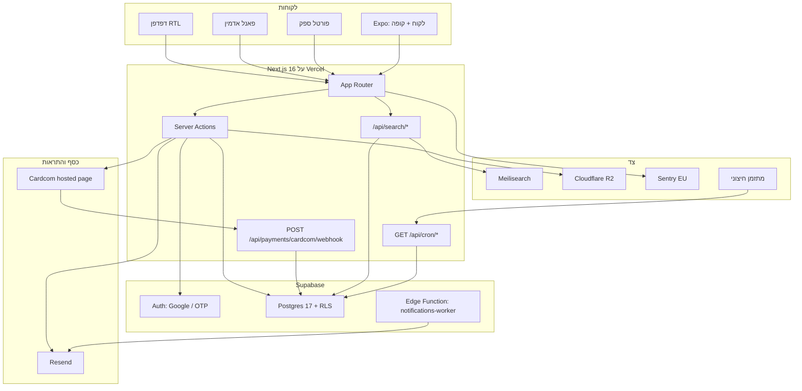

# KenyonExpress

שוק קופונים ודילים בעברית (RTL). הלקוח משלם באתר דרך Cardcom, מקבל שובר עם QR חתום, ומממש אותו אצל הספק. אין escrow. הכסף במנוע הוא אגורות שלמות (`bigint`), אף פעם לא `float`.

האתר רץ על Next.js 16 (App Router) ב-Vercel, מול Postgres ב-Supabase עם RLS על כל טבלה. אפליקציית Expo חיה ב-

```
apps/mobile
```

והיא מחוץ ל-workspace של pnpm בכוונה: אין כאן Turborepo, ואין `packages/`.

יום ראשון בפרויקט, הכללים הקדושים, ואיפה כל דבר: [docs/ONBOARDING.md](docs/ONBOARDING.md).

## מה זה

שלושה סוגי מוצרים, מודל מחייב:

| סוג | הלקוח משלם באתר | נשאר בפלטפורמה | הספק מקבל מהאתר | בעסק |
| --- | --- | --- | --- | --- |
| קופון | `coupon_price` (סכום מוחלט שהאדמין קובע) | 100% ממחיר הקופון | 0 | היתרה (`face - coupon_price`) בסריקה |
| פיזי | מחיר מלא | `platform_percent` פר-מוצר, בלי ברירת מחדל | היתרה | אין |
| מנוי | `recurring_amount` כל מחזור | `platform_percent` פר חיוב | היתרה, פר חיוב | אין |

`platform_percent` מצולם ל-`order_items` בזמן ההזמנה ואינו נקרא מחדש מהמוצר בזמן settlement.

ארבעה משטחים:

- חנות ציבורית (`src/app/(store)`): קטלוג, עגלה, checkout, דפי מוצר וקטגוריה
- אזור אישי (`src/app/(account)`): הזמנות, שוברים, ארנק פנימי (בלי משיכה)
- פאנל אדמין (`src/app/(admin)`): קטלוג, הזמנות, ספקים, כסף, ביקורת
- פורטל ספק (`src/app/(supplier)`): סריקת QR, מימושים, הזמנות של העסק

## ארכיטקטורה



זרימת קנייה בקצרה:

```
עגלת אורח → שלם → Google / session → beginCheckout
  → Cardcom hosted page → webhook + GetLpResult
  → finalize → קופון: platform_settled + שובר/QR + מייל
             → פיזי: split_executed + הודעה לספק
```

הכותב היחיד של המעבר ל-`paid` הוא

```
src/server/payments/finalize.ts
```

חישוב כסף עובר רק דרך

```
src/lib/money.ts
```

(ממתג מחדש את `src/lib/commerce/money.ts`). אחוזים הם basis points שלמים (10% = 1000 bp).

החוזה של הסביבה בזמן עלייה: `src/lib/env.ts`. בפרודקשן השרת מסרב לעלות בלי סודות Cardcom / Supabase / QR / cron, ומסרב גם אם `CARDCOM_SANDBOX=true`.

## מבנה הריפו

זה לא monorepo של pnpm. השורש הוא אפליקציית Next אחת. `apps/mobile` מותקנת בנפרד (`pnpm install --ignore-workspace`) כי שילוב `expo` + `react-native` באותו עץ שובר את `sharp` של האתר.

```
.
├── src/                      האתר כולו
│   ├── app/                  App Router: דפים, layouts, route handlers
│   │   ├── (store)/          חנות ציבורית: בית, מוצר, קטגוריה, עגלה, checkout
│   │   ├── (account)/        אזור אישי
│   │   ├── (admin)/          פאנל אדמין
│   │   ├── (auth)/           התחברות, הרשמה, איפוס סיסמה
│   │   ├── (supplier)/       פורטל ספק (אחרי התחברות)
│   │   ├── (supplier-public)/ כניסת ספק ודף סירוב
│   │   ├── (legal)/          תקנון, פרטיות, נגישות, ביטולים
│   │   ├── (main)/           קופונים, ניוזלטר
│   │   ├── api/              webhooks, cron, חיפוש, בריאות, ארנק
│   │   └── coupon/           דף שובר לפי מזהה
│   ├── components/           UI לפי דומיין: cart, admin, supplier, storefront
│   ├── lib/                  כסף, env, supabase, תשלומים, חיפוש, RBAC
│   ├── server/               server actions, דומיין (orders/vouchers), finalize
│   ├── db/schema/            Drizzle: קריאה בלבד, לא מקור הסכימה
│   ├── types/                database.ts שנוצר מ-Supabase (לא לערוך ביד)
│   ├── hooks/                hooks של הלקוח
│   ├── i18n/                 next-intl
│   ├── styles/               CSS גלובלי
│   ├── content/              MDX
│   ├── assets/               פונטים ותמונות סטטיות
│   └── __tests__/            שערי ריפו: RLS, מיגרציות ממתינות, הרשאות
├── apps/mobile/              Expo Router. מחוץ ל-workspace. בלי מסלול כסף משלה
├── supabase/
│   ├── migrations/           מיגרציות שכבר הוחלו בפרודקשן. אל תכתוב לכאן קובץ חדש
│   ├── functions/            Edge Functions (notifications-worker)
│   ├── seed/                 זריעת קטגוריות וכו'
│   └── rls-manifest.json     מניפסט מדיניות שנמדד מול הפרודקשן
├── migrations/pending/       מיגרציות שטרם הוחלו. הנתיב היחיד לשינוי סכימה
├── scripts/                  compare.mjs, seed, ביקורות, ייבוא WP
├── e2e/                      Playwright (locale he-IL)
├── tests/sql/                בדיקות SQL מול Postgres (RLS, מחזור שובר)
├── load/                     בדיקות עומס
├── docs/                     ארכיטקטורה, הרצה, ציות. אינדקס: ARCHITECTURE-DOCS-INDEX.md
├── messages/                 מחרוזות he / en
├── .github/workflows/        ci.yml, cron.yml (כבוי עד שסודות קיימים). אין deploy.yml
├── .env.example              רשימת env מלאה כפי שהקוד קורא. בלי ערכים אמיתיים
└── STATE.md                  מצב הסשן בין סוכנים. לא מדריך למפתח
```

קבצים בשורש עם שמות `ARCHITECTURE-*.md` ו-`MASTER-ARCHITECTURE*.md` הם שרידים. המקור המחייב חי ב-`docs/`.

## הרמת סביבת פיתוח מאפס

כל הפקודות רצות משורש הריפו. `npm install` נכשל כאן (arborist מול עץ ה-symlinks של pnpm). רק `pnpm`.

### 1. כלים

| כלי | גרסה | בדיקה ב-Terminal |
| --- | --- | --- |
| Node | 22 (מה ש-CI מריץ) | `node --version` |
| pnpm | 11.1.2 (`packageManager` ב-`package.json`) | `pnpm --version` |
| Git | כל גרסה סבירה | `git --version` |
| Supabase CLI | אופציונלי, לטיפוסים ול-SQL מקומי | `supabase --version` |

Terminal:

```bash
corepack enable
corepack prepare pnpm@11.1.2 --activate
```

### 2. שכפול והתקנה

Terminal, מתיקיית העבודה שלך:

```bash
git clone git@github.com:kenyonexpress/kenyonexpress.git
cd kenyonexpress
pnpm install --frozen-lockfile
```

### 3. משתני סביבה

Terminal:

```bash
cp .env.example .env.local
```

מלא את `.env.local` מול הטבלה למטה. הערכים מגיעים מבעל הפרויקט (Supabase, Cardcom sandbox, Resend). **אסור** להעתיק ערכים מ-`.env.test`: הקובץ במעקב git ומכיל placeholders בלבד, ושום קוד לא קורא אותו.

לפיתוח מקומי מספיקים בדרך כלל:

- `NEXT_PUBLIC_SUPABASE_URL`
- `NEXT_PUBLIC_SUPABASE_ANON_KEY`
- אחד מ-`SUPABASE_SERVICE_ROLE_KEY` / `SUPABASE_SECRET_KEY`
- `NEXT_PUBLIC_APP_URL` ו-`NEXT_PUBLIC_SITE_URL` (אותו ערך, בדרך כלל `http://localhost:3000`)
- `RESEND_API_KEY` אם אתה בודק מיילים
- Cardcom sandbox אם אתה בודק תשלום אמיתי; אחרת השאר ריק וה-mock נכנס מחוץ ל-`NODE_ENV=production`

`pnpm start` (בילד פרודקשן על הלפטופ) דורש גם `ALLOW_INCOMPLETE_ENV=true`, אחרת `src/lib/env.ts` מפיל את ה-instrumentation על סודות Cardcom חסרים. אסור להגדיר את המשתנה הזה ב-Vercel.

### 4. Auth ב-Supabase

ב-Supabase Dashboard, תחת Authentication:

1. הפעל Google OAuth עם redirect ל-`http://localhost:3000/auth/callback` (וגם לדומיין הפרודקשן).
2. אם אתה בודק OTP לטלפון, הפעל Phone. הדגל בצד האפליקציה הוא `PHONE_AUTH_ENABLED` + `NEXT_PUBLIC_PHONE_AUTH_ENABLED`.

בלי Google, כפתור "שלם" בחנות האורחים נשבר אחרי העגלה.

### 5. הרצה

Terminal:

```bash
pnpm dev
```

Chrome: [http://localhost:3000](http://localhost:3000)

שלושת השערים המקומיים, לפני כל PR:

```bash
pnpm test
pnpm type-check
pnpm lint
```

### 6. אפליקציית המובייל (רק אם צריך)

Terminal:

```bash
cd apps/mobile
pnpm install --ignore-workspace
pnpm type-check
```

ה-checkout של האפליקציה הוא WebView על האתר. אין עגלה ואין Cardcom ב-`apps/mobile`. פירוט ב-`apps/mobile/README.md`.

## משתני סביבה

מקור האמת של הרשימה הוא `.env.example` (נוצר מקריאות אמיתיות בקוד). כאן הסבר בלי ערכים. כל `NEXT_PUBLIC_*` ו-`EXPO_PUBLIC_*` נצרב ל-bundle בזמן בילד.

מקרא לעמודת **חובה**:

- **פרודקשן**: `src/lib/env.ts` מסרב לעלות בלעדיו, או שהפיצ'ר נשבר
- **אופציונלי**: יש נפילה מתועדת
- **כלי**: סקריפטים / בדיקות / CI. אסור ב-Vercel
- **פלטפורמה**: Vercel או ה-runner מזריקים. אל תגדיר ביד

### Supabase

| משתנה | חובה | חשיפה | תפקיד |
| --- | --- | --- | --- |
| `NEXT_PUBLIC_SUPABASE_URL` | פרודקשן | דפדפן + שרת | כתובת הפרויקט. URL שגוי או stack מקומי כבוי מציגים קטלוג ריק בלי שגיאה |
| `NEXT_PUBLIC_SUPABASE_ANON_KEY` | פרודקשן | דפדפן + שרת | מפתח anon. כפוף ל-RLS. בטוח בדפדפן לפי עיצוב |
| `SUPABASE_SERVICE_ROLE_KEY` | פרודקשן (אחד משניים) | שרת בלבד | מפתח JWT ישן שעוקף RLS. אסור ב-`NEXT_PUBLIC_` |
| `SUPABASE_SECRET_KEY` | פרודקשן (אחד משניים) | שרת בלבד | הצורה החדשה `sb_secret_...`. `admin-key.ts` מקבל את שניהם |

### זהות האפליקציה

| משתנה | חובה | חשיפה | תפקיד |
| --- | --- | --- | --- |
| `NEXT_PUBLIC_APP_URL` | פרודקשן | דפדפן + שרת | המקור הקנוני. ממנו נבנים IndicatorUrl ו-ReturnUrl של Cardcom |
| `NEXT_PUBLIC_SITE_URL` | פרודקשן | דפדפן + שרת | אותו ערך כמו `NEXT_PUBLIC_APP_URL`. מודולים אחרים קוראים אותו |
| `NEXT_PUBLIC_WHATSAPP_PHONE` | אופציונלי | דפדפן | מספר וואטסאפ עסקי, ספרות בלבד עם קידומת מדינה |
| `CONTACT_TO` | אופציונלי | שרת | תיבת דואר לטופס יצירת קשר |

### Cardcom

| משתנה | חובה | חשיפה | תפקיד |
| --- | --- | --- | --- |
| `CARDCOM_TERMINAL_NUMBER` | פרודקשן | שרת | מספר מסוף |
| `CARDCOM_API_NAME` | פרודקשן | שרת | שם API |
| `CARDCOM_API_PASSWORD` | פרודקשן | שרת | סיסמת API |
| `CARDCOM_WEBHOOK_SECRET` | פרודקשן | שרת | סוד שבחרת (`openssl rand -hex 32`). Cardcom לא חותם callbacks; הערך רוכב על IndicatorUrl כ-`?s=` והוא ההגנה היחידה מול האינטרנט הפתוח |
| `CARDCOM_WEBHOOK_SECRET_PREVIOUS` | אופציונלי | שרת | הערך הישן בזמן רוטציה. מתקבל בכניסה, לא יוצא החוצה |
| `CHECKOUT_ENABLED` | פרודקשן | שרת | מתג תשלום. בפרודקשן נפתח רק במחרוזת המדויקת `true`. חסר = סגור |
| `CARDCOM_USE_MOCK` | אופציונלי | שרת | תשלום מצליח בלי חיוב. אסור בפרודקשן |
| `CARDCOM_SANDBOX` | אסור `true` בפרודקשן | שרת | מסוף בדיקות. `env.ts` מפיל את הבוט אם זה `true` ב-`NODE_ENV=production` |
| `CARDCOM_ALLOW_SANDBOX` | אופציונלי | שרת | אישור מפורש לחשבונות sandbox בטעינה |
| `CARDCOM_ACCOUNTS` | אופציונלי | שרת | JSON של מסופים נוספים. אסור שידרוס את חשבון הפלטפורמה |
| `CARDCOM_PLATFORM_LABEL` | אופציונלי | שרת | תווית חשבון הפלטפורמה |
| `CARDCOM_API_BASE_URL` | אופציונלי | שרת | בסיס API. שורה ריקה שונה מהשמטה; השאר בחוץ אם אין צורך |
| `CARDCOM_CREDIT_NOTE_TYPE` | אופציונלי | שרת | קוד מסמך זיכוי |
| `CARDCOM_COUPON_RECEIPT_TYPE` | אופציונלי | שרת | קוד קבלה לקופון |
| `INVOICE_VAT_PERCENT` | אופציונלי | שרת | מע"מ. ערך לא חוקי זורק, לא נופל בשקט ל-18 |

### שוברים (QR)

| משתנה | חובה | חשיפה | תפקיד |
| --- | --- | --- | --- |
| `VOUCHER_QR_SECRET` | פרודקשן | שרת | חתימת QR. רוטציה בלי `PREVIOUS` פוסלת את כל השוברים החיים |
| `VOUCHER_QR_SECRET_PREVIOUS` | אופציונלי | שרת | הסוד הישן, לאימות בלבד |
| `VOUCHER_QR_KEY_ID` | אופציונלי | שרת | מזהה מפתח ב-payload. ברירת מחדל: `v1` |

### Cron

| משתנה | חובה | חשיפה | תפקיד |
| --- | --- | --- | --- |
| `CRON_SECRET` | פרודקשן | שרת | Bearer לכל `src/app/api/cron/*` ולמשימות האינדוקס. חסר = כל העבודות מחזירות 401 (סגור, לא פתוח) |
| `ABANDONED_CART_HOURS` | אופציונלי | שרת | כמה שעות עגלה יושבת לפני תזכורת. ברירת מחדל: 3 |

עשרת הלוחות עצמם מתועדים ב-`docs/CRON-EXTERNAL.md`, לא ב-`vercel.json`.

### דואל (Resend)

| משתנה | חובה | חשיפה | תפקיד |
| --- | --- | --- | --- |
| `RESEND_API_KEY` | נדרש לפיצ'ר | שרת | בלי זה שובר לא מגיע לקונה |
| `EMAIL_FROM` | אופציונלי | שרת | כתובת From עסקאות. הדומיין חייב להיות מאומת ב-Resend |
| `RESEND_FROM` | אופציונלי | שרת | From שיווקי. נופל ל-`EMAIL_FROM` |
| `RESEND_AUDIENCE_ID` | אופציונלי | שרת | רשימת תפוצה |
| `CONSENT_IP_SALT` | אופציונלי | שרת | מלח ל-hash של IP בהסכמה. חסר = hash הפיך |

### Observability

| משתנה | חובה | חשיפה | תפקיד |
| --- | --- | --- | --- |
| `NEXT_PUBLIC_SENTRY_DSN` | אופציונלי בפועל נדרש | דפדפן (בילד) | DSN ללקוח. בילד בלי זה מדווח כלום בשקט |
| `SENTRY_DSN` | אופציונלי | שרת | DSN לשרת |
| `SENTRY_ENVIRONMENT` / `NEXT_PUBLIC_SENTRY_ENVIRONMENT` | אופציונלי | שרת / דפדפן | תג סביבה. נופל ל-`NODE_ENV` |
| `SENTRY_RELEASE` / `NEXT_PUBLIC_SENTRY_RELEASE` | אופציונלי | שרת / דפדפן | תג שחרור. נופל ל-`VERCEL_GIT_COMMIT_SHA` |
| `SENTRY_ORG` / `SENTRY_PROJECT` / `SENTRY_AUTH_TOKEN` | אופציונלי | בילד | העלאת source maps |
| `SENTRY_KEEP_SOURCEMAPS` | אופציונלי | בילד | משאיר maps ב-bundle. השאר כבוי |
| `SENTRY_DEBUG_ROUTES` | אופציונלי | שרת | חושף `/debug/sentry`. לכבות אחרי אימות |
| `LOG_LEVEL` | אופציונלי | שרת | `debug` / `info` / `warn` / `error` |
| `ALERTS_ENABLED` | אופציונלי | שרת | `false` משתיק התראות יוצאות |
| `NTFY_TOPIC` / `NTFY_BASE_URL` | אופציונלי | שרת | יעד ntfy. שם ה-topic הוא בקרת הגישה |
| `HEALTH_NTFY_TOPIC` | אופציונלי | שרת | נושא נפרד ל-cron הבריאות |

### Cloudflare R2

| משתנה | חובה | חשיפה | תפקיד |
| --- | --- | --- | --- |
| `R2_ACCOUNT_ID` | אופציונלי | שרת | חשבון Cloudflare. חסר = נפילה ל-Supabase Storage |
| `R2_ACCESS_KEY_ID` | אופציונלי | שרת | מפתח גישה |
| `R2_SECRET_ACCESS_KEY` | אופציונלי | שרת | סוד |
| `R2_BUCKET` | אופציונלי | שרת | שם באקט |
| `R2_PUBLIC_BASE_URL` | אופציונלי | שרת | בסיס CDN ציבורי |

### חיפוש

| משתנה | חובה | חשיפה | תפקיד |
| --- | --- | --- | --- |
| `MEILISEARCH_HOST` | אופציונלי | שרת | חסר = `/search` נופל ל-Postgres `LIKE` |
| `MEILISEARCH_API_KEY` | אופציונלי | שרת | מפתח. בנתיב ציבורי: search-only |
| `MEILISEARCH_INDEX` | אופציונלי | שרת | שם אינדקס. ברירת מחדל: `products` |
| `QSTASH_TOKEN` | אופציונלי | שרת | תור אינדוקס אסינכרוני |
| `QSTASH_CURRENT_SIGNING_KEY` / `QSTASH_NEXT_SIGNING_KEY` | אופציונלי | שרת | אימות חתימת QStash |
| `SEARCH_WEBHOOK_SECRET` | אופציונלי | שרת | חתימת webhooks של שינוי מוצר. נופל ל-Bearer של `CRON_SECRET` |

### Rate limit (Upstash)

המשתנים האלה נקראים ב-`src/lib/env.ts` וב-`src/lib/rate-limit/`. חצי קונפיגורציה מתייחסת כחסר: נופלים ל-RPC `check_rate_limit` ב-Postgres.

| משתנה | חובה | חשיפה | תפקיד |
| --- | --- | --- | --- |
| `UPSTASH_REDIS_REST_URL` | אופציונלי | שרת | backend ראשי ל-rate limit |
| `UPSTASH_REDIS_REST_TOKEN` | אופציונלי | שרת | טוקן. שניהם חייבים להיות מוגדרים יחד |
| `UPSTASH_REDIS_REST_TIMEOUT_MS` | אופציונלי | שרת | timeout. ברירת מחדל בקוד: 1000ms |

### אנליטיקה

| משתנה | חובה | חשיפה | תפקיד |
| --- | --- | --- | --- |
| `GA4_API_SECRET` | אופציונלי | שרת | Measurement Protocol. חסר = לא נשלח כלום |
| `NEXT_PUBLIC_GA4_MEASUREMENT_ID` | אופציונלי | דפדפן | מזהה GA4 |
| `META_CAPI_TOKEN` | אופציונלי | שרת | Conversions API |
| `NEXT_PUBLIC_META_PIXEL_ID` | אופציונלי | דפדפן | Pixel |

### Wallet (Apple / Google)

כפתורי הארנק מסתתרים כשהסט חסר. קונפיגורציה חלקית אינה שגיאת ריצה.

| משתנה | חובה | חשיפה | תפקיד |
| --- | --- | --- | --- |
| `APPLE_WALLET_TEAM_ID` | אופציונלי | שרת | Team ID |
| `APPLE_WALLET_PASS_TYPE_ID` | אופציונלי | שרת | סוג הפס |
| `APPLE_WALLET_ORG_NAME` | אופציונלי | שרת | שם הארגון על הפס |
| `APPLE_WALLET_CERT_PEM` | אופציונלי | שרת | תעודת חתימה |
| `APPLE_WALLET_KEY_PEM` | אופציונלי | שרת | מפתח |
| `APPLE_WALLET_KEY_PASSPHRASE` | אופציונלי | שרת | סיסמת מפתח |
| `APPLE_WALLET_WWDR_PEM` | אופציונלי | שרת | תעודת WWDR |
| `GOOGLE_WALLET_ISSUER_ID` | אופציונלי | שרת | מנפיק Google Wallet |
| `GOOGLE_WALLET_CLASS_SUFFIX` | אופציונלי | שרת | סיומת מחלקה |
| `GOOGLE_WALLET_SA_EMAIL` | אופציונלי | שרת | חשבון שירות |
| `GOOGLE_WALLET_SA_KEY_PEM` | אופציונלי | שרת | מפתח חשבון שירות |

### דגלי פיצ'ר ומובייל

| משתנה | חובה | חשיפה | תפקיד |
| --- | --- | --- | --- |
| `PHONE_AUTH_ENABLED` | אופציונלי | שרת | שער OTP בשרת |
| `NEXT_PUBLIC_PHONE_AUTH_ENABLED` | אופציונלי | דפדפן (בילד) | אותו שער ל-UI |
| `PUSH_ENABLED` | אופציונלי | שרת | מדלג על כל push כשכבוי |
| `EXPO_ACCESS_TOKEN` | אופציונלי | שרת | נדרש רק כש-push דולק |
| `EXPO_PUBLIC_SUPABASE_URL` | אפליקציה | אפליקציה | ב-`.env` של Expo, לא ב-Vercel |
| `EXPO_PUBLIC_SUPABASE_ANON_KEY` | אפליקציה | אפליקציה | אותו anon של האתר |
| `EXPO_PUBLIC_SITE_URL` | אפליקציה | אפליקציה | מקור האתר ל-WebView |
| `EXPO_PUBLIC_PHONE_AUTH_ENABLED` | אפליקציה | אפליקציה | OTP באפליקציה |
| `SUPABASE_URL` | אפליקציה | אפליקציה | כינוי לא-ציבורי ש-`apps/mobile` מקבל |

### פלטפורמה והחרגה מקומית

| משתנה | חובה | חשיפה | תפקיד |
| --- | --- | --- | --- |
| `NODE_ENV` | פלטפורמה | שרת | `next start` על לפטופ הוא גם `production` |
| `NEXT_RUNTIME` | פלטפורמה | שרת | Node מול Edge |
| `VERCEL_URL` | פלטפורמה | שרת | host של הדיפלוימנט |
| `VERCEL_GIT_COMMIT_SHA` / `NEXT_PUBLIC_VERCEL_GIT_COMMIT_SHA` | פלטפורמה | שרת / דפדפן | SHA ל-Sentry |
| `CI` | פלטפורמה | CI | Playwright נכשל על `.only` ומריץ retry |
| `ALLOW_INCOMPLETE_ENV` | רק לפטופ | שרת | `"true"` מאפשר `pnpm start` בלי סודות Cardcom. אסור ב-Vercel |

### כלי, בדיקות וייבוא (אסור ב-Vercel)

| משתנה | חובה | תפקיד |
| --- | --- | --- |
| `DATABASE_URL` | כלי | חיבור ל-`scripts/check-rls.mjs` |
| `SUPABASE_DB_URL` | כלי | Drizzle וסקריפטים. חובה לפקודות drizzle-kit |
| `SUPABASE_PUBLISHABLE_KEY` / `NEXT_PUBLIC_SUPABASE_PUBLISHABLE_KEY` | כלי | `scripts/security-probe-views.mjs` |
| `E2E_CUSTOMER_EMAIL` / `E2E_CUSTOMER_PASSWORD` | כלי | חשבון לקוח ל-Playwright (נוצר ב-`pnpm seed:test`) |
| `E2E_SUPPLIER_EMAIL` / `E2E_SUPPLIER_PASSWORD` | כלי | חשבון ספק ל-Playwright |
| `E2E_PAID_FLOW` | כלי | מריץ ספקים שדורשים הזמנה ששולמה |
| `E2E_BASE_URL` | כלי | מצביע את הסוויטה לשרת שכבר רץ (ואז Playwright לא מזריק `CARDCOM_USE_MOCK`) |
| `E2E_PORT` | כלי | פורט. ברירת מחדל 3000. שנה ב-worktree מקביל |
| `E2E_WEB_COMMAND` | כלי | ברירת מחדל `pnpm dev`. ב-CI: `pnpm start` |
| `E2E_WORKERS` | כלי | ברירת מחדל 2 מקומית, 1 ב-CI |
| `VERCEL_AUTOMATION_BYPASS_SECRET` | כלי | כותרת לעקיפת הגנת דיפלוימנט ב-Vercel |
| `DEV_ADMIN_EMAIL` / `DEV_ADMIN_PASSWORD` | כלי | `scripts/_admin-shot.mjs` |
| `LIVE_BASE` / `LOCAL_BASE` | כלי | `scripts/compare.mjs` מול האתר החי |
| `LIVE_PRODUCT_PATH` / `LOCAL_PRODUCT_PATH` / `LIVE_CATEGORY_PATH` / `LOCAL_CATEGORY_PATH` | כלי | נתיבי השוואת פיקסלים |
| `COMPARE_*` / `MINE_URL` / `PLAYWRIGHT_BROWSERS_PATH` | כלי | כלי ההשוואה הוויזואלית |
| `CI_DIFF_RANGE` | כלי | טווח ל-lint/typecheck/hardcoded על הדיף. ברירת מחדל `HEAD~1..HEAD` |
| `WC_BASE` / `WC_KEY` / `WC_SECRET` | כלי | REST של WooCommerce לייבוא |
| `WP_IMPORT_ALLOW_WRITES` | כלי | הייבוא לקריאה בלבד עד שזה מוגדר |

## פקודות נפוצות

הכל משורש הריפו, ב-Terminal.

| פקודה | מה היא עושה |
| --- | --- |
| `pnpm dev` | שרת פיתוח על פורט 3000 |
| `pnpm build` | בילד פרודקשן |
| `pnpm start` | מגיש את הבילד. דורש `ALLOW_INCOMPLETE_ENV=true` מקומית |
| `pnpm test` | Vitest, פעם אחת |
| `pnpm test:watch` | Vitest במעקב |
| `pnpm test:coverage` | Vitest עם כיסוי (כולל רצפות כסף) |
| `pnpm test:e2e` | Playwright |
| `pnpm type-check` | `tsc --noEmit` |
| `pnpm lint` | Biome על כל הריפו |
| `pnpm lint:changed` | Biome רק על הדיף |
| `pnpm format` | Biome format |
| `pnpm check` | Biome check עם כתיבה |
| `pnpm seed:test` | זריעת חשבונות ל-E2E |
| `pnpm db:types` | מייצר `src/types/database.ts` מהפרויקט המקושר |
| `pnpm ci:diff-gates` | lint + typecheck + hardcoded על הדיף |
| `pnpm lighthouse:smoke` | Lighthouse קצר |
| `pnpm sentry:verify` | בודק ש-Sentry מקבל אירוע |

השוואת פיקסלים מול האתר החי (שער מתחת ל-11% בדף הבית):

```bash
PORT=3311 pnpm start &
LOCAL_BASE=http://localhost:3311 node scripts/compare.mjs --page=home
```

הוספת תלות:

```bash
pnpm add <pkg>
pnpm add -D <pkg>
```

לעולם לא `npm i`.

## כללים שאי אפשר לשבור

1. **כסף = אגורות integer.** כל חישוב ב-`src/lib/money.ts`. אסור `float` / `number` רגיל במסלול כסף.
2. **אסור `db push`.** שינוי סכימה הוא קובץ ב-`migrations/pending/`, ומחכה לאישור לפני החלה על פרודקשן.
3. **RLS על כל טבלה.** טבלה בלי policy מתאימה = deny. `service_role` עוקף RLS ולכן כל קריאה ל-`createAdminClient()` היא החלטה, לא ברירת מחדל.
4. **עברית RTL בכל ה-UI.**
5. **`platform_percent` פר-מוצר**, מצולם ל-`order_items` בזמן ההזמנה.

פירוט, מלכודות, וסדר קריאה ליום הראשון: [docs/ONBOARDING.md](docs/ONBOARDING.md).

## לאן הלאה

| מסמך | מתי לפתוח |
| --- | --- |
| [docs/ONBOARDING.md](docs/ONBOARDING.md) | עכשיו, אם זה היום הראשון שלך |
| [docs/BUSINESS-MODEL.md](docs/BUSINESS-MODEL.md) | לפני כל שינוי במודל כסף |
| [docs/AUTH-MODEL.md](docs/AUTH-MODEL.md) | לפני מסך מוגן או שאילתה חדשה |
| [docs/DB-SECURITY-MODEL.md](docs/DB-SECURITY-MODEL.md) | לפני policy, RPC, או טבלה |
| [migrations/pending/README.md](migrations/pending/README.md) | לפני כתיבת מיגרציה |
| [docs/CRON-EXTERNAL.md](docs/CRON-EXTERNAL.md) | לפני עבודת רקע |
| [docs/ARCHITECTURE-DOCS-INDEX.md](docs/ARCHITECTURE-DOCS-INDEX.md) | אינדקס כל מסמכי הארכיטקטורה |
| [apps/mobile/README.md](apps/mobile/README.md) | לפני נגיעה באפליקציה |
| [src/server/payments/README.md](src/server/payments/README.md) | לפני checkout / refund / שובר |
