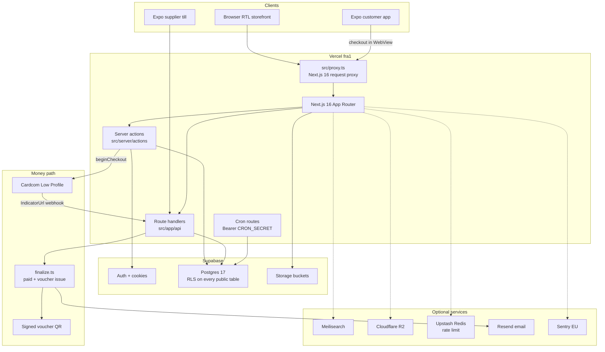
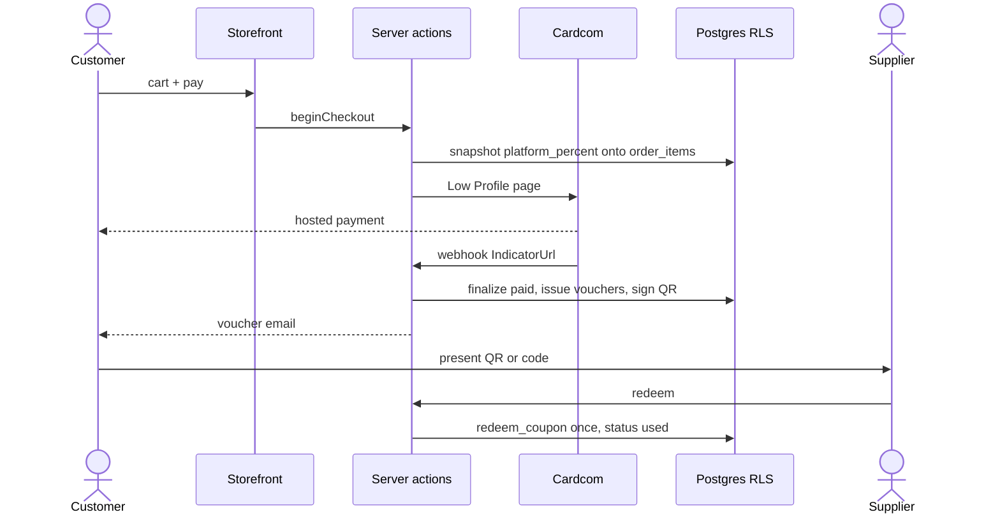

# KenyonExpress

פלטפורמת קופונים ומסחר בישראל. הלקוח קונה באתר, מקבל שובר עם QR חתום, ומממש אותו אצל הספק. הכסף עובר ב-Cardcom; האתר לא מחזיק כרטיסים.

האתר החי:

```
https://kenyonexpress.co.il
```

המסמך הזה הוא שער הכניסה. יום ראשון בפרויקט: [docs/ONBOARDING.md](docs/ONBOARDING.md).

## מה זה

KenyonExpress מחליף את חנות ה-WordPress/WooCommerce באותו דומיין. שלושה סוגי מוצרים:

| סוג | מה הלקוח משלם באתר | מה נשאר בפלטפורמה | מה מקבל הספק |
| --- | --- | --- | --- |
| קופון | מחיר הקופון בלבד (שדה חופשי, לא נגזר מאחוז) | 100% ממחיר הקופון | 0 מהאתר. היתרה במזומן בעסק, בסריקה |
| פיזי | המחיר המלא | `platform_percent` של המוצר | היתרה, בהתחשבנות |
| מנוי | הסכום החוזר בכל מחזור | `platform_percent` פר חיוב | היתרה פר חיוב |

`platform_percent` הוא דינמי פר מוצר, חובה, בלי ברירת מחדל. הוא מצולם ל-`order_items` בזמן ההזמנה ולא משתנה אחריה.

אין escrow, אין נאמן חיצוני, אין פיצול בטרמינל בזמן התשלום. הכסף יושב בחשבון Cardcom של הפלטפורמה; הפיצול הוא רישום פנימי ב-ledger.

## ארכיטקטורה



זרימת רכישה ומימוש:



שכבות ההרשאה (כולן חובה; אף אחת לא מחליפה את האחרות):

1. Session: Supabase Auth (cookie / bearer).
2. Route guard: `src/lib/admin/rbac.ts`, `src/lib/supplier/rbac.ts`.
3. RLS: מדיניות Postgres על כל טבלת `public`.
4. `SECURITY DEFINER`: RPCs שרצות כבעלים, ובודקות הרשאה בעצמן.

`service_role` עוקף RLS. כל קריאה דרך `createAdminClient()` היא חור מכוון, לא קיצור דרך.

## מבנה הריפו

זה לא pnpm workspace קלאסי. האתר יושב בשורש. `apps/mobile` הוא חבילת Expo נפרדת במכוון: הוספת `react-native` לעץ אחד עם Next שוברת את `sharp` ואת מייעל התמונות. `pnpm-workspace.yaml` בשורש אינו מכיל `packages:`.

כל פקודה רצה משורש הריפו, חוץ מהתקנה ובדיקות של האפליקציה עצמה (שם: `cd apps/mobile` ואז `pnpm install --ignore-workspace`).

### שורש

| נתיב | מה יש שם |
| --- | --- |
| `src/` | האתר כולו: App Router, רכיבים, ספריות, server actions |
| `apps/mobile/` | אפליקציית לקוח וקופה ב-Expo. מחוץ ל-workspace של pnpm |
| `supabase/migrations/` | מיגרציות **שהוחלו** על פרודקשן. מקור האמת של הסכימה החיה |
| `migrations/pending/` | מיגרציות **שטרם הוחלו**. אסור `db push`. אסור להריץ בלי אישור |
| `docs/` | ארכיטקטורה, runbooks, onboarding, החלטות |
| `scripts/` | כלי מדידה, השוואת פיקסלים, זריעה, שערי CI, ייבוא WP |
| `e2e/` | Playwright מול ביליד אמיתי |
| `src/__tests__/` | Vitest לצד היחידות והשערים הסטטיים |
| `tests/sql/` | שאילתות שלמות כספית / RLS להרצה על Postgres |
| `.github/workflows/` | CI, smoke, cron (כבוי עד משתנה), Dependabot |
| `load/` | תרחישי עומס (k6) |
| `messages/` | מחרוזות `next-intl`: `he.json`, `en.json` |
| `public/` | סטטי: לוגו, אייקוני PWA, `sw.js` |
| `refs/` | ייחוס ויזואלי מול האתר החי. gitignored אחרי הצילום |
| `.env.example` | רשימת משתני הסביבה שהקוד באמת קורא. בלי סודות |
| `STATE.md` | מצב העבודה בין סשנים. לקרוא בתחילת כל יום |
| `INVARIANTS.md` | שאילתות שלמות כספית |
| `CLAUDE.md` / `AGENTS.md` | חוקי סוכן ו-Next 16 |

### `src/` תיקייה-תיקייה

| נתיב | תפקיד |
| --- | --- |
| `src/app/(store)/` | חנות: בית, קטגוריה, מוצר, עגלה, checkout, חיפוש, בלוג |
| `src/app/(account)/` | אזור אישי |
| `src/app/(admin)/` | פאנל ניהול |
| `src/app/(supplier)/` | פורטל ספק וסריקה |
| `src/app/(auth)/` | התחברות / OTP / OAuth |
| `src/app/(legal)/` | תקנון, פרטיות, ביטולים, נגישות |
| `src/app/api/` | Route handlers: תשלומים, cron, חיפוש, בריאות, wallet |
| `src/app/coupon/` | דף שובר ללקוח |
| `src/proxy.ts` | מחליף את `middleware.ts` של Next 16. רענון session, SEO redirects, request id |
| `src/instrumentation.ts` | ולידציית env ב-boot דרך `src/lib/env.ts` |
| `src/components/` | UI לפי משטח: store, storefront, admin, supplier, cart, ui |
| `src/lib/money.ts` | **המודול הקנוני לכסף.** אגורות integer, אחוזים ב-basis points |
| `src/lib/commerce/` | מנוע מחיר, עמלה, עמודות `_agorot` |
| `src/lib/payments/` | לקוח Cardcom, חשבונות טרמינל, חוזה env |
| `src/lib/supabase/` | לקוחות browser / server / admin |
| `src/lib/auth/` | OTP, guards, מיפוי שגיאות |
| `src/lib/admin/` | RBAC, תפקידים, הרשאות פאנל |
| `src/lib/supplier/` | RBAC ספק |
| `src/server/actions/` | Server actions: עגלה, checkout, auth, אדמין |
| `src/server/actions/payments/` | `beginCheckout`, webhook handling, refund |
| `src/server/payments/` | `finalize.ts` (הכותב היחיד ל-paid), חשבוניות, DLQ |
| `src/server/domain/` | הזמנות, שוברים, דוחות, מכונת מצבים |
| `src/db/schema/` | Drizzle: תיאור מנוהל, לא מקור האמת של Postgres |
| `src/types/database.ts` | טיפוסי Supabase שנוצרים ב-`pnpm db:types` |
| `src/styles/` | CSS של דפי החנות (בית, מוצר, קטגוריה, checkout) |
| `src/content/` | תוכן משפטי ובלוג בקוד |
| `src/i18n/` | כיוון שפה וטעינת הודעות |

### `src/app/api/`

| נתיב | תפקיד |
| --- | --- |
| `api/payments/cardcom/webhook` | IndicatorUrl. מאמת `?s=` מול `CARDCOM_WEBHOOK_SECRET` |
| `api/cron/*` | עשרה jobs. כולם `GET` עם `Authorization: Bearer CRON_SECRET` |
| `api/health` | תלות ב-DB ובשירותים אופציונליים |
| `api/search/*` | חיפוש, suggest, תור אינדוקס, DLQ |
| `api/supplier/vouchers/*` | lookup / redeem / batch לקופה |
| `api/wallet/apple/[id]` | Apple Wallet pass |
| `api/webhooks/products` | שינוי מוצר לתור החיפוש |
| `api/app/*` | סשן ו-push של אפליקציית הלקוח |

### תיקיות שכדאי לא לבלבל

| נתיב | אל תבלבל עם |
| --- | --- |
| `supabase/migrations/` (הוחל) | `migrations/pending/` (טרם הוחל) |
| `docs/` (קנוני) | קבצי `ARCHITECTURE-*.md` בשורש (עותקים היסטוריים) |
| `src/lib/money.ts` | פורמט תצוגה ב-`src/lib/money-format.ts` |
| `createClient()` (RLS) | `createAdminClient()` (עוקף RLS) |
| `NEXT_PUBLIC_*` (נדחס ל-bundle) | סודות שרת בלי הקידומת |

## הרמת סביבת פיתוח מאפס

איפה: **Terminal**, משורש הריפו.

### 1. דרישות

- Node 22 (CI רץ על 22; המכונה הזאת: 22.14.0)
- pnpm 11.1.2 בדיוק (`packageManager` ב-`package.json`)
- Git
- גישה לפרויקט Supabase ולסודות. לא מייצרים אותם לבד ולא מעתיקים מ-git

`npm install` בשורש **נכשל**. העץ הוא `node_modules/.pnpm` עם symlinks; npm קורס ב-`Link.matches`. אין תיקון מתוך הריפו. תמיד:

```bash
pnpm install
```

חבילה חדשה:

```bash
pnpm add -D <pkg>
```

### 2. שכפול והתקנה

```bash
git clone <repo-url>
cd kenyonexpress
pnpm install
```

### 3. משתני סביבה

```bash
cp .env.example .env.local
```

ממלאים ערכים אמיתיים ב-`.env.local` בלבד. הקובץ ב-gitignore. `.env.example` ו-`.env.test` הם placeholders ועוקבים אחרי git; אסור לשים בהם סוד.

מינימום להרצת `pnpm dev` מול פרויקט קיים:

- `NEXT_PUBLIC_SUPABASE_URL`
- `NEXT_PUBLIC_SUPABASE_ANON_KEY`
- אחד מ-`SUPABASE_SERVICE_ROLE_KEY` / `SUPABASE_SECRET_KEY`
- `NEXT_PUBLIC_APP_URL` ו-`NEXT_PUBLIC_SITE_URL` (אותו ערך, למשל `http://localhost:3000`)

בלי Cardcom מלא, checkout לא גובה. זה בסדר לפיתוח UI. `pnpm start` (בילד production על לפטופ) דורש `ALLOW_INCOMPLETE_ENV=true` אם הסודות חסרים; אחרת `instrumentation.ts` מפיל כל route ב-500. **אסור** להציב את המשתנה הזה ב-Vercel.

אל תכוונו `NEXT_PUBLIC_SUPABASE_URL` ל-stack מקומי כבוי: כל דף ייראה כקטלוג ריק, בלי שגיאה.

### 4. הרצה

```bash
pnpm dev
```

הדפדפן: `http://localhost:3000`.

בילד כמו פרודקשן (חובה לפני השוואת פיקסלים ו-E2E):

```bash
pnpm build
ALLOW_INCOMPLETE_ENV=true PORT=3311 pnpm start
```

### 5. בדיקות לפני שינוי ראשון

```bash
pnpm test
pnpm type-check
pnpm lint
```

E2E דורש דפדפני Playwright ושרת ביליד. ראו פקודות נפוצות למטה.

### 6. מה לא לעשות ביום הראשון

- לא `npx supabase db push`
- לא להחיל קובץ מ-`migrations/pending/` על פרודקשן
- לא לכתוב `float` במסלול כסף
- לא להוסיף `NEXT_PUBLIC_` לסוד
- לא לפתוח עותק שני של הריפו (`src copy`, `kenyonexpress/kenyonexpress`)

## משתני סביבה

המקור: `.env.example` (כל משתנה שיש לו קורא בקוד) ו-`src/lib/env.ts` (חוזה ה-boot). הטבלה מסבירה; **אין ערכים**.

מקרא סטטוס:

- **חובה בפרודקשן**: בלי זה הבוט נכשל או שהפיצ'ר שבור
- **אופציונלי**: יש נפילה לאחור מתועדת, או שהפיצ'ר פשוט כבוי
- **כלי**: סקריפטים / טסטים / CI. לא לשים ב-Vercel
- **פלטפורמה**: מוזרק. לא מגדירים ידנית

`NEXT_PUBLIC_*` ו-`EXPO_PUBLIC_*` נדחסים ל-bundle בזמן **בילד**. שינוי ב-Vercel דורש deploy מחדש. `src/lib/env.ts` מסרב לעלות אם הוא רואה `NEXT_PUBLIC_*(SECRET|PASSWORD|SERVICE_ROLE|PRIVATE_KEY|API_KEY)`.

### Supabase

| משתנה | סטטוס | מה זה |
| --- | --- | --- |
| `NEXT_PUBLIC_SUPABASE_URL` | חובה בפרודקשן | כתובת הפרויקט. נקרא ב-proxy, ב-SSR ובדפדפן |
| `NEXT_PUBLIC_SUPABASE_ANON_KEY` | חובה בפרודקשן | מפתח anon. בטוח בדפדפן כי RLS אוכף שורות |
| `SUPABASE_SERVICE_ROLE_KEY` | חובה בפרודקשן (אחד משניים) | JWT ישן של service role. עוקף RLS. אסור `NEXT_PUBLIC_` |
| `SUPABASE_SECRET_KEY` | חובה בפרודקשן (אחד משניים) | הצורה החדשה `sb_secret_...`. אותו תפקיד |

### זהות האתר

| משתנה | סטטוס | מה זה |
| --- | --- | --- |
| `NEXT_PUBLIC_APP_URL` | חובה | מקור קנוני. ממנו נבנים ReturnUrl ו-IndicatorUrl של Cardcom |
| `NEXT_PUBLIC_SITE_URL` | חובה | אותו ערך כמו `NEXT_PUBLIC_APP_URL`. מודולים שונים קוראים שמות שונים |
| `NEXT_PUBLIC_WHATSAPP_PHONE` | אופציונלי | ספרות בלבד, קידומת מדינה. בלי זה יש נפילה למספר הישן של חנות הבדיקה |
| `CONTACT_TO` | אופציונלי | תיבת דואר לטופס יצירת קשר |

### Cardcom

| משתנה | סטטוס | מה זה |
| --- | --- | --- |
| `CARDCOM_TERMINAL_NUMBER` | חובה בפרודקשן | מספר טרמינל |
| `CARDCOM_API_NAME` | חובה בפרודקשן | שם API |
| `CARDCOM_API_PASSWORD` | חובה בפרודקשן | סיסמת API |
| `CARDCOM_WEBHOOK_SECRET` | חובה בפרודקשן | סוד שבחרנו. Cardcom **לא** חותם callbacks. הערך רוכב על IndicatorUrl כ-`?s=` |
| `CARDCOM_WEBHOOK_SECRET_PREVIOUS` | אופציונלי | הסוד הקודם בזמן רוטציה. בלי זה callbacks של דפי תשלום פתוחים נופלים ב-200 (בלי retry) |
| `CHECKOUT_ENABLED` | חובה בפרודקשן | כפתור התשלום נפתח רק בערך המדויק `true`. אחרת סגור |
| `CARDCOM_USE_MOCK` | אופציונלי | תשלום מצליח בלי חיוב. אסור בפרודקשן |
| `CARDCOM_SANDBOX` | אופציונלי | בפרודקשן, `true` מפיל את הבוט. טרמינל בדיקה על הזמנות אמיתיות |
| `CARDCOM_ALLOW_SANDBOX` | אופציונלי | אישור מפורש לחשבונות sandboxed בטעינה |
| `CARDCOM_ACCOUNTS` | אופציונלי | JSON של טרמינלים נוספים. לא להגדיר מחדש את חשבון הפלטפורמה |
| `CARDCOM_PLATFORM_LABEL` | אופציונלי | תווית תצוגה לחשבון הפלטפורמה |
| `CARDCOM_API_BASE_URL` | אופציונלי | בסיס API. שורה ריקה שונה מהשמטה; להשאיר בחוץ אם אין צורך |
| `CARDCOM_CREDIT_NOTE_TYPE` | אופציונלי | קוד מסמך זיכוי |
| `CARDCOM_COUPON_RECEIPT_TYPE` | אופציונלי | קוד קבלה לקופון |
| `INVOICE_VAT_PERCENT` | אופציונלי | מע״מ לחשבונית. ערך לא חוקי זורק, לא נופל בשקט. ברירת המחדל מ-`VAT_RATE_BP` ב-`money.ts` |

### חתימת QR לשובר

| משתנה | סטטוס | מה זה |
| --- | --- | --- |
| `VOUCHER_QR_SECRET` | חובה בפרודקשן | חותם כל שובר שהונפק. רוטציה בלי `PREVIOUS` פוסלת את כולם |
| `VOUCHER_QR_SECRET_PREVIOUS` | אופציונלי | אימות בלבד, לא חתימה חדשה |
| `VOUCHER_QR_KEY_ID` | אופציונלי | מזהה מפתח ב-payload |

### Cron

| משתנה | סטטוס | מה זה |
| --- | --- | --- |
| `CRON_SECRET` | חובה בפרודקשן | Bearer לכל `api/cron/*`. בלי ברירת מחדל: חסר = כל job מחזיר 401 |
| `ABANDONED_CART_HOURS` | אופציונלי | כמה שעות עגלה נטושה מחכה לפני תזכורת |

פירוט עשרת ה-jobs: `docs/CRON-EXTERNAL.md`. המתזמן לא יושב ב-`vercel.json`.

### דוא״ל (Resend)

| משתנה | סטטוס | מה זה |
| --- | --- | --- |
| `RESEND_API_KEY` | חובה לפיצ'ר | בלי זה שובר לא מגיע למייל |
| `EMAIL_FROM` | אופציונלי | From טרנזקציונלי. הדומיין חייב להיות מאומת ב-Resend |
| `RESEND_FROM` | אופציונלי | From שיווקי. נופל ל-`EMAIL_FROM` |
| `RESEND_AUDIENCE_ID` | אופציונלי | רשימת ניוזלטר |
| `CONSENT_IP_SALT` | אופציונלי | מלח ל-hash של IP בהסכמה. בלי זה ההאש הפיך |

### Observability

| משתנה | סטטוס | מה זה |
| --- | --- | --- |
| `NEXT_PUBLIC_SENTRY_DSN` | אופציונלי בפועל חובה | DSN ללקוח. נקרא בבילד. בלי זה ה-SDK שותק |
| `SENTRY_DSN` | אופציונלי | DSN שרת |
| `SENTRY_ENVIRONMENT` / `NEXT_PUBLIC_SENTRY_ENVIRONMENT` | אופציונלי | תג סביבה |
| `SENTRY_RELEASE` / `NEXT_PUBLIC_SENTRY_RELEASE` | אופציונלי | תג ריליז. נפילה: `VERCEL_GIT_COMMIT_SHA` |
| `SENTRY_ORG` / `SENTRY_PROJECT` / `SENTRY_AUTH_TOKEN` | אופציונלי | העלאת source maps בבילד |
| `SENTRY_KEEP_SOURCEMAPS` | אופציונלי | השארת maps ב-bundle. לא בפרודקשן |
| `SENTRY_DEBUG_ROUTES` | אופציונלי | חושף `/debug/sentry` |
| `LOG_LEVEL` | אופציונלי | `debug` / `info` / `warn` / `error` |
| `ALERTS_ENABLED` | אופציונלי | `false` משתיק התראות יוצאות |
| `NTFY_TOPIC` / `NTFY_BASE_URL` | אופציונלי | יעד ntfy. נושא ציבורי = בקרת גישה יחידה |
| `HEALTH_NTFY_TOPIC` | אופציונלי | נושא להתראת תלות שבורה |

### Rate limit (Upstash)

לא מופיעים ב-`.env.example` ועדיין נקראים ב-`src/lib/env.ts` וב-`src/lib/rate-limit/`. בלי שני הראשונים יחד, המגביל נופל ל-RPC של Postgres.

| משתנה | סטטוס | מה זה |
| --- | --- | --- |
| `UPSTASH_REDIS_REST_URL` | אופציונלי | REST URL. חצי-הגדרה = Postgres |
| `UPSTASH_REDIS_REST_TOKEN` | אופציונלי | טוקן. חייב יחד עם ה-URL |
| `UPSTASH_REDIS_REST_TIMEOUT_MS` | אופציונלי | timeout למילישניות |

### Cloudflare R2

בלי החמישה, תמונות נופלות ל-Supabase Storage.

| משתנה | סטטוס | מה זה |
| --- | --- | --- |
| `R2_ACCOUNT_ID` | אופציונלי | מזהה חשבון |
| `R2_ACCESS_KEY_ID` | אופציונלי | מפתח גישה |
| `R2_SECRET_ACCESS_KEY` | אופציונלי | סוד |
| `R2_BUCKET` | אופציונלי | שם bucket |
| `R2_PUBLIC_BASE_URL` | אופציונלי | CDN ציבורי |

### חיפוש

בלי Meilisearch, `/search` רץ על `LIKE` ב-Postgres.

| משתנה | סטטוס | מה זה |
| --- | --- | --- |
| `MEILISEARCH_HOST` | אופציונלי | כתובת Meilisearch |
| `MEILISEARCH_API_KEY` | אופציונלי | מפתח. בדפדפן: search-only |
| `MEILISEARCH_INDEX` | אופציונלי | שם אינדקס |
| `QSTASH_TOKEN` | אופציונלי | תור אינדוקס אסינכרוני |
| `QSTASH_CURRENT_SIGNING_KEY` | אופציונלי | אימות QStash |
| `QSTASH_NEXT_SIGNING_KEY` | אופציונלי | מפתח הבא ברוטציה |
| `SEARCH_WEBHOOK_SECRET` | אופציונלי | חתימת webhook לשינוי מוצר. נפילה: Bearer של `CRON_SECRET` |

### אנליטיקה

ארבעתם אינרטיים כשחסרים.

| משתנה | סטטוס | מה זה |
| --- | --- | --- |
| `GA4_API_SECRET` | אופציונלי | Measurement Protocol |
| `NEXT_PUBLIC_GA4_MEASUREMENT_ID` | אופציונלי | מזהה זרם GA4 |
| `META_CAPI_TOKEN` | אופציונלי | Conversions API |
| `NEXT_PUBLIC_META_PIXEL_ID` | אופציונלי | Pixel |

### Wallet passes

כפתורי הארנק מוסתרים אם הסט חסר. אין קריסת runtime על הגדרה חלקית.

| משתנה | סטטוס | מה זה |
| --- | --- | --- |
| `APPLE_WALLET_TEAM_ID` | אופציונלי | Team ID |
| `APPLE_WALLET_PASS_TYPE_ID` | אופציונלי | מזהה סוג pass |
| `APPLE_WALLET_ORG_NAME` | אופציונלי | שם ארגון על ה-pass |
| `APPLE_WALLET_CERT_PEM` | אופציונלי | תעודת חתימה |
| `APPLE_WALLET_KEY_PEM` | אופציונלי | מפתח |
| `APPLE_WALLET_KEY_PASSPHRASE` | אופציונלי | סיסמת מפתח |
| `APPLE_WALLET_WWDR_PEM` | אופציונלי | WWDR |
| `GOOGLE_WALLET_ISSUER_ID` | אופציונלי | מנפיק Google Wallet |
| `GOOGLE_WALLET_CLASS_SUFFIX` | אופציונלי | סיומת class |
| `GOOGLE_WALLET_SA_EMAIL` | אופציונלי | אימייל service account |
| `GOOGLE_WALLET_SA_KEY_PEM` | אופציונלי | מפתח service account |

### דגלי פיצ'ר

| משתנה | סטטוס | מה זה |
| --- | --- | --- |
| `PHONE_AUTH_ENABLED` | אופציונלי | שער שרת ל-OTP טלפון |
| `NEXT_PUBLIC_PHONE_AUTH_ENABLED` | אופציונלי | אותו דגל ל-UI בזמן ביליד |
| `PUSH_ENABLED` | אופציונלי | מדלג על כל push כשכבוי |
| `EXPO_ACCESS_TOKEN` | אופציונלי | נדרש רק כש-push דלוק |
| `ALLOW_INCOMPLETE_ENV` | אופציונלי מקומי | מאפשר `next start` בלי סודות Cardcom. אסור ב-Vercel |

### אפליקציית Expo (`apps/mobile`)

מוגדרים בפרויקט Expo, לא ב-Vercel.

| משתנה | סטטוס | מה זה |
| --- | --- | --- |
| `EXPO_PUBLIC_SUPABASE_URL` | חובה לאפליקציה | אותו פרויקט כמו האתר |
| `EXPO_PUBLIC_SUPABASE_ANON_KEY` | חובה לאפליקציה | אותו מפתח anon |
| `EXPO_PUBLIC_SITE_URL` | חובה לאפליקציה | בסיס ה-WebView ל-checkout |
| `EXPO_PUBLIC_PHONE_AUTH_ENABLED` | אופציונלי | OTP באפליקציה |
| `SUPABASE_URL` | אופציונלי | כינוי לא-ציבורי ש-`apps/mobile` מקבל |

### מוזרקים (לא ידנית)

| משתנה | סטטוס | מה זה |
| --- | --- | --- |
| `NODE_ENV` | פלטפורמה | `next start` על לפטופ הוא גם `production` |
| `NEXT_RUNTIME` | פלטפורמה | Node מול Edge |
| `VERCEL_URL` | פלטפורמה | host של ה-deploy |
| `VERCEL_GIT_COMMIT_SHA` | פלטפורמה | SHA; נפילת Sentry release |
| `NEXT_PUBLIC_VERCEL_GIT_COMMIT_SHA` | פלטפורמה | אותו SHA בצד הלקוח |
| `CI` | פלטפורמה | Playwright נכשל על `.only` ומריץ retry |

### כלי, טסטים, CI (לא ב-Vercel)

| משתנה | סטטוס | מה זה |
| --- | --- | --- |
| `DATABASE_URL` | כלי | חיבור ל-`scripts/check-rls.mjs` |
| `SUPABASE_DB_URL` | כלי | חיבור ל-Drizzle ולסקריפטי DB |
| `SUPABASE_PUBLISHABLE_KEY` | כלי | בדיקות אבטחה על views |
| `NEXT_PUBLIC_SUPABASE_PUBLISHABLE_KEY` | כלי | כינוי ציבורי לאותו מפתח |
| `E2E_CUSTOMER_EMAIL` / `E2E_CUSTOMER_PASSWORD` | כלי | חשבון לקוח ל-Playwright |
| `E2E_SUPPLIER_EMAIL` / `E2E_SUPPLIER_PASSWORD` | כלי | חשבון ספק ל-Playwright |
| `E2E_PAID_FLOW` | כלי | מריץ ספקים שדורשים הזמנה ששולמה באמת |
| `E2E_BASE_URL` | כלי | מצביע על שרת שכבר רץ. כשמוגדר, Playwright לא מפעיל שרת ולא מזריק את בלוק ה-env שלו |
| `E2E_PORT` | כלי | פורט לשרת שה-suite מפעיל |
| `E2E_WEB_COMMAND` | כלי | ברירת מחדל `pnpm dev`. ב-CI: `pnpm start` |
| `E2E_WORKERS` | כלי | מקביליות. ב-CI נכפה 1 |
| `VERCEL_AUTOMATION_BYPASS_SECRET` | כלי | מעקף הגנת deploy של Vercel |
| `DEV_ADMIN_EMAIL` / `DEV_ADMIN_PASSWORD` | כלי | צילומי אדמין |
| `LIVE_BASE` / `LOCAL_BASE` | כלי | השוואת פיקסלים מול האתר החי |
| `LIVE_PRODUCT_PATH` / `LOCAL_PRODUCT_PATH` | כלי | נתיבי מוצר להשוואה |
| `LIVE_CATEGORY_PATH` / `LOCAL_CATEGORY_PATH` | כלי | נתיבי קטגוריה |
| `COMPARE_*` | כלי | slug, PNG, storage state, הקלות מדודות |
| `PLAYWRIGHT_BROWSERS_PATH` | כלי | מיקום דפדפנים |
| `CI_DIFF_RANGE` | כלי | טווח לשערי lint/typecheck/hardcoded |
| `WC_BASE` / `WC_KEY` / `WC_SECRET` | כלי | REST של WooCommerce לייבוא |
| `WP_IMPORT_ALLOW_WRITES` | כלי | בלי זה הייבוא יבש בלבד |

## פקודות נפוצות

כולן משורש הריפו, ב-**Terminal**.

### יום-יום

| פקודה | מה היא עושה |
| --- | --- |
| `pnpm dev` | שרת פיתוח |
| `pnpm build` | ביליד Next |
| `pnpm start` | שרת מהבילד. `NODE_ENV=production` גם על לפטופ |
| `pnpm test` | Vitest פעם אחת |
| `pnpm test:watch` | Vitest במעקב |
| `pnpm test:coverage` | כיסוי, כולל רצפות למודול הכסף |
| `pnpm type-check` | `tsc --noEmit` |
| `pnpm lint` | `biome check .` על כל הריפו |
| `pnpm format` | Biome format |
| `pnpm check` | Biome check עם כתיבה |

### שערי CI מקומית

| פקודה | מה היא עושה |
| --- | --- |
| `pnpm lint:changed` | Biome על קבצי ה-diff |
| `pnpm typecheck:changed` | `tsc --strict` על ה-diff |
| `pnpm gate:hardcoded` | אוסר hex/px חדשים ב-`src/` בלי שורה ב-`docs/hardcoded-audit.md` |
| `pnpm ci:diff-gates` | שלושת השערים ברצף |

### E2E, פיקסלים, תצפית

| פקודה | מה היא עושה |
| --- | --- |
| `pnpm seed:test` | זורע חשבונות ל-Playwright |
| `pnpm test:e2e` | Playwright |
| `PORT=3311 pnpm start` ואז `LOCAL_BASE=http://localhost:3311 node scripts/compare.mjs --page=home` | שער פיקסלים מול האתר החי. חייב להישאר מתחת ל-11% |
| `pnpm lighthouse:smoke` | Lighthouse קצר |
| `pnpm sentry:verify` | בודק ש-DSN באמת מדווח |

### מסד וטיפוסים

| פקודה | מה היא עושה |
| --- | --- |
| `pnpm db:types` | מייצר `src/types/database.ts` מהפרויקט המקושר |
| `node scripts/check-rls.mjs` | משווה מדיניות חיה למניפסט |

אין פקודת `db push`. שינוי סכימה = קובץ חדש ב-`migrations/pending/`, אישור, ורק אז החלה מבוקרת. הסדר החי: `migrations/pending/README.md`.

### מובייל

```bash
cd apps/mobile
pnpm install --ignore-workspace
pnpm type-check
```

`pnpm test` / `pnpm lint` / `pnpm type-check` בשורש **לא** בודקים את `apps/mobile`.

## חוקים שאי אפשר לעגל

1. **כסף = אגורות, integer בלבד.** כל חישוב דרך `src/lib/money.ts`. אין `float` במסלול כסף. אחוזים ב-basis points (`1000` = 10%).
2. **אין `db push`.** מיגרציה חדשה נכתבת ל-`migrations/pending/` ומחכה לאישור לפני פרודקשן.
3. **RLS על כל טבלת `public`.** טבלה בלי policy = deny-all מכוון, לא שכחה.
4. **`platform_percent` פר מוצר**, מצולם ל-`order_items` בזמן ההזמנה.
5. **UI עברית RTL**, לפי `refs/ke_live_singlefile.html`.
6. **pnpm, לא npm.**

פירוט ליום הראשון: [docs/ONBOARDING.md](docs/ONBOARDING.md).

## לאן הלאה

| נושא | מסמך |
| --- | --- |
| יום ראשון | [docs/ONBOARDING.md](docs/ONBOARDING.md) |
| מודל עסקי | [docs/BUSINESS-MODEL.md](docs/BUSINESS-MODEL.md) |
| כסף ו-checkout | [src/server/payments/README.md](src/server/payments/README.md) |
| Auth ו-RBAC | [docs/AUTH-MODEL.md](docs/AUTH-MODEL.md) |
| RLS שנמדד מול פרודקשן | [docs/DB-SECURITY-MODEL.md](docs/DB-SECURITY-MODEL.md) |
| מיגרציות ממתינות | [migrations/pending/README.md](migrations/pending/README.md) |
| משתני סביבה (פירוט קוראים) | [.env.example](.env.example) |
| Cron | [docs/CRON-EXTERNAL.md](docs/CRON-EXTERNAL.md) |
| CI | [.github/workflows/README.md](.github/workflows/README.md) |
| Expo | [apps/mobile/README.md](apps/mobile/README.md) |
| שלמות כספית | [INVARIANTS.md](INVARIANTS.md) |
| מצב נוכחי | [STATE.md](STATE.md) |
