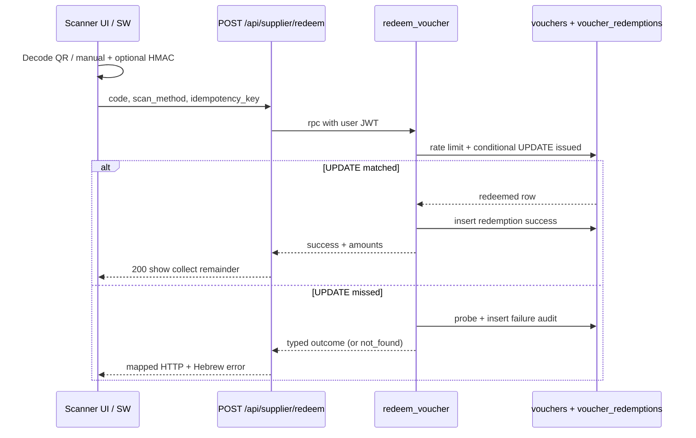

# SUPPLIER-PORTAL-ARCHITECTURE.md

KenyonExpress supplier portal and coupon redemption architecture.

Status: BINDING for `arch/admin-supplier` (2026-07-27)
Companion: `ADMIN-ARCHITECTURE.md`
Canonical redeem RPC: `public.redeem_voucher(p_code, p_scan_method, p_idempotency_key)` (migration 054)

---

## 0. Money model (supplier view)

| Product type | Customer pays online | Customer pays at scan | Supplier receives from platform |
|---|---|---|---|
| Coupon | `coupon_price_ils` (absolute) | `price_ils - coupon_price_ils` | 0 (cash collected at the business) |
| Physical | Full price | 0 | `(1 - platform_percent/100) * line` after T+3 and min 100 ILS |

No external Escrow. Platform keeps 100% of coupon online charges.

---

## 1. Portal surface

| Route | Min membership | Purpose |
|---|---|---|
| `/supplier` | scanner | Home / today stats |
| `/supplier/scan` | scanner | Camera + manual redeem |
| `/supplier/redemptions` | scanner | Own-supplier scan history |
| `/supplier/orders` | manager | Physical order queue |
| `/supplier/products` | manager | Read / limited edit own catalog |
| `/supplier/team` | owner | Invite managers / scanners |
| `/supplier/payouts` | owner | Statements and bank profile |
| `/supplier/settings` | owner | Business profile |

Auth: `profiles.role = 'vendor'` is routing only. Authorization is `supplier_members(is_active)` with roles `owner` | `manager` | `scanner`.

Helpers:

- `is_supplier_member(supplier_id)`
- `is_supplier_owner(supplier_id)`
- `current_supplier_id()` (UI assumes one active supplier in v1)

---

## 2. Onboarding

```
customer submits supplier_applications (pending)
  -> admin approves (ADMIN-ARCHITECTURE)
  -> suppliers row + supplier_members(owner) + profiles.role=vendor
  -> supplier lands on /supplier
```

Reject stores reason. One pending application per user (partial unique index).

---

## 3. Redeem flow (full step-by-step)

Transport: Route Handler `POST /api/supplier/redeem` (PWA / service worker offline drain). Also callable as RPC from an authenticated server action that wraps the same function for online UI.

Single money-mutating path: `public.redeem_voucher`.

### 3.1 Actors and inputs

| Input | Source | Trust |
|---|---|---|
| Session user | Supabase cookie / JWT | Trusted after `getUser()` |
| Supplier identity | `supplier_members` for `auth.uid()` | Trusted (never from QR body) |
| Code | Camera QR payload or manual 8+ char code | Untrusted |
| `scan_method` | `camera` \| `manual` | Clamped server-side |
| `idempotency_key` | Client UUID per tap / queue item | Untrusted string; unique when present |

QR format: `KEV1.<base64url payload>.<base64url HMAC-SHA256>`. HMAC proves minting; it is **not** an authz token. Single-use is decided only by the conditional UPDATE inside `redeem_voucher`.

### 3.2 Happy path (online)

1. **Scanner opens** `/supplier/scan` as an active `supplier_members` user.
2. **Client obtains code**
   - Camera: decode QR, extract code field from verified payload, or
   - Manual: normalize to alphanumeric uppercase.
3. **Optional app-layer HMAC verify** (online). Failure does **not** call redeem; call `log_voucher_scan(..., outcome='invalid_request')` and show Hebrew error "קוד לא תקין".
4. **Client generates** `idempotency_key = crypto.randomUUID()` once per attempt (persist in IndexedDB for offline queue).
5. **Client POST** `/api/supplier/redeem`:

```json
{
  "code": "AB12CD34",
  "scan_method": "camera",
  "idempotency_key": "550e8400-e29b-41d4-a716-446655440000"
}
```

6. **Route handler**
   - Reject missing session → HTTP 401 `{ outcome: "unauthorized" }`
   - Zod-validate body → 400 `{ outcome: "invalid_request" }`
   - Rate-limit IP fail-open; user rate limit lives inside RPC
   - Call `supabase.rpc('redeem_voucher', { p_code, p_scan_method, p_idempotency_key })` with the user JWT (not service role)
7. **RPC `redeem_voucher`**
   1. `auth.uid()` null → `{ outcome: 'unauthorized' }`
   2. No active membership → insert redemption audit `unauthorized`, return same
   3. If `idempotency_key` seen before:
      - different code → `{ outcome: 'invalid_request', replayed: true }`
      - same code + prior success → success payload + `replayed: true`
      - same code + prior failure → prior outcome + `replayed: true`
   4. `check_user_rate_limit(uid, 'voucher_scan', 30, 60)` fail → `{ outcome: 'rate_limited' }`
   5. **Atomic UPDATE**:
      - `status = 'issued'`
      - `expires_at > now()`
      - `supplier_id` in caller's active memberships
      - set `redeemed_*` provenance and `redeemed_amount_collected_agorot = remaining_amount_due_agorot`
   6. If UPDATE matched → insert `voucher_redemptions` success, return `voucher_success_payload`
   7. Else probe row and classify failure (section 3.4), always insert audit row
8. **UI on success**
   - Show product name, customer name (if present), face value, **יתרה לגבייה בבית העסק** (`remaining_amount_due_agorot` / 100)
   - Green confirm; play short success sound; clear scanner for next code
   - Persist local receipt for offline reprint
9. **Business collects** remaining amount in cash/card at the till (outside the platform). No platform payout for coupon lines.

### 3.3 Offline queue drain

1. Scanner loses network after local HMAC ok (or manual entry).
2. Intent stored in IndexedDB `redeem_intents` (`code`, `scan_method`, `idempotency_key`, `created_at`).
3. Service worker / foreground sync POSTs each intent when online.
4. Server idempotency guarantees one success even if drained twice.
5. UI marks queue item `synced` | `failed` from outcome; failures stay for operator review (never auto-delete `already_redeemed` without display).

### 3.4 Error handling matrix

| Outcome (RPC / API) | HTTP (route) | When | Client UX (Hebrew) | Retry? |
|---|---|---|---|---|
| `success` | 200 | Atomic UPDATE matched | הצג יתרה לגבייה + אישור | No (unless replayed display) |
| `success` + `replayed` | 200 | Idempotent retry | אותו מסך הצלחה | No |
| `unauthorized` | 401 | No session / no membership | אין הרשאת סריקה | Fix login / membership |
| `invalid_request` | 400 | Bad body, HMAC fail (app), idempotency key reuse with different code | בקשה לא תקינה | New key + correct code |
| `rate_limited` | 429 | >30 scans / 60s / user | נסה שוב בעוד רגע | After `Retry-After` |
| `already_redeemed` | 409 | Status already redeemed (honest detail only for owning supplier) | כבר מומש + `redeemed_at` | No |
| `expired` | 410 | Expired status or `expires_at` past | פג תוקף | No |
| `cancelled` | 409 | Order cancelled | בוטל | No |
| `refunded` | 409 | Refunded | זוכה | No |
| `not_found` | 404 | Unknown code **or** `wrong_supplier` (anti-enumeration) | קוד לא נמצא | Check code / store |
| `INTERNAL` / RPC throw | 500 | Unexpected | שגיאה פנימית; נשמר לוג | Safe retry with same idempotency key |

Notes:

- `wrong_supplier` is stored in `voucher_redemptions.outcome` but **collapsed to `not_found`** in the JSON returned to the client.
- Concurrent double-scan: second transaction sees zero-row UPDATE → `already_redeemed`.
- Forged QR naming another supplier cannot redeem: supplier id comes from membership ∩ row, not from payload.
- App-layer HMAC failure never creates a success path; optional `log_voucher_scan` for disputes.

### 3.5 Sequence (mermaid)



### 3.6 Success payload (contract)

```json
{
  "outcome": "success",
  "voucher_id": "uuid",
  "code": "AB12CD34",
  "status": "redeemed",
  "product_name": "…",
  "supplier_name": "…",
  "customer_name": "…",
  "face_value_agorot": 10000,
  "coupon_price_agorot": 900,
  "remaining_amount_due_agorot": 9100,
  "redeemed_at": "2026-07-27T00:00:00Z",
  "offer_valid_until": null,
  "replayed": false
}
```

UI must highlight `remaining_amount_due_agorot` as the till collection amount. Never tell the supplier to expect a platform transfer for that coupon.

---

## 4. API surface (supplier)

| Method | Route / Action | Auth | Purpose |
|---|---|---|---|
| `POST` | `/api/supplier/redeem` | `supplier:scanner+` session | Redeem / drain queue |
| `POST` | `logVoucherScan` action or RPC `log_voucher_scan` | scanner | Audit pre-DB rejects |
| RSC | `/supplier/redemptions` | scanner | List own redemptions via RLS |
| RSC | `/supplier/orders` | manager | Physical orders for own `supplier_id` |
| Action | `updateSupplierProfile` | owner | Non-bank profile fields |
| Action | `inviteSupplierMember` | owner | Add manager/scanner |
| Action | `removeSupplierMember` | owner | Deactivate member |

Envelope: same `ActionResult<T>` as admin for actions. Redeem route returns the RPC JSON plus HTTP mapping above.

---

## 5. RLS (supplier scope, exact SQL)

```sql
-- Membership helper
CREATE OR REPLACE FUNCTION public.is_supplier_member(p_supplier uuid)
RETURNS boolean
LANGUAGE sql
STABLE
SECURITY DEFINER
SET search_path = public
AS $$
  SELECT EXISTS (
    SELECT 1
    FROM public.supplier_members sm
    WHERE sm.supplier_id = p_supplier
      AND sm.user_id = auth.uid()
      AND sm.is_active
  );
$$;

REVOKE ALL ON FUNCTION public.is_supplier_member(uuid) FROM PUBLIC, anon;
GRANT EXECUTE ON FUNCTION public.is_supplier_member(uuid) TO authenticated;

-- Redemptions: supplier reads own audit rows
ALTER TABLE public.voucher_redemptions ENABLE ROW LEVEL SECURITY;
ALTER TABLE public.voucher_redemptions FORCE ROW LEVEL SECURITY;

DROP POLICY IF EXISTS voucher_redemptions_supplier_read ON public.voucher_redemptions;
CREATE POLICY voucher_redemptions_supplier_read
  ON public.voucher_redemptions
  FOR SELECT
  TO authenticated
  USING (
    supplier_id IS NOT NULL
    AND public.is_supplier_member(supplier_id)
  );

-- No direct INSERT/UPDATE for authenticated on voucher_redemptions.
-- Writers: redeem_voucher / log_voucher_scan only.

-- Orders: supplier managers read paid+ rows that contain their items
DROP POLICY IF EXISTS orders_supplier_read ON public.orders;
CREATE POLICY orders_supplier_read
  ON public.orders
  FOR SELECT
  TO authenticated
  USING (
    EXISTS (
      SELECT 1
      FROM public.order_items oi
      WHERE oi.order_id = orders.id
        AND oi.supplier_id IS NOT NULL
        AND public.is_supplier_member(oi.supplier_id)
    )
    AND status IN ('paid', 'fulfilled', 'partially_fulfilled', 'refunded', 'cancelled')
  );
```

Voucher SELECT policy for suppliers is defined in `ADMIN-ARCHITECTURE.md` §7.5. Redeem mutations remain RPC-only.

---

## 6. Physical orders (brief)

- Manager sees own `order_items` after payment.
- Mark shipped / ready for pickup via Server Action (service role or definer), never client UPDATE on `orders`.
- Payout lines appear on statements after T+3 business days; min payout 100 ILS; below threshold rolls over.

---

## 7. Security checklist

- [ ] QR HMAC keyed (not bare sha256)
- [ ] Redeem uses user JWT + membership, never trusts supplier_id from body
- [ ] `wrong_supplier` collapsed to `not_found` externally
- [ ] Rate limit 30/min/user on scan
- [ ] Offline intents always carry stable idempotency keys
- [ ] Bank fields visible to owner only
- [ ] Suspended supplier membership `is_active=false` blocks redeem

---

## 8. Acceptance checklist

- [ ] Double-scan of one code yields one `redeemed` row and one success + one `already_redeemed`
- [ ] Scanner of store A cannot redeem store B code (sees `not_found`)
- [ ] Success screen shows remaining amount due in ILS
- [ ] Offline drain of the same intent is idempotent
- [ ] Unauthorized user cannot EXECUTE a forged success via PostgREST UPDATE
