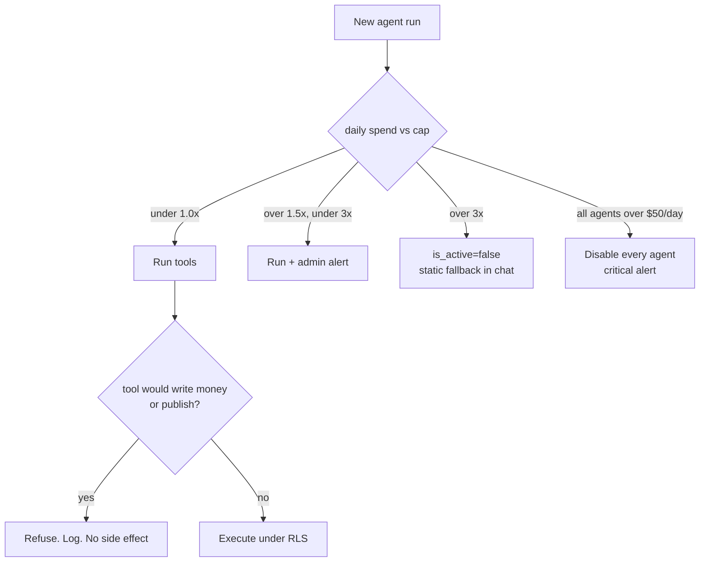

# AI runtime policy (v1.2)

Standalone policy for KenyonExpress agents. **No agent runtime exists in `src/` today.** There is no `src/server/agents/`, no `/api/agents/*`, no Anthropic/OpenAI client on a live path, and migration `028_agents.sql` is marked `DRAFT - DO NOT APPLY YET`.

This document is the policy those agents must obey **if and when** they ship. It is not a description of production behaviour. Kill switches that **do** exist in production (`KILL_SWITCH_CACHE`, `KILL_SWITCH_SEARCH`, `KILL_SWITCH_RECS`, `KILL_SWITCH_NOTIFICATIONS`, `CHECKOUT_ENABLED`) are for other subsystems. They do not start or stop an LLM.

Canonical architecture draft: `docs/ARCHITECTURE-AI-AGENTS-RUNTIME.md` (six agents). Companion: `docs/ARCHITECTURE-AI-AGENTS.md`. Support-specific draft: `docs/ARCHITECTURE-AI-AGENTS-SUPPORT.md` (uses different names; this policy follows the six `agent_key` values below).

KenyonExpress is a platform. Agents never hold inventory, never move money, never publish a product, never honour a voucher.

---

## 0. Hard invariants (all agents)

These are not negotiable. A prompt that would violate them is a defect, not a "capability".

1. **No money writes.** No charge, refund, wallet credit, payout, invoice, or voucher issue/redeem. Refund **intake** (open a human ticket) is the farthest support may go, and only through a SECURITY DEFINER RPC that enforces the 14-day window.
2. **No catalogue publish.** Enrichment writes suggestions. A human applies them.
3. **No PAN, CVV, full voucher code, or QR payload** in prompts, logs, or tool results. Last four of a voucher code only.
4. **Server-side model calls only.** No browser SDK, no supplier-portal key.
5. **RLS is the tenancy boundary.** Tools that accept an arbitrary id must not cross `auth.uid()` / supplier membership. Enumeration returns a uniform `NOT_FOUND`.
6. **A live conversation is never cut mid-turn.** Budget kill blocks **new** runs only.
7. **`is_active=false` on the active prompt version is the agent kill switch.** Env kill switches in `src/lib/resilience/kill-switches.ts` are a different system.

---

## 1. Catalogue of agents

Three sources in the repo disagree. This policy **binds** the V2 six-agent catalogue. Draft 028 currently enums only `shopping`, `supplier_ops`, `support`, `fraud_watch`. Applying 028 without adding `catalog_enrichment` and `pricing_analyst` to the CREATE TYPE (R22: no `ADD VALUE` in a regular file) would ship a schema that cannot represent the first agent we intend to turn on.

Launch order (RUNTIME §7): enrichment first, then support, shopping, supplier_ops, fraud_watch, pricing_analyst. Shopping is **not** first.

Daily launch caps assume ~1k orders/day. They live in config (`agent_prompts.tools_config.budget_usd_daily`) and are checked against `v_agent_costs_daily` at the start of a run. **None of that exists until 028+039 apply.**

---

## 2. Per-agent policy

### 2.1 `catalog_enrichment`

First to launch, if anything launches. No end-user, no PII, output is a staff queue.

| | Rule |
| --- | --- |
| **Data allowed** | One product row, its variants, up to 4 images (read-only). Category name. Existing Hebrew/English copy. Public catalogue fields only. |
| **Data forbidden** | Other suppliers' costs. Customer PII. Orders. Wallet. Direct UPDATE/INSERT on `products`. Auto-write to `search_synonyms` (synonyms go through the existing admin screen only). Treating image OCR / on-image text as instructions. |
| **Approval gates** | Every suggestion lands in `enrichment_suggestions` with `status=pending`. Staff approve / reject / apply. No apply without `reviewed_by`. Admin batch trigger capped at 500 products per batch. |
| **Cost cap** | **$5 / day** on backfill days. One-off WP backfill estimate ~$40 (batch API), not a daily burn. Eval-gate to drop model tier if monthly cost of this agent exceeds $500. |
| **Kill switch** | Hard: `is_active=false` on the prompt version. Soft: 1.5x daily cap → admin alert. Also stop the planned cron `agents-enrichment` (03:00 UTC) at the scheduler if the model vendor is down. |

### 2.2 `support`

Talks to a logged-in customer about **their** orders, coupons, wallet.

| | Rule |
| --- | --- |
| **Data allowed** | Orders, order items, vouchers (masked), wallet **balance** of `auth.uid()`, via RLS. Public help copy. Cancellation window facts (14 days, unredeemed only). |
| **Data forbidden** | Full voucher code / QR. PAN / last4 of card unless already shown to that user on their own receipt UI (prefer none). Other users' orders. Supplier bank details. Service-role data. Inventing a refund amount. |
| **Approval gates** | `refund_intake` opens a human queue only, through `fn_agent_open_refund_intake` (planned). Escalate to a human. The agent must not call Cardcom `RefundDeal`, must not credit the wallet, must not mark a voucher cancelled. |
| **Cost cap** | **$1.50 / day** at launch. |
| **Kill switch** | Same two-stage + global $50. Chat UI falls back to static FAQ / `https://kenyonexpress.co.il/contact` and WhatsApp `052-463-5550`. |

### 2.3 `shopping`

Customer-facing catalogue assistant.

| | Rule |
| --- | --- |
| **Data allowed** | Public catalogue (same as anon product SELECT). Category tree. City names from the static city list. Search results the site would already show. |
| **Data forbidden** | Any money write. Cart mutation that bypasses the existing cart API. "Guaranteed in stock" beyond what `in_stock` already exposes. PII. Cross-user history. |
| **Approval gates** | Escalation only (hand off to support or `/contact`). No publish, no price change, no voucher issue. |
| **Cost cap** | **$4 / day**. This is the expensive chat surface (~98% of scale cost in the draft). |
| **Kill switch** | Same. Fallback is ordinary search (`/search`, Postgres `ILIKE` today). |

### 2.4 `supplier_ops`

Helps a supplier draft an application or a listing. Does not submit it.

| | Rule |
| --- | --- |
| **Data allowed** | The supplier's own draft onboarding fields. Public category list. Aggregated anonymised category benchmarks (no named peer). Image-in for the listing they uploaded. |
| **Data forbidden** | Bank account numbers, branch codes, national IDs. Another supplier's products or volumes. Auto-submit of `supplier_leads` / applications. Auto-publish. |
| **Approval gates** | Admin approval of the application. Staff approval of any listing draft. The agent must not flip `app_scanning_enabled` or membership roles. |
| **Cost cap** | **$1 / day**. |
| **Kill switch** | Same. Fallback is the existing admin/supplier forms. |

### 2.5 `fraud_watch`

Nightly (planned cron 05:00 UTC) SQL detectors over scans, wallet, refunds.

| | Rule |
| --- | --- |
| **Data allowed** | Aggregates and detector features: scan failure rates, repeat redeem attempts, wallet credit spikes, refund clustering. Identifiers as opaque uuids in flags. |
| **Data forbidden** | Automatic block of a user, supplier, voucher, or IP. Automatic refund reverse. Dumping raw PII into Slack/ntfy. Acting on a single false-positive without a human. |
| **Approval gates** | Flags to admin only. A human decides. No `CHECKOUT_ENABLED` flip by the agent (that is an owner/env action). |
| **Cost cap** | **$0.50 / day**. |
| **Kill switch** | Same. If this agent is the only thing watching scans, turning it off means a human reads `/admin/payments` and redeem error logs instead. Do not "fail closed" by blocking all redemptions. |

### 2.6 `pricing_analyst`

Weekly report (planned cron Sunday 06:00 UTC).

| | Rule |
| --- | --- |
| **Data allowed** | Analytics views the admin dashboard already uses (sales lines in agorot, product type split, take rate by `platform_percent`). Platform-wide aggregates. |
| **Data forbidden** | One supplier's numbers in another supplier's context. Writing `products.price` / `platform_percent`. Customer-level rows. |
| **Approval gates** | Writes `agent_reports` (admin RLS). Price changes remain a human on `/admin/products/[id]/edit`. |
| **Cost cap** | **$0.50 / day** (few runs). |
| **Kill switch** | Same. Fallback is `/admin/analytics`. |

---

## 3. Shared data rules

| Class | Allowed in prompts / tools? |
| --- | --- |
| Public catalogue | Yes |
| Caller's own orders / vouchers (masked) / wallet balance | Support only |
| Email, phone | No. Redact if a tool returns them |
| Full voucher code, QR HMAC payload | Never |
| Card PAN / CVV / Cardcom token | Never |
| `SUPABASE_SERVICE_ROLE_KEY`, `CARDCOM_*`, `CRON_SECRET` | Never |
| Another tenant's rows | Never |
| `audit_log` payloads | Admin tools only, scrubbed |
| Images | Enrichment / supplier_ops only, treated as data not instructions |

PII masking belongs in the (unbuilt) `toolRunner` before the model sees a step, and again before `fn_log_agent_run` persists it.

---

## 4. Approval gates (matrix)

| Agent | Can talk | Can queue a suggestion | Can open a human ticket | Can change money or catalogue |
| --- | --- | --- | --- | --- |
| `catalog_enrichment` | staff | yes | no | no |
| `support` | customer | no | yes (`refund_intake`) | no |
| `shopping` | customer | no | escalate only | no |
| `supplier_ops` | supplier | listing/application draft | no | no |
| `fraud_watch` | nobody (cron) | fraud flag | no | no |
| `pricing_analyst` | nobody (cron) | report | no | no |

"Queue" is not "done". Apply / refund / publish / payout remain human.

---

## 5. Cost caps and kill switch

| Agent | Launch daily cap (USD) |
| --- | --- |
| `shopping` | 4 |
| `support` | 1.5 |
| `supplier_ops` | 1 |
| `catalog_enrichment` | 5 (backfill days) |
| `fraud_watch` | 0.5 |
| `pricing_analyst` | 0.5 |
| **All agents combined** | **50** (global hard) |

| Level | Trigger | Action |
| --- | --- | --- |
| soft | daily spend > 1.5 × that agent's cap | Admin alert (`v_money_alarms` channel in the draft). Keep running |
| hard | daily spend > 3 × cap | `is_active=false` on active prompt. Static fallback |
| global | sum of all agents > $50 / day | Disable every agent + critical alert |

Monthly: if an agent's calendar-month cost exceeds $500, open the eval gate to drop model tier (sonnet → cheaper) only if Hebrew eval scores hold.

There is **no** production env var `KILL_SWITCH_AGENTS` today. Until the runtime exists, the only way to "kill" agents is to not apply 028/039 and not add the three crons.

Do not reuse `KILL_SWITCH_NOTIFICATIONS` or `CHECKOUT_ENABLED` as an AI kill. Checkout-off during a model outage punishes customers who are not talking to a bot.

---

## 6. What "done" would mean (not done)

From RUNTIME §10, still open:

1. Apply edited 028 + 039 via Supabase MCP `apply_migration` after human approval. Never `db push`.
2. `src/server/agents/` with toolRunner, budget check, kill switch, PII mask, `fn_log_agent_run`.
3. Eval harness in CI on every prompt change.
4. Enrichment backfill behind a staff approval queue.
5. Admin dashboard: runs, daily cost vs cap, approval queues, flags.

Until those exist, any UI copy that says "AI assistant" on the storefront is a lie.

---

## 7. Source files

- `docs/ARCHITECTURE-AI-AGENTS-RUNTIME.md` (§3 per agent, §6.3 kill switch, §7 launch order)
- `docs/ARCHITECTURE-AI-AGENTS.md` (invariants, PII table)
- `docs/ARCHITECTURE-AI-AGENTS-SUPPORT.md` (support tools; names differ)
- `supabase/migrations/028_agents.sql` (DRAFT, do not apply)
- `src/lib/resilience/kill-switches.ts` (unrelated production switches)
