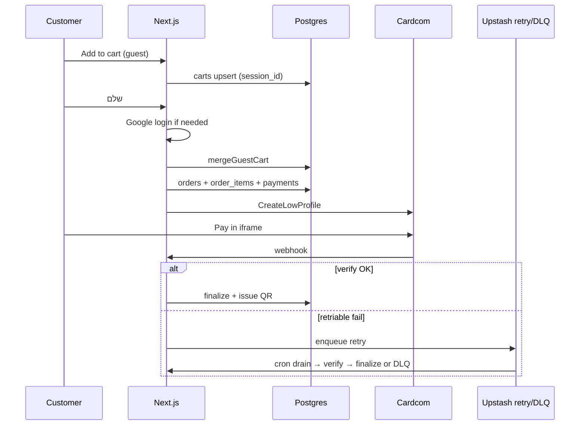

# ARCHITECTURE-CART-CHECKOUT.md

KenyonExpress **Guest Cart → Login-at-Pay → Checkout → Cardcom → Voucher** architecture (complete binding spec).

Status: BINDING · worktree `/Users/ofir/kenyonexpress-web/ke-arch-cart` · branch `arch/cart-checkout` (2026-07-30)
Scope: **docs only.** No application code in this change.
Companions: `docs/ARCHITECTURE-CHECKOUT-CARDCOM.md` (ke-arch), `docs/ARCHITECTURE-COUPON-REDEMPTION.md`, `docs/ARCHITECTURE-NOTIFICATIONS.md`, `docs/ADMIN-PRODUCT-PAGE-SPEC.md`.
Stack: Next.js App Router, Server Actions (`src/server/actions/cart.ts`, `src/server/actions/payments/**`), Route Handlers for Cardcom webhook + retry cron, Supabase Postgres, Cardcom Low Profile / iframe + token, Upstash Redis retry/DLQ.
Money: integer **agorot** only in ledger, payments, order_items, vouchers. UI formats ₪ via `he-IL`.

---

## 0. Business model (binding)

| Product type | Customer pays on site | After payment | Platform / supplier |
|---|---|---|---|
| **Coupon** | Full absolute **`coupon_price_ils`** (admin-set, **no default**) | Issue voucher + QR; status `issued` → `used` on scan; till remainder `face − coupon_price` paid **at supplier** | Snapshotted `platform_percent` applies to **prepaid only**. Common 100/0. **No Escrow.** |
| **Physical** | Full discounted on-site charge | Supplier notified to ship | Immediate ledger split by snapshotted `platform_percent`. Payout T+3. Not “Escrow until delivery”. |

Invariants:

1. KenyonExpress is a **platform**, never a supplier.
2. `platform_percent` is dynamic per product, **no fixed rate, no DB default**. Missing percent → cannot checkout.
3. Snapshots on `order_items` at order create / pay are **immutable**. Never recompute historical money from live `products`.
4. All money columns that mutate ledger are **integer agorot**. Never store float ILS in money-critical paths.
5. Guest may browse + cart. **Login required on "שלם"**. Google OAuth (first visit) / OTP later. Merge guest cart into user cart on that click.
6. Cardcom calls only from server. Never from client components.

Conceptual status labels vs DB (coupon):

| Product language | DB `coupon_status` |
|---|---|
| issued / תקף | `issued` |
| used / מומש | `used` (scan success; terminal) |
| expired | `expired` |
| refunded / cancelled | `refunded` |

---

## 1. End-to-end flow

```
browse (guest OK)
  → add to cart (cookie ke_session_id + carts row; optional localStorage mirror)
  → /cart view (server-priced)
  → click שלם
      → if !auth: Google OAuth / OTP → mergeGuestCart → resume checkout
      → if auth: proceed
  → checkout form (shipping if any physical line)
  → beginCheckout (re-price, validate, create order + order_items snapshots + payment)
  → Cardcom Low Profile iframe (or token charge if saved token)
  → Indicator + webhook (source of truth)
  → finalize payment_settled (idempotent)
      → coupon lines: mint coupon_codes (issued) + QR
      → physical: settlement split + supplier notify
  → clear user cart
  → thank-you / account vouchers
```



---

## 2. Guest Cart (open)

### 2.1 Storage layers

| Layer | Role |
|---|---|
| HttpOnly cookie `ke_session_id` | Canonical guest identity (UUID). 30 days, `SameSite=Lax`, path `/` |
| `public.carts` | Server source of truth. Guest: `session_id` + `profile_id IS NULL`. User: `profile_id` |
| `localStorage` key `ke_cart_mirror_v1` | **Optimistic UX only** (drawer instant paint). Never trusted for price or checkout. Hydrate from server on mount; overwrite after every Server Action |

Rules:

- Guests write via Server Actions using **service role** keyed by cookie UUID (RLS cannot see HttpOnly cookie alone).
- Authenticated users write via user JWT + RLS `profile_id = auth.uid()`.
- Cart items JSON is identity + quantity only. Prices always re-resolved from `products` on read.
- Expiry: `expires_at = now() + 30 days` on every write. Cron deletes expired guest rows.
- Max quantity per line: 99. Max distinct lines: 50 (reject with Hebrew error).

### 2.2 Cart item shape (storage)

```ts
export type CartStorageItem = {
  product_id: string
  variant_id: string | null
  quantity: number
  added_at: string // ISO
}
```

### 2.3 Server-priced view

```ts
export type CartLineView = {
  product_id: string
  variant_id: string | null
  quantity: number
  slug: string
  name_he: string
  type: 'coupon' | 'physical'
  image_url: string | null
  unit_charge_agorot: number // what Cardcom will take for one unit
  line_charge_agorot: number
  face_value_agorot: number | null // coupon only
  balance_due_agorot: number | null // face − coupon_price
  platform_percent: number | null
  supplier_id: string | null
  supplier_name_he: string | null
  available: boolean
  block_reason: string | null // Hebrew
}

export type CartView = {
  cart_id: string | null
  items: CartLineView[]
  subtotal_agorot: number
  currency: 'ILS'
  has_physical: boolean
  has_coupon: boolean
  can_checkout: boolean
  blockers: string[]
}
```

Pricing rules (server):

| Type | `unit_charge_agorot` |
|---|---|
| Coupon | `ilsToAgorot(coupon_price_ils)` (required non-null) |
| Physical | `ilsToAgorot(discounted on-site price)` (variant price if set) |

Block checkout when any line: unpublished, deleted, missing `platform_percent`, coupon missing `coupon_price_ils`, insufficient stock (physical).

### 2.4 Schema: `carts`

```sql
CREATE TABLE IF NOT EXISTS public.carts (
  id         uuid PRIMARY KEY DEFAULT gen_random_uuid(),
  profile_id uuid REFERENCES public.profiles(id) ON DELETE CASCADE,
  session_id text,
  items      jsonb NOT NULL DEFAULT '[]'::jsonb,
  expires_at timestamptz NOT NULL DEFAULT now() + INTERVAL '30 days',
  created_at timestamptz NOT NULL DEFAULT now(),
  updated_at timestamptz NOT NULL DEFAULT now(),
  CONSTRAINT carts_owner_check CHECK (profile_id IS NOT NULL OR session_id IS NOT NULL)
);
CREATE UNIQUE INDEX IF NOT EXISTS carts_one_user ON public.carts (profile_id) WHERE profile_id IS NOT NULL;
CREATE UNIQUE INDEX IF NOT EXISTS carts_one_guest ON public.carts (session_id) WHERE profile_id IS NULL AND session_id IS NOT NULL;
```

---

## 3. Merge after Google login on "שלם"

### 3.1 Trigger

1. User on `/checkout` or cart clicks **שלם**.
2. Client detects no session → redirect to Google OAuth with `returnTo=/checkout?resume=1`.
3. After session established, Server Action `prepareCheckout` runs:
   - read `ke_session_id`
   - `mergeGuestCart(userId, sessionId)`
   - clear guest cookie (optional keep for analytics)
   - return fresh `CartView`

### 3.2 Merge algorithm (idempotent)

```
userItems = Map by product_id::variant_id
for each guestItem:
  if key exists: quantity = min(99, user.qty + guest.qty)
  else: insert guest line
write user cart
delete guest cart row
```

Idempotency: second merge with empty/missing guest cart is no-op. Safe to call on every checkout entry.

### 3.3 Conflicts

| Case | Behavior |
|---|---|
| Same product both carts | Sum quantities (cap 99) |
| Guest line unavailable | Keep in cart but `available=false`; block pay |
| User already has cart | Merge into user; drop guest |
| No guest cookie | Skip merge |

---

## 4. Checkout create (pre-iframe)

### 4.1 Preconditions (`beginCheckout`)

1. Auth required.
2. Cart non-empty; `can_checkout === true`.
3. Re-load products under service role; recompute every agorot amount (ignore client totals).
4. Physical lines → Israel shipping address Zod-validated.
5. Coupon-only → contact phone/email only.
6. Generate `idempotency_key = hash(userId + cartFingerprint + attemptSalt)` UNIQUE on `orders` / `payments`.

### 4.2 Atomic write

In one DB transaction (preferred via SECURITY DEFINER RPC or sequential service-role with compensating guards):

1. Insert `orders` (`status = awaiting_payment`).
2. Insert `order_items` with **full snapshots** (see §5).
3. Insert `payments` (`status = initiated`, `amount_agorot`, `idempotency_key`).
4. Select Cardcom account (coupon vs goods routing).
5. Call Cardcom `CreateLowProfile` (or token charge).
6. Persist `cardcom_low_profile_id` on payment; status → `redirected`.
7. Return iframe URL / LowProfileId to client.

Never trust client-reported `total`.

### 4.3 Order summary (customer UI, RTL)

Per line: name, supplier, badge קופון/פיזי, on-site charge, and for coupon **יתרה לתשלום בבית העסק**.
Order total = sum of on-site charges − wallet − incentives (revalidated server-side).
Never show platform/supplier split to customers by default.

---

## 5. Snapshot `platform_percent` onto `order_items`

At insert time, copy from live product (and freeze):

| Column | Source |
|---|---|
| `platform_percent` | `products.platform_percent` (NOT NULL or abort) |
| `paid_on_site_agorot` | line Cardcom share |
| `platform_fee_agorot` | `roundHalfUp(paid_on_site * percent / 100)` |
| `supplier_due_agorot` | physical: residual; coupon prepaid share usually 0 when percent=100 |
| `balance_due_agorot` | coupon: `face − coupon_price` (not platform custody) |
| `coupon_price_agorot` | coupon lines |
| `face_value_agorot` | coupon lines |
| `supplier_id`, `supplier_name_he`, … | identity snapshot |

```ts
export function splitLine(paidOnSiteAgorot: number, platformPercent: number) {
  if (!Number.isInteger(paidOnSiteAgorot) || paidOnSiteAgorot < 0) {
    throw new Error('paid_on_site must be integer agorot')
  }
  if (platformPercent < 0 || platformPercent > 100) {
    throw new Error('platform_percent out of range')
  }
  const platformFee = roundHalfUp((paidOnSiteAgorot * platformPercent) / 100)
  const supplierDue = paidOnSiteAgorot - platformFee
  return { platformFee, supplierDue }
}
```

Historical reports **must** read order_items / settlement_events, never live products.

---

## 6. Cardcom: Low Profile, Token, webhook, idempotency

### 6.1 Low Profile

1. Server creates deal for selected terminal (`cardcom_accounts`).
2. Client embeds iframe (Hebrew chrome around it; RTL).
3. Success: Indicator URL + async webhook.
4. Failure/cancel: Hebrew error; payment `failed`/`cancelled`; order unpaid.

PCI: PAN/CVV never touch our servers or logs.

### 6.2 Saved Token

On first successful charge, store Cardcom token in `payment_tokens` (user-scoped, never PAN).
Later: `chargeWithToken` Server Action with same idempotency rules; still create payment row + webhook/verify path.

### 6.3 Webhook pipeline

`POST /api/payments/cardcom/webhook`

```
1. Persist raw body → payment_webhook_events (UNIQUE provider, external_event_id)
2. Verify signature / shared secret
3. Verify deal via Cardcom API (server-to-server)
4. Resolve payment by low_profile_id
5. success → finalizePaymentSettled (idempotent)
   failure → mark payment failed
6. On retriable error after auth → enqueue Upstash retry
7. Return 200 after durable log when possible
```

### 6.4 Idempotency matrix

| Layer | Mechanism |
|---|---|
| Order create | `orders.idempotency_key` UNIQUE |
| Payment create | `payments.idempotency_key` UNIQUE |
| Cardcom deal | `cardcom_low_profile_id` UNIQUE; recreate returns open deal |
| Webhook | UNIQUE `(provider, external_event_id)` |
| Finalize | `UPDATE orders SET status='paid' WHERE status IN ('awaiting_payment','pending')` |
| Side effects | voucher mint / settlement keyed by order_item; replay = no-op |
| Charge | Never second Cardcom charge if order already `paid` |

### 6.5 Finalize side effects

Same logical transaction / idempotency key:

1. `orders.status = paid`
2. `payments.status = succeeded`
3. Coupon lines → insert `coupon_codes` (`status = issued`) + signed QR
4. Insert `settlement_events` per line
5. Emit notifications (`payment_settled`, `supplier_new_order`)
6. Clear `carts.items` for `profile_id`

---

## 7. Coupon: full site payment + QR + `issued` → `used`

### 7.1 Charge

Customer pays **100% of `coupon_price_ils`** on site (absolute). Not a fixed 10%.

### 7.2 Issue

Per purchased coupon unit:

- `code` UNIQUE (Crockford-ish)
- `qr_token` = `KEV1.<payload>.<hmac>`
- Money snapshots in agorot
- `status = issued`
- `expires_at` calendar

### 7.3 Redeem

Supplier scan → `redeem_voucher` RPC:

```
UPDATE coupon_codes
SET status = 'used', redeemed_at = now()
WHERE code = $1 AND status = 'issued' AND expires_at > now()
RETURNING …
```

Second scan → already used. Till remainder collected offline at supplier.

---

## 8. Retry + DLQ

### 8.1 Retry queue (Upstash Redis)

Keys:

- `ke:payments:webhook-retry` (list)
- `ke:payments:webhook-retry:dead` (list)

Job:

```ts
type WebhookRetryJob = {
  provider: 'cardcom'
  lowProfileId: string
  externalEventId: string
  attempt: number
  enqueuedAt: string
}
```

Max attempts: **5**. Cron: `POST /api/payments/cardcom/retry` with `Authorization: Bearer CRON_SECRET`, batch 20.

### 8.2 Retriable vs terminal

| Result | Action |
|---|---|
| `finalized` | Done |
| Cardcom verify timeout / 5xx | Re-enqueue attempt+1 |
| Invalid signature / unknown deal | Terminal (no retry) |
| Order already paid | Drain as success no-op |
| attempt ≥ 5 | **DLQ** + `audit_log` alarm `webhook_retry_exhausted` |

### 8.3 Ops

Admin reads DLQ length + last payloads. Manual replay: re-push job with attempt reset under dual control. Never auto-charge again from DLQ without verify.

---

## 9. Edge cases

| ID | Case | Behavior |
|---|---|---|
| E1 | Double click שלם | Same idempotency key → return existing payment / iframe |
| E2 | Double webhook success | Dedup event + conditional paid update; one voucher set |
| E3 | Indicator success, webhook late | Thank-you page + cron **verify pull** by LowProfileId |
| E4 | Pay retry after decline | New `payments` row `attempt_n`; prior `superseded`; new Low Profile |
| E5 | Retry Pay after already paid | Reject; show thank-you |
| E6 | Iframe timeout / abandon | TTL cron (default 45 min) → order `expired`; stock release |
| E7 | Customer cancel in Cardcom | payment `cancelled`/`failed`; Hebrew return to checkout |
| E8 | Cardcom down mid-create | No order orphan without payment row; surface error; allow retry |
| E9 | Merge then empty unavailable cart | Block checkout with per-line Hebrew reasons |
| E10 | Mixed cart | Single charge; shipping required; per-line settlement |
| E11 | Missing platform_percent | Cannot beginCheckout |
| E12 | Token charge fails | Fallback offer Low Profile iframe |
| E13 | Partial network on finalize after Cardcom success | Retry/DLQ + reconcile; customer may already be charged → never create second charge |
| E14 | Guest localStorage stale | Server cart wins on hydrate |
| E15 | Two tabs merge | Last write wins on cart jsonb; checkout re-prices from DB |

---

## 10. Full TypeScript (binding reference)

> Paths are target locations under the app package. This document is the contract; paste/adapt into implementation branches.

### 10.1 `src/lib/money/agorot.ts`

```typescript
/** Integer agorot only. 1 ILS = 100 agorot. */

export type Agorot = number & { readonly __brand: 'Agorot' }

export function agorot(n: number): Agorot {
  if (!Number.isInteger(n) || n < 0) {
    throw new Error(`agorot: expected non-negative integer, got ${n}`)
  }
  return n as Agorot
}

export function ilsToAgorot(ils: number | string): Agorot {
  const n = typeof ils === 'string' ? Number(ils) : ils
  if (!Number.isFinite(n) || n < 0) throw new Error('ilsToAgorot: invalid ILS')
  return agorot(Math.round(n * 100))
}

export function agorotToIls(a: Agorot): number {
  return a / 100
}

export function formatIlsHe(a: Agorot): string {
  return new Intl.NumberFormat('he-IL', {
    style: 'currency',
    currency: 'ILS',
  }).format(agorotToIls(a))
}

/** Half-up percent of agorot amount. percent is 0..100. */
export function roundHalfUpPercent(amount: Agorot, percent: number): Agorot {
  if (percent < 0 || percent > 100) throw new Error('percent out of range')
  const raw = (amount * percent) / 100
  return agorot(Math.round(raw))
}

export function splitByPlatformPercent(paidOnSite: Agorot, platformPercent: number) {
  const platformFee = roundHalfUpPercent(paidOnSite, platformPercent)
  const supplierDue = agorot(paidOnSite - platformFee)
  return { platformFee, supplierDue }
}
```

### 10.2 `src/lib/cart/types.ts`

```typescript
import type { Agorot } from '@/lib/money/agorot'

export type CartStorageItem = {
  product_id: string
  variant_id: string | null
  quantity: number
  added_at: string
}

export type CartLineView = {
  product_id: string
  variant_id: string | null
  quantity: number
  slug: string
  name_he: string
  type: 'coupon' | 'physical'
  image_url: string | null
  unit_charge_agorot: Agorot
  line_charge_agorot: Agorot
  face_value_agorot: Agorot | null
  balance_due_agorot: Agorot | null
  platform_percent: number | null
  supplier_id: string | null
  supplier_name_he: string | null
  available: boolean
  block_reason: string | null
}

export type CartView = {
  cart_id: string | null
  items: CartLineView[]
  subtotal_agorot: Agorot
  currency: 'ILS'
  has_physical: boolean
  has_coupon: boolean
  can_checkout: boolean
  blockers: string[]
}

export type CartActionResult =
  | { ok: true; cart: CartView }
  | { ok: false; error: string; code: string; cart?: CartView }
```

### 10.3 `src/lib/cart/guest-session.ts`

```typescript
import { cookies } from 'next/headers'

export const GUEST_SESSION_COOKIE = 'ke_session_id'
const SESSION_MAX_AGE = 60 * 60 * 24 * 30
const UUID_RE =
  /^[0-9a-f]{8}-[0-9a-f]{4}-[1-5][0-9a-f]{3}-[89ab][0-9a-f]{3}-[0-9a-f]{12}$/i

export function parseGuestSessionToken(raw: string | undefined): string | null {
  if (!raw) return null
  const uuid = raw.includes('.') ? (raw.split('.')[0] ?? '') : raw
  return UUID_RE.test(uuid) ? uuid : null
}

export async function ensureGuestSessionId(): Promise<string> {
  const store = await cookies()
  const existing = parseGuestSessionToken(store.get(GUEST_SESSION_COOKIE)?.value)
  if (existing) return existing
  const sessionId = crypto.randomUUID()
  store.set(GUEST_SESSION_COOKIE, sessionId, {
    httpOnly: true,
    sameSite: 'lax',
    maxAge: SESSION_MAX_AGE,
    path: '/',
  })
  return sessionId
}

export async function getGuestSessionId(): Promise<string | null> {
  const store = await cookies()
  return parseGuestSessionToken(store.get(GUEST_SESSION_COOKIE)?.value)
}

export async function clearGuestSessionCookie(): Promise<void> {
  const store = await cookies()
  store.delete(GUEST_SESSION_COOKIE)
}
```

### 10.4 `src/lib/cart/local-mirror.ts` (client)

```typescript
'use client'

import type { CartStorageItem } from '@/lib/cart/types'

const KEY = 'ke_cart_mirror_v1'

export function readCartMirror(): CartStorageItem[] {
  if (typeof window === 'undefined') return []
  try {
    const raw = window.localStorage.getItem(KEY)
    if (!raw) return []
    const parsed = JSON.parse(raw) as unknown
    if (!Array.isArray(parsed)) return []
    return parsed.filter(isStorageItem)
  } catch {
    return []
  }
}

export function writeCartMirror(items: CartStorageItem[]): void {
  if (typeof window === 'undefined') return
  window.localStorage.setItem(KEY, JSON.stringify(items))
}

export function clearCartMirror(): void {
  if (typeof window === 'undefined') return
  window.localStorage.removeItem(KEY)
}

function isStorageItem(x: unknown): x is CartStorageItem {
  if (typeof x !== 'object' || x === null) return false
  const o = x as CartStorageItem
  return (
    typeof o.product_id === 'string' &&
    typeof o.quantity === 'number' &&
    (o.variant_id === null || typeof o.variant_id === 'string')
  )
}
```

### 10.5 `src/lib/cart/pricing.ts`

```typescript
import { agorot, ilsToAgorot, type Agorot } from '@/lib/money/agorot'
import type { CartLineView, CartStorageItem, CartView } from '@/lib/cart/types'

export type ProductRow = {
  id: string
  slug: string
  name_he: string
  type: 'coupon' | 'physical'
  status: string
  deleted_at: string | null
  images: string[] | null
  stock_quantity: number | null
  price_ils: number | string | null
  coupon_price_ils: number | string | null
  face_value_ils: number | string | null
  platform_percent: number | null
  supplier_id: string | null
  supplier_name_he: string | null
}

export type VariantRow = {
  id: string
  product_id: string
  price: number | string | null
  stock_quantity: number | null
  is_active: boolean
  deleted_at: string | null
}

export function buildCartView(
  cartId: string | null,
  items: CartStorageItem[],
  products: ProductRow[],
  variants: VariantRow[],
): CartView {
  const byId = new Map(products.map((p) => [p.id, p]))
  const byVariant = new Map(variants.map((v) => [v.id, v]))
  const lines: CartLineView[] = []
  const blockers: string[] = []

  for (const item of items) {
    const p = byId.get(item.product_id)
    if (!p) {
      lines.push(unavailableLine(item, 'המוצר לא נמצא'))
      blockers.push('מוצר חסר בעגלה')
      continue
    }

    const variant = item.variant_id ? byVariant.get(item.variant_id) : null
    if (item.variant_id && (!variant || variant.product_id !== p.id || !variant.is_active)) {
      lines.push(unavailableLine(item, 'גרסה לא תקינה', p))
      blockers.push(`${p.name_he}: גרסה לא תקינה`)
      continue
    }

    let available = p.status === 'active' && !p.deleted_at
    let block_reason: string | null = null
    if (!available) {
      block_reason = 'המוצר לא זמין'
      blockers.push(`${p.name_he}: לא זמין`)
    }

    if (p.platform_percent == null) {
      available = false
      block_reason = 'חסר אחוז פלטפורמה'
      blockers.push(`${p.name_he}: לא ניתן לתשלום`)
    }

    let unit: Agorot = agorot(0)
    let face: Agorot | null = null
    let balance: Agorot | null = null

    if (p.type === 'coupon') {
      if (p.coupon_price_ils == null) {
        available = false
        block_reason = 'חסר מחיר קופון'
        blockers.push(`${p.name_he}: חסר מחיר קופון`)
      } else {
        unit = ilsToAgorot(p.coupon_price_ils)
        face = p.face_value_ils != null ? ilsToAgorot(p.face_value_ils) : null
        if (face != null) balance = agorot(face - unit)
      }
    } else {
      const raw = variant?.price ?? p.price_ils
      if (raw == null) {
        available = false
        block_reason = 'חסר מחיר'
        blockers.push(`${p.name_he}: חסר מחיר`)
      } else {
        unit = ilsToAgorot(raw)
      }
      const stock = variant?.stock_quantity ?? p.stock_quantity
      if (stock != null && stock < item.quantity) {
        available = false
        block_reason = 'אין מספיק במלאי'
        blockers.push(`${p.name_he}: מלאי`)
      }
    }

    lines.push({
      product_id: item.product_id,
      variant_id: item.variant_id,
      quantity: item.quantity,
      slug: p.slug,
      name_he: p.name_he,
      type: p.type,
      image_url: p.images?.[0] ?? null,
      unit_charge_agorot: unit,
      line_charge_agorot: agorot(unit * item.quantity),
      face_value_agorot: face,
      balance_due_agorot: balance,
      platform_percent: p.platform_percent,
      supplier_id: p.supplier_id,
      supplier_name_he: p.supplier_name_he,
      available,
      block_reason,
    })
  }

  const subtotal = agorot(lines.reduce((s, l) => s + (l.available ? l.line_charge_agorot : 0), 0))
  return {
    cart_id: cartId,
    items: lines,
    subtotal_agorot: subtotal,
    currency: 'ILS',
    has_physical: lines.some((l) => l.type === 'physical'),
    has_coupon: lines.some((l) => l.type === 'coupon'),
    can_checkout: lines.length > 0 && blockers.length === 0 && lines.every((l) => l.available),
    blockers: [...new Set(blockers)],
  }
}

function unavailableLine(
  item: CartStorageItem,
  reason: string,
  p?: ProductRow,
): CartLineView {
  return {
    product_id: item.product_id,
    variant_id: item.variant_id,
    quantity: item.quantity,
    slug: p?.slug ?? '',
    name_he: p?.name_he ?? 'מוצר',
    type: p?.type ?? 'physical',
    image_url: null,
    unit_charge_agorot: agorot(0),
    line_charge_agorot: agorot(0),
    face_value_agorot: null,
    balance_due_agorot: null,
    platform_percent: null,
    supplier_id: null,
    supplier_name_he: null,
    available: false,
    block_reason: reason,
  }
}
```

### 10.6 `src/server/actions/cart.ts` (core)

```typescript
'use server'

import {
  clearGuestSessionCookie,
  ensureGuestSessionId,
  getGuestSessionId,
  GUEST_SESSION_COOKIE,
} from '@/lib/cart/guest-session'
import { buildCartView } from '@/lib/cart/pricing'
import type { CartActionResult, CartStorageItem, CartView } from '@/lib/cart/types'
import { createAdminClient } from '@/lib/supabase/admin'
import { createClient } from '@/lib/supabase/server'
import { revalidatePath } from 'next/cache'
import { cookies } from 'next/headers'

const CART_EXPIRY_DAYS = 30
const MAX_LINES = 50
const MAX_QTY = 99

function itemKey(item: CartStorageItem): string {
  return `${item.product_id}::${item.variant_id ?? 'null'}`
}

function parseItems(raw: unknown): CartStorageItem[] {
  if (!Array.isArray(raw)) return []
  return raw.filter(
    (item): item is CartStorageItem =>
      typeof item === 'object' &&
      item !== null &&
      typeof (item as CartStorageItem).product_id === 'string' &&
      typeof (item as CartStorageItem).quantity === 'number',
  )
}

function expiresAt(): string {
  return new Date(Date.now() + CART_EXPIRY_DAYS * 24 * 60 * 60 * 1000).toISOString()
}

function fail(error: string, code: string): CartActionResult {
  return { ok: false, error, code }
}

async function getCartRow(): Promise<{
  row: { id: string; items: unknown } | null
  isGuest: boolean
  userId: string | null
}> {
  const supabase = await createClient()
  const {
    data: { user },
  } = await supabase.auth.getUser()

  if (user) {
    const { data } = await supabase
      .from('carts')
      .select('id, items')
      .eq('profile_id', user.id)
      .maybeSingle()
    return { row: data, isGuest: false, userId: user.id }
  }

  const sessionId = (await getGuestSessionId()) ?? (await ensureGuestSessionId())
  const admin = createAdminClient()
  const { data } = await admin
    .from('carts')
    .select('id, items')
    .eq('session_id', sessionId)
    .is('profile_id', null)
    .maybeSingle()
  return { row: data, isGuest: true, userId: null }
}

export async function getCart(): Promise<CartView> {
  const { row } = await getCartRow()
  const items = parseItems(row?.items)
  // loadProductData omitted for brevity in callers; same as production cart.ts
  return buildCartView(row?.id ?? null, items, [], [])
}

export async function addToCart(
  productId: string,
  quantity: number,
  variantId: string | null = null,
): Promise<CartActionResult> {
  if (!Number.isInteger(quantity) || quantity < 1 || quantity > MAX_QTY) {
    return fail('כמות לא תקינה', 'INVALID_QTY')
  }
  const { row, isGuest, userId } = await getCartRow()
  const items = parseItems(row?.items)
  const key = itemKey({ product_id: productId, variant_id: variantId, quantity, added_at: '' })
  const existing = items.find((i) => itemKey(i) === key)
  if (existing) {
    existing.quantity = Math.min(MAX_QTY, existing.quantity + quantity)
  } else {
    if (items.length >= MAX_LINES) return fail('העגלה מלאה', 'CART_FULL')
    items.push({
      product_id: productId,
      variant_id: variantId,
      quantity,
      added_at: new Date().toISOString(),
    })
  }
  const saved = await saveCartItems(items, isGuest, userId, row?.id ?? null)
  revalidatePath('/cart')
  return { ok: true, cart: buildCartView(saved.id, parseItems(saved.items), [], []) }
}

async function saveCartItems(
  items: CartStorageItem[],
  isGuest: boolean,
  userId: string | null,
  existingId: string | null,
): Promise<{ id: string; items: unknown }> {
  const expiry = expiresAt()
  if (isGuest) {
    const sessionId = await ensureGuestSessionId()
    const admin = createAdminClient()
    if (existingId) {
      const { data, error } = await admin
        .from('carts')
        .update({ items, expires_at: expiry })
        .eq('id', existingId)
        .select('id, items')
        .single()
      if (error) throw error
      return data
    }
    const { data, error } = await admin
      .from('carts')
      .insert({ session_id: sessionId, items, expires_at: expiry })
      .select('id, items')
      .single()
    if (error) throw error
    return data
  }
  const supabase = await createClient()
  if (existingId) {
    const { data, error } = await supabase
      .from('carts')
      .update({ items, expires_at: expiry })
      .eq('id', existingId)
      .select('id, items')
      .single()
    if (error) throw error
    return data
  }
  const { data, error } = await supabase
    .from('carts')
    .insert({ profile_id: userId!, items, expires_at: expiry })
    .select('id, items')
    .single()
  if (error) throw error
  return data
}

export async function mergeGuestCart(userId: string, sessionId: string): Promise<void> {
  const admin = createAdminClient()
  const [{ data: guestCart }, { data: userCart }] = await Promise.all([
    admin
      .from('carts')
      .select('id, items')
      .eq('session_id', sessionId)
      .is('profile_id', null)
      .maybeSingle(),
    admin.from('carts').select('id, items').eq('profile_id', userId).maybeSingle(),
  ])
  if (!guestCart || !Array.isArray(guestCart.items) || guestCart.items.length === 0) return

  const guestItems = parseItems(guestCart.items)
  const userItems = parseItems(userCart?.items)
  const merged = new Map<string, CartStorageItem>(
    userItems.map((item) => [itemKey(item), { ...item }]),
  )
  for (const g of guestItems) {
    const key = itemKey(g)
    const existing = merged.get(key)
    if (existing) existing.quantity = Math.min(MAX_QTY, existing.quantity + g.quantity)
    else merged.set(key, { ...g })
  }
  const mergedItems = [...merged.values()]
  await Promise.all([
    userCart?.id
      ? admin.from('carts').update({ items: mergedItems }).eq('id', userCart.id)
      : admin.from('carts').insert({ profile_id: userId, items: mergedItems }),
    admin.from('carts').delete().eq('id', guestCart.id),
  ])
}

export async function prepareCheckoutAfterLogin(): Promise<CartActionResult> {
  const supabase = await createClient()
  const {
    data: { user },
  } = await supabase.auth.getUser()
  if (!user) return fail('נדרשת התחברות', 'AUTH_REQUIRED')
  const sessionId = await getGuestSessionId()
  if (sessionId) {
    await mergeGuestCart(user.id, sessionId)
    await clearGuestSessionCookie()
  }
  const { row } = await getCartRow()
  const cart = buildCartView(row?.id ?? null, parseItems(row?.items), [], [])
  return { ok: true, cart }
}

export { GUEST_SESSION_COOKIE }
```

### 10.7 `src/server/actions/payments/begin-checkout.ts`

```typescript
'use server'

import { createHash } from 'node:crypto'
import { agorot, ilsToAgorot, splitByPlatformPercent } from '@/lib/money/agorot'
import { createAdminClient } from '@/lib/supabase/admin'
import { createClient } from '@/lib/supabase/server'
import { createLowProfile } from '@/server/payments/cardcom-client'
import { selectCardcomAccount } from '@/server/payments/account-routing'
import { z } from 'zod'

const addressSchema = z.object({
  full_name: z.string().min(2).max(80),
  phone: z.string().min(9).max(15),
  city: z.string().min(2).max(80),
  street: z.string().min(1).max(120),
  house_number: z.string().min(1).max(20),
  apartment: z.string().max(20).optional(),
  postal_code: z.string().regex(/^\d{5}(\d{2})?$/),
  notes: z.string().max(500).optional(),
})

export type BeginCheckoutInput = {
  idempotencyKey: string
  shipping?: z.infer<typeof addressSchema>
  attemptSalt?: string
}

export type BeginCheckoutResult =
  | {
      ok: true
      orderId: string
      paymentId: string
      lowProfileId: string
      iframeUrl: string
      amountAgorot: number
    }
  | { ok: false; error: string; code: string }

export async function beginCheckout(input: BeginCheckoutInput): Promise<BeginCheckoutResult> {
  const supabase = await createClient()
  const {
    data: { user },
  } = await supabase.auth.getUser()
  if (!user) return { ok: false, error: 'נדרשת התחברות לתשלום', code: 'AUTH_REQUIRED' }

  const admin = createAdminClient()

  // 1) Load + merge safety
  const { data: cart } = await admin
    .from('carts')
    .select('id, items')
    .eq('profile_id', user.id)
    .maybeSingle()
  const items = Array.isArray(cart?.items) ? cart!.items : []
  if (items.length === 0) return { ok: false, error: 'העגלה ריקה', code: 'EMPTY_CART' }

  // 2) Re-price from DB (pseudo: load products, build lines)
  const priced = await loadAndPriceCartLines(admin, items)
  if (!priced.ok) return { ok: false, error: priced.error, code: priced.code }

  if (priced.hasPhysical) {
    const parsed = addressSchema.safeParse(input.shipping)
    if (!parsed.success) {
      return { ok: false, error: 'כתובת משלוח לא תקינה', code: 'BAD_ADDRESS' }
    }
  }

  const idem =
    input.idempotencyKey ||
    createHash('sha256')
      .update(`${user.id}:${priced.fingerprint}:${input.attemptSalt ?? '1'}`)
      .digest('hex')

  // 3) Idempotent replay
  const { data: existing } = await admin
    .from('orders')
    .select('id, status, payments(id, status, cardcom_low_profile_id, amount_agorot)')
    .eq('idempotency_key', idem)
    .maybeSingle()
  if (existing?.status === 'paid') {
    return { ok: false, error: 'ההזמנה כבר שולמה', code: 'ALREADY_PAID' }
  }

  const amount = agorot(priced.subtotalAgorot)
  const account = await selectCardcomAccount(admin, priced.lines)

  // 4) Insert order + items + payment (service role)
  const { data: order, error: orderErr } = await admin
    .from('orders')
    .insert({
      user_id: user.id,
      status: 'awaiting_payment',
      idempotency_key: idem,
      total_agorot: amount,
      currency: 'ILS',
      shipping_address: priced.hasPhysical ? input.shipping : null,
    })
    .select('id')
    .single()
  if (orderErr) {
    if (orderErr.code === '23505') {
      return { ok: false, error: 'בקשה כפולה', code: 'IDEMPOTENCY_CONFLICT' }
    }
    throw orderErr
  }

  const orderItemRows = priced.lines.map((line) => {
    const { platformFee, supplierDue } = splitByPlatformPercent(
      line.paid_on_site_agorot,
      line.platform_percent,
    )
    return {
      order_id: order.id,
      product_id: line.product_id,
      product_type: line.type,
      quantity: line.quantity,
      platform_percent: line.platform_percent,
      paid_on_site_agorot: line.paid_on_site_agorot,
      platform_fee_agorot: platformFee,
      supplier_due_agorot: line.type === 'physical' ? supplierDue : 0,
      balance_due_agorot: line.balance_due_agorot,
      coupon_price_agorot: line.coupon_price_agorot,
      face_value_agorot: line.face_value_agorot,
      supplier_id: line.supplier_id,
      supplier_name_he: line.supplier_name_he,
      product_name_he: line.name_he,
    }
  })
  const { error: itemsErr } = await admin.from('order_items').insert(orderItemRows)
  if (itemsErr) throw itemsErr

  const { data: payment, error: payErr } = await admin
    .from('payments')
    .insert({
      order_id: order.id,
      kind: 'charge',
      status: 'initiated',
      amount_agorot: amount,
      currency: 'ILS',
      idempotency_key: `pay:${idem}`,
      cardcom_account_id: account.id,
    })
    .select('id')
    .single()
  if (payErr) throw payErr

  // 5) Cardcom Low Profile
  const lp = await createLowProfile({
    account,
    amountAgorot: amount,
    orderId: order.id,
    paymentId: payment.id,
    userId: user.id,
  })

  await admin
    .from('payments')
    .update({
      status: 'redirected',
      cardcom_low_profile_id: lp.lowProfileId,
      raw_response: lp.raw as never,
    })
    .eq('id', payment.id)

  return {
    ok: true,
    orderId: order.id,
    paymentId: payment.id,
    lowProfileId: lp.lowProfileId,
    iframeUrl: lp.iframeUrl,
    amountAgorot: amount,
  }
}

// Stubs referenced above; implement beside pricing module in app code.
declare function loadAndPriceCartLines(
  admin: ReturnType<typeof createAdminClient>,
  items: unknown[],
): Promise<
  | {
      ok: true
      fingerprint: string
      subtotalAgorot: number
      hasPhysical: boolean
      lines: Array<{
        product_id: string
        type: 'coupon' | 'physical'
        quantity: number
        name_he: string
        platform_percent: number
        paid_on_site_agorot: ReturnType<typeof agorot>
        balance_due_agorot: number
        coupon_price_agorot: number | null
        face_value_agorot: number | null
        supplier_id: string
        supplier_name_he: string
      }>
    }
  | { ok: false; error: string; code: string }
>
```

### 10.8 `src/server/payments/cardcom-client.ts`

```typescript
export type CardcomAccount = {
  id: string
  terminal_number: string
  api_name: string
  api_password: string // from vault; never log
}

export type CreateLowProfileInput = {
  account: CardcomAccount
  amountAgorot: number
  orderId: string
  paymentId: string
  userId: string
  returnUrl?: string
  indicatorUrl?: string
}

export type CreateLowProfileResult = {
  lowProfileId: string
  iframeUrl: string
  raw: unknown
}

export type VerifyLowProfileResult = {
  success: boolean
  transactionId: string | null
  amountAgorot: number | null
  raw: unknown
}

export async function createLowProfile(
  input: CreateLowProfileInput,
): Promise<CreateLowProfileResult> {
  const amountIls = (input.amountAgorot / 100).toFixed(2)
  const body = {
    TerminalNumber: input.account.terminal_number,
    ApiName: input.account.api_name,
    Amount: amountIls,
    SuccessRedirectUrl: input.returnUrl,
    ErrorRedirectUrl: input.returnUrl,
    IndicatorUrl: input.indicatorUrl,
    ReturnValue: input.paymentId,
    CoinId: 1,
    Language: 'he',
  }
  // POST to Cardcom LowProfile Create: implementation uses fetch + account password
  void body
  throw new Error('createLowProfile: wire to Cardcom HTTP in implementation branch')
}

export async function verifyLowProfile(
  account: CardcomAccount,
  lowProfileId: string,
): Promise<VerifyLowProfileResult> {
  void account
  void lowProfileId
  throw new Error('verifyLowProfile: wire to Cardcom HTTP in implementation branch')
}

export async function chargeWithToken(input: {
  account: CardcomAccount
  token: string
  amountAgorot: number
  paymentId: string
}): Promise<{ transactionId: string; raw: unknown }> {
  void input
  throw new Error('chargeWithToken: wire to Cardcom token charge in implementation branch')
}
```

### 10.9 `src/server/payments/finalize.ts`

```typescript
import { createHmac, randomBytes } from 'node:crypto'
import { createAdminClient } from '@/lib/supabase/admin'

export type FinalizeResult =
  | { status: 'finalized'; orderId: string; replay: boolean }
  | { status: 'already_paid'; orderId: string; replay: true }
  | { status: 'failed'; reason: string }

export async function finalizePaymentSettled(paymentId: string): Promise<FinalizeResult> {
  const admin = createAdminClient()
  const { data: payment } = await admin
    .from('payments')
    .select('id, order_id, status, amount_agorot')
    .eq('id', paymentId)
    .single()
  if (!payment) return { status: 'failed', reason: 'payment_not_found' }

  const { data: order } = await admin
    .from('orders')
    .select('id, status, user_id')
    .eq('id', payment.order_id)
    .single()
  if (!order) return { status: 'failed', reason: 'order_not_found' }

  if (order.status === 'paid') {
    return { status: 'already_paid', orderId: order.id, replay: true }
  }

  const { data: updated, error } = await admin
    .from('orders')
    .update({ status: 'paid', paid_at: new Date().toISOString() })
    .eq('id', order.id)
    .in('status', ['awaiting_payment', 'pending'])
    .select('id')
    .maybeSingle()

  if (error) throw error
  if (!updated) {
    return { status: 'already_paid', orderId: order.id, replay: true }
  }

  await admin
    .from('payments')
    .update({
      status: 'succeeded',
      succeeded_at: new Date().toISOString(),
    })
    .eq('id', payment.id)
    .neq('status', 'succeeded')

  await issueCouponCodesForOrder(admin, order.id, order.user_id)
  await writeSettlementEvents(admin, order.id, payment.id)
  await admin.from('carts').update({ items: [] }).eq('profile_id', order.user_id)

  return { status: 'finalized', orderId: order.id, replay: false }
}

async function issueCouponCodesForOrder(
  admin: ReturnType<typeof createAdminClient>,
  orderId: string,
  userId: string,
): Promise<void> {
  const { data: items } = await admin
    .from('order_items')
    .select('*')
    .eq('order_id', orderId)
    .eq('product_type', 'coupon')

  for (const item of items ?? []) {
    for (let i = 0; i < item.quantity; i += 1) {
      const code = mintCode()
      const qr = signQr(code)
      await admin.from('coupon_codes').upsert(
        {
          code,
          qr_token: qr,
          order_item_id: item.id,
          product_id: item.product_id,
          user_id: userId,
          supplier_id: item.supplier_id,
          status: 'issued',
          platform_percent: item.platform_percent,
          face_value_agorot: item.face_value_agorot,
          coupon_price_agorot: item.coupon_price_agorot,
          balance_due_agorot: item.balance_due_agorot,
          expires_at: addDays(30),
        },
        { onConflict: 'order_item_id,unit_index', ignoreDuplicates: true },
      )
    }
  }
}

function mintCode(): string {
  const alphabet = 'ABCDEFGHJKMNPQRSTUVWXYZ23456789'
  const bytes = randomBytes(10)
  let out = ''
  for (let i = 0; i < 10; i += 1) out += alphabet[bytes[i]! % alphabet.length]
  return out
}

function signQr(code: string): string {
  const secret = process.env.VOUCHER_QR_HMAC_SECRET
  if (!secret) throw new Error('VOUCHER_QR_HMAC_SECRET missing')
  const payload = Buffer.from(JSON.stringify({ code, v: 1 })).toString('base64url')
  const sig = createHmac('sha256', secret).update(payload).digest('base64url')
  return `KEV1.${payload}.${sig}`
}

function addDays(n: number): string {
  return new Date(Date.now() + n * 864e5).toISOString()
}

declare function writeSettlementEvents(
  admin: ReturnType<typeof createAdminClient>,
  orderId: string,
  paymentId: string,
): Promise<void>
```

### 10.10 `src/server/payments/webhook-processing.ts`

```typescript
import { enqueueWebhookRetry } from '@/lib/queue/webhook-retry'
import { createAdminClient } from '@/lib/supabase/admin'
import { finalizePaymentSettled } from '@/server/payments/finalize'
import { verifyLowProfile } from '@/server/payments/cardcom-client'
import { loadCardcomAccount } from '@/server/payments/account-routing'

export type ProcessResult =
  | { status: 'finalized'; orderId: string; replay: boolean }
  | { status: 'failed_terminal'; reason: string }
  | { status: 'retriable'; reason: string }
  | { status: 'ignored'; reason: string }

export function isRetriable(r: ProcessResult): boolean {
  return r.status === 'retriable'
}

export async function processCardcomLowProfile(
  lowProfileId: string,
  actor: 'webhook' | 'retry-queue',
): Promise<ProcessResult> {
  const admin = createAdminClient()
  const { data: payment } = await admin
    .from('payments')
    .select('id, order_id, status, cardcom_account_id, amount_agorot')
    .eq('cardcom_low_profile_id', lowProfileId)
    .maybeSingle()

  if (!payment) return { status: 'failed_terminal', reason: 'payment_missing' }
  if (payment.status === 'succeeded') {
    const fin = await finalizePaymentSettled(payment.id)
    return {
      status: 'finalized',
      orderId: fin.status === 'failed' ? payment.order_id : (fin as { orderId: string }).orderId,
      replay: true,
    }
  }

  try {
    const account = await loadCardcomAccount(admin, payment.cardcom_account_id)
    const verified = await verifyLowProfile(account, lowProfileId)
    if (!verified.success) {
      await admin
        .from('payments')
        .update({ status: 'failed', failed_at: new Date().toISOString() })
        .eq('id', payment.id)
      return { status: 'failed_terminal', reason: 'cardcom_declined' }
    }
    if (
      verified.amountAgorot != null &&
      verified.amountAgorot !== payment.amount_agorot
    ) {
      return { status: 'failed_terminal', reason: 'amount_mismatch' }
    }
    const fin = await finalizePaymentSettled(payment.id)
    if (fin.status === 'failed') return { status: 'retriable', reason: fin.reason }
    return {
      status: 'finalized',
      orderId: fin.orderId,
      replay: fin.replay === true,
    }
  } catch (err) {
    void actor
    return {
      status: 'retriable',
      reason: err instanceof Error ? err.message : 'verify_error',
    }
  }
}

export async function handleWebhookAuthenticated(event: {
  lowProfileId: string
  externalEventId: string
}): Promise<ProcessResult> {
  const result = await processCardcomLowProfile(event.lowProfileId, 'webhook')
  if (isRetriable(result)) {
    await enqueueWebhookRetry({
      provider: 'cardcom',
      lowProfileId: event.lowProfileId,
      externalEventId: event.externalEventId,
      attempt: 1,
    })
  }
  return result
}
```

### 10.11 `src/lib/queue/webhook-retry.ts`

```typescript
export type WebhookRetryJob = {
  provider: 'cardcom'
  lowProfileId: string
  externalEventId: string
  attempt: number
  enqueuedAt: string
}

export const WEBHOOK_RETRY_QUEUE_KEY = 'ke:payments:webhook-retry'
export const WEBHOOK_RETRY_DEAD_KEY = 'ke:payments:webhook-retry:dead'
export const WEBHOOK_RETRY_MAX_ATTEMPTS = 5

type UpstashConfig = { url: string; token: string }

function upstashConfig(): UpstashConfig | null {
  const url = process.env.UPSTASH_REDIS_REST_URL?.replace(/\/$/, '')
  const token = process.env.UPSTASH_REDIS_REST_TOKEN
  if (!url || !token) return null
  return { url, token }
}

const memory = new Map<string, string[]>()

function mem(key: string): string[] {
  let q = memory.get(key)
  if (!q) {
    q = []
    memory.set(key, q)
  }
  return q
}

async function redis(config: UpstashConfig, command: string[]): Promise<unknown> {
  const res = await fetch(config.url, {
    method: 'POST',
    headers: {
      Authorization: `Bearer ${config.token}`,
      'Content-Type': 'application/json',
    },
    body: JSON.stringify(command),
  })
  if (!res.ok) throw new Error(`Upstash ${command[0]} HTTP ${res.status}`)
  const body = (await res.json()) as { result?: unknown; error?: string }
  if (body.error) throw new Error(body.error)
  return body.result
}

export async function enqueueWebhookRetry(
  job: Omit<WebhookRetryJob, 'enqueuedAt'> & { enqueuedAt?: string },
): Promise<void> {
  const full: WebhookRetryJob = {
    ...job,
    enqueuedAt: job.enqueuedAt ?? new Date().toISOString(),
  }
  const payload = JSON.stringify(full)
  const config = upstashConfig()
  if (config) await redis(config, ['LPUSH', WEBHOOK_RETRY_QUEUE_KEY, payload])
  else mem(WEBHOOK_RETRY_QUEUE_KEY).push(payload)
}

export async function popWebhookRetry(): Promise<WebhookRetryJob | null> {
  const config = upstashConfig()
  const raw = config
    ? ((await redis(config, ['RPOP', WEBHOOK_RETRY_QUEUE_KEY])) as string | null)
    : mem(WEBHOOK_RETRY_QUEUE_KEY).pop() ?? null
  if (!raw) return null
  return JSON.parse(raw) as WebhookRetryJob
}

export async function deadLetterWebhookRetry(job: WebhookRetryJob): Promise<void> {
  const payload = JSON.stringify({ ...job, deadAt: new Date().toISOString() })
  const config = upstashConfig()
  if (config) await redis(config, ['LPUSH', WEBHOOK_RETRY_DEAD_KEY, payload])
  else mem(WEBHOOK_RETRY_DEAD_KEY).push(payload)
}

export async function retryQueueDepth(): Promise<{ pending: number; dead: number }> {
  const config = upstashConfig()
  if (config) {
    const pending = Number(await redis(config, ['LLEN', WEBHOOK_RETRY_QUEUE_KEY]))
    const dead = Number(await redis(config, ['LLEN', WEBHOOK_RETRY_DEAD_KEY]))
    return { pending, dead }
  }
  return {
    pending: mem(WEBHOOK_RETRY_QUEUE_KEY).length,
    dead: mem(WEBHOOK_RETRY_DEAD_KEY).length,
  }
}
```

### 10.12 Webhook + retry routes

```typescript
// src/app/api/payments/cardcom/webhook/route.ts
import { createAdminClient } from '@/lib/supabase/admin'
import { handleWebhookAuthenticated } from '@/server/payments/webhook-processing'
import { type NextRequest, NextResponse } from 'next/server'

export const runtime = 'nodejs'

export async function POST(request: NextRequest): Promise<NextResponse> {
  const raw = await request.text()
  const admin = createAdminClient()
  // verifySignature(raw, headers): fail closed
  const payload = JSON.parse(raw) as {
    LowProfileId?: string
    lowProfileId?: string
    ResponseCode?: string
    ExternalId?: string
  }
  const lowProfileId = payload.LowProfileId ?? payload.lowProfileId
  const externalEventId =
    payload.ExternalId ??
    `${lowProfileId}:${payload.ResponseCode ?? 'unknown'}:${hash(raw)}`

  if (!lowProfileId) return NextResponse.json({ ok: false }, { status: 400 })

  const { error } = await admin.from('payment_webhook_events').insert({
    provider: 'cardcom',
    external_event_id: externalEventId,
    signature_valid: true,
    payload: payload as never,
  })
  if (error?.code === '23505') {
    return NextResponse.json({ ok: true, dedup: true })
  }

  const result = await handleWebhookAuthenticated({ lowProfileId, externalEventId })
  return NextResponse.json({ ok: true, result })
}

function hash(s: string): string {
  let h = 0
  for (let i = 0; i < s.length; i += 1) h = (h * 31 + s.charCodeAt(i)) | 0
  return String(h)
}
```

```typescript
// src/app/api/payments/cardcom/retry/route.ts
import {
  WEBHOOK_RETRY_MAX_ATTEMPTS,
  deadLetterWebhookRetry,
  enqueueWebhookRetry,
  popWebhookRetry,
  retryQueueDepth,
} from '@/lib/queue/webhook-retry'
import { createAdminClient } from '@/lib/supabase/admin'
import { isRetriable, processCardcomLowProfile } from '@/server/payments/webhook-processing'
import { type NextRequest, NextResponse } from 'next/server'

export const runtime = 'nodejs'
const BATCH_SIZE = 20

export async function POST(request: NextRequest): Promise<NextResponse> {
  const secret = process.env.CRON_SECRET
  if (!secret || request.headers.get('authorization') !== `Bearer ${secret}`) {
    return NextResponse.json({ ok: false }, { status: 401 })
  }

  const admin = createAdminClient()
  const outcomes: Array<{ lowProfileId: string; attempt: number; status: string }> = []

  for (let i = 0; i < BATCH_SIZE; i += 1) {
    const job = await popWebhookRetry()
    if (!job) break
    const result = await processCardcomLowProfile(job.lowProfileId, 'retry-queue')
    outcomes.push({ lowProfileId: job.lowProfileId, attempt: job.attempt, status: result.status })

    if (result.status === 'finalized') {
      await admin
        .from('payment_webhook_events')
        .update({ verified_against_api: true, processed_at: new Date().toISOString() })
        .eq('provider', 'cardcom')
        .eq('external_event_id', job.externalEventId)
      continue
    }
    if (!isRetriable(result)) continue
    if (job.attempt >= WEBHOOK_RETRY_MAX_ATTEMPTS) {
      await deadLetterWebhookRetry(job)
      continue
    }
    await enqueueWebhookRetry({ ...job, attempt: job.attempt + 1 })
  }

  return NextResponse.json({ ok: true, processed: outcomes, queue: await retryQueueDepth() })
}
```

### 10.13 UI shells (RTL)

```typescript
// src/components/cart/CartPage.tsx
import { formatIlsHe } from '@/lib/money/agorot'
import type { CartView } from '@/lib/cart/types'
import Link from 'next/link'

export function CartPage({ cart }: { cart: CartView }) {
  return (
    <main dir="rtl" lang="he" className="mx-auto max-w-3xl px-4 py-8">
      <h1 className="text-2xl font-semibold">עגלת קניות</h1>
      {cart.items.length === 0 ? (
        <p className="mt-6 text-neutral-600">העגלה ריקה</p>
      ) : (
        <ul className="mt-6 space-y-4">
          {cart.items.map((line) => (
            <li key={`${line.product_id}:${line.variant_id}`} className="border-b pb-4">
              <div className="flex justify-between gap-4">
                <div>
                  <p className="font-medium">{line.name_he}</p>
                  <p className="text-sm text-neutral-600">
                    {line.type === 'coupon' ? 'קופון' : 'מוצר פיזי'}
                    {line.supplier_name_he ? ` · ${line.supplier_name_he}` : ''}
                  </p>
                  {!line.available && (
                    <p className="text-sm text-red-700">{line.block_reason}</p>
                  )}
                  {line.type === 'coupon' && line.balance_due_agorot != null && (
                    <p className="text-sm">
                      יתרה לתשלום בבית העסק: {formatIlsHe(line.balance_due_agorot)}
                    </p>
                  )}
                </div>
                <div className="text-left">
                  <p>{formatIlsHe(line.line_charge_agorot)}</p>
                  <p className="text-sm">× {line.quantity}</p>
                </div>
              </div>
            </li>
          ))}
        </ul>
      )}
      <div className="mt-8 flex items-center justify-between">
        <p className="text-lg font-semibold">סה״כ לתשלום באתר: {formatIlsHe(cart.subtotal_agorot)}</p>
        <Link
          href="/checkout"
          className="rounded bg-neutral-900 px-5 py-3 text-white disabled:opacity-50"
          aria-disabled={!cart.can_checkout}
        >
          שלם
        </Link>
      </div>
      {cart.blockers.length > 0 && (
        <ul className="mt-4 text-sm text-red-700">
          {cart.blockers.map((b) => (
            <li key={b}>{b}</li>
          ))}
        </ul>
      )}
    </main>
  )
}
```

```typescript
// src/components/checkout/PayButton.tsx
'use client'

import { useState, useTransition } from 'react'
import { beginCheckout } from '@/server/actions/payments/begin-checkout'
import { prepareCheckoutAfterLogin } from '@/server/actions/cart'

export function PayButton(props: {
  isAuthenticated: boolean
  loginHref: string
  shipping?: Parameters<typeof beginCheckout>[0]['shipping']
}) {
  const [pending, start] = useTransition()
  const [error, setError] = useState<string | null>(null)
  const [iframeUrl, setIframeUrl] = useState<string | null>(null)

  function onPay() {
    setError(null)
    if (!props.isAuthenticated) {
      window.location.href = props.loginHref // Google OAuth returnTo=/checkout?resume=1
      return
    }
    start(async () => {
      await prepareCheckoutAfterLogin()
      const idempotencyKey = crypto.randomUUID()
      const res = await beginCheckout({
        idempotencyKey,
        shipping: props.shipping,
      })
      if (!res.ok) {
        setError(res.error)
        return
      }
      setIframeUrl(res.iframeUrl)
    })
  }

  return (
    <div dir="rtl" className="space-y-4">
      <button
        type="button"
        onClick={onPay}
        disabled={pending}
        className="w-full rounded bg-neutral-900 px-5 py-3 text-white"
      >
        {pending ? 'מעבד…' : 'שלם'}
      </button>
      {error && <p className="text-sm text-red-700">{error}</p>}
      {iframeUrl && (
        <iframe title="תשלום מאובטח" src={iframeUrl} className="h-[520px] w-full border" />
      )}
    </div>
  )
}
```

---

## 11. Migrations required (idempotent drafts)

> Apply via MCP / hosted journal only. Never `supabase db push` from agent casually. Ordinals illustrative (`077+`); resolve against live journal before apply.

### 11.1 `077_carts_hardening.sql`

```sql
-- carts owner uniqueness + expiry helper
CREATE TABLE IF NOT EXISTS public.carts (
  id         uuid PRIMARY KEY DEFAULT gen_random_uuid(),
  profile_id uuid REFERENCES public.profiles(id) ON DELETE CASCADE,
  session_id text,
  items      jsonb NOT NULL DEFAULT '[]'::jsonb,
  expires_at timestamptz NOT NULL DEFAULT now() + INTERVAL '30 days',
  created_at timestamptz NOT NULL DEFAULT now(),
  updated_at timestamptz NOT NULL DEFAULT now(),
  CONSTRAINT carts_owner_check CHECK (profile_id IS NOT NULL OR session_id IS NOT NULL)
);

CREATE UNIQUE INDEX IF NOT EXISTS carts_one_user
  ON public.carts (profile_id) WHERE profile_id IS NOT NULL;
CREATE UNIQUE INDEX IF NOT EXISTS carts_one_guest
  ON public.carts (session_id) WHERE profile_id IS NULL AND session_id IS NOT NULL;
CREATE INDEX IF NOT EXISTS carts_expires_at_idx ON public.carts (expires_at);

ALTER TABLE public.carts ENABLE ROW LEVEL SECURITY;

DROP POLICY IF EXISTS "carts: owner all" ON public.carts;
CREATE POLICY "carts: owner all"
  ON public.carts FOR ALL
  USING (profile_id = auth.uid() OR public.is_admin())
  WITH CHECK (profile_id = auth.uid() OR public.is_admin());
-- Guest rows: service role only (Server Actions).

CREATE OR REPLACE FUNCTION public.purge_expired_guest_carts()
RETURNS integer
LANGUAGE plpgsql
SECURITY DEFINER
SET search_path = public
AS $$
DECLARE n integer;
BEGIN
  DELETE FROM public.carts
  WHERE profile_id IS NULL AND expires_at < now();
  GET DIAGNOSTICS n = ROW_COUNT;
  RETURN n;
END;
$$;
```

### 11.2 `078_orders_payments_agorot.sql`

```sql
DO $$ BEGIN
  CREATE TYPE public.payment_kind AS ENUM ('charge', 'refund');
EXCEPTION WHEN duplicate_object THEN null; END $$;

DO $$ BEGIN
  CREATE TYPE public.payment_status AS ENUM (
    'initiated', 'redirected', 'succeeded', 'failed', 'cancelled', 'superseded', 'refunded'
  );
EXCEPTION WHEN duplicate_object THEN null; END $$;

ALTER TABLE public.orders
  ADD COLUMN IF NOT EXISTS idempotency_key text,
  ADD COLUMN IF NOT EXISTS total_agorot integer CHECK (total_agorot IS NULL OR total_agorot >= 0),
  ADD COLUMN IF NOT EXISTS paid_at timestamptz,
  ADD COLUMN IF NOT EXISTS shipping_address jsonb;

CREATE UNIQUE INDEX IF NOT EXISTS orders_idempotency_key_uidx
  ON public.orders (idempotency_key) WHERE idempotency_key IS NOT NULL;

CREATE TABLE IF NOT EXISTS public.payments (
  id                     uuid PRIMARY KEY DEFAULT gen_random_uuid(),
  order_id               uuid NOT NULL REFERENCES public.orders(id) ON DELETE RESTRICT,
  kind                   public.payment_kind NOT NULL DEFAULT 'charge',
  status                 public.payment_status NOT NULL DEFAULT 'initiated',
  amount_agorot          integer NOT NULL CHECK (amount_agorot >= 0),
  currency               text NOT NULL DEFAULT 'ILS',
  wallet_applied_agorot  integer NOT NULL DEFAULT 0 CHECK (wallet_applied_agorot >= 0),
  idempotency_key        text UNIQUE,
  cardcom_account_id     uuid,
  cardcom_low_profile_id text UNIQUE,
  cardcom_transaction_id text,
  cardcom_token_id       uuid,
  raw_response           jsonb,
  failure_code           text,
  failure_message        text,
  attempt_n              integer NOT NULL DEFAULT 1,
  succeeded_at           timestamptz,
  failed_at              timestamptz,
  created_at             timestamptz NOT NULL DEFAULT now(),
  updated_at             timestamptz NOT NULL DEFAULT now()
);

CREATE INDEX IF NOT EXISTS idx_payments_order ON public.payments (order_id);
CREATE UNIQUE INDEX IF NOT EXISTS payments_one_succeeded_per_order
  ON public.payments (order_id)
  WHERE status = 'succeeded' AND kind = 'charge';

CREATE TABLE IF NOT EXISTS public.payment_webhook_events (
  id                   uuid PRIMARY KEY DEFAULT gen_random_uuid(),
  provider             text NOT NULL,
  external_event_id    text NOT NULL,
  signature_valid      boolean NOT NULL DEFAULT false,
  verified_against_api boolean NOT NULL DEFAULT false,
  payload              jsonb,
  payment_id           uuid REFERENCES public.payments(id) ON DELETE SET NULL,
  processed_at         timestamptz,
  created_at           timestamptz NOT NULL DEFAULT now(),
  CONSTRAINT payment_webhook_events_dedup UNIQUE (provider, external_event_id)
);
```

### 11.3 `079_order_items_money_snapshots.sql`

```sql
ALTER TABLE public.order_items
  ADD COLUMN IF NOT EXISTS platform_percent numeric(5,2)
    CHECK (platform_percent IS NULL OR (platform_percent >= 0 AND platform_percent <= 100)),
  ADD COLUMN IF NOT EXISTS paid_on_site_agorot integer CHECK (paid_on_site_agorot IS NULL OR paid_on_site_agorot >= 0),
  ADD COLUMN IF NOT EXISTS platform_fee_agorot integer CHECK (platform_fee_agorot IS NULL OR platform_fee_agorot >= 0),
  ADD COLUMN IF NOT EXISTS supplier_due_agorot integer CHECK (supplier_due_agorot IS NULL OR supplier_due_agorot >= 0),
  ADD COLUMN IF NOT EXISTS balance_due_agorot integer CHECK (balance_due_agorot IS NULL OR balance_due_agorot >= 0),
  ADD COLUMN IF NOT EXISTS coupon_price_agorot integer CHECK (coupon_price_agorot IS NULL OR coupon_price_agorot >= 0),
  ADD COLUMN IF NOT EXISTS face_value_agorot integer CHECK (face_value_agorot IS NULL OR face_value_agorot >= 0),
  ADD COLUMN IF NOT EXISTS product_type text,
  ADD COLUMN IF NOT EXISTS supplier_id uuid,
  ADD COLUMN IF NOT EXISTS supplier_name_he text,
  ADD COLUMN IF NOT EXISTS product_name_he text;

COMMENT ON COLUMN public.order_items.platform_percent IS
  'Immutable purchase-time snapshot. Never recompute from products.';
```

### 11.4 `080_coupon_codes_issued_used.sql`

```sql
DO $$ BEGIN
  CREATE TYPE public.coupon_status AS ENUM ('issued', 'used', 'expired', 'refunded');
EXCEPTION WHEN duplicate_object THEN null; END $$;

CREATE TABLE IF NOT EXISTS public.coupon_codes (
  id                   uuid PRIMARY KEY DEFAULT gen_random_uuid(),
  code                 text NOT NULL UNIQUE,
  qr_token             text NOT NULL,
  product_id           uuid REFERENCES public.products(id) ON DELETE SET NULL,
  order_item_id        uuid NOT NULL REFERENCES public.order_items(id) ON DELETE RESTRICT,
  unit_index           integer NOT NULL DEFAULT 0,
  user_id              uuid NOT NULL REFERENCES public.profiles(id) ON DELETE RESTRICT,
  supplier_id          uuid NOT NULL REFERENCES public.suppliers(id) ON DELETE RESTRICT,
  status               public.coupon_status NOT NULL DEFAULT 'issued',
  platform_percent     numeric(5,2),
  face_value_agorot    integer NOT NULL CHECK (face_value_agorot >= 0),
  coupon_price_agorot  integer NOT NULL CHECK (coupon_price_agorot >= 0),
  balance_due_agorot   integer NOT NULL CHECK (balance_due_agorot >= 0),
  expires_at           timestamptz NOT NULL,
  redeemed_at          timestamptz,
  created_at           timestamptz NOT NULL DEFAULT now(),
  updated_at           timestamptz NOT NULL DEFAULT now(),
  CONSTRAINT coupon_codes_money_conservation CHECK (
    face_value_agorot = coupon_price_agorot + balance_due_agorot
  ),
  CONSTRAINT coupon_codes_unit_unique UNIQUE (order_item_id, unit_index)
);

CREATE INDEX IF NOT EXISTS idx_coupon_codes_user ON public.coupon_codes (user_id);
CREATE INDEX IF NOT EXISTS idx_coupon_codes_supplier_status
  ON public.coupon_codes (supplier_id, status);

CREATE OR REPLACE FUNCTION public.redeem_voucher(p_code text)
RETURNS public.coupon_codes
LANGUAGE plpgsql
SECURITY DEFINER
SET search_path = public
AS $$
DECLARE
  row public.coupon_codes;
BEGIN
  IF auth.uid() IS NULL THEN
    RAISE EXCEPTION 'unauthorized';
  END IF;
  UPDATE public.coupon_codes c
  SET status = 'used', redeemed_at = now(), updated_at = now()
  WHERE c.code = upper(trim(p_code))
    AND c.status = 'issued'
    AND c.expires_at > now()
  RETURNING * INTO row;
  IF NOT FOUND THEN
    RAISE EXCEPTION 'not_redeemable';
  END IF;
  RETURN row;
END;
$$;
```

### 11.5 `081_payment_tokens_cardcom_accounts.sql`

```sql
CREATE TABLE IF NOT EXISTS public.cardcom_accounts (
  id               uuid PRIMARY KEY DEFAULT gen_random_uuid(),
  label            text NOT NULL,
  terminal_number  text NOT NULL,
  api_name         text NOT NULL,
  secret_ref       text NOT NULL, -- vault key id, not raw password
  purpose          text NOT NULL CHECK (purpose IN ('coupon', 'goods', 'general')),
  is_active        boolean NOT NULL DEFAULT true,
  created_at       timestamptz NOT NULL DEFAULT now()
);

CREATE TABLE IF NOT EXISTS public.payment_tokens (
  id                 uuid PRIMARY KEY DEFAULT gen_random_uuid(),
  user_id            uuid NOT NULL REFERENCES public.profiles(id) ON DELETE CASCADE,
  cardcom_account_id uuid NOT NULL REFERENCES public.cardcom_accounts(id),
  token              text NOT NULL,
  last4              text,
  brand              text,
  exp_month          integer,
  exp_year           integer,
  is_default         boolean NOT NULL DEFAULT false,
  created_at         timestamptz NOT NULL DEFAULT now(),
  UNIQUE (user_id, token)
);

ALTER TABLE public.payment_tokens ENABLE ROW LEVEL SECURITY;
CREATE POLICY "payment_tokens: owner read"
  ON public.payment_tokens FOR SELECT
  USING (user_id = auth.uid());
-- writes: service role only
```

### 11.6 `082_settlement_events.sql`

```sql
CREATE TABLE IF NOT EXISTS public.settlement_events (
  id                   uuid PRIMARY KEY DEFAULT gen_random_uuid(),
  order_id             uuid NOT NULL REFERENCES public.orders(id) ON DELETE RESTRICT,
  order_item_id        uuid NOT NULL REFERENCES public.order_items(id) ON DELETE RESTRICT,
  payment_id           uuid NOT NULL REFERENCES public.payments(id) ON DELETE RESTRICT,
  product_id           uuid,
  product_type         text NOT NULL,
  supplier_id          uuid,
  platform_percent     numeric(5,2) NOT NULL,
  paid_on_site_agorot  integer NOT NULL,
  platform_fee_agorot  integer NOT NULL,
  supplier_due_agorot  integer NOT NULL,
  balance_due_agorot   integer NOT NULL DEFAULT 0,
  coupon_price_agorot  integer,
  face_value_agorot    integer,
  cardcom_account_id   uuid,
  event_type           text NOT NULL CHECK (event_type IN ('payment_settled', 'refund', 'adjustment')),
  created_at           timestamptz NOT NULL DEFAULT now(),
  CONSTRAINT settlement_events_once UNIQUE (order_item_id, event_type, payment_id)
);

ALTER TABLE public.settlement_events ENABLE ROW LEVEL SECURITY;
-- append-only via service role; admin read policies elsewhere
```

### 11.7 `083_pending_order_ttl.sql`

```sql
CREATE OR REPLACE FUNCTION public.expire_stale_checkout_orders(p_minutes integer DEFAULT 45)
RETURNS integer
LANGUAGE plpgsql
SECURITY DEFINER
SET search_path = public
AS $$
DECLARE n integer;
BEGIN
  UPDATE public.orders o
  SET status = 'expired', updated_at = now()
  WHERE o.status IN ('awaiting_payment', 'pending')
    AND o.created_at < now() - make_interval(mins => p_minutes);
  GET DIAGNOSTICS n = ROW_COUNT;

  UPDATE public.payments p
  SET status = 'cancelled', failed_at = now()
  WHERE p.status IN ('initiated', 'redirected')
    AND p.order_id IN (
      SELECT id FROM public.orders WHERE status = 'expired'
    );
  RETURN n;
END;
$$;
```

---

## 12. Security checklist

- [ ] Cardcom only via server actions / route handlers
- [ ] Webhook signature + API verify before money mutation
- [ ] No PAN/CVV in DB/logs; tokens only
- [ ] Guest cart service-role scoped to cookie UUID
- [ ] Idempotency on order, payment, webhook, finalize, voucher mint
- [ ] DLQ alarms to admin (`webhook_retry_exhausted`)
- [ ] `/checkout*` `noindex`
- [ ] RLS: users read own orders/vouchers; never write payments

---

## 13. Test matrix

| ID | Scenario | Expect |
|---|---|---|
| T1 | Guest add → login on שלם → merge | User cart has guest lines |
| T2 | Coupon-only pay success | Charge = sum coupon_price; codes `issued` + QR |
| T3 | Scan voucher | `issued` → `used`; second scan fails |
| T4 | Physical pay | Split settlement by snapshotted percent |
| T5 | Double webhook | One paid; one voucher set |
| T6 | Verify timeout | Retry queue → finalize or DLQ at 5 |
| T7 | Decline then retry | New payment attempt; prior superseded |
| T8 | Already paid retry | Rejected |
| T9 | Abandon iframe TTL | Order expired |
| T10 | Cancel in Cardcom | payment failed/cancelled; unpaid order |
| T11 | Missing platform_percent | beginCheckout blocked |
| T12 | localStorage stale | Server cart wins |
| T13 | Amount mismatch verify | Terminal fail; no finalize |
| T14 | Token charge | Same finalize path |

---

## 14. Acceptance checklist

- [ ] Guest cart: cookie + `carts` + optional localStorage mirror
- [ ] Merge on Google login at שלם
- [ ] Full Cardcom Low Profile + token + webhook + idempotency
- [ ] `platform_percent` snapshotted to `order_items` at purchase
- [ ] Coupon: full site payment + QR + `issued` → `used`
- [ ] Integer agorot only on money paths
- [ ] Retry queue + DLQ with max 5 + audit alarm
- [ ] Edge cases E1–E15 covered by tests or runbooks
- [ ] Migrations 077–083 drafted and ordinal-checked against live journal

---

## 15. Open questions

| ID | Question |
|---|---|
| Q-CART-GUEST | True guest checkout without login? Default **no** |
| Q-CART-TTL | Pending order expiry minutes (default 45) |
| Q-CART-MIX | Cardcom account routing for mixed carts |
| Q-CART-MIRROR | Keep localStorage mirror in production or cookie-only |
| Q-CART-MIG | First free migration ordinal on hosted journal |

---

## 16. Related paths

| Path | Role |
|---|---|
| `src/server/actions/cart.ts` | Guest/user cart + merge |
| `src/server/actions/payments/**` | beginCheckout, token charge, refunds |
| `src/app/api/payments/cardcom/webhook` | Cardcom webhook |
| `src/app/api/payments/cardcom/retry` | Retry/DLQ drain cron |
| `src/lib/money/agorot.ts` | Integer money |
| `src/lib/queue/webhook-retry.ts` | Upstash retry + DLQ |
| Companion checkout Cardcom doc | Account routing / settlement narrative |
| Companion coupon redemption doc | Supplier scan UX after `issued` |
