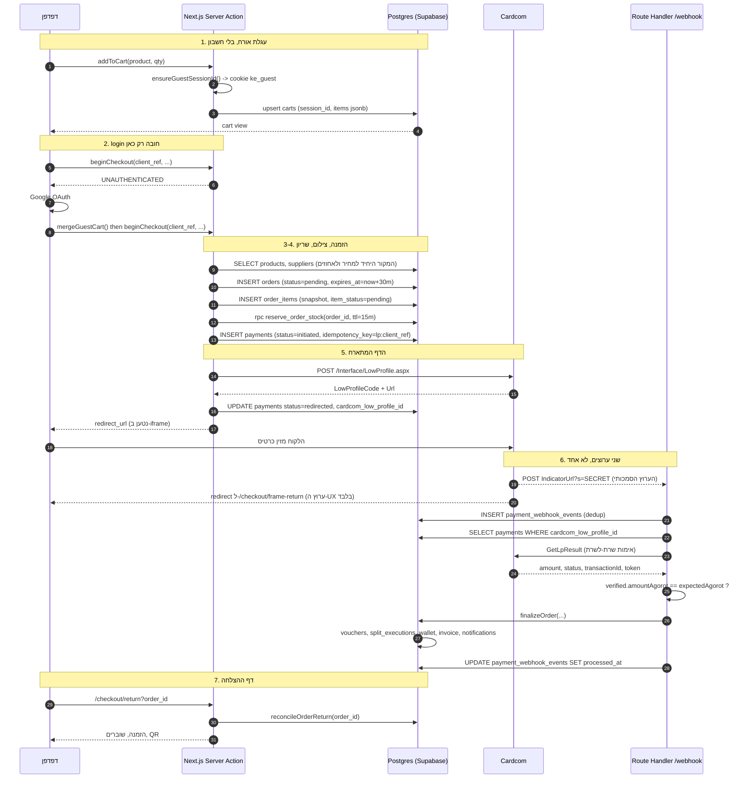

# ARCHITECTURE-CHECKOUT-CARDCOM-E2E.md

זרימת ה-checkout המלאה מקצה לקצה: עגלת אורח, התחברות ברגע התשלום, ‏Cardcom
Low Profile, ‏webhook, יצירת הזמנה ושובר, ודף ההצלחה עם ה-QR.

Status: **BINDING** · branch `docs/architecture-night` · 2026-08-19
Scope: **docs only.** אין קוד אפליקציה בשינוי הזה.
Supersedes: הסעיפים החופפים ב-`docs/ARCHITECTURE-CHECKOUT-CARDCOM.md`,
`docs/ARCHITECTURE-CART-CHECKOUT.md`, `CHECKOUT-ARCHITECTURE.md`,
`docs/CARDCOM-ARCHITECTURE.md`. במקום שיש סתירה, המסמך הזה גובר.
Companions: `ARCHITECTURE-ORDER-STATE-MACHINE.md`,
`ARCHITECTURE-REFUNDS-CANCELLATIONS.md`, `ARCHITECTURE-SECURITY-HARDENING.md`,
`ARCHITECTURE-OBSERVABILITY.md`.

---

## 0. המודל העסקי המחייב, בשורה אחת לכל טיפוס

| טיפוס | מה הלקוח משלם באתר | מה קורה אחרי התשלום | מי מקבל מה |
| --- | --- | --- | --- |
| **קופון** | `coupon_price_ils` בלבד, סכום **מוחלט** שהאדמין קבע בדף המוצר. אין ברירת מחדל ואין נוסחה. | מונפק שובר אחד ליחידה, עם קוד ו-QR חתום. היתרה (`face_value - coupon_price`) נגבית בבית העסק במעמד הסריקה. | **‏100% מהתשלום באתר נשאר בפלטפורמה** ברגע התשלום. אין Escrow, אין שחרור מאוחר, ואין שורת custody. הספק מקבל מזומן בעסק, לא מאיתנו. |
| **פיזי** | המחיר המלא אחרי הנחה. | הספק מקבל התראה לשלוח. | **פיצול מיידי** לפי `platform_percent` שצולם ל-`order_items`. ‏`commission = round_once(paid × percent / 100)`, ‏`supplier_due = paid - commission`. |

שלוש עובדות שאסור לשכוח אותן בשום מקום בזרימה:

1. **`platform_percent` הוא פר מוצר ודינמי.** אין ברירת מחדל בקוד, אין ב-env,
   אין ב-DB. מוצר בלי הזוג `platform_percent + supplier_split_percent = 100`
   **אינו ניתן למכירה**, ו-`beginCheckout` מחזיר `INTERNAL` עם שם המוצר.
2. **כסף = אגורות שלמות.** כל חישוב עובר דרך `src/lib/money.ts`. ‏Cardcom מקבל
   שקלים עם שתי ספרות, וההמרה קורית **רק** בגבול ה-HTTP
   (`CardcomProvider.ilsFromAgorot`). ‏float אינו נוגע בסכום באף שלב אחר.
3. **הצילום ב-`order_items` הוא immutable.** עריכת המוצר או הספק אחרי ההזמנה
   לא מזיזה שורה קיימת. שורה שנקנתה ב-70/30 ממשיכה לקרוא 70/30 אחרי שהמוצר עבר
   ל-85/15.

---

## 1. שבעת השלבים, ומה בדיוק קיים בקוד היום

| # | שלב | היכן זה חי | מצב |
| --- | --- | --- | --- |
| 1 | עגלת אורח, בלי התחברות | `src/lib/cart/guest-session.ts`, `carts.session_id` | קיים |
| 2 | התחברות חובה בלחיצה על "לתשלום" | `beginCheckout` מחזיר `UNAUTHENTICATED` | קיים |
| 3 | מיזוג עגלת אורח לעגלת משתמש | `src/server/actions/cart.ts` | קיים, ראה §3.3 |
| 4 | יצירת הזמנה + פריטים + שריון מלאי | `runBeginCheckout` שלבים 4, 4b | קיים |
| 5 | ‏Cardcom Low Profile ב-iframe | `CardcomProvider.createLowProfile` | קיים, legacy `.aspx` |
| 6 | ‏webhook ‏+ ‏GetLpResult ‏+ ‏finalize | `src/app/api/payments/cardcom/webhook/route.ts` | קיים |
| 7 | דף הצלחה עם QR | `src/app/(store)/checkout/return`, `src/lib/vouchers/qr-image.ts` | קיים |

---

## 2. תרשים רצף ראשי, המסלול המצליח



**הקריאה החשובה בתרשים:** החץ מ-Cardcom לדפדפן (ה-redirect) **אינו** מקור אמת.
הוא ערוץ UX. אם הוא מגיע לפני ה-webhook, דף ההצלחה קורא הזמנה שעדיין `pending`,
ולכן `reconcileOrderReturn` קיים. ראה §7.

---

## 3. שלבים 1 עד 3: עגלת אורח והתחברות ברגע התשלום

### 3.1 העגלה פתוחה לגמרי

`carts` מחזיקה `session_id uuid` ו-`profile_id uuid`, שתיהן nullable, ו-`items`
כ-jsonb. אורח מקבל cookie ‏`ke_guest` עם UUID (`ensureGuestSessionId`), והעגלה
נכתבת על `session_id`. אין דרישת התחברות, אין gate, ואין "התחבר כדי להוסיף לסל".

הצורה של הטוקן סובלת גם `{uuid}.{sig}` חתום וגם UUID חשוף, כי הפרוקסי חותם
ופעולות שרת לא תמיד. `parseGuestSessionToken` לוקח את החלק שלפני הנקודה ומאמת
שהוא UUID. **מה שזה אומר בפועל:** הטוקן אינו סוד ואינו הרשאה. הוא מפתח לעגלה
בלבד, ואין בעגלה שום דבר ששייך למשתמש מזוהה.

### 3.2 ההתחברות היחידה, וכמה מאוחר היא

`runBeginCheckout` פותח ב-`supabase.auth.getUser()` ומחזיר
`{ ok: false, code: 'UNAUTHENTICATED' }` אם אין משתמש. זה **הגייט היחיד**.
דפדוף, חיפוש, דף מוצר, הוספה לסל, עדכון כמות, קוד קופון: כולם פתוחים.

ספק הזהות הוא **Google OAuth**. הבחירה הזאת נגזרת מהמודל ולא מהנוחות: אין
סיסמאות לאחסן, אין מסלול "שכחתי סיסמה", והמייל מאומת על ידי הספק, מה שחשוב כי
השובר נשלח למייל.

### 3.3 המיזוג, והכלל שמונע אובדן עגלה

אחרי חזרה מ-OAuth, העגלה של האורח ממוזגת לעגלת המשתמש. הכלל:

1. אם למשתמש אין עגלה: העגלה של האורח מקבלת `profile_id` והופכת לשלו.
2. אם יש לו עגלה: הפריטים מאוחדים לפי `(product_id, variant_id)`, והכמות היא
   **המקסימום** של השתיים ולא הסכום.
3. ‏`session_id` מנוקה מהשורה הממוזגת, ו-cookie ה-guest נמחק.

**למה מקסימום ולא סכום.** סכום הופך "התחברתי פעמיים" לכפל כמות, וזה מזמין
חיוב על יחידה שהלקוח לא ביקש. מקסימום הוא היחיד שהוא idempotent על מיזוג חוזר.

### 3.4 מה קורה אם ההתחברות נכשלת באמצע

ההזמנה עוד לא נוצרה. אין מה לנקות. העגלה נשארת על `session_id`, ו-cookie
ה-guest חי עד `carts.expires_at`. הריפר (`101_cart_reaper.sql`) מוחק עגלות
שפג תוקפן.

---

## 4. שלב 4: יצירת ההזמנה, הצילום, והשריון

הסדר בקוד אינו שרירותי, ולכל צעד יש סיבה שמופיעה כהערה בקובץ:

```
1. auth gate
2. rate limit (10 ניסיונות לדקה למשתמש, check_rate_limit)
3. Zod על הקלט
4. getCart() בשרת + validateCartView()  <- העגלה נבנית בשרת, לא מהלקוח
5. בדיקת בעלות על address_id
6. idempotency replay לפי lp:{client_ref}
7. SELECT products + suppliers -> הצילום
8. ארנק: cap ליתרה וגם לחיוב באתר
9. הנחה: מחושבת מחדש מ-coupons ברגע הזה
10. calculateSettlement()
11. INSERT orders (pending, expires_at = now + 30m)
12. INSERT order_items (הצילום)
13. reserve_order_stock (TTL 15 דקות)
14. INSERT payments (initiated)
15. createLowProfile -> UPDATE payments (redirected)
```

### 4.1 שום מחיר לא מגיע מהלקוח

`beginCheckout` מקבל `client_ref`, `address_id`, `apply_wallet_ils`,
`save_card`, `token_id`, `channel` ופרטי מתנה. **הוא אינו מקבל סכומים.**
המחירים והאחוזים נקראים מ-`products` בתוך אותה קריאה. לקוח ששולח מחיר לא משנה
כלום, כי אין שדה שיקרא אותו.

### 4.2 מה בדיוק מצולם, ולמה זה מיותר בכוונה

`buildOrderItemSnapshot` כותב ל-`order_items`:

| שדה | מקור | למה |
| --- | --- | --- |
| `platform_percent` | `products.platform_percent` (או משלים מ-`supplier_split_percent`) | הכסף מחושב ממנו לנצח |
| `supplier_split_percent` | הזוג המשלים | ביקורת: שניהם חייבים להסתכם ב-100 |
| `discount_percent` | `products.discount_percent` | הסבר למחיר |
| `coupon_price_ils` | `products.coupon_price_ils` | **הסכום המוחלט** שנגבה באתר |
| `face_value_agorot` | `unit_price × qty` | ממנו נגזרת היתרה בעסק |
| `balance_due_agorot` | `face_value - paid_on_site` | מה שהלקוח ישלם בקופה |
| `paid_on_site_agorot` | תוצאת ה-settlement | מה שחויב בכרטיס |
| `commission_agorot` | `round_once(paid × pct/100)` | ההכנסה שלנו |
| `supplier_immediate_agorot` | `paid - commission` | פיזי בלבד, 0 בקופון |
| `supplier_name/phone/address/logo_url` | `suppliers` | ההזמנה ממשיכה לנקוב בעסק שממנו נקנתה גם אחרי שינוי שם |

**הכפילות עם `products` היא הנקודה.** טבלת הזמנות שקוראת מ-`products` בזמן
צפייה היא טבלה שמשנה את העבר בכל פעם שהאדמין עורך מוצר.

`buildOrderItemSnapshot` **אינו** כותב 100 קשיח בשורות קופון. זה היה בקוד וזה
תוקן: זה רשם כלל במקום עובדה, וכל הזמנת קופון בטבלה טענה שהפלטפורמה לקחה הכל
בלי קשר למה שהאדמין הגדיר. הרווח שנשאר בפלטפורמה על קופון הוא עדיין 100% מהתשלום
באתר, אבל `platform_percent` על השורה הוא מה שהוגדר, ומשמש לדיווח.

### 4.3 שריון המלאי, ולמה דווקא שם

`reserve_order_stock` נקרא **אחרי** ש-`order_items` קיימות (ה-RPC קורא אותן)
ו**לפני** שנוצרת שורת תשלום כלשהי.

עד מיגרציה 117 הבדיקה היחידה הייתה ב"הוסף לסל", שנכונה לרגע שהיא רצה ולא אומרת
דבר על הדקות שהקונה מבלה על דף התשלום. שני אנשים יכלו להגיע לדף עם היחידה
האחרונה, ושניהם היו מחויבים.

הכללים:

- ‏**‏all-or-nothing.** שורה חסרה אחת ולא נשרין דבר, וה-RPC חוזר עם רשימת
  ה-shortfalls לפני שהכניס משהו.
- **‏TTL של 15 דקות**, קצר מ-30 הדקות של `orders.expires_at` בכוונה. שריון
  ששורד את ההזמנה חוסם מלאי בלי סיבה.
- **כישלון של ה-RPC אינו "יש מלאי".** מערכת שריון שנכשלת פתוח היא מערכת שלא
  עושה כלום ביום שהיא נדרשת. השגיאה מבטלת את ההזמנה ומחזירה `INTERNAL`.
- מחסור מבטל את ההזמנה (`cancelled`) במקום להשאיר `pending`. הזמנה תלויה שאי
  אפשר לשלם עליה תשב עד הריפר, והניסיון הבא של הקונה ייצור שנייה.

---

## 5. שלב 5: ‏Cardcom Low Profile

### 5.1 עובדות על האינטגרציה, כפי שהיא בקוד

| עובדה | פירוט |
| --- | --- |
| API | **legacy `/Interface/*.aspx`**, לא v11 JSON. החלטה מ-23.07. |
| יצירת דף | `POST /Interface/LowProfile.aspx` |
| חיוב טוקן | `POST /Interface/ChargeToken.aspx` |
| זיכוי | `POST /Interface/RefundDeal.aspx` עם `ApiPassword` |
| דוח יומי | `POST /Interface/ListTransactions.aspx` |
| חתימת webhook | **אין.** ‏Cardcom אינו חותם. ראה §6.1. |
| סכומים | שקלים עם 2 ספרות בחוט, אגורות אצלנו |
| ‏`ReturnValue` | ‏`payment.id` שלנו, חוזר בקולבק |
| ‏`Operation` | `ChargeAndCreateToken` אם `save_card`, אחרת `ChargeOnly` |
| ‏Codepage | `65001` (UTF-8), חובה לעברית |

### 5.2 ריבוי טרמינלים, וכלל ה-all-or-nothing

`payments.cardcom_account_id` רושם על איזה טרמינל נוצר הדף.
**‏Low Profile id נפתר רק על הטרמינל שיצר אותו**, ולכן כל `GetLpResult` וכל
זיכוי חייבים לפתור את הספק מהשורה השמורה ולא מברירת מחדל.

`selectAccountForSuppliers` בוחר חשבון מהספקים שבהזמנה, והכלל הוא all-or-nothing:
**סל מעורב נסלק על טרמינל הפלטפורמה** ולא מתפצל לשניים. פיצול לשני טרמינלים
פירושו שני חיובים שהלקוח יכול להצליח בחצי מהם.

### 5.3 ה-iframe, ומלכודת ה-cookie שהוא יוצר

הדף המתארח נטען ב-iframe בתוך ה-checkout שלנו, לא בניווט. הכתובת שאליה Cardcom
מחזיר היא **stub** ולא הדף האמיתי:

```
successRedirectUrl = {appUrl}/checkout/frame-return?order_id={id}
failedRedirectUrl  = {appUrl}/checkout/frame-return?order_id={id}&status=failed
```

**למה stub.** הניווט של Cardcom לתוך ה-iframe שלנו הוא cross-site, ו-cookie
הסשן שלנו הוא `SameSite=Lax`, כלומר הדפדפן **לא שולח אותו**. דף שדורש סשן
היה מקבל משתמש מנותק אחרי תשלום מוצלח. ה-stub לא צריך סשן; הוא מזיז את
החלון העליון לדף האמיתי, ושם ה-cookie נשלח.

באפליקציה אין iframe ואין את הבעיה. שם `channel === 'app'` וה-redirect הוא
deep-link חזרה לנייטיב (`appReturnUrl`). אותה קריאת ספק, מגרש נחיתה אחר.

---

## 6. שלב 6: ה-webhook. הלב של הזרימה

### 6.1 אין חתימה. על מה נשענת האותנטיות

Cardcom **אינו חותם** קולבקים. אין HMAC ואין header לאמת. לכן:

1. **סוד לא ניתן לניחוש ב-URL** (`?s=`), שנקבע בזמן יצירת ה-Low Profile.
   ההשוואה היא `secretEquals` בזמן קבוע, ו-`anySecretMatches` בודק את **כל**
   הסודות המקובלים בלי short-circuit, כדי שזמן התגובה לא יסגיר איזה סוד הוצג.
2. **אימות שרת-לשרת חובה** דרך `GetLpResult`. **התשובה שחוזרת משם היא המקור
   היחיד המהימן** לסכום, לסטטוס ולטוקן. גוף ה-POST אינו נאמן על כלום, לעולם.

חלון שני סודות (`CARDCOM_WEBHOOK_SECRET` + הסוד הפורש) קיים כדי שרוטציה לא
תפיל תשלומים. קולבק שנפרס כ-Cardcom תקין אך לא תואם אף סוד מקובל מפעיל
`capturePaymentAlarm`, כי זו תקלת קונפיגורציה שבלי התראה היא בלתי נראית לגמרי:
הנקודה מחזירה 200, ‏Cardcom מרוצה, וכל הזמנה משולמת נשארת פתוחה בשקט.

### 6.2 סדר הפעולות, ולמה כל אחת בדיוק שם

```
1. קריאת גוף גולמי + פענוח JSON סובלני
2. INSERT payment_webhook_events   <-- ראשון. לפני כל החלטה.
3. אם 23505 (unique) -> replay -> 200 no-op
4. אם INSERT נכשל מסיבה אחרת -> 503   <-- לא 200
5. אם הסוד לא תואם -> 200 + alarm (אם נפרס)
6. SELECT payments לפי cardcom_low_profile_id
7. אם אין payment -> alarm + 200
8. אם Cardcom אומר כישלון -> payments.failed -> 200
9. GetLpResult                        <-- האמת היחידה
10. השוואת סכום: verified == expected ?
11. UPDATE payment_webhook_events: verified_against_api = true
12. finalizeOrder(...)
13. UPDATE payment_webhook_events: processed_at = now()
```

**‏(2) לפני הכל.** אין החלטה שקודמת לרישום. אירוע שלא נרשם הוא אירוע שאי אפשר
לשחזר.

**‏(4) הוא 503 ולא 200, וזה תיקון של באג אמיתי.** בעבר כל כישלון INSERT ענה
`{ok:true, replay:true}` עם 200, מה שאומר ל-Cardcom שהקולבק התקבל ומפסיק
ריטרייז. ‏connection reset, מדיניות שהשתנתה, דיסק מלא: כולם ענו "קיבלתי".
הכרטיס מחויב, ‏`GetLpResult` לעולם לא נקרא, ההזמנה נשארת פתוחה, והשורה
ש-`webhook-dlq.ts` היה משחזר מעולם לא נכתבה. **5xx כאן הוא כל מנגנון ההתאוששות**,
כי הוא גורם ל-Cardcom לנסות שוב.

**‏(13) אחרי finalize ולא לפניו.** `processed_at` נשאר null עד שההזמנה באמת
נסגרת. הוא נחתם פעם אחת שורה אחת לפני `finalizeOrder`, כלומר האירוע שהכי צריך
שחזור (חויב, אומת, ההזמנה עדיין פתוחה) היה זה שסומן כמטופל. ה-dead letters היו
בלתי נראים בהגדרה.

### 6.3 מפתח ה-dedup

```
external_event_id = `${lowprofilecode}:${InternalDealNumber ?? 'na'}`
```

עם `UNIQUE (provider, external_event_id)`. שגיאת 23505 היא ה-dedup עובד, ותשובתה
היא 200. כל קוד שגיאה אחר הוא לא replay.

### 6.4 בדיקת הסכום, והקו האדום

```
expectedAgorot = readAmountAgorot(money, payment)
if (verified.amountAgorot !== expectedAgorot) -> audit_log + alarm + 200, בלי finalize
```

**‏Cardcom חייב את הסכום שביקשנו, או שההזמנה לא נסגרת.** אין סובלנות, אין
עיגול, אין epsilon. אי-התאמה נרשמת ל-`audit_log` עם `alarm: 'cardcom_amount_mismatch'`
ומעירה אדם. ההזמנה נשארת `pending` ותטופל ידנית או תבוטל.

### 6.5 עמודות כסף שנפתרות במקום להיקרא בשם

`resolvePaymentMoneySchema` ו-`moneyColumnProbe` בודקים איזו עמודה קיימת לפני
שכותבים אליה. זה לא עודף הנדסי; זה תיקון לתקלה שקרתה: הפרויקט המתארח הוא
pre-059 ויש בו `amount_ils`, ושאילתה שנקבה ב-`amount_agorot` החזירה 42703,
שמפילה את כל ה-SELECT. התוצאה הייתה `payment === null` והנקודה ענתה
`{ok:true, unknown_payment:true}` עם 200 ללקוח ש-Cardcom בדיוק חייב.

**זהו חוב טכני עם תאריך תפוגה.** ‏`PENDING-money-integer-fix.sql` הוא מה שמסיים
אותו. עד שהוא מורץ, הפתרון בזמן ריצה הוא ההגנה.

---

## 7. שלב 7: החזרה, דף ההצלחה, וה-QR

### 7.1 מרוץ שאין דרך למנוע

ה-redirect לדפדפן וה-webhook נשלחים על ידי Cardcom בנפרד. אין הבטחת סדר. שלושת
המצבים בכניסה ל-`/checkout/return`:

| מצב | מה הלקוח רואה | מה קורה |
| --- | --- | --- |
| ‏webhook הגיע ראשון | הזמנה `paid`, שוברים, QR | הדרך הרגילה |
| ‏redirect ראשון | "מאשרים את התשלום" | `reconcileOrderReturn` + polling |
| ‏webhook לא הגיע כלל | אותו מסך המתנה, ואז הודעה עם מספר הזמנה | ה-DLQ תופס תוך דקות |

`reconcileOrderReturn(orderId)` קורא ל-Cardcom **בעצמו** (אותו `GetLpResult`,
אותו טרמינל מ-`payments.cardcom_account_id`) ומריץ את אותו `finalizeOrder`.
הוא לא מדמה תשלום ולא סומך על ה-query string; הוא שואל את Cardcom.

**כלל מחייב:** דף ההצלחה **לעולם אינו** מקור לשינוי סטטוס על סמך פרמטרים ב-URL.
`?status=success` הוא רמז ל-UI. `GetLpResult` הוא העובדה.

### 7.2 מה `finalizeOrder` עושה, לפי הסדר

```
1. SELECT order + items + FOR UPDATE semantics
2. אם status כבר paid -> { ok:true, replay:true }   <-- idempotent
3. לכל שורת קופון: issueVouchersForItem()
   - חובה coupon_expiry_days על המוצר, אחרת זריקה מכוונת
   - שובר אחד ליחידה, cap על quantity, מפתח order_item_id
   - vouchers UNIQUE(code) + ה-cap הופכים replay ל-no-op
   - חתימת QR: signVoucherQrPayload()
4. שורות קופון -> settlement_status='split_executed', item_status='issued'
5. שורות פיזיות -> settlement_status='split_executed'
6. INSERT split_executions (רישום הפיצול)
7. rpc consume_order_stock (הפיכת השריון לצריכה)
8. אם save_card: INSERT payment_tokens
9. UPDATE orders SET status='paid', paid_at=now()
10. INSERT audit_log
11. UPDATE carts SET items='[]' (ריקון העגלה)
12. ארנק: fn_wallet_transfer (קאשבק)
13. חשבונית: enqueueOrderInvoice + issueQueuedInvoice
14. התראות: fn_enqueue_notification
15. מיילים: sendVoucherEmail, sendOrderGifts
16. אנליטיקס: sendServerPurchase
```

**סירוב מכוון בשלב 3.** מוצר קופון בלי `coupon_expiry_days` גורם לזריקה.
נפילה חזרה ל-90 יום ממציאה הבטחה צרכנית שאיש לא נתן, ובפקיעה היא מחליטה מתי
אנחנו חייבים ללקוח את כספו. הסירוב רועש ובר-תיקון: התשלום עומד, ‏finalize
ינסה שוב, ואדמין ממלא את השדה.

**שלבים 12 עד 16 בולעים שגיאות משלהם.** אף אחד מהם לא מפיל את סגירת ההזמנה.
מייל שלא נשלח הוא תקלה; הזמנה שלא נסגרה כי מייל נכשל היא אסון.

### 7.3 ה-QR: מה הוא כן ומה הוא לא

```
KEV1.<base64url(payload)>.<base64url(HMAC-SHA256)>
payload = { v:1, c:code, s:supplier_id, u:user_id, e:expiry_unix, k:key_id }
```

ה-MAC מכסה את `KEV1.<payload>` **כולל תחילית הגרסה**, כדי שלא יהיה אפשר להחליף
את בית הגרסה בלי לשבור את החתימה. ‏`k` הוא מזהה מפתח, ל-rotation
(`VOUCHER_QR_SECRET` + `VOUCHER_QR_SECRET_PREVIOUS`).

**ה-payload מוכיח שה-QR נטבע על ידי הפלטפורמה. הוא אינו טוקן הרשאה.**
שימוש-יחיד מוכרע ב-DB בלבד, ‏`redeem_voucher()`, ולעולם לא על ידי החזקה
ב-payload תקין. צילום מסך של QR חוקי הוא עדיין רק מחרוזת חוקית; אחרי הסריקה
הראשונה ה-DB עונה `already_redeemed`.

**‏`VOUCHER_QR_SECRET` חסר = סירוב לחתום ולאמת** (`VoucherQrSecretMissingError`).
בלי הסוד אין שוברים, וזה מכוון: מערכת ששולחת QR לא חתום שולחת נייר.

---

## 8. ‏Idempotency, שכבה אחר שכבה

| שכבה | המפתח | מה קורה בהרצה שנייה |
| --- | --- | --- |
| ‏`beginCheckout` | `payments.idempotency_key = lp:{client_ref}` | `initiated`/`redirected` -> אותו `redirect_url`; `succeeded` -> `{kind:'paid'}`; אחרת `IDEMPOTENT_REPLAY` |
| ‏webhook | `UNIQUE(provider, external_event_id)` | 23505 -> 200 no-op |
| ‏`finalizeOrder` | `orders.status = 'paid'` | `{ok:true, replay:true}`, בלי תופעות לוואי |
| הנפקת שובר | `cap` על quantity + `vouchers UNIQUE(code)` | לא מונפק שובר שני לאותה יחידה |
| מימוש | `voucher_redemptions.idempotency_key` | סריקה כפולה = אותה תוצאה |
| ארנק | `fn_wallet_transfer` עם מפתח | אין זיכוי כפול |
| חשבונית | `orders.invoice_number` לא null | לא מונפקת שנייה |

`client_ref` נוצר בלקוח פעם אחת לכל ניסיון checkout ונשמר עד שהניסיון מסתיים.
רענון דף אינו מייצר חדש. **‏"נסה שוב" אחרי כישלון כן מייצר חדש**, אחרת הניסיון
השני יחזור לתשלום שנכשל.

---

## 9. ‏Retry: מי מנסה שוב, מתי, וכמה

| רכיב | מדיניות | מקור |
| --- | --- | --- |
| ‏Cardcom -> webhook | ריטרייז של Cardcom כל עוד לא ענינו 2xx | חיצוני. **‏5xx הוא הבקשה לנסות שוב.** |
| ‏DLQ | ‏`payment_webhook_events` עם `processed_at IS NULL` ו-`verified_against_api = true` | `src/server/payments/webhook-dlq.ts`, ‏cron |
| ‏`reconcileOrderReturn` | על כל טעינה של דף החזרה | הלקוח מפעיל |
| ‏`createLowProfile` | **אין ריטרייז אוטומטי** | ראה למטה |
| ‏`chargeWithToken` | **אין ריטרייז אוטומטי** | ראה למטה |
| התאמה יומית | `ListTransactions` מול `payments` | `terminal-reconciliation` |

**למה אין ריטרייז אוטומטי על קריאות מחייבות.** ‏HTTP timeout מול Cardcom אינו
אומר שהחיוב לא קרה. הוא אומר שלא שמענו. ניסיון שני על אותו טוקן הוא חיוב שני
אפשרי. ההתאוששות עוברת דרך שאילתה (`GetLpResult`, ‏`ListTransactions`) ולא דרך
פעולה חוזרת. **‏שאילתות בטוח לנסות שוב, חיובים לא.**

---

## 10. ‏Failure modes, בטבלה אחת

| # | תקלה | מי מזהה | תוצאה ללקוח | תוצאה למערכת | חומרה |
| --- | --- | --- | --- | --- | --- |
| F1 | `checkoutEnabled=false` | `beginCheckout` | "התשלום מושבת כרגע" | אין הזמנה | נמוכה |
| F2 | לא מחובר | `beginCheckout` | מסך התחברות | אין הזמנה | תקין |
| F3 | rate limit | `check_rate_limit` | "יותר מדי ניסיונות" | אין הזמנה | נמוכה |
| F4 | מוצר בלי זוג אחוזים | `completeSplitPair` | "לא הוגדר פיצול עמלה: {שם}" | **חוסם מכירה** | גבוהה, פגם נתונים |
| F5 | קופון בלי `coupon_price_ils` | `beginCheckout` | "לא הוגדר מחיר קופון" | חוסם מכירה | גבוהה |
| F6 | קופון בלי `coupon_expiry_days` | `finalizeOrder` | **התשלום עבר**, השובר מתעכב | ההזמנה `pending`, ‏DLQ | **קריטית** |
| F7 | מלאי אזל בין הסל לתשלום | `reserve_order_stock` | "אחד הפריטים אזל" | ההזמנה `cancelled` | תקין |
| F8 | ‏`reserve_order_stock` נכשל | ה-RPC | "לא הצלחנו לשריין" | ההזמנה `cancelled` | בינונית |
| F9 | ‏`createLowProfile` נכשל | try/catch | "שגיאה בחיבור לספק הסליקה" | `payments.failed`, שריון פג ב-15 דק' | גבוהה אם חוזר |
| F10 | הלקוח נטש את דף Cardcom | הריפר | ההזמנה נעלמת מהחשבון | `expires_at` עובר, שריון משוחרר | תקין |
| F11 | כרטיס נדחה | ה-webhook | חזרה עם שגיאת Cardcom | `payments.failed` | תקין |
| F12 | webhook בלי סוד תואם, נפרס | `anySecretMatches` | **כלום. הכי מסוכן.** | alarm + 200 | **קריטית** |
| F13 | webhook על תשלום שלא קיים | `payment === null` | כלום | `alarm unknown_payment` | **קריטית** |
| F14 | ‏GetLpResult סותר את הקולבק | `verified.success` | ההזמנה תקועה | alarm + 200 | **קריטית** |
| F15 | אי-התאמת סכום | השוואת agorot | ההזמנה תקועה | `audit_log` + alarm | **קריטית** |
| F16 | ‏`finalizeOrder` נכשל אחרי חיוב | `result.ok === false` | "מאשרים את התשלום" | 5xx, ‏`processed_at` null, ‏DLQ | **הגרועה במערכת** |
| F17 | ‏42703 על עמודת כסף | הפותרים | היה: הזמנה נכשלת בשקט | היום: נפתר בזמן ריצה | היסטורית |
| F18 | ‏`VOUCHER_QR_SECRET` חסר | `primarySecret()` | אין שובר | זריקה, ‏DLQ | **קריטית** |
| F19 | מייל שובר נכשל | `sendVoucherEmail` | השובר בחשבון, בלי מייל | לוג בלבד | נמוכה |
| F20 | חשבונית נכשלת | `issueQueuedInvoice` | אין מסמך | `invoices` לא-מונפק, תור | בינונית |
| F21 | קאשבק נכשל | `fn_wallet_transfer` | אין נקודות | לוג | בינונית |
| F22 | ‏redirect לפני webhook | `reconcileOrderReturn` | מסך המתנה קצר | נפתר לבד | תקין |
| F23 | ‏iframe חסום | הלקוח | דף ריק | **אין fallback היום** | ראה §12 |
| F24 | חיוב כפול מהטרמינל | ההתאמה היומית | חיוב פעמיים | `ListTransactions` מול `payments` | **קריטית**, ידני |

`capturePaymentAlarm` על **כל** מה שמסומן קריטי. ‏F16 מתריע ללא תנאי.

---

## 11. טיוטת SQL: `payment_events`

```
migrations/pending/120_payment_events.sql
```

הקובץ נכתב בהרצה הזאת ו**לא הורץ**. הוא יוצר יומן append-only לכל אירוע על
מסלול הכסף. הנימוק המלא, כולל למה הוא לא מחליף את `payment_webhook_events`,
נמצא בראש הקובץ. תמצית:

- ‏`payment_webhook_events` עונה על "מה Cardcom אמר". ‏`payment_events` עונה על
  "מה **אנחנו** עשינו ולמה". ‏`GetLpResult` שלא תואם קולבק הוא אירוע שלנו ואין
  לו קולבק לתלות בו.
- ‏append-only נאכף בטריגר שחוסם UPDATE ו-DELETE, לא במוסכמה.
- ללא FK ל-`payments`, כי אירוע על תשלום שאין לו שורה (F13) הוא בדיוק האירוע
  שהכי צריך רישום.
- הכסף באגורות, `bigint`, לפי חוק הפרויקט.

---

## 12. מה חסר, ומה נדרש לפני עלייה לאוויר

### 12.1 חוסמים

1. **‏8 סודות ב-Vercel.** `CARDCOM_TERMINAL_NUMBER`, `CARDCOM_API_NAME`,
   `CARDCOM_API_PASSWORD`, `CARDCOM_WEBHOOK_SECRET`, `VOUCHER_QR_SECRET`,
   `CRON_SECRET`, `RESEND_API_KEY`, `SENTRY_AUTH_TOKEN`. בלעדיהם אין תשלום,
   אין קופונים, אין מיילים, ואף cron לא רץ.
2. **שמות השדות של legacy `RefundDeal.aspx` לא אומתו** מול טרמינל חי. יש
   `TODO(cardcom)` בקוד. זיכוי שנכשל אינו זיכוי שקרה בשקט (בדיקת `ResponseCode`),
   אבל הוא כן אומר שאין לנו מסלול החזר עד שזה מאומת.
3. **‏`CreateDocument` באותו מצב.** מסמך נכשל משאיר `invoices` לא-מונפק עם
   הסיבה, ו-`orders.invoice_number` לא נכתב. תור נראה, לא חשבונית שקרית.
4. **‏`ListTransactions` מפוענח לפי תחילית**, לא לפי סכמה מתועדת. טרמינל שעונה
   בצורה שהפרסר לא מזהה מייצר רשימה **ריקה**, וההתאמה תאמר "הכל שלנו חסר
   מרחוק", שהוא הדלי בחומרה נמוכה בכוונה.

### 12.2 פערים ידועים

| פער | מצב | מסמך |
| --- | --- | --- |
| ‏`coupons.used_count` לא מתקדם | `max_uses` נאכף כקריאה של מונה שאף חלק בזרימה לא מקדם | פתוח |
| ‏iframe חסום, אין fallback | F23 | פתוח |
| חיוב כפול מטרמינל | זיהוי יומי בלבד, טיפול ידני | §13 |
| ‏`payment_events` | טיוטה בלבד | §11 |
| מיזוג עגלה: אין טסט לכפל מיזוג | §3.3 | פתוח |

### 12.3 ‏Definition of done לזרימה הזאת

- [ ] כל 8 הסודות ב-Vercel production
- [ ] רכישת קופון אמיתית מקצה לקצה על טרמינל חי, כולל סריקה
- [ ] `RefundDeal.aspx` מאומת מול טרמינל חי
- [ ] `CreateDocument` מאומת
- [ ] webhook עונה 5xx על כשל DB, מאומת בטסט
- [ ] ‏DLQ רץ ב-cron ומאמת שחזור
- [ ] התאמה יומית רצה ומדווחת
- [ ] ‏Sentry מקבל את כל 8 ה-`capturePaymentAlarm`
- [ ] רוטציה של `VOUCHER_QR_SECRET` מתועדת ומתורגלת

---

## 13. נספח: החלטות שלא ישתנו בלי מסמך שגובר על זה

1. **גוף ה-webhook לעולם אינו מקור אמת.** רק `GetLpResult`.
2. **‏5xx על כשל רישום.** לא 200.
3. **‏`processed_at` נחתם אחרי `finalizeOrder`.** לא לפניו.
4. **חיובים לא מנוסים שוב אוטומטית.** שאילתות כן.
5. **אין ברירת מחדל לאחוז, למחיר קופון או לתוקף.** שדה ריק = שגיאת ולידציה.
6. **הסל נבנה בשרת.** ‏`getCart()` בתוך `beginCheckout`, לא מהלקוח.
7. **ההנחה מחושבת מחדש ברגע החיוב**, לא מתקבלת מהסל שרונדר.
8. **סל מעורב נסלק על טרמינל אחד.**
9. **קופון: ‏100% מהתשלום באתר נשאר בפלטפורמה, ואין Escrow.**
10. **‏QR הוא הוכחת מקור, לא הרשאה.** שימוש-יחיד מוכרע ב-DB.
