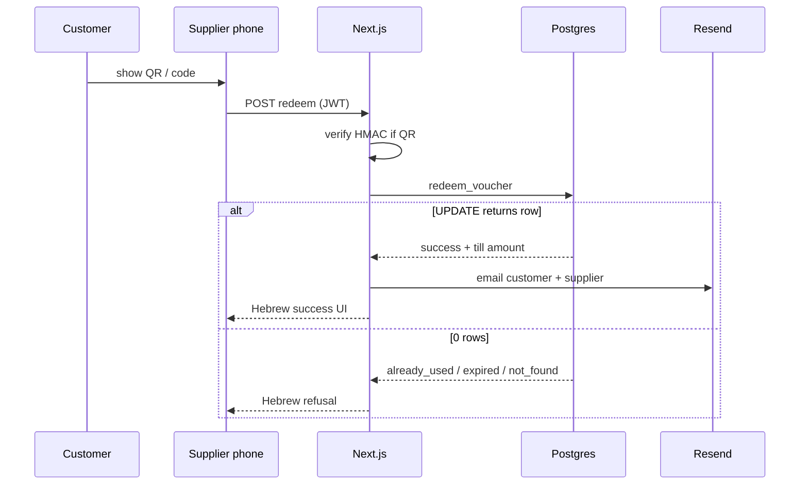

# ARCHITECTURE-COUPON-REDEMPTION.md

KenyonExpress **supplier coupon / voucher redemption** architecture (binding scan spec).

Status: BINDING · worktree `/Users/ofir/kenyonexpress-web/ke-arch-redemption` · branch `arch/coupon-redemption` (2026-07-30)
Scope: **docs only.** No application code applied in this change.
Companions: `docs/ARCHITECTURE-CART-CHECKOUT.md`, `docs/ARCHITECTURE-SECURITY.md`, `docs/ARCHITECTURE-NOTIFICATIONS.md`, `ARCHITECTURE-VOUCHER-REDEMPTION.md` (live code companion).

Stack: Next.js (`/supplier/scan`, `/redeem/[token]`, `POST /api/supplier/vouchers/redeem`), Supabase RPC `redeem_voucher` (SECURITY DEFINER), HMAC QR (`KEV1`), Resend email, integer **agorot**.

**Terminal status (binding):** `issued` → `used` (atomic UPDATE).  
Live drift note: some environments still store `redeemed` as the used terminal. Migration must map `redeemed` → `used` (or treat both as used in readers). New writes use **`used` only**.

---

## 0. Business model

| Fact | Rule |
|---|---|
| Online | Customer already paid full `coupon_price` on site |
| At scan | Customer pays remainder `face − coupon_price` **at the till** to the supplier |
| Platform | Keeps prepaid share via snapshotted `platform_percent`. **No Escrow.** |
| Single-use | Decided only by conditional SQL UPDATE, never by QR possession alone |
| Wrong shop | Collapses to `not_found` for the client (anti-enumeration) |

Money: integer agorot. UI formats ₪ via `he-IL`.

---

## 1. End-to-end flow

```
Checkout finalize (paid)
  → mint voucher(s): status=issued, code, qr_payload (HMAC), money snapshots
  → Resend: customer "הקופון מוכן" (+ account deep link)
  → customer shows QR / code at business

Supplier /supplier/scan (mobile-first)
  → camera decode QR OR manual code
  → verify HMAC client-optional; server always verifies if qr_payload sent
  → POST /api/supplier/vouchers/redeem (user JWT)
  → redeem_voucher RPC:
        UPDATE vouchers SET status='used' WHERE status='issued' AND ... RETURNING *
  → audit row in voucher_redemptions (+ audit_log)
  → Resend: customer "מומש" + supplier confirmation
```



---

## 2. QR at purchase (issue)

### 2.1 Artifacts on `vouchers`

| Column | Purpose |
|---|---|
| `code` | Manual entry, unique, normalized A-Z0-9 |
| `qr_payload` | `KEV1.<body>.<HMAC>` |
| `qr_key_id` | Rotation |
| `status` | starts `issued` |
| `expires_at` | calendar expiry |
| `face_value_agorot` / `coupon_price_agorot` / `remaining_amount_due_agorot` | snapshots |
| `supplier_id` / `user_id` / `order_item_id` | ownership |

CHECK: `face = coupon_price + remaining_amount_due`.

### 2.2 Sign / verify (TypeScript)

```typescript
// src/server/domain/vouchers/qr.ts
import { createHmac, timingSafeEqual } from 'node:crypto'
import { normalizeVoucherCode, isValidVoucherCode } from './code'

const VERSION_PREFIX = 'KEV1'

export type VoucherQrPayload = {
  v: 1
  c: string // code
  s: string // supplier_id (informational only; never authorize from this)
  u: string // customer user_id
  e: number // expiry unix seconds
  k: string // key id
}

function primarySecret(): string {
  const secret = process.env.VOUCHER_QR_SECRET
  if (!secret || secret.length < 16) {
    throw new Error('VOUCHER_QR_SECRET missing')
  }
  return secret
}

function sign(input: string, secret: string): string {
  return createHmac('sha256', secret).update(input).digest('base64url')
}

export function signVoucherQrPayload(
  payload: Omit<VoucherQrPayload, 'v'> & { v?: 1 },
): string {
  const full: VoucherQrPayload = { ...payload, v: 1 }
  const body = Buffer.from(JSON.stringify(full)).toString('base64url')
  const signingInput = `${VERSION_PREFIX}.${body}`
  return `${signingInput}.${sign(signingInput, primarySecret())}`
}

export function verifyVoucherQrPayload(token: string): VoucherQrPayload | null {
  if (typeof token !== 'string') return null
  const parts = token.split('.')
  if (parts.length !== 3 || parts[0] !== VERSION_PREFIX) return null
  const signingInput = `${parts[0]}.${parts[1]}`
  const secrets = [primarySecret(), process.env.VOUCHER_QR_SECRET_PREVIOUS].filter(
    (s): s is string => Boolean(s && s.length >= 16),
  )
  for (const secret of secrets) {
    const expected = Buffer.from(sign(signingInput, secret))
    const actual = Buffer.from(parts[2])
    if (expected.length === actual.length && timingSafeEqual(expected, actual)) {
      try {
        const json = JSON.parse(Buffer.from(parts[1], 'base64url').toString('utf8'))
        if (json?.v !== 1 || !isValidVoucherCode(normalizeVoucherCode(json.c))) return null
        return {
          v: 1,
          c: normalizeVoucherCode(json.c),
          s: String(json.s),
          u: String(json.u),
          e: Number(json.e),
          k: String(json.k),
        }
      } catch {
        return null
      }
    }
  }
  return null
}
```

```typescript
// src/server/domain/vouchers/code.ts
export function normalizeVoucherCode(raw: string): string {
  return raw.toUpperCase().replace(/[^0-9A-Z]/g, '')
}

export function isValidVoucherCode(code: string): boolean {
  return /^[0-9A-Z]{8,12}$/.test(code)
}
```

### 2.3 Issue on payment settle

```typescript
// src/server/payments/issue-vouchers.ts (excerpt)
import { signVoucherQrPayload } from '@/server/domain/vouchers/qr'
import { createAdminClient } from '@/lib/supabase/admin'
import { randomVoucherCode } from '@/server/domain/vouchers/code-gen'

export async function issueVouchersForPaidOrder(orderId: string): Promise<void> {
  const admin = createAdminClient()
  // load paid coupon lines + snapshots (service role, after webhook verified)
  // for each unit:
  const code = await randomVoucherCode()
  const expiresAt = /* from product.coupon_expiry_days */
  const qr = signVoucherQrPayload({
    c: code,
    s: supplierId,
    u: userId,
    e: Math.floor(new Date(expiresAt).getTime() / 1000),
    k: process.env.VOUCHER_QR_KEY_ID ?? 'k1',
  })
  await admin.from('vouchers').insert({
    code,
    qr_payload: qr,
    qr_key_id: process.env.VOUCHER_QR_KEY_ID ?? 'k1',
    status: 'issued',
    // ... money + FKs
  })
}
```

Customer account renders QR from `qr_payload` (see Account architecture).

---

## 3. Validations (binding order)

Before / inside RPC:

| # | Check | Outcome if fail |
|---|---|---|
| 1 | Authenticated + active `supplier_members` | `unauthorized` |
| 2 | HMAC OK when `qr_payload` provided | `not_found` (log `invalid_signature`) |
| 3 | Code exists | `not_found` |
| 4 | Caller membership includes `voucher.supplier_id` | `not_found` (internal `wrong_supplier`) |
| 5 | `status = 'issued'` | else `already_used` / `expired` / `refunded` |
| 6 | `expires_at > now()` | `expired` |
| 7 | Rate limit 30/min/user | `rate_limited` |
| 8 | Idempotency key replay | return prior outcome |

**Never** authorize from `supplier_id` inside the QR payload.

---

## 4. Atomic `issued` → `used`

### 4.1 Compare-and-set (the only writer)

```sql
UPDATE public.vouchers v
SET
  status = 'used',
  used_at = now(),                 -- or redeemed_at alias column
  redeemed_by_supplier_id = v.supplier_id,
  redeemed_by_user_id = auth.uid(),
  redeemed_amount_collected_agorot = v.remaining_amount_due_agorot
WHERE v.code = v_code
  AND v.status = 'issued'
  AND v.expires_at > now()
  AND v.supplier_id IN (
    SELECT supplier_id FROM public.supplier_members
    WHERE user_id = auth.uid() AND is_active
  )
RETURNING v.*;
```

- Winner: `FOUND` → success audit + notifications.
- Loser (concurrent second scan): 0 rows → diagnose probe row → `already_used`.
- Row lock on UPDATE serializes the race; UNIQUE success on `voucher_redemptions(voucher_id) WHERE outcome='success'` is the belt.

### 4.2 Race matrix

| Scenario | Result |
|---|---|
| Two tills, same code, same ms | One `used`, one `already_used` |
| Double-tap same phone | Same `idempotency_key` → replay success without second mutate |
| Offline queue flush twice | Same key → replay |
| Wrong supplier concurrent | Both get `not_found` externally |

---

## 5. Full SQL: `redeem_voucher` (binding draft)

> <!-- v1-final-banner:2026-09-01 -->
> ⚠️ **This draft was never applied, and production went the other way.**
> The live `voucher_status` is
> `issued, redeemed, expired, cancelled, refunded`. It keeps **`redeemed`**,
> which this draft proposed renaming to `used`, and it carries **`cancelled`**,
> which this draft omits entirely. Migration `087` is not in production's
> ledger. Do not use the enum below as a reference for what a voucher row can
> hold; use `docs/PAYMENT-FLOW.md` §6.

```sql
-- 087_redeem_voucher_issued_used.sql (idempotent draft, NEVER APPLIED)

DO $$ BEGIN
  CREATE TYPE public.voucher_status AS ENUM ('issued', 'used', 'expired', 'refunded');
EXCEPTION WHEN duplicate_object THEN NULL; END $$;

-- Map legacy redeemed → used if present
DO $$ BEGIN
  IF EXISTS (
    SELECT 1 FROM pg_enum e
    JOIN pg_type t ON t.oid = e.enumtypid
    WHERE t.typname = 'voucher_status' AND e.enumlabel = 'redeemed'
  ) THEN
    UPDATE public.vouchers SET status = 'used' WHERE status::text = 'redeemed';
  END IF;
EXCEPTION WHEN OTHERS THEN NULL; END $$;

CREATE TABLE IF NOT EXISTS public.voucher_redemptions (
  id uuid PRIMARY KEY DEFAULT gen_random_uuid(),
  voucher_id uuid REFERENCES public.vouchers(id),
  code_entered text NOT NULL,
  supplier_id uuid,
  scanned_by uuid REFERENCES auth.users(id),
  scan_method text NOT NULL CHECK (scan_method IN ('camera', 'manual', 'offline_sync')),
  outcome text NOT NULL,
  idempotency_key text UNIQUE,
  amount_collected_agorot integer,
  ip_address inet,
  user_agent text,
  created_at timestamptz NOT NULL DEFAULT now()
);

CREATE UNIQUE INDEX IF NOT EXISTS voucher_redemptions_one_success
  ON public.voucher_redemptions (voucher_id)
  WHERE outcome = 'success' AND voucher_id IS NOT NULL;

CREATE OR REPLACE FUNCTION public.redeem_voucher(
  p_code text,
  p_scan_method text DEFAULT 'manual',
  p_idempotency_key text DEFAULT NULL,
  p_ip text DEFAULT NULL,
  p_user_agent text DEFAULT NULL
)
RETURNS jsonb
LANGUAGE plpgsql
SECURITY DEFINER
SET search_path = public
AS $$
DECLARE
  v_uid uuid := auth.uid();
  v_code text := upper(regexp_replace(coalesce(p_code, ''), '[^0-9A-Za-z]', '', 'g'));
  v_method text := CASE
    WHEN p_scan_method IN ('camera', 'manual', 'offline_sync') THEN p_scan_method
    ELSE 'manual'
  END;
  v_voucher public.vouchers%ROWTYPE;
  v_probe public.vouchers%ROWTYPE;
  v_prior public.voucher_redemptions%ROWTYPE;
  v_outcome text;
  v_supplier_id uuid;
BEGIN
  IF v_uid IS NULL THEN
    RETURN jsonb_build_object('outcome', 'unauthorized');
  END IF;

  IF NOT EXISTS (
    SELECT 1 FROM public.supplier_members WHERE user_id = v_uid AND is_active
  ) THEN
    INSERT INTO public.voucher_redemptions (code_entered, scanned_by, scan_method, outcome)
    VALUES (left(v_code, 32), v_uid, v_method, 'unauthorized');
    RETURN jsonb_build_object('outcome', 'unauthorized');
  END IF;

  IF p_idempotency_key IS NOT NULL AND length(p_idempotency_key) > 0 THEN
    SELECT * INTO v_prior FROM public.voucher_redemptions
    WHERE idempotency_key = p_idempotency_key;
    IF FOUND THEN
      IF v_prior.code_entered IS DISTINCT FROM left(v_code, 32) THEN
        RETURN jsonb_build_object('outcome', 'invalid_request', 'replayed', true);
      END IF;
      IF v_prior.outcome = 'success' AND v_prior.voucher_id IS NOT NULL THEN
        SELECT * INTO v_voucher FROM public.vouchers WHERE id = v_prior.voucher_id;
        RETURN jsonb_build_object(
          'outcome', 'success',
          'replayed', true,
          'code', v_voucher.code,
          'remaining_amount_due_agorot', v_voucher.remaining_amount_due_agorot,
          'used_at', v_voucher.used_at
        );
      END IF;
      RETURN jsonb_build_object('outcome', v_prior.outcome, 'replayed', true);
    END IF;
  END IF;

  IF NOT public.check_user_rate_limit(v_uid, 'voucher_scan', 30, 60) THEN
    INSERT INTO public.voucher_redemptions
      (code_entered, scanned_by, scan_method, outcome, idempotency_key)
    VALUES (left(v_code, 32), v_uid, v_method, 'rate_limited', p_idempotency_key);
    RETURN jsonb_build_object('outcome', 'rate_limited');
  END IF;

  UPDATE public.vouchers v
  SET status = 'used',
      used_at = now(),
      redeemed_by_supplier_id = v.supplier_id,
      redeemed_by_user_id = v_uid,
      redeemed_amount_collected_agorot = v.remaining_amount_due_agorot
  WHERE v.code = v_code
    AND v.status = 'issued'
    AND v.expires_at > now()
    AND v.supplier_id IN (
      SELECT supplier_id FROM public.supplier_members
      WHERE user_id = v_uid AND is_active
    )
  RETURNING v.* INTO v_voucher;

  IF FOUND THEN
    v_outcome := 'success';
    v_supplier_id := v_voucher.supplier_id;
  ELSE
    SELECT * INTO v_probe FROM public.vouchers WHERE code = v_code;
    IF NOT FOUND THEN
      v_outcome := 'not_found';
    ELSIF NOT EXISTS (
      SELECT 1 FROM public.supplier_members
      WHERE user_id = v_uid AND is_active AND supplier_id = v_probe.supplier_id
    ) THEN
      v_outcome := 'wrong_supplier';
    ELSIF v_probe.status = 'used' THEN
      v_outcome := 'already_used';
      v_supplier_id := v_probe.supplier_id;
    ELSIF v_probe.status = 'refunded' THEN
      v_outcome := 'refunded';
      v_supplier_id := v_probe.supplier_id;
    ELSE
      v_outcome := 'expired';
      v_supplier_id := v_probe.supplier_id;
    END IF;
    v_voucher := v_probe;
  END IF;

  INSERT INTO public.voucher_redemptions
    (voucher_id, code_entered, supplier_id, scanned_by, scan_method, outcome,
     idempotency_key, amount_collected_agorot)
  VALUES (
    v_voucher.id, left(v_code, 32), v_supplier_id, v_uid, v_method, v_outcome,
    p_idempotency_key,
    CASE WHEN v_outcome = 'success' THEN v_voucher.remaining_amount_due_agorot END
  );

  -- audit_log (best-effort inside same tx)
  INSERT INTO public.audit_log (actor_id, action, entity_type, entity_id, changes)
  VALUES (
    v_uid,
    'voucher_redeem_' || v_outcome,
    'vouchers',
    v_voucher.id,
    jsonb_build_object('code', left(v_code, 32), 'method', v_method, 'outcome', v_outcome)
  );

  IF v_outcome = 'success' THEN
    RETURN jsonb_build_object(
      'outcome', 'success',
      'code', v_voucher.code,
      'product_name', (SELECT name_he FROM public.products WHERE id = v_voucher.product_id),
      'face_value_agorot', v_voucher.face_value_agorot,
      'coupon_price_agorot', v_voucher.coupon_price_agorot,
      'remaining_amount_due_agorot', v_voucher.remaining_amount_due_agorot,
      'used_at', v_voucher.used_at
    );
  ELSIF v_outcome = 'already_used' THEN
    RETURN jsonb_build_object('outcome', 'already_used', 'used_at', v_voucher.used_at);
  ELSIF v_outcome = 'expired' THEN
    RETURN jsonb_build_object('outcome', 'expired', 'expires_at', v_voucher.expires_at);
  ELSIF v_outcome IN ('refunded') THEN
    RETURN jsonb_build_object('outcome', v_outcome);
  ELSE
    RETURN jsonb_build_object('outcome', 'not_found');
  END IF;
END;
$$;

REVOKE ALL ON FUNCTION public.redeem_voucher(text, text, text, text, text) FROM PUBLIC, anon;
GRANT EXECUTE ON FUNCTION public.redeem_voucher(text, text, text, text, text) TO authenticated;
```

---

## 6. Mobile-first scan page

Route: `/supplier/scan`  
Auth: supplier member. RTL. Large tap targets (≥44px). Camera primary; manual always available (basement / no camera permission).

### 6.1 Offline manual queue

When `navigator.onLine === false`:

1. Validate local format of code only.
2. Push `{ code, idempotency_key, method:'offline_sync', queued_at }` into IndexedDB.
3. Show Hebrew: `נשמר לסנכרון. המימוש הסופי יתבצע כשיחזור האינטרנט.`
4. On `online`, flush queue FIFO via redeem API. Never invent success for money till amount until server confirms.

QR camera still needs network for the authoritative UPDATE (single-use is server-side). Offline is **manual code queue**, not offline success.

### 6.2 Full TypeScript: ScanClient

```typescript
// src/app/(supplier)/supplier/scan/ScanClient.tsx
'use client'

import { normalizeVoucherCode } from '@/server/domain/vouchers/code'
import { useCallback, useEffect, useRef, useState } from 'react'

type RedeemOutcome =
  | 'success'
  | 'already_used'
  | 'expired'
  | 'refunded'
  | 'not_found'
  | 'unauthorized'
  | 'rate_limited'
  | 'invalid_request'

type RedeemResponse = {
  outcome: RedeemOutcome
  message: string
  replayed?: boolean
  voucher?: {
    code: string
    product_name: string | null
    remaining_amount_due_agorot: number | null
    used_at: string | null
  }
}

const OUTCOME_HE: Record<RedeemOutcome, string> = {
  success: 'הקופון מומש בהצלחה',
  already_used: 'הקופון כבר מומש',
  expired: 'תוקף הקופון פג',
  refunded: 'הקופון הוחזר ללקוח',
  not_found: 'קוד קופון לא נמצא',
  unauthorized: 'אין הרשאת ספק',
  rate_limited: 'יותר מדי סריקות, המתינו רגע',
  invalid_request: 'בקשה לא תקינה',
}

function shekels(agorot: number): string {
  return new Intl.NumberFormat('he-IL', {
    style: 'currency',
    currency: 'ILS',
  }).format(agorot / 100)
}

const OFFLINE_KEY = 'ke_redeem_queue_v1'

type QueueItem = {
  code: string
  idempotency_key: string
  queued_at: string
}

function readQueue(): QueueItem[] {
  try {
    return JSON.parse(localStorage.getItem(OFFLINE_KEY) ?? '[]') as QueueItem[]
  } catch {
    return []
  }
}

function writeQueue(items: QueueItem[]) {
  localStorage.setItem(OFFLINE_KEY, JSON.stringify(items))
}

export default function ScanClient() {
  const [manual, setManual] = useState('')
  const [busy, setBusy] = useState(false)
  const [result, setResult] = useState<RedeemResponse | null>(null)
  const [online, setOnline] = useState(true)
  const videoRef = useRef<HTMLVideoElement>(null)
  const streamRef = useRef<MediaStream | null>(null)

  useEffect(() => {
    const sync = () => setOnline(navigator.onLine)
    sync()
    window.addEventListener('online', sync)
    window.addEventListener('offline', sync)
    return () => {
      window.removeEventListener('online', sync)
      window.removeEventListener('offline', sync)
    }
  }, [])

  const redeem = useCallback(async (raw: string, method: 'camera' | 'manual' | 'offline_sync') => {
    const code = normalizeVoucherCode(raw)
    if (!code) return
    const idempotency_key = crypto.randomUUID()

    if (!navigator.onLine && method !== 'offline_sync') {
      const q = readQueue()
      q.push({ code, idempotency_key, queued_at: new Date().toISOString() })
      writeQueue(q)
      setResult({
        outcome: 'invalid_request',
        message: 'אין אינטרנט. הקוד נשמר ויסונכרן אוטומטית כשהרשת תחזור.',
      })
      return
    }

    setBusy(true)
    try {
      const res = await fetch('/api/supplier/vouchers/redeem', {
        method: 'POST',
        headers: { 'Content-Type': 'application/json' },
        body: JSON.stringify({ code, method, idempotency_key }),
      })
      const body = (await res.json()) as RedeemResponse
      setResult({ ...body, message: body.message || OUTCOME_HE[body.outcome] })
    } catch {
      setResult({ outcome: 'invalid_request', message: 'שגיאת רשת, נסו שוב' })
    } finally {
      setBusy(false)
    }
  }, [])

  // Flush offline queue
  useEffect(() => {
    if (!online) return
    const q = readQueue()
    if (q.length === 0) return
    let cancelled = false
    ;(async () => {
      const remaining: QueueItem[] = []
      for (const item of q) {
        if (cancelled) break
        try {
          const res = await fetch('/api/supplier/vouchers/redeem', {
            method: 'POST',
            headers: { 'Content-Type': 'application/json' },
            body: JSON.stringify({
              code: item.code,
              method: 'offline_sync',
              idempotency_key: item.idempotency_key,
            }),
          })
          if (!res.ok && res.status >= 500) remaining.push(item)
        } catch {
          remaining.push(item)
        }
      }
      writeQueue(remaining)
    })()
    return () => {
      cancelled = true
    }
  }, [online])

  useEffect(() => {
    let detector: BarcodeDetector | null = null
    let raf = 0
    async function start() {
      if (!('BarcodeDetector' in window) || !videoRef.current) return
      detector = new BarcodeDetector({ formats: ['qr_code'] })
      const stream = await navigator.mediaDevices.getUserMedia({
        video: { facingMode: 'environment' },
        audio: false,
      })
      streamRef.current = stream
      videoRef.current.srcObject = stream
      await videoRef.current.play()

      const tick = async () => {
        if (!videoRef.current || !detector || busy) {
          raf = requestAnimationFrame(tick)
          return
        }
        try {
          const codes = await detector.detect(videoRef.current)
          const raw = codes[0]?.rawValue
          if (raw) {
            // If raw is KEV1 payload, API path with qr_payload is preferred
            if (raw.startsWith('KEV1.')) {
              setBusy(true)
              const idempotency_key = crypto.randomUUID()
              const res = await fetch('/api/supplier/vouchers/redeem', {
                method: 'POST',
                headers: { 'Content-Type': 'application/json' },
                body: JSON.stringify({
                  qr_payload: raw,
                  method: 'camera',
                  idempotency_key,
                }),
              })
              const body = (await res.json()) as RedeemResponse
              setResult({ ...body, message: body.message || OUTCOME_HE[body.outcome] })
              setBusy(false)
            } else {
              await redeem(raw, 'camera')
            }
          }
        } catch {
          // keep scanning
        }
        raf = requestAnimationFrame(tick)
      }
      raf = requestAnimationFrame(tick)
    }
    void start()
    return () => {
      cancelAnimationFrame(raf)
      streamRef.current?.getTracks().forEach((t) => t.stop())
    }
  }, [busy, redeem])

  return (
    <main dir="rtl" className="scan-page mx-auto min-h-dvh max-w-md px-4 py-4">
      <h1 className="text-xl font-bold">סריקת קופונים</h1>
      <p className="text-sm text-gray-600">
        {online ? 'מחובר' : 'לא מקוון (קוד ידני יישמר לסנכרון)'}
      </p>

      <div className="mt-4 overflow-hidden rounded-2xl bg-black">
        <video ref={videoRef} className="aspect-[3/4] w-full object-cover" muted playsInline />
      </div>

      <form
        className="mt-4 space-y-3"
        onSubmit={(e) => {
          e.preventDefault()
          void redeem(manual, 'manual')
        }}
      >
        <label className="block text-sm font-medium" htmlFor="code">
          הזנה ידנית
        </label>
        <input
          id="code"
          className="w-full rounded-xl border px-4 py-3 text-lg tracking-widest"
          value={manual}
          onChange={(e) => setManual(e.target.value)}
          inputMode="text"
          autoCapitalize="characters"
          placeholder="קוד הקופון"
          disabled={busy}
        />
        <button
          type="submit"
          disabled={busy || manual.trim().length < 6}
          className="w-full rounded-xl bg-gray-900 py-3 text-base font-bold text-white disabled:opacity-50"
        >
          {busy ? 'מאמת…' : 'מימוש'}
        </button>
      </form>

      {result ? (
        <div
          className={`mt-4 rounded-2xl border p-4 ${
            result.outcome === 'success' ? 'border-green-600 bg-green-50' : 'border-amber-500 bg-amber-50'
          }`}
          role="status"
        >
          <p className="font-bold">{result.message}</p>
          {result.outcome === 'success' && result.voucher?.remaining_amount_due_agorot != null ? (
            <p className="mt-2 text-lg">
              לגבייה בקופה:{' '}
              <strong>{shekels(result.voucher.remaining_amount_due_agorot)}</strong>
            </p>
          ) : null}
          {result.replayed ? <p className="mt-1 text-xs">תשובה חוזרת (idempotent)</p> : null}
        </div>
      ) : null}
    </main>
  )
}
```

```typescript
// src/app/(supplier)/supplier/scan/page.tsx
import { requireSupplierSession } from '@/lib/supplier/rbac'
import ScanClient from './ScanClient'

export const metadata = { title: 'סריקת קופונים', robots: { index: false } }

export default async function SupplierScanPage() {
  await requireSupplierSession()
  return <ScanClient />
}
```

---

## 7. API route (full)

```typescript
// src/app/api/supplier/vouchers/redeem/route.ts
import { createClient } from '@/lib/supabase/server'
import { normalizeVoucherCode } from '@/server/domain/vouchers/code'
import { verifyVoucherQrPayload } from '@/server/domain/vouchers/qr'
import { readScanContext, recordRefusedScan } from '@/server/domain/vouchers/scan-context'
import { enqueueRedemptionEmails } from '@/server/notifications/redemption-emails'
import { type NextRequest, NextResponse } from 'next/server'
import { z } from 'zod'

export const runtime = 'nodejs'

const schema = z
  .object({
    code: z.string().trim().max(64).optional(),
    qr_payload: z.string().trim().max(2048).optional(),
    method: z.enum(['camera', 'manual', 'offline_sync']).default('manual'),
    idempotency_key: z.string().trim().min(8).max(128).optional(),
  })
  .refine((d) => Boolean(d.code || d.qr_payload), { message: 'code or qr_payload required' })

const MSG: Record<string, string> = {
  success: 'הקופון מומש בהצלחה',
  already_used: 'הקופון כבר מומש',
  already_redeemed: 'הקופון כבר מומש',
  expired: 'תוקף הקופון פג',
  refunded: 'הקופון הוחזר ללקוח',
  not_found: 'קוד קופון לא נמצא',
  unauthorized: 'אין הרשאת ספק',
  rate_limited: 'יותר מדי סריקות, המתינו רגע',
  invalid_request: 'בקשה לא תקינה',
}

export async function POST(request: NextRequest) {
  const supabase = await createClient()
  const ctx = readScanContext(request.headers)
  const {
    data: { user },
  } = await supabase.auth.getUser()
  if (!user) {
    return NextResponse.json({ outcome: 'unauthorized', message: MSG.unauthorized }, { status: 401 })
  }

  const parsed = schema.safeParse(await request.json().catch(() => null))
  if (!parsed.success) {
    return NextResponse.json({ outcome: 'invalid_request', message: MSG.invalid_request }, { status: 400 })
  }

  let shortCode: string | null = null
  if (parsed.data.qr_payload) {
    const verified = verifyVoucherQrPayload(parsed.data.qr_payload)
    if (!verified) {
      await recordRefusedScan({
        codeEntered: '',
        outcome: 'invalid_signature',
        scanMethod: parsed.data.method,
        context: ctx,
        client: supabase,
      })
      return NextResponse.json({ outcome: 'not_found', message: MSG.not_found }, { status: 404 })
    }
    shortCode = normalizeVoucherCode(verified.c)
  } else if (parsed.data.code) {
    shortCode = normalizeVoucherCode(parsed.data.code)
  }

  if (!shortCode) {
    return NextResponse.json({ outcome: 'not_found', message: MSG.not_found }, { status: 404 })
  }

  const { data, error } = await supabase.rpc('redeem_voucher', {
    p_code: shortCode,
    p_scan_method: parsed.data.method,
    p_idempotency_key: parsed.data.idempotency_key ?? null,
    p_ip: ctx.ip,
    p_user_agent: ctx.userAgent,
  })

  if (error) {
    return NextResponse.json({ outcome: 'invalid_request', message: 'שגיאת מערכת, נסו שוב' }, { status: 500 })
  }

  const result = (data ?? {}) as Record<string, unknown>
  let outcome = String(result.outcome ?? 'not_found')
  if (outcome === 'already_redeemed') outcome = 'already_used'

  if (outcome === 'success' && !result.replayed) {
    void enqueueRedemptionEmails({
      code: String(result.code ?? shortCode),
      remainingAgorot: Number(result.remaining_amount_due_agorot ?? 0),
      productName: (result.product_name as string) ?? null,
      usedAt: (result.used_at as string) ?? new Date().toISOString(),
    })
  }

  const status =
    outcome === 'success' ? 200 :
    outcome === 'not_found' ? 404 :
    outcome === 'unauthorized' ? 401 :
    outcome === 'rate_limited' ? 429 :
    outcome === 'invalid_request' ? 400 : 409

  return NextResponse.json(
    {
      outcome,
      message: MSG[outcome] ?? MSG.not_found,
      replayed: result.replayed === true,
      voucher: outcome === 'success' ? {
        code: result.code,
        product_name: result.product_name ?? null,
        remaining_amount_due_agorot: result.remaining_amount_due_agorot ?? null,
        used_at: result.used_at ?? null,
      } : undefined,
    },
    { status },
  )
}
```

**Important:** call RPC with **user JWT client** so `auth.uid()` is set. Never service_role for redeem.

---

## 8. Audit log

| Store | What |
|---|---|
| `voucher_redemptions` | Every attempt: success + refusals + method + IP + UA + idempotency |
| `audit_log` | `voucher_redeem_*` with actor + entity |
| forged QR pre-RPC | `log_voucher_scan` / `recordRefusedScan` |

Retention: align with legal 7-year money records for success rows; PII scrub on account deletion per Identity doc.

---

## 9. Resend: customer + supplier

```typescript
// src/server/notifications/redemption-emails.ts
import { Resend } from 'resend'
import { createAdminClient } from '@/lib/supabase/admin'

const resend = new Resend(process.env.RESEND_API_KEY)

function ils(agorot: number): string {
  return new Intl.NumberFormat('he-IL', { style: 'currency', currency: 'ILS' }).format(agorot / 100)
}

export async function enqueueRedemptionEmails(input: {
  code: string
  remainingAgorot: number
  productName: string | null
  usedAt: string
}) {
  const admin = createAdminClient()
  const { data: voucher } = await admin
    .from('vouchers')
    .select('user_id, supplier_id, code, products(name_he), profiles:user_id(email, full_name)')
    .eq('code', input.code)
    .maybeSingle()

  if (!voucher) return

  const customerEmail = (voucher as { profiles?: { email?: string } }).profiles?.email
  const product = input.productName ?? 'קופון'

  // Look up supplier notify email from suppliers table
  const { data: supplier } = await admin
    .from('suppliers')
    .select('name, notify_email')
    .eq('id', voucher.supplier_id)
    .maybeSingle()

  const when = new Date(input.usedAt).toLocaleString('he-IL', { timeZone: 'Asia/Jerusalem' })

  if (customerEmail) {
    await resend.emails.send({
      from: process.env.RESEND_FROM!,
      to: customerEmail,
      subject: `הקופון מומש: ${product}`,
      html: `<div dir="rtl"><h1>הקופון שלך מומש</h1>
        <p>${product}</p>
        <p>קוד: <strong>${input.code}</strong></p>
        <p>שולם בבית העסק (לפי הצעה): ${ils(input.remainingAgorot)}</p>
        <p>זמן: ${when}</p></div>`,
    })
  }

  if (supplier?.notify_email) {
    await resend.emails.send({
      from: process.env.RESEND_FROM!,
      to: supplier.notify_email,
      subject: `מימוש קופון ב${supplier.name ?? 'בית העסק'}`,
      html: `<div dir="rtl"><h1>מימוש חדש</h1>
        <p>${product}</p>
        <p>קוד: <strong>${input.code}</strong></p>
        <p>גבו בקופה: ${ils(input.remainingAgorot)}</p>
        <p>זמן: ${when}</p></div>`,
    })
  }
}
```

Prefer outbox (`notifications_outbox`) in production for retry/DLQ; direct Resend is acceptable for the binding sketch.

---

## 10. Deep link `/redeem/[token]`

Mobile scan of customer QR that embeds path token:

1. Rate-limit IP.
2. Verify HMAC **before** login.
3. Require supplier session.
4. Show confirm UI with till amount; POST redeem with `qr_payload`.

`robots: noindex`. Never sitemap.

---

## 11. Edge cases

| ID | Case | Behavior |
|---|---|---|
| R1 | Double scan race | one `used`, one `already_used` |
| R2 | Idempotent retry | `replayed: true`, no second email if guarded |
| R3 | Wrong supplier | client `not_found` |
| R4 | Forged QR | refuse + audit `invalid_signature` |
| R5 | Expired issued | `expired` |
| R6 | Offline manual | queue; sync later |
| R7 | Camera denied | manual entry only |
| R8 | Refunded voucher | `refunded`, cannot use |
| R9 | No membership | `unauthorized` |
| R10 | Rate flood | `rate_limited` |

---

## 12. Acceptance

- [ ] Issue mints HMAC QR + `issued`
- [ ] Scan page mobile-first + manual + offline queue
- [ ] Validations: exists, not expired, not used, correct supplier
- [ ] Atomic `UPDATE ... WHERE status='issued' ... RETURNING`
- [ ] Concurrent scans safe
- [ ] Audit in `voucher_redemptions` + `audit_log`
- [ ] Resend to customer and supplier on success
- [ ] RTL Hebrew outcomes
- [ ] Anti-enumeration for wrong shop

---

## 13. Related paths

```
supabase/migrations/087_redeem_voucher_issued_used.sql
src/server/domain/vouchers/qr.ts
src/server/domain/vouchers/code.ts
src/app/(supplier)/supplier/scan/page.tsx
src/app/(supplier)/supplier/scan/ScanClient.tsx
src/app/api/supplier/vouchers/redeem/route.ts
src/app/redeem/[token]/page.tsx
src/server/notifications/redemption-emails.ts
src/server/payments/issue-vouchers.ts
```

---

## 14. Open questions

1. Camera: BarcodeDetector vs html5-qrcode polyfill for Safari older versions?
2. Should success emails debounce on `replayed` via outbox idempotency key?
3. Force-migrate live `redeemed` enum label to `used` in one migration or dual-read forever?
