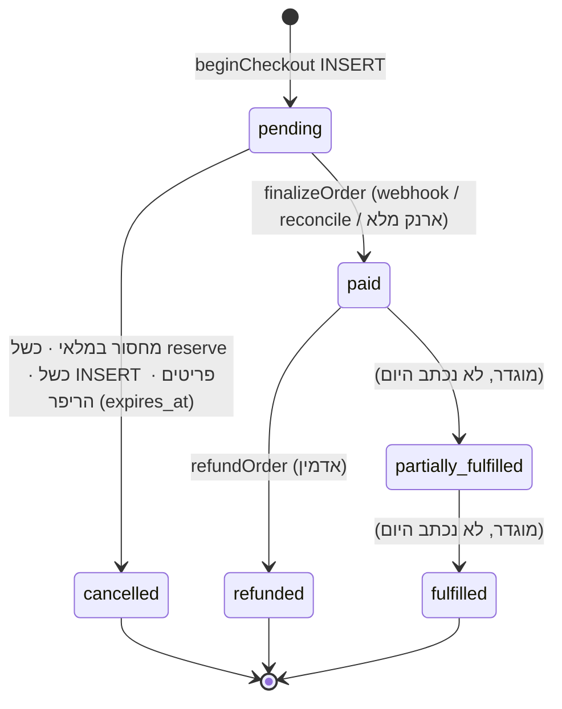
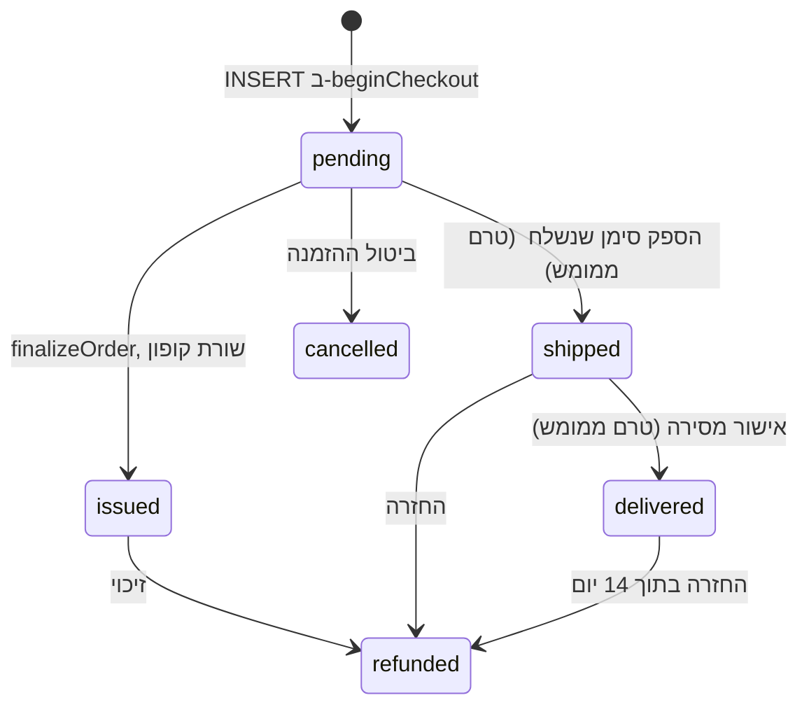
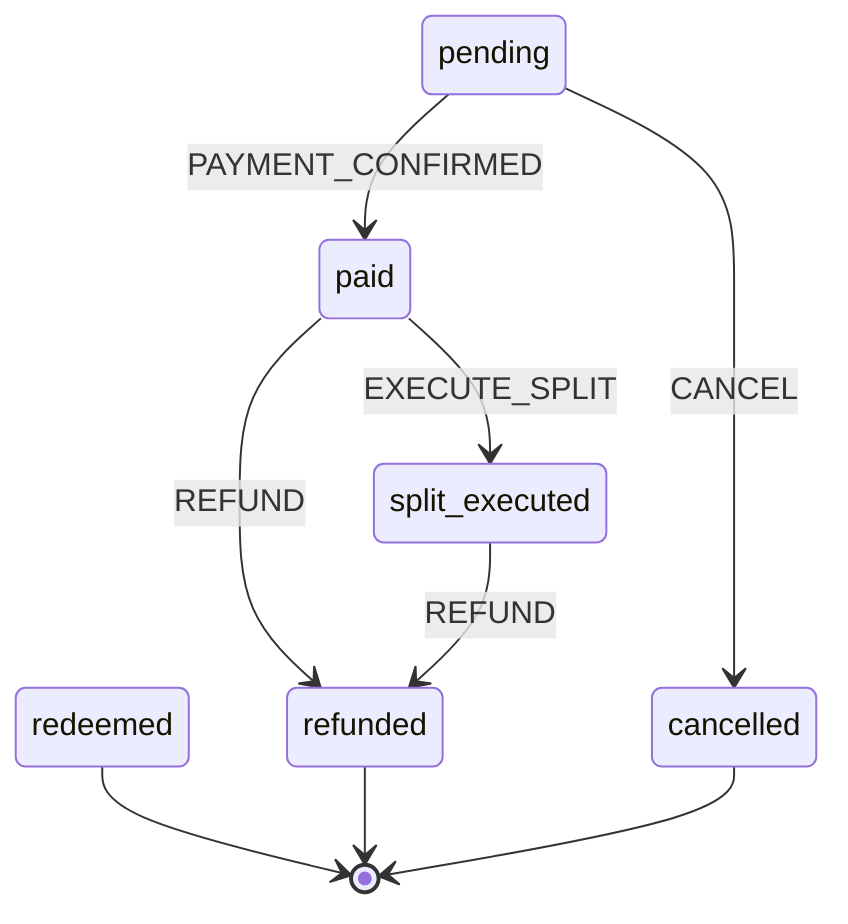
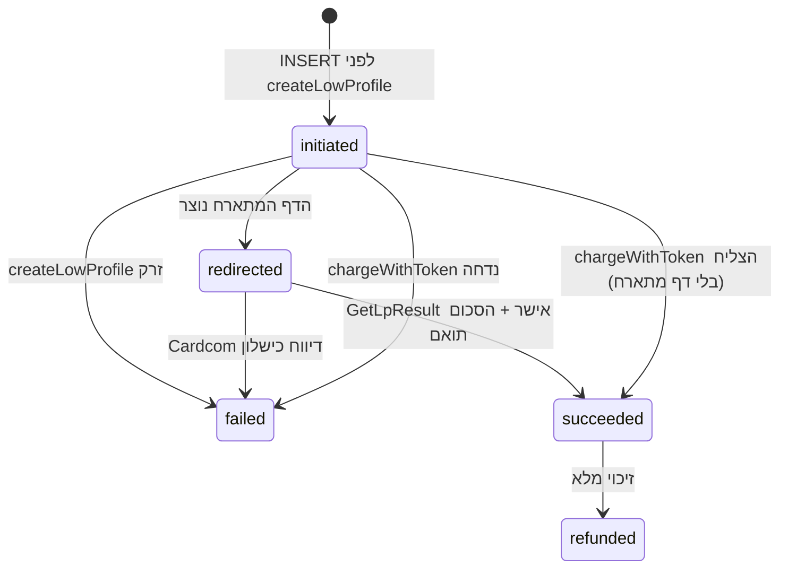
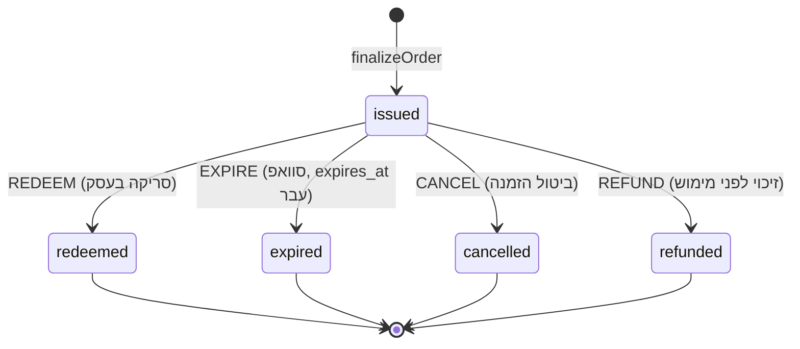

# ARCHITECTURE-ORDER-STATE-MACHINE.md

מכונות המצב של ההזמנה, הפריט, התשלום והשובר. כל הסטטוסים, כל המעברים החוקיים,
מי מורשה לכל מעבר, מקרי הקצה, ומסלול הביקורת שאי אפשר לערוך.

Status: **BINDING** · branch `docs/architecture-night` · 2026-08-19
Scope: **docs only.**
Companions: `ARCHITECTURE-CHECKOUT-CARDCOM-E2E.md`,
`ARCHITECTURE-REFUNDS-CANCELLATIONS.md`, `ARCHITECTURE-SECURITY-HARDENING.md`.
Draft SQL: `migrations/pending/007-order-transition-guard.sql` (לא הורצה).

---

## 0. חמש מכונות, לא אחת. וזה מכוון

ההזמנה אינה מחזיקה מצב אחד. היא מחזיקה **חמישה צירים בלתי תלויים**, וכל אחד
עונה על שאלה אחרת:

| ציר | העמודה | השאלה שהוא עונה עליה | הטיפוס |
| --- | --- | --- | --- |
| ‏1. ההזמנה | `orders.status` | האם ההזמנה קיימת, שולמה, בוטלה או זוכתה | `order_status` |
| ‏2. מילוי הפריט | `order_items.item_status` | האם הפריט סופק ללקוח | `order_item_status` |
| ‏3. הסדרת הכסף | `order_items.settlement_status` | האם הכסף על השורה הוסדר | `settlement_status` |
| ‏4. התשלום | `payments.status` | מה קרה בסליקה | `payment_status` |
| ‏5. השובר | `vouchers.status` | האם השובר עוד שווה משהו | `voucher_status` |

**למה לא ציר אחד.** "שולם" ו"סופק" ו"הכסף הוסדר" הם שלוש עובדות שונות שיכולות
להיות נכונות בזמנים שונים. הזמנה פיזית משולמת ולא נשלחה, קופון משולם והוסדר
כספית לפני שנסרק, וזיכוי מחזיר כסף מבלי שהמשלוח חוזר. ציר יחיד היה מאלץ אותנו
להמציא מצבים כמו `paid_but_not_shipped_and_settled`, וזה בדיוק המקום שממנו
מגיעות מכונות מצב עם 40 מצבים.

---

## 1. ‏`orders.status` — מכונת ההזמנה

### 1.1 הערכים בסכימה החיה

```
pending | paid | partially_fulfilled | fulfilled | cancelled | refunded
```

### 1.2 המעברים החוקיים



### 1.3 טבלת ההרשאות. מי רשאי לבצע כל מעבר

| מ | אל | מי מבצע | הגייט בפועל |
| --- | --- | --- | --- |
| `[*]` | `pending` | משתמש מחובר | `auth.getUser()` + rate limit 10/דקה |
| `pending` | `paid` | **המערכת בלבד** | `finalizeOrder`, מ-webhook מאומת / ‏`reconcileOrderReturn` / מסלול ארנק מלא. אין UI שמעביר. |
| `pending` | `cancelled` | המערכת | מחסור מלאי, כשל שריון, כשל INSERT, ריפר `expires_at` |
| `paid` | `refunded` | **אדמין בלבד** | `requireAdminSession()` ב-`runRefundOrder` |
| `paid` | `partially_fulfilled` / `fulfilled` | **אף אחד היום** | ראה §1.5 |

### 1.4 שלושה שומרי מצב שהם לא קישוט

```
// finalizeOrder
if (order.status === 'paid') return { ok: true, replay: true }

// runRefundOrder
if (order.status === 'refunded') return { ok: true, replay: true }
if (order.status !== 'paid')    return { code: 'STATE_INVALID' }

// כל UPDATE של סטטוס נושא תנאי על ה-from
.update({ status: 'refunded' }).eq('id', order.id).eq('status', 'paid')
```

התנאי `.eq('status', 'paid')` על ה-UPDATE הוא מה שהופך את המעבר ל-**compare-and-swap**.
שתי בקשות זיכוי במקביל: הראשונה מעדכנת שורה אחת, השנייה מעדכנת אפס שורות.
בלי התנאי הזה שתיהן היו מצליחות, ושתיהן היו קוראות ל-Cardcom.

### 1.5 ‏`partially_fulfilled` ו-`fulfilled` קיימים ואינם נכתבים

חיפוש על `src/` מראה שאף קוד לא כותב את שני הערכים האלה. הם קיימים ב-enum מאז
הסכימה המקורית ומחכים למסלול המילוי הפיזי (`ARCHITECTURE-FULFILLMENT-SUPPLIER-WORKFLOW.md`).

**מה זה אומר בפועל:** הזמנה פיזית ששולמה ונשלחה נשארת `paid` לנצח. מבחינת הכסף
זה נכון; מבחינת הלקוח, "האם זה נשלח" לא נמצא ב-`orders.status` ולכן ה-UI חייב
לקרוא את `order_items.item_status`. זה פער מתועד, לא באג.

---

## 2. ‏`order_items.item_status` — מכונת המילוי

### 2.1 הערכים

```
pending | issued | shipped | delivered | cancelled | refunded
```

### 2.2 המעברים, ומה באמת קורה היום



| מעבר | מי | מצב היום |
| --- | --- | --- |
| `pending -> issued` | המערכת (`finalizeOrder`) | **קיים.** קופון בלבד. |
| `pending -> shipped` | ספק | **לא קיים.** אין כותב. |
| `shipped -> delivered` | ספק / שליח | **לא קיים.** |
| `* -> refunded` | אדמין (`runRefundOrder`) | **קיים.** |
| `* -> cancelled` | המערכת | קיים דרך ביטול ההזמנה |

**‏שורה פיזית שמשולמת נשארת `pending` לנצח היום.** `finalizeOrder` מעביר
ל-`issued` רק שורות קופון. הפער הזה הוא מדוע `orders.status` לעולם לא מגיע
ל-`fulfilled`: אין מי שיזין את הציר. זה החוסם היחיד בין המודל הפיזי לבין
מכירה פיזית אמיתית, והוא מסמך אחר.

---

## 3. ‏`order_items.settlement_status` — מכונת הכסף

זו המכונה היחידה שממומשת כקוד טהור עם בדיקות, ב-`src/server/domain/orders/state-machine.ts`.

### 3.1 הערכים ב-enum החי, ומי מהם חי

```
pending | paid | split_executed | escrow_held | escrow_released
| redeemed | refunded | cancelled | platform_settled
```

מכונת המצב בקוד מכירה **שישה** מהם:

| מצב | מעמד | הערה |
| --- | --- | --- |
| `pending` | חי | ההתחלה |
| `paid` | חי | קיים לרגע בתוך `finalizeOrder` |
| `split_executed` | חי | **מצב המנוחה של כל שורה משולמת**, לשני הטיפוסים |
| `refunded` | חי, סופי | |
| `cancelled` | חי, סופי | |
| `redeemed` | **legacy**, סופי | מודל `coupon_codes` שקדם לשוברים, שרשם צריכה על השורה במקום על השובר |
| `platform_settled` | **legacy** | נכתב על ידי כלל C11(a) שבוטל. **אין מעבר שנכנס אליו** במכונה, רק יוצא. אפס שורות נושאות אותו. |
| `escrow_held` / `escrow_released` | **מבוטלים** | קיימים ב-enum, לא מוכרים במכונה, ואין מי שכותב אותם. ראה §3.4 |

### 3.2 המעברים החוקיים, מילה במילה מהקוד



ארבעה אירועים בלבד: `PAYMENT_CONFIRMED`, `EXECUTE_SPLIT`, `REFUND`, `CANCEL`.

**שני הטיפוסים נוחתים באותו `split_executed`, וזה עיקר המודל.** שורה פיזית
מתפצלת לפי `platform_percent` שצולם; שורת קופון "מתפצלת" ‏100/0, כי הפלטפורמה
שומרת את כל התשלום המקוון והספק גובה את חלקו במזומן בקופה. **אין מצב ביניים בין
`paid` לבין מוסדר**, כי אין מה לדחות ואין מה להחזיק.

### 3.3 ‏`transition()` זורק, ולא מחזיר `false`

```ts
transition(from, event, productType) // -> SettlementState | throws SettlementTransitionError
canTransition(from, event, productType) // -> boolean
```

שתי שגיאות: `ILLEGAL_TRANSITION` ו-`WRONG_PRODUCT_TYPE`. **החוק:** קוד שמחליט
מה לכתוב חייב לעבור דרך `transition()`. קוד ש**שואל** משתמש ב-`canTransition()`.
‏`UPDATE` ישיר על `settlement_status` בלי אחד מהשניים הוא הפרה.

### 3.4 סתירה ידועה בין תיעוד לקוד, ומה נכון

**ה-docblock בראש `src/server/domain/orders/state-machine.ts` מתאר את מודל
‏C11(b)** ("a coupon prepayment is held for the supplier until the voucher is
scanned", ומסלול `pending -> paid -> escrow_held -> escrow_released`).
**‏`TRANSITIONS` באותו קובץ אינו מממש את זה**, אין `escrow_held` במכונה, ו-`redeem_voucher()`
בפרודקשן אינו מזיז כסף.

**מה מחייב:** הקוד, לא ההערה. אין Escrow. ההערה היא שריד לניסוח שבוטל ב-28.07,
ותיקונה הוא שינוי בקוד ולכן מחוץ לתחום הענף הזה. **רשום כאן כדי שהקורא הבא לא
יסיק מהערה שהמודל חזר.**

`migrations/pending/004-expire-vouchers-drop-escrow.sql` מסיים את אותו ניקוי
בצד ה-DB: `expire_vouchers()` בפרודקשן עדיין נוגע ב-`escrow_holds`.

### 3.5 הגלגול לרמת ההזמנה, והמלכודת שבו

```ts
deriveOrderStatus(lineStates): SettlementState
// יש pending -> pending
// יש paid -> paid
// יש redeemed -> redeemed
// כולן cancelled -> cancelled
// כולן refunded/cancelled -> refunded
// אחרת -> split_executed
```

**‏⚠️ הוא מחזיר `SettlementState`, לא `order_status`.** `split_executed`
ו-`redeemed` **אינם ערכים חוקיים** ב-`order_status`. הפונקציה משמשת ב-`queries/orders.ts`
כשדה תצוגה בשם `settlementStatus` וב-`refund.ts` כשדה בשם `orderStatus` בתוך
ה-plan. **אף אחד מהם אינו נכתב ל-`orders.status`.**

**החוק:** תוצאת `deriveOrderStatus` **לעולם** לא נכתבת ל-`orders.status`. מי
שיכתוב אותה יקבל `22P02 invalid input value for enum order_status`. השם
`orderStatus` בתוך `RefundPlan` הוא שם מטעה שכדאי לשנות, וזה שינוי קוד.

---

## 4. ‏`payments.status` — מכונת הסליקה

```
initiated | redirected | succeeded | failed | refunded
```



| מעבר | מי | תנאי |
| --- | --- | --- |
| `-> initiated` | `beginCheckout` | אחרי שריון מלאי |
| `initiated -> redirected` | `beginCheckout` | `createLowProfile` החזיר `LowProfileCode` |
| `* -> succeeded` | **ה-webhook בלבד**, אחרי `GetLpResult` | `verified.success` **וגם** `amountAgorot === expectedAgorot` |
| `* -> failed` | ה-webhook / ה-catch | `.in('status', ['initiated','redirected'])` |
| `succeeded -> refunded` | אדמין | `.eq('status', payment.status)` |

**‏`succeeded` נכתב ממקום אחד ואחרי בדיקה אחת.** לא מגוף הקולבק, לא מה-redirect,
לא מהלקוח. ‏`GetLpResult` בלבד, וסכום זהה לאגורה.

**זיכוי חלקי אינו מעביר את שורת החיוב.** הוא יוצר **שורת `payments` נוספת** עם
`kind = 'refund'`. השורה המקורית נשארת `succeeded`. `payments.status = 'refunded'`
נכתב רק על זיכוי מלא. ראה `ARCHITECTURE-REFUNDS-CANCELLATIONS.md`.

---

## 5. ‏`vouchers.status` — מכונת השובר

```
issued | redeemed | expired | cancelled | refunded
```

### 5.1 **כל מצב שאינו `issued` הוא סופי.** בלי יוצא מן הכלל



**למה הכל סופי.** אין Escrow ואין payout. ברגע שהשובר עוזב את `issued` אין מה
להזיז: הערך נצרך בעסק, או שהכסף חזר ללקוח, או שהוא פקע. שובר "פעיל שוב" היה
שובר שאפשר לממש פעמיים.

### 5.2 השומרים על `REDEEM`, ומי נושא כל אחד

| שומר | היכן | כישלון |
| --- | --- | --- |
| משתמש מחובר | `auth.uid() IS NULL` | `unauthorized` |
| חבר בספק פעיל | `supplier_members ... is_active` | `unauthorized` |
| ‏idempotency | `voucher_redemptions.idempotency_key` | התשובה הראשונה, עם `replayed: true` |
| rate limit | ‏30 סריקות לדקה למשתמש | `rate_limited` |
| **הספק הנכון** | `v.supplier_id IN (memberships)` | `wrong_supplier`, שמוצג כ-`not_found` |
| **סטטוס `issued`** | בתוך ה-`WHERE` של ה-UPDATE | `already_redeemed` / `cancelled` / `refunded` |
| **טרם פג** | `v.expires_at > now()` בתוך אותו `WHERE` | `expired` |

### 5.3 השורה שהיא כל ההגנה מפני מימוש כפול

```sql
UPDATE public.vouchers v
SET status = 'redeemed', redeemed_at = now(), ...
WHERE v.code = v_code
  AND v.status = 'issued'
  AND v.expires_at > now()
  AND v.supplier_id IN (SELECT supplier_id FROM supplier_members WHERE user_id = auth.uid() AND is_active)
RETURNING v.* INTO v_voucher;
```

**‏`UPDATE ... WHERE status='issued'` יחיד ואטומי.** שתי סריקות בו-זמנית:
Postgres מסדר אותן, הראשונה מוצאת `issued` ומעדכנת, השנייה מוצאת `redeemed`
ומעדכנת אפס שורות ונופלת ל-`already_redeemed`. **אין `SELECT` ואחר כך `UPDATE`,
כי בין השניים יש חלון.**

### 5.4 ‏`not_found` ו-`wrong_supplier` מתמזגים בתשובה

```
outcome 'wrong_supplier' נרשם ב-voucher_redemptions
התשובה ללקוח: { outcome: 'not_found' }
```

**אנטי-enumeration.** ספק שיכול להבחין בין "קוד לא קיים" ל"קוד של עסק אחר" יכול
למפות את מרחב הקודים של המתחרים. הרישום הפנימי מדויק; התשובה החוצה לא.

### 5.5 ‏`offer_valid_until` מול `expires_at`

| שדה | משמעות | מי אוכף |
| --- | --- | --- |
| `offer_valid_until` | עד מתי **ההצעה נמכרת**. חוק הגנת הצרכן: מוצג ללקוח לפני הרכישה. | ה-UI + הקטלוג |
| `expires_at` | עד מתי **השובר שנרכש ניתן למימוש**. `issued_at + coupon_expiry_days`. | `redeem_voucher()` |

הם **אינם** אותו דבר, ו-`voucher_success_payload` מחזיר את שניהם בתשובת `expired`,
כדי שהעסק יוכל להסביר ללקוח מה בדיוק פג.

**‏`coupon_expiry_days` חובה, בלי ברירת מחדל.** `finalizeOrder` זורק אם הוא חסר,
במקום להמציא 90 יום. ראה `ARCHITECTURE-CHECKOUT-CARDCOM-E2E.md` §7.2.

---

## 6. ‏Edge cases. מה קורה בדיוק בכל אחד

### 6.1 ביטול או זיכוי **אחרי** סריקה

**התשובה: לא ניתן להחזיר לכרטיס. נקודה.**

```ts
// refund.ts
const consumed = input.vouchers.filter(v => v.status === 'redeemed' || v.status === 'expired')
// consumed חוסם את התוכנית
```

הלקוח כבר קיבל את הערך בעסק. משיכת הכסף מהכרטיס תשאיר את הפלטפורמה בחסר מול
עסק שכבר נתן שירות. `describeRefundBlockers` מחזיר חוסם בעברית שמוצג לאדמין.

**מה כן אפשר:** **זיכוי לארנק** כמחווה. זו תנועת כסף אחרת לגמרי, היא אינה נוגעת
ב-`vouchers` ואינה עוברת ב-`planOrderRefund`. הארנק פנימי בלבד ולא יוצא החוצה.

**‏`expired` נחסם באותה שורה כמו `redeemed`.** שובר שפג הוא breakage שכבר הוכר
כהכנסה. **‏⚠️ יש כאן מתח משפטי מתועד (C6):** לקוח ששילם ולא מימש בגלל שהעסק
נסגר אינו "צרך ערך". `credit_expired_vouchers()` קיים בדיוק בשביל המקרה, והוא
מזכה לארנק ולא לכרטיס. הגבול בין השניים הוא החלטה עסקית שמסמך ההחזרים מפרט.

### 6.2 זיכוי חלקי

```ts
partialAmountAgorot // כשמוגדר: אין דמי ביטול, ו-cancelOnly תמיד false
```

| כלל | למה |
| --- | --- |
| **אין דמי ביטול על חלקי** | דמי הביטול החוקיים הם על ביטול העסקה, לא על התאמת סכום |
| **`cancelOnly` תמיד `false`** | "חצי עסקה לא ניתן לבטל לפני שידור". ביטול לפני שידור הוא הכל או כלום. |
| **שורת `payments` חדשה** עם `kind='refund'` | שורת החיוב נשארת `succeeded` |
| **`orders.status` נשאר `paid`** | ההזמנה לא זוכתה, רק חלק ממנה |
| השוברים אינם משתנים | זיכוי חלקי אינו מבטל שובר |

### 6.3 תשלום כפול

**שני חיובים שהצליחו על אותה הזמנה.** שלוש הגנות, ואחת שנשארת ידנית:

| שכבה | מה תופסת | מה לא |
| --- | --- | --- |
| `idempotency_key = lp:{client_ref}` | לחיצה כפולה על "שלם" | לא תופסת שני `client_ref` שונים |
| `UNIQUE(provider, external_event_id)` | קולבק שנשלח פעמיים | לא תופסת שתי עסקאות שונות |
| `finalizeOrder`: `status === 'paid'` -> replay | ‏finalize שני | **הכרטיס כבר חויב פעמיים** |
| ההתאמה היומית (`ListTransactions`) | עסקה בטרמינל בלי שורה אצלנו | **ידני** |

**מה שלא מכוסה:** לקוח שפתח שתי לשוניות, קיבל שני `client_ref`, ושילם בשתיהן.
שתי ההזמנות תקינות ושתיהן ייסגרו. ההגנה היחידה היא הזיהוי היומי והזיכוי הידני.
**זה פער ידוע**, וההצעה לסגירתו:

```sql
-- טיוטה בלבד, לא ב-006 ולא ב-007
create unique index orders_one_open_per_user_idx
  on public.orders (user_id)
  where status = 'pending' and deleted_at is null;
```

**זה לא נכתב כמיגרציה בכוונה.** הוא ימנע גם מקרה לגיטימי (לקוח שנטש הזמנה
ומתחיל חדשה לפני שהריפר ניקה), ולכן הוא דורש שינוי בקוד שיבטל הזמנה תלויה לפני
יצירת חדשה. **החלטה: לא לפני שיש מדידה כמה כפילויות באמת קורות.**

### 6.4 השובר פג בין התשלום להנפקה

לא ייתכן: `expires_at` מחושב **בזמן ההנפקה** מ-`issued_at + coupon_expiry_days`,
לא מזמן ההזמנה.

### 6.5 העסק נסגר והשובר עדיין `issued`

אין מעבר לזה. `CANCEL` הוא הכלי (`cancel_vouchers_for_order`), והוא מחייב אדמין.
הכסף חוזר דרך מסלול הזיכוי הרגיל, כי השובר עדיין `issued`.

### 6.6 ‏`finalizeOrder` הצליח חלקית

הפעולות אינן בטרנזקציה אחת. שובר שהונפק ושורה שהתעדכנה נשארים; ‏`orders.status`
נשאר `pending` אם השלב שלו לא הגיע. **הריצה החוזרת בטוחה:** ה-cap על הכמות +
`vouchers UNIQUE(code)` מונעים שובר שני, וכל UPDATE נושא תנאי `from`.

### 6.7 המלאי נצרך והתשלום נכשל

`consume_order_stock` נקרא רק בתוך `finalizeOrder`, כלומר **אחרי** שהתשלום אומת.
מה שקורה לפני זה הוא **שריון** עם TTL של 15 דקות, שמשתחרר לבד.

---

## 7. מסלול ביקורת append-only

### 7.1 מה קיים היום, ומה חסר בו

| טבלה | מה נרשם | append-only? |
| --- | --- | --- |
| `audit_log` | שינויי סטטוס, override ידני, הרשאות, כניסות | **לא נאכף** |
| `payment_webhook_events` | כל קולבק, גולמי | דה-פקטו (רק `processed_at` מתעדכן) |
| `voucher_redemptions` | **כל סריקה, כולל כישלונות** | דה-פקטו |
| `split_executions` | הפיצול בזמן התשלום | דה-פקטו |
| `wallet_entries` | תנועות ארנק | ספר חשבונות |
| `payment_events` | **טיוטה**, `120_payment_events.sql` | **כן, בטריגר** |

`voucher_redemptions` היא הטובה שבהן: היא רושמת גם `not_found`, גם `wrong_supplier`
וגם `rate_limited`, עם `ip_address` ו-`user_agent`. **יומן שרושם רק הצלחות לא
עונה על השאלה מי ניסה.**

### 7.2 שלוש הבעיות ב-`audit_log`

1. **אין אכיפה.** אין טריגר שחוסם UPDATE/DELETE. יומן שאפשר לערוך אינו ראיה.
2. **‏`actor_id: null` על פעולות אדמין.** ב-`runRefundOrder` נכתב
   `actor_id: null, actor_role: 'admin'`, למרות ש-`requireAdminSession()` יודע מי
   המשתמש. היומן אומר "אדמין כלשהו", וזו בדיוק השאלה שיומן קיים כדי לענות עליה.
3. **אזעקות כסף מעורבבות עם כניסות.** `cardcom_amount_mismatch` נרשם כ-`manual_override`
   עם ה-alarm ב-`metadata`, לצד logins. זה מה ש-`payment_events` בא לפתור.

### 7.3 הכלל המחייב, מכאן והלאה

> **כל מעבר סטטוס על מסלול הכסף נרשם, עם `actor_id` אמיתי כשיש אדם,
> ל-טבלה שאי אפשר לערוך.**

`migrations/pending/007-order-transition-guard.sql` מוסיף את החלק שאפשר לאכוף
ב-DB: טריגר שחוסם מעברים בלתי חוקיים על `orders`, ‏`order_items`, ‏`payments`
ו-`vouchers`, וטריגר שחוסם UPDATE/DELETE על `audit_log`. שני התיקונים
הנותרים (‏`actor_id` אמיתי, כתיבה ל-`payment_events`) הם שינויי קוד.

---

## 8. טבלת המעברים המלאה, לעותק אחד להדפסה

| ישות | מ | אל | אירוע | מי | תנאי |
| --- | --- | --- | --- | --- | --- |
| order | `[*]` | pending | INSERT | משתמש | auth + rate limit |
| order | pending | paid | finalize | מערכת | webhook מאומת |
| order | pending | cancelled | cancel | מערכת | מלאי / ריפר |
| order | paid | refunded | refund | **אדמין** | אין שובר נצרך |
| item | `[*]` | pending | INSERT | משתמש | |
| item | pending | issued | finalize | מערכת | קופון בלבד |
| item | * | refunded | refund | אדמין | |
| settlement | pending | paid | PAYMENT_CONFIRMED | מערכת | |
| settlement | pending | cancelled | CANCEL | מערכת | |
| settlement | paid | split_executed | EXECUTE_SPLIT | מערכת | |
| settlement | paid | refunded | REFUND | אדמין | |
| settlement | split_executed | refunded | REFUND | אדמין | |
| payment | `[*]` | initiated | INSERT | מערכת | |
| payment | initiated | redirected | LP נוצר | מערכת | |
| payment | initiated/redirected | succeeded | webhook | מערכת | **GetLpResult + סכום זהה** |
| payment | initiated/redirected | failed | webhook/catch | מערכת | |
| payment | succeeded | refunded | refund | אדמין | זיכוי מלא בלבד |
| voucher | `[*]` | issued | finalize | מערכת | `coupon_expiry_days` קיים |
| voucher | issued | redeemed | REDEEM | **ספק בעל חברות פעילה** | ספק נכון + טרם פג + rate limit |
| voucher | issued | expired | EXPIRE | ‏cron | `expires_at` עבר |
| voucher | issued | cancelled | CANCEL | אדמין | |
| voucher | issued | refunded | REFUND | אדמין | |

---

## 9. תשע החלטות שלא ישתנו בלי מסמך שגובר

1. **חמישה צירים, לא אחד.** אין מיזוג ל-`status` יחיד.
2. **כל UPDATE של סטטוס נושא תנאי `from`.** compare-and-swap, לא read-modify-write.
3. **`succeeded` נכתב רק מ-`GetLpResult` עם סכום זהה לאגורה.**
4. **כל מצב שאינו `issued` בשובר הוא סופי.**
5. **מימוש הוא `UPDATE ... WHERE status='issued'` אטומי יחיד.**
6. **שובר נצרך או שפג חוסם החזר לכרטיס.** המסלול היחיד הוא זיכוי לארנק.
7. **זיכוי חלקי: בלי דמי ביטול, בלי `cancelOnly`, שורת `payments` חדשה.**
8. **`deriveOrderStatus` לעולם לא נכתב ל-`orders.status`.**
9. **אין Escrow.** ה-docblock ב-`state-machine.ts` שאומר אחרת הוא שריד; הקוד מחייב.
