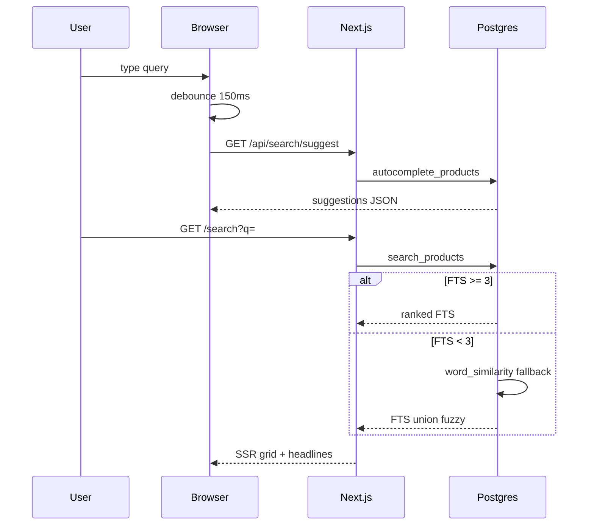

# ARCHITECTURE-SEARCH.md

KenyonExpress **Hebrew catalog search** architecture (binding Postgres FTS spec).

Status: BINDING · worktree `/Users/ofir/kenyonexpress-web/ke-arch-search` · branch `arch/search` (2026-07-30)
Scope: **docs only.** No application code in this change.
Companions: `docs/ARCHITECTURE-CATALOG-SEARCH-SEO.md`, `docs/ARCHITECTURE-CATEGORY-PAGE.md` (results chrome 1:1 electro).
Optional overlay: Meilisearch in `src/lib/search-server.ts` may accelerate reads later; **this binding’s source of truth is Postgres.**

Stack: Next.js App Router (`/search`, `/api/search/suggest`), Supabase Postgres (`simple` + `unaccent` + `pg_trgm`), RPCs, Server Components, client debounce.

---

## 0. Binding decisions

1. **Primary engine = Postgres FTS.** Meili is optional cache only.
2. **Config = `simple` + `unaccent`.** No Hebrew stemmer on managed Supabase.
3. **`search_vector` maintained by TRIGGER** so `categories.name_he` can enter the vector.
4. **Ranking field order:** name (**A**) > description/aliases (**B**) > category (**C**).
5. **GIN** on `tsvector` + **GIN trigram** on `name_he` (and optionally `description_he`).
6. **Typo fallback:** `pg_trgm` `word_similarity` when FTS returns fewer than 3 rows.
7. **Autocomplete:** prefix / `ILIKE`, debounce **150ms**, min **2** chars, abort in-flight.
8. **Results UI:** 1:1 with electro listing chrome (same shell as category page): breadcrumb, title, count, search box, sidebar, grid.
9. **Highlighting:** `ts_headline('simple', ...)` on name (+ optional description snippet).
10. RTL Hebrew. `/search` is `robots: noindex`.

| Field | Weight |
|---|---|
| `products.name_he` | **A** |
| `description_he` + `search_keywords` + `name_en` + `brand` + `sku` | **B** |
| primary `categories.name_he` | **C** |

---

## 1. End-to-end flow

```
type ≥2 chars → debounce 150ms → GET /api/search/suggest → autocomplete_products
submit → /search?q=&type=&min=&max=&page= → search_products(he_tsquery)
       → FTS rank; if <3 hits → pg_trgm fuzzy → grid + ts_headline → log_search_query
```



---

## 2. Hebrew FTS constraints

| Issue | Mitigation |
|---|---|
| No Hebrew stemmer | `simple` + admin keywords/synonyms |
| Clitics מש״ה וכל״ב | `he_tsquery` alternate tokens |
| Typos | `pg_trgm` when FTS thin |
| Latin accents on brands | `f_unaccent()` before `to_tsvector` |
| Nikud | ignore in commercial catalog |

---

## 3. Score formula (binding)

```
score =
  0.70 * ts_rank_cd(search_vector, q, 32)  -- A>B>C inside vector
+ 0.15 * fuzzy_similarity                 -- 0 for pure FTS rows
+ 0.10 * freshness                        -- exp(-age_days/30)
+ 0.05 * is_featured
```

Lexical dominates. Do **not** boost `platform_percent` inside search relevance (supersedes 030 margin term for this binding).

---

## 4. Full migration SQL

Implementation path:

`supabase/migrations/085_search_fts_unaccent_trigger.sql`

```sql
-- 085_search_fts_unaccent_trigger.sql
-- Idempotent draft: simple+unaccent FTS, trigger tsvector, GIN, pg_trgm,
-- he_tsquery, search_products, autocomplete_products, headline helper.

CREATE EXTENSION IF NOT EXISTS pg_trgm WITH SCHEMA extensions;
CREATE EXTENSION IF NOT EXISTS unaccent WITH SCHEMA extensions;

CREATE OR REPLACE FUNCTION public.f_unaccent(text)
RETURNS text
LANGUAGE sql
IMMUTABLE
PARALLEL SAFE
STRICT
SET search_path = public, extensions
AS $$
  SELECT extensions.unaccent('extensions.unaccent', $1)
$$;

-- Replace GENERATED search_vector (030) with trigger-maintained column
ALTER TABLE public.products DROP COLUMN IF EXISTS search_vector;
ALTER TABLE public.products ADD COLUMN IF NOT EXISTS search_vector tsvector;
ALTER TABLE public.products ADD COLUMN IF NOT EXISTS search_keywords text;

CREATE INDEX IF NOT EXISTS products_search_vector_idx
  ON public.products USING gin (search_vector);
CREATE INDEX IF NOT EXISTS products_name_he_trgm_idx
  ON public.products USING gin (name_he gin_trgm_ops);
CREATE INDEX IF NOT EXISTS products_description_he_trgm_idx
  ON public.products USING gin (description_he gin_trgm_ops);

CREATE OR REPLACE FUNCTION public.products_build_search_vector(p public.products)
RETURNS tsvector
LANGUAGE sql
STABLE
SET search_path = public, extensions
AS $$
  SELECT
    setweight(to_tsvector('simple', public.f_unaccent(coalesce(p.name_he, ''))), 'A')
    || setweight(
         to_tsvector(
           'simple',
           public.f_unaccent(
             coalesce(p.description_he, '') || ' ' ||
             coalesce(p.search_keywords, '') || ' ' ||
             coalesce(p.name_en, '') || ' ' ||
             coalesce(p.brand, '') || ' ' ||
             coalesce(p.sku, '')
           )
         ),
         'B'
       )
    || setweight(
         to_tsvector(
           'simple',
           public.f_unaccent(coalesce((
             SELECT c.name_he FROM public.categories c WHERE c.id = p.category_id
           ), ''))
         ),
         'C'
       );
$$;

CREATE OR REPLACE FUNCTION public.products_search_vector_trigger()
RETURNS trigger
LANGUAGE plpgsql
SET search_path = public, extensions
AS $$
BEGIN
  NEW.search_vector := public.products_build_search_vector(NEW);
  RETURN NEW;
END;
$$;

DROP TRIGGER IF EXISTS trg_products_search_vector ON public.products;
CREATE TRIGGER trg_products_search_vector
  BEFORE INSERT OR UPDATE OF
    name_he, description_he, search_keywords, name_en, brand, sku, category_id
  ON public.products
  FOR EACH ROW
  EXECUTE FUNCTION public.products_search_vector_trigger();

-- When a category is renamed, refresh dependent product vectors
CREATE OR REPLACE FUNCTION public.categories_touch_product_search()
RETURNS trigger
LANGUAGE plpgsql
SET search_path = public
AS $$
BEGIN
  IF TG_OP = 'UPDATE' AND NEW.name_he IS DISTINCT FROM OLD.name_he THEN
    UPDATE public.products p
       SET search_vector = public.products_build_search_vector(p)
     WHERE p.category_id = NEW.id;
  END IF;
  RETURN NEW;
END;
$$;

DROP TRIGGER IF EXISTS trg_categories_touch_product_search ON public.categories;
CREATE TRIGGER trg_categories_touch_product_search
  AFTER UPDATE OF name_he ON public.categories
  FOR EACH ROW
  EXECUTE FUNCTION public.categories_touch_product_search();

-- Backfill
UPDATE public.products p
   SET search_vector = public.products_build_search_vector(p)
 WHERE search_vector IS NULL
    OR true;  -- full rebuild once on apply

-- Synonyms dictionary (admin-managed)
CREATE TABLE IF NOT EXISTS public.search_synonyms (
  id         uuid PRIMARY KEY DEFAULT gen_random_uuid(),
  term       text NOT NULL,
  synonyms   text[] NOT NULL DEFAULT '{}',
  created_at timestamptz NOT NULL DEFAULT now(),
  updated_at timestamptz NOT NULL DEFAULT now(),
  CONSTRAINT search_synonyms_term_uniq UNIQUE (term)
);

ALTER TABLE public.search_synonyms ENABLE ROW LEVEL SECURITY;
DROP POLICY IF EXISTS "search_synonyms public read" ON public.search_synonyms;
CREATE POLICY "search_synonyms public read"
  ON public.search_synonyms FOR SELECT USING (true);
DROP POLICY IF EXISTS "search_synonyms admin write" ON public.search_synonyms;
CREATE POLICY "search_synonyms admin write"
  ON public.search_synonyms FOR ALL TO authenticated
  USING (public.is_admin()) WITH CHECK (public.is_admin());

CREATE TABLE IF NOT EXISTS public.search_queries (
  id             uuid PRIMARY KEY DEFAULT gen_random_uuid(),
  query          text NOT NULL,
  results_count  int  NOT NULL DEFAULT 0,
  source         text NOT NULL DEFAULT 'search'
                   CHECK (source IN ('search', 'autocomplete', 'zero_fallback')),
  session_id     text,
  user_id        uuid REFERENCES public.profiles(id) ON DELETE SET NULL,
  created_at     timestamptz NOT NULL DEFAULT now()
);
CREATE INDEX IF NOT EXISTS search_queries_created_idx
  ON public.search_queries (created_at DESC);
CREATE INDEX IF NOT EXISTS search_queries_zero_idx
  ON public.search_queries (created_at DESC)
  WHERE results_count = 0;

-- ---------------------------------------------------------------------------
-- he_tsquery: clitics + synonyms + prefix
-- ---------------------------------------------------------------------------

CREATE OR REPLACE FUNCTION public.he_tsquery(p_raw text)
RETURNS tsquery
LANGUAGE plpgsql
STABLE
SET search_path = public, extensions
AS $$
DECLARE
  v_raw   text := lower(public.f_unaccent(btrim(coalesce(p_raw, ''))));
  v_token text;
  v_alt   text;
  v_parts text[] := ARRAY[]::text[];
  v_ors   text[];
  v_syn   text[];
  v_s     text;
  v_out   tsquery;
BEGIN
  IF v_raw = '' THEN
    RETURN ''::tsquery;
  END IF;

  -- Keep Hebrew, Latin, digits; split on other chars
  FOR v_token IN
    SELECT t FROM regexp_split_to_table(v_raw, '[^[:alnum:]א-ת]+') AS t
    WHERE length(t) >= 1
  LOOP
    v_ors := ARRAY[v_token || ':*'];

    -- single clitic
    IF length(v_token) >= 4 AND substr(v_token, 1, 1) IN ('ו','ה','ב','כ','ל','מ','ש') THEN
      v_alt := substr(v_token, 2);
      v_ors := v_ors || (v_alt || ':*');
    END IF;

    -- double clitic prefixes
    IF length(v_token) >= 5 AND substr(v_token, 1, 2) IN
         ('וה','וב','ול','וכ','ומ','וש','שה','לה','בה','מה','כש') THEN
      v_alt := substr(v_token, 3);
      v_ors := v_ors || (v_alt || ':*');
    END IF;

    SELECT s.synonyms INTO v_syn
      FROM public.search_synonyms s
     WHERE s.term = v_token
     LIMIT 1;
    IF v_syn IS NOT NULL THEN
      FOREACH v_s IN ARRAY v_syn LOOP
        IF length(btrim(v_s)) > 0 THEN
          v_ors := v_ors || (public.f_unaccent(lower(btrim(v_s))) || ':*');
        END IF;
      END LOOP;
    END IF;

    v_parts := v_parts || ('(' || array_to_string(v_ors, ' | ') || ')');
  END LOOP;

  IF coalesce(array_length(v_parts, 1), 0) = 0 THEN
    RETURN ''::tsquery;
  END IF;

  BEGIN
    v_out := to_tsquery('simple', array_to_string(v_parts, ' & '));
  EXCEPTION WHEN OTHERS THEN
    v_out := plainto_tsquery('simple', v_raw);
  END;
  RETURN v_out;
END;
$$;

-- ---------------------------------------------------------------------------
-- search_products
-- ---------------------------------------------------------------------------

CREATE OR REPLACE FUNCTION public.search_products(
  p_query       text,
  p_limit       int DEFAULT 24,
  p_offset      int DEFAULT 0,
  p_category_id uuid DEFAULT NULL
)
RETURNS TABLE (
  id           uuid,
  slug         text,
  name_he      text,
  name_headline text,
  kenyon_price numeric,
  full_price   numeric,
  images       jsonb,
  score        real,
  match_type   text
)
LANGUAGE plpgsql
STABLE
SET search_path = public, extensions
AS $$
DECLARE
  v_q   tsquery;
  v_lim int := least(greatest(coalesce(p_limit, 24), 1), 100);
  v_off int := greatest(coalesce(p_offset, 0), 0);
BEGIN
  v_q := public.he_tsquery(p_query);

  RETURN QUERY
  WITH base AS (
    SELECT p.id, p.slug, p.name_he, p.kenyon_price, p.full_price, p.images,
           p.search_vector, p.published_at, p.created_at, p.is_featured,
           p.description_he
    FROM public.products p
    WHERE p.status = 'active'::public.product_status
      AND p.deleted_at IS NULL
      AND (
        p_category_id IS NULL
        OR p.category_id = p_category_id
        OR EXISTS (
          SELECT 1 FROM public.product_categories pc
          WHERE pc.product_id = p.id AND pc.category_id = p_category_id
        )
      )
  ),
  fts AS (
    SELECT b.*, ts_rank_cd(b.search_vector, v_q, 32)::real AS lex
    FROM base b
    WHERE v_q <> ''::tsquery AND b.search_vector @@ v_q
  ),
  fuzzy AS (
    SELECT b.*, word_similarity(p_query, b.name_he)::real AS sim
    FROM base b
    WHERE (SELECT count(*) FROM fts) < 3
      AND word_similarity(p_query, b.name_he) > 0.35
      AND NOT EXISTS (SELECT 1 FROM fts f WHERE f.id = b.id)
  ),
  united AS (
    SELECT f.id, f.slug, f.name_he, f.kenyon_price, f.full_price, f.images,
           f.published_at, f.created_at, f.is_featured, f.description_he,
           f.lex, 0::real AS sim, 'fts'::text AS mt
    FROM fts f
    UNION ALL
    SELECT z.id, z.slug, z.name_he, z.kenyon_price, z.full_price, z.images,
           z.published_at, z.created_at, z.is_featured, z.description_he,
           0::real, z.sim, 'fuzzy'::text
    FROM fuzzy z
  ),
  scored AS (
    SELECT u.*,
           (0.70 * u.lex
            + 0.15 * u.sim
            + 0.10 * exp(-extract(epoch FROM (now() - coalesce(u.published_at, u.created_at))) / (30 * 86400.0))
            + 0.05 * (u.is_featured)::int
           )::real AS rank_score,
           coalesce(u.published_at, u.created_at) AS recency,
           ts_headline(
             'simple',
             public.f_unaccent(u.name_he),
             v_q,
             'StartSel=<mark>, StopSel=</mark>, MaxWords=12, MinWords=3, MaxFragments=1'
           ) AS headline
    FROM united u
  )
  SELECT s.id, s.slug, s.name_he, s.headline, s.kenyon_price, s.full_price, s.images,
         s.rank_score, s.mt
  FROM scored s
  ORDER BY s.rank_score DESC, s.recency DESC
  LIMIT v_lim OFFSET v_off;
END;
$$;

CREATE OR REPLACE FUNCTION public.autocomplete_products(
  p_prefix text,
  p_limit  int DEFAULT 8
)
RETURNS TABLE (
  kind         text,
  id           uuid,
  slug         text,
  label_he     text,
  kenyon_price numeric,
  image        text
)
LANGUAGE plpgsql
STABLE
SET search_path = public, extensions
AS $$
DECLARE
  v_p   text := btrim(coalesce(p_prefix, ''));
  v_lim int  := least(greatest(coalesce(p_limit, 8), 1), 20);
BEGIN
  IF length(v_p) < 2 THEN
    RETURN;
  END IF;
  v_p := replace(replace(v_p, '%', ''), '_', '');

  RETURN QUERY
  (
    SELECT 'category'::text, c.id, c.slug, c.name_he, NULL::numeric, NULL::text
    FROM public.categories c
    WHERE c.is_active = true AND c.deleted_at IS NULL
      AND c.name_he ILIKE v_p || '%'
    ORDER BY c.sort_order
    LIMIT 2
  )
  UNION ALL
  (
    SELECT 'product'::text, p.id, p.slug, p.name_he, p.kenyon_price,
           CASE WHEN jsonb_typeof(p.images) = 'array' THEN p.images->>0 ELSE NULL END
    FROM public.products p
    WHERE p.status = 'active'::public.product_status
      AND p.deleted_at IS NULL
      AND (p.name_he ILIKE v_p || '%' OR p.name_he ILIKE '% ' || v_p || '%')
    ORDER BY p.is_featured DESC, coalesce(p.published_at, p.created_at) DESC
    LIMIT v_lim
  );
END;
$$;

CREATE OR REPLACE FUNCTION public.log_search_query(
  p_query text,
  p_results_count int,
  p_source text DEFAULT 'search',
  p_session_id text DEFAULT NULL
)
RETURNS void
LANGUAGE plpgsql
SECURITY DEFINER
SET search_path = public
AS $$
BEGIN
  INSERT INTO public.search_queries (query, results_count, source, session_id, user_id)
  VALUES (
    left(btrim(coalesce(p_query, '')), 200),
    greatest(coalesce(p_results_count, 0), 0),
    CASE WHEN p_source IN ('search', 'autocomplete', 'zero_fallback') THEN p_source ELSE 'search' END,
    p_session_id,
    auth.uid()
  );
END;
$$;

REVOKE ALL ON FUNCTION public.log_search_query(text, int, text, text) FROM PUBLIC;
GRANT EXECUTE ON FUNCTION public.log_search_query(text, int, text, text) TO anon, authenticated;
GRANT EXECUTE ON FUNCTION public.search_products(text, int, int, uuid) TO anon, authenticated;
GRANT EXECUTE ON FUNCTION public.autocomplete_products(text, int) TO anon, authenticated;
GRANT EXECUTE ON FUNCTION public.he_tsquery(text) TO anon, authenticated;
```

---

## 5. URL state (results page)

| Param | Meaning |
|---|---|
| `q` | query string (required for search) |
| `page` | 1-based page |
| `type` | `coupon` \| `physical` \| omit |
| `min` / `max` | price filter ILS (sidebar) |
| `category` | optional slug/id narrow |
| `sort` | `relevance` (default) \| `price_asc` \| `price_desc` \| `newest` |

Page size: **24** (electro listing density).

---

## 6. Full TypeScript

### 6.1 Types

```typescript
// src/lib/search/types.ts
export type SearchMatchType = 'fts' | 'fuzzy'

export type SearchHit = {
  id: string
  slug: string
  name_he: string
  name_headline: string | null
  kenyon_price: number | null
  full_price: number | null
  images: string[]
  score: number
  match_type: SearchMatchType
}

export type AutocompleteItem = {
  kind: 'category' | 'product'
  id: string
  slug: string
  label_he: string
  kenyon_price: number | null
  image: string | null
}

export type SearchPageResult = {
  hits: SearchHit[]
  total: number
  page: number
  pageSize: number
  q: string
}
```

### 6.2 Debounce hook

```typescript
// src/hooks/useDebouncedValue.ts
'use client'

import { useEffect, useState } from 'react'

export function useDebouncedValue<T>(value: T, delayMs = 150): T {
  const [debounced, setDebounced] = useState(value)
  useEffect(() => {
    const t = window.setTimeout(() => setDebounced(value), delayMs)
    return () => window.clearTimeout(t)
  }, [value, delayMs])
  return debounced
}
```

### 6.3 Server search (Postgres RPC)

```typescript
// src/lib/search/postgres.ts
import { createClient } from '@/lib/supabase/server'
import type { AutocompleteItem, SearchHit, SearchPageResult } from '@/lib/search/types'

const PAGE_SIZE = 24

function asImages(raw: unknown): string[] {
  if (!Array.isArray(raw)) return []
  return raw.filter((x): x is string => typeof x === 'string')
}

export async function searchProductsPg(
  q: string,
  opts: { page?: number; categoryId?: string | null; limit?: number } = {},
): Promise<SearchPageResult> {
  const page = Math.max(opts.page ?? 1, 1)
  const limit = Math.min(opts.limit ?? PAGE_SIZE, 100)
  const offset = (page - 1) * limit
  const term = q.trim()

  if (term.length < 2) {
    return { hits: [], total: 0, page, pageSize: limit, q: term }
  }

  const supabase = await createClient()
  const { data, error } = await supabase.rpc('search_products', {
    p_query: term,
    p_limit: limit,
    p_offset: offset,
    p_category_id: opts.categoryId ?? null,
  })
  if (error) throw error

  const hits: SearchHit[] = (data ?? []).map((row: Record<string, unknown>) => ({
    id: String(row.id),
    slug: String(row.slug),
    name_he: String(row.name_he),
    name_headline: row.name_headline ? String(row.name_headline) : null,
    kenyon_price: row.kenyon_price == null ? null : Number(row.kenyon_price),
    full_price: row.full_price == null ? null : Number(row.full_price),
    images: asImages(row.images),
    score: Number(row.score ?? 0),
    match_type: row.match_type === 'fuzzy' ? 'fuzzy' : 'fts',
  }))

  // Approximate total: if we got a full page, ask one more window or use count RPC later.
  const total = hits.length < limit ? offset + hits.length : offset + hits.length + 1

  void supabase.rpc('log_search_query', {
    p_query: term,
    p_results_count: hits.length,
    p_source: hits.length === 0 ? 'zero_fallback' : 'search',
  })

  return { hits, total, page, pageSize: limit, q: term }
}

export async function autocompleteProductsPg(prefix: string, limit = 8): Promise<AutocompleteItem[]> {
  const term = prefix.trim()
  if (term.length < 2) return []

  const supabase = await createClient()
  const { data, error } = await supabase.rpc('autocomplete_products', {
    p_prefix: term,
    p_limit: limit,
  })
  if (error) throw error

  return (data ?? []).map((row: Record<string, unknown>) => ({
    kind: row.kind === 'category' ? 'category' : 'product',
    id: String(row.id),
    slug: String(row.slug),
    label_he: String(row.label_he),
    kenyon_price: row.kenyon_price == null ? null : Number(row.kenyon_price),
    image: row.image ? String(row.image) : null,
  }))
}
```

### 6.3b Count helper (optional RPC companion)

For exact totals, add `search_products_count(p_query, p_category_id)` mirroring the FTS/fuzzy filters without limit. Until then UI may show "נמצאו N+" when `hits.length === pageSize`.

### 6.4 Autocomplete API route

```typescript
// src/app/api/search/suggest/route.ts
import { autocompleteProductsPg } from '@/lib/search/postgres'
import { NextResponse } from 'next/server'

export const runtime = 'nodejs'

const MAX = 8
const MIN = 2

export async function GET(request: Request) {
  const q = new URL(request.url).searchParams.get('q')?.trim() ?? ''
  if (q.length < MIN) {
    return NextResponse.json({ results: [] })
  }

  try {
    const results = await autocompleteProductsPg(q, MAX)
    return NextResponse.json(
      { results },
      { headers: { 'Cache-Control': 'private, max-age=30' } },
    )
  } catch {
    return NextResponse.json({ results: [] }, { status: 200 })
  }
}
```

### 6.5 HeaderSearch (debounce + abort)

```typescript
// src/components/search/HeaderSearch.tsx
'use client'

import { useDebouncedValue } from '@/hooks/useDebouncedValue'
import type { AutocompleteItem } from '@/lib/search/types'
import { Search } from 'lucide-react'
import Link from 'next/link'
import { useRouter } from 'next/navigation'
import { useEffect, useId, useRef, useState } from 'react'

export default function HeaderSearch() {
  const router = useRouter()
  const listId = useId()
  const [q, setQ] = useState('')
  const debounced = useDebouncedValue(q, 150)
  const [items, setItems] = useState<AutocompleteItem[]>([])
  const [open, setOpen] = useState(false)
  const abortRef = useRef<AbortController | null>(null)

  useEffect(() => {
    const term = debounced.trim()
    if (term.length < 2) {
      setItems([])
      return
    }

    abortRef.current?.abort()
    const ac = new AbortController()
    abortRef.current = ac

    void fetch(`/api/search/suggest?q=${encodeURIComponent(term)}`, { signal: ac.signal })
      .then(async (res) => {
        if (!res.ok) return
        const body = (await res.json()) as { results: AutocompleteItem[] }
        setItems(body.results ?? [])
        setOpen(true)
      })
      .catch((err: unknown) => {
        if (err instanceof DOMException && err.name === 'AbortError') return
        setItems([])
      })

    return () => ac.abort()
  }, [debounced])

  function onSubmit(e: React.FormEvent) {
    e.preventDefault()
    const term = q.trim()
    setOpen(false)
    router.push(term ? `/search?q=${encodeURIComponent(term)}` : '/search')
  }

  return (
    <div className="header-search" dir="rtl">
      <form onSubmit={onSubmit} role="search" aria-label="חיפוש מוצרים">
        <input
          type="search"
          value={q}
          onChange={(e) => setQ(e.target.value)}
          onFocus={() => items.length > 0 && setOpen(true)}
          onBlur={() => window.setTimeout(() => setOpen(false), 150)}
          placeholder="מה בא לך למצוא היום?"
          aria-autocomplete="list"
          aria-controls={listId}
          aria-expanded={open}
          autoComplete="off"
        />
        <button type="submit" aria-label="חיפוש">
          <Search size={18} />
        </button>
      </form>

      {open && items.length > 0 ? (
        <ul id={listId} className="header-search__list" role="listbox">
          {items.map((item) => (
            <li key={`${item.kind}:${item.id}`} role="option">
              <Link
                href={item.kind === 'category' ? `/category/${item.slug}` : `/product/${item.slug}`}
                onMouseDown={(e) => e.preventDefault()}
              >
                <span className="header-search__kind">
                  {item.kind === 'category' ? 'קטגוריה' : 'מוצר'}
                </span>
                <span>{item.label_he}</span>
              </Link>
            </li>
          ))}
          <li className="header-search__all">
            <Link href={`/search?q=${encodeURIComponent(q.trim())}`} onMouseDown={(e) => e.preventDefault()}>
              כל התוצאות עבור "{q.trim()}"
            </Link>
          </li>
        </ul>
      ) : null}
    </div>
  )
}
```

### 6.6 SearchBox (results page)

```typescript
// src/components/search/SearchBox.tsx
'use client'

import { Search } from 'lucide-react'
import { useRouter } from 'next/navigation'
import { useState } from 'react'

export default function SearchBox({ defaultValue = '' }: { defaultValue?: string }) {
  const router = useRouter()
  const [q, setQ] = useState(defaultValue)

  function submit(e: React.FormEvent) {
    e.preventDefault()
    const term = q.trim()
    router.push(term ? `/search?q=${encodeURIComponent(term)}` : '/search')
  }

  return (
    <form onSubmit={submit} className="search-box" aria-label="חיפוש מוצרים" dir="rtl">
      <input
        type="search"
        value={q}
        onChange={(e) => setQ(e.target.value)}
        placeholder="מה בא לך למצוא היום?"
      />
      <button type="submit" aria-label="חיפוש">
        <Search size={18} />
      </button>
    </form>
  )
}
```

### 6.7 Highlight rendering

```typescript
// src/components/search/SearchHitTitle.tsx
/** Renders ts_headline HTML (<mark>) safely after server sanitize. */
export function SearchHitTitle({
  nameHe,
  headline,
}: {
  nameHe: string
  headline: string | null
}) {
  if (!headline) return <span>{nameHe}</span>
  // headline is generated by Postgres ts_headline with fixed StartSel/StopSel.
  // Only <mark> tags are expected. Strip anything else.
  const safe = headline
    .replace(/&/g, '&amp;')
    .replace(/</g, '&lt;')
    .replace(/>/g, '&gt;')
    .replace(/&lt;mark&gt;/g, '<mark>')
    .replace(/&lt;\/mark&gt;/g, '</mark>')

  return <span className="search-hit__title" dangerouslySetInnerHTML={{ __html: safe }} />
}
```

### 6.8 Results page (1:1 electro listing chrome)

```typescript
// src/app/(store)/search/page.tsx
import CategoryBreadcrumb, { defaultHomeCrumb } from '@/components/category/CategoryBreadcrumb'
import CategoryFilterSidebar from '@/components/category/CategoryFilterSidebar'
import CategoryGridSkeleton from '@/components/category/CategoryGridSkeleton'
import SearchBox from '@/components/search/SearchBox'
import { SearchHitTitle } from '@/components/search/SearchHitTitle'
import { getAllCategories, parseProductType } from '@/lib/category-page'
import { searchProductsPg } from '@/lib/search/postgres'
import type { Metadata } from 'next'
import Image from 'next/image'
import Link from 'next/link'
import { Suspense } from 'react'
import '@/styles/category-page.css'

type Props = { searchParams: Promise<{ [key: string]: string | string[] | undefined }> }

const MIN_QUERY = 2

function firstStr(v: string | string[] | undefined): string {
  return (Array.isArray(v) ? v[0] : v) ?? ''
}

export async function generateMetadata({ searchParams }: Props): Promise<Metadata> {
  const q = firstStr((await searchParams).q).trim()
  return {
    title: q ? `תוצאות חיפוש: ${q}` : 'חיפוש מוצרים',
    description: q ? `תוצאות חיפוש עבור "${q}" בקניון אקספרס` : 'חיפוש מוצרים בקניון אקספרס',
    robots: { index: false },
  }
}

async function ResultCount({ q, page }: { q: string; page: number }) {
  const { total, hits } = await searchProductsPg(q, { page })
  const shown = hits.length
  return (
    <p className="category-page__count">
      נמצאו {total}{shown === 24 ? '+' : ''} מוצרים
    </p>
  )
}

async function ResultGrid({ q, page }: { q: string; page: number }) {
  const { hits } = await searchProductsPg(q, { page })

  if (hits.length === 0) {
    return (
      <div className="category-page__empty">
        <p>לא נמצאו מוצרים עבור "{q}".</p>
        <p>נסו מילה אחרת, או בדקו איות.</p>
      </div>
    )
  }

  return (
    <ul className="category-products">
      {hits.map((product) => (
        <li key={product.id} className="category-products__item">
          <Link href={`/product/${product.slug}`} className="category-product-card">
            <div className="category-product-card__media">
              {product.images[0] ? (
                <Image src={product.images[0]} alt={product.name_he} width={320} height={320} />
              ) : null}
            </div>
            <h2 className="category-product-card__title">
              <SearchHitTitle nameHe={product.name_he} headline={product.name_headline} />
            </h2>
            {product.match_type === 'fuzzy' ? (
              <p className="search-hit__fuzzy">התאמה משוערת</p>
            ) : null}
          </Link>
        </li>
      ))}
    </ul>
  )
}

export default async function SearchPage({ searchParams }: Props) {
  const sp = await searchParams
  const q = firstStr(sp.q).trim()
  const page = Math.max(Number(firstStr(sp.page) || '1') || 1, 1)
  const productType = parseProductType(sp.type)
  const allCategories = await getAllCategories()

  return (
    <div className="category-page" dir="rtl">
      <div className="category-page__inner">
        <CategoryBreadcrumb items={[defaultHomeCrumb(), { label: 'חיפוש' }]} />

        <header className="category-page__header">
          <h1 className="category-page__title">
            {q ? `תוצאות חיפוש עבור "${q}"` : 'חיפוש מוצרים'}
          </h1>
          {q.length >= MIN_QUERY ? (
            <Suspense fallback={null}>
              <ResultCount q={q} page={page} />
            </Suspense>
          ) : null}
        </header>

        <div className="category-search__box">
          <SearchBox defaultValue={q} />
        </div>

        <div className="category-page__body">
          <div className="category-page__main">
            {q.length < MIN_QUERY ? (
              <div className="category-page__empty">
                <p>הקלידו לפחות {MIN_QUERY} תווים כדי לחפש.</p>
              </div>
            ) : (
              <Suspense fallback={<CategoryGridSkeleton count={12} />}>
                <ResultGrid q={q} page={page} />
              </Suspense>
            )}
          </div>

          <CategoryFilterSidebar
            categories={allCategories}
            priceMin={undefined}
            priceMax={undefined}
            productType={productType}
          />
        </div>
      </div>
    </div>
  )
}
```

### 6.9 loading.tsx

```typescript
// src/app/(store)/search/loading.tsx
import CategoryGridSkeleton from '@/components/category/CategoryGridSkeleton'

export default function SearchLoading() {
  return (
    <div className="category-page" dir="rtl">
      <div className="category-page__inner">
        <div className="category-page__header">
          <div className="skeleton skeleton--title" />
        </div>
        <CategoryGridSkeleton count={12} />
      </div>
    </div>
  )
}
```

---

## 7. Highlighting contract

- Server returns `name_headline` from `ts_headline` with `StartSel=<mark>`.
- Client re-encodes then re-allows only `<mark>` (see `SearchHitTitle`).
- CSS: `mark { background: ...; color: inherit; }` under RTL, never remove focus styles.

---

## 8. Edge cases

| ID | Case | Behavior |
|---|---|---|
| S1 | q length < 2 | empty suggest; results page prompt |
| S2 | FTS 0, fuzzy >0 | show fuzzy with chip התאמה משוערת |
| S3 | both 0 | empty state + log zero_fallback |
| S4 | SQL injection in q | parameterized RPC; he_tsquery sanitizes |
| S5 | `%` `_` in autocomplete | stripped before ILIKE |
| S6 | category rename | trigger rebuilds product vectors |
| S7 | rapid typing | debounce + AbortController |
| S8 | unpublished / deleted | excluded in RPC WHERE |
| S9 | Meili down | irrelevant; Postgres path is primary |
| S10 | headline XSS | mark-only sanitizer |

---

## 9. Acceptance checklist

- [ ] `unaccent` + `pg_trgm` installed
- [ ] trigger keeps `search_vector` with weights A>B>C (name > description > category)
- [ ] GIN on vector + trigram on `name_he`
- [ ] `he_tsquery` strips clitics and applies synonyms
- [ ] typo queries still return via fuzzy when FTS thin
- [ ] autocomplete debounce 150ms, min 2 chars
- [ ] `/search` matches category listing chrome (electro)
- [ ] headlines show `<mark>` highlights
- [ ] RTL + noindex metadata
- [ ] zero results logged

---

## 10. Related paths

```
supabase/migrations/085_search_fts_unaccent_trigger.sql
src/lib/search/types.ts
src/lib/search/postgres.ts
src/hooks/useDebouncedValue.ts
src/app/api/search/suggest/route.ts
src/components/search/HeaderSearch.tsx
src/components/search/SearchBox.tsx
src/components/search/SearchHitTitle.tsx
src/app/(store)/search/page.tsx
src/app/(store)/search/loading.tsx
```

---

## 11. Open questions

1. Keep Meilisearch as read-through cache after Postgres ranking, or delete Meili path?
2. Exact total count RPC vs approximate `N+`?
3. Secondary categories (`product_categories`) inside weight C or ignored?
