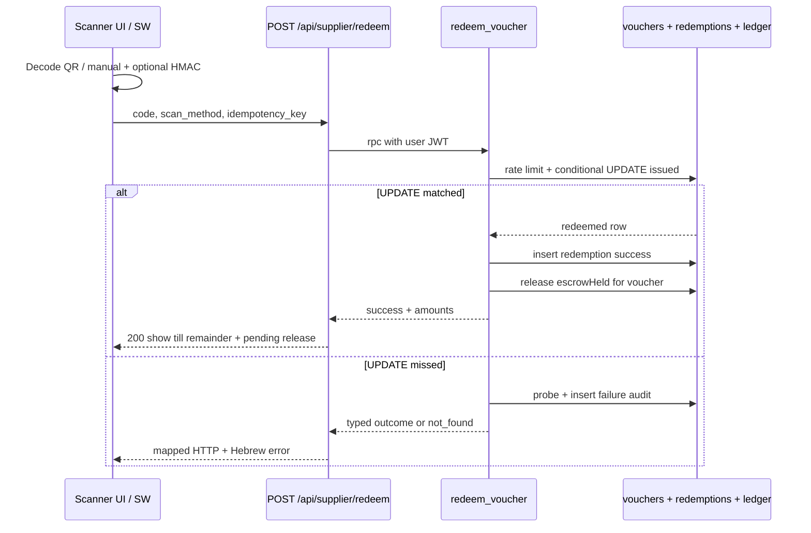

# ARCHITECTURE-SUPPLIER-PORTAL.md

KenyonExpress supplier portal and coupon redemption architecture.

Status: BINDING for branch `arch/supplier-portal` (2026-07-27)
Stack: Next.js App Router (`/supplier/**`), Supabase Postgres + RLS, PWA scanner, Route Handler redeem
Money: agorot integers internally; ILS with 2 decimals on the wire
Canonical redeem RPC: `public.redeem_voucher(p_code, p_scan_method, p_idempotency_key)` (migration 054+)

This document decides. Where older drafts said the platform keeps 100% of every coupon prepayment and the supplier gets 0 from the platform, the 2026-07-27 C11(b) ruling wins: the platform keeps only `platform_percent` of the on-site prepayment; the supplier share is held internally and released at redemption.

---

## 0. Money model (supplier view)

| Product type | Customer pays online | Customer pays at scan | Platform keeps | Supplier from platform |
|---|---|---|---|---|
| Coupon | Absolute `coupon_price_ils` (admin-set, no percent derivation) | `price_ils - coupon_price_ils` at the till | `platform_percent` of the prepayment | Remainder of the prepayment, held until redeem, then released (T+3 / min payout rules apply to the release path) |
| Physical | Full `price_ils` | 0 | `platform_percent` of the full charge | Remainder, transferred with settlement after T+3 and min 100 ILS |

Definitions used in split / commission code:

- `supplierImmediateIls`: physical only; zero on coupons
- `escrowHeldIls`: coupon only; supplier share of the prepayment held in our ledger until redeem
- `supplierDueIls`: `immediate + held`

"Held" is an internal ledger row only (C3). The money sits in the Cardcom settlement account. There is no third-party escrow agent, no J5, and no hold on the customer's card.

`platform_percent` is mandatory on **both** product types. No default anywhere (C1/C2). Complementary admin display percent may exist, but a DB constraint forces the pair to sum to 100 so money always has one answer.

---

## 1. Roles and portal surface

`profiles.role = 'vendor'` is a routing hint only. Authorization is `supplier_members(is_active)` with `member_role`:

| member_role | Allowed |
|---|---|
| `scanner` | Scan, view own-supplier redemptions, home stats |
| `manager` | scanner + physical orders + limited product view |
| `owner` | manager + team, bank profile, payouts, settings |

Helpers (SECURITY DEFINER, break RLS recursion):

- `is_supplier_member(supplier_id)`
- `is_supplier_owner(supplier_id)`
- `current_supplier_id()` (v1 UI assumes one active supplier)

| Route | Min role | Purpose |
|---|---|---|
| `/supplier` | scanner | Home / today stats |
| `/supplier/scan` | scanner | Camera + manual redeem |
| `/supplier/redemptions` | scanner | Own-supplier scan history |
| `/supplier/orders` | manager | Physical order queue |
| `/supplier/products` | manager | Read / limited edit own catalog |
| `/supplier/team` | owner | Invite managers / scanners |
| `/supplier/payouts` | owner | Statements and bank profile |
| `/supplier/settings` | owner | Business profile |

UI: Hebrew RTL, touch targets >= 44px, offline-capable scan page (PWA).

---

## 2. Onboarding

```
customer submits supplier_applications (status=pending)
  -> admin approves
  -> suppliers row + supplier_members(owner) + profiles.role=vendor
  -> supplier lands on /supplier
```

Reject stores a reason. One pending application per user (partial unique index). Suspended suppliers set `supplier_members.is_active=false` (and/or `suppliers.status='suspended'`), which blocks redeem.

---

## 3. Redeem flow (step-by-step)

Transport: `POST /api/supplier/redeem` (required for service-worker offline drain). Online UI may wrap the same RPC.

Single money-mutating path for voucher state: `public.redeem_voucher`.

Release of `escrowHeld` to the supplier payout pipeline is a **separate** post-success ledger step triggered only after a successful redeem (same transaction or immediately chained SECURITY DEFINER call). Failure to release must not undo the redeem; it retries via idempotent job keyed by `voucher_id`.

### 3.1 Inputs and trust

| Input | Source | Trust |
|---|---|---|
| Session user | Supabase JWT via `getUser()` | Trusted |
| Supplier identity | `supplier_members` for `auth.uid()` | Trusted (never from QR / body) |
| Code | Camera QR or manual entry | Untrusted |
| `scan_method` | `camera` \| `manual` | Clamped server-side |
| `idempotency_key` | Client UUID per attempt | Untrusted; unique when present |

QR format: `KEV1.<base64url payload>.<base64url HMAC-SHA256>`. HMAC proves minting. It is not an authorization token. Single-use is decided only by the conditional UPDATE inside `redeem_voucher`.

### 3.2 Happy path (online)

1. Scanner opens `/supplier/scan` as an active member.
2. Client obtains a code (camera decode or manual normalize to alphanumeric uppercase).
3. Optional app-layer HMAC verify. On failure: call `log_voucher_scan` with `invalid_request`, show "קוד לא תקין", do **not** call redeem.
4. Client creates `idempotency_key = crypto.randomUUID()` once (persist in IndexedDB for offline).
5. Client POST `/api/supplier/redeem`:

```json
{
  "code": "AB12CD34",
  "scan_method": "camera",
  "idempotency_key": "550e8400-e29b-41d4-a716-446655440000"
}
```

6. Route handler:
   - no session → 401 `unauthorized`
   - Zod fail → 400 `invalid_request`
   - call `rpc('redeem_voucher', …)` with the **user JWT** (not service role)
7. RPC:
   1. no `auth.uid()` → `unauthorized`
   2. no active membership → audit `unauthorized`, return same
   3. idempotency hit → replay prior success/failure (key+code mismatch → `invalid_request`)
   4. rate limit `voucher_scan` 30 / 60s / user → `rate_limited`
   5. atomic UPDATE where `status='issued'` AND `expires_at > now()` AND `supplier_id` in caller's memberships; set redeemed provenance; `redeemed_amount_collected_agorot = remaining_amount_due_agorot`
   6. success → insert `voucher_redemptions`, return success payload; enqueue / run escrow release for this voucher
   7. miss → probe, classify (3.4), always insert audit row
8. UI success:
   - product name, customer name if present
   - **יתרה לגבייה בבית העסק** = `remaining_amount_due_agorot / 100`
   - show that a platform release of the held prepayment share is now pending (not cash in hand from KE yet)
   - clear scanner for next code
9. Business collects the till balance outside the platform (cash/card at store).

### 3.3 Offline queue

1. After local accept (HMAC ok or manual), store intent in IndexedDB `redeem_intents`.
2. Service worker / foreground sync POSTs each intent when online.
3. Same `idempotency_key` makes double drain safe.
4. UI marks `synced` | `failed`; never silently drop `already_redeemed`.

### 3.4 Error matrix

| Outcome | HTTP | When | UX (Hebrew) | Retry? |
|---|---|---|---|---|
| `success` | 200 | UPDATE matched | יתרה לגבייה + אישור | No |
| `success` + `replayed` | 200 | Idempotent retry | אותו מסך הצלחה | No |
| `unauthorized` | 401 | No session / membership | אין הרשאת סריקה | Fix auth |
| `invalid_request` | 400 | Bad body / HMAC / key reuse with different code | בקשה לא תקינה | New key |
| `rate_limited` | 429 | >30 scans / min | נסה שוב בעוד רגע | After wait |
| `already_redeemed` | 409 | Already redeemed (detail only for owning supplier) | כבר מומש | No |
| `expired` | 410 | Expired | פג תוקף | No |
| `cancelled` | 409 | Cancelled | בוטל | No |
| `refunded` | 409 | Refunded | זוכה | No |
| `not_found` | 404 | Unknown code **or** `wrong_supplier` (collapsed) | קוד לא נמצא | Check code |
| `INTERNAL` | 500 | Unexpected | שגיאה פנימית | Same idempotency key |

Notes:

- `wrong_supplier` is stored in audit but returned as `not_found` (anti-enumeration).
- Concurrent double-scan: second UPDATE matches 0 rows → `already_redeemed`.
- Forged QR cannot redirect supplier identity; membership ∩ row decides.

### 3.5 Sequence



### 3.6 Success payload

```json
{
  "outcome": "success",
  "voucher_id": "uuid",
  "code": "AB12CD34",
  "status": "redeemed",
  "product_name": "…",
  "supplier_name": "…",
  "customer_name": "…",
  "face_value_agorot": 10000,
  "coupon_price_agorot": 900,
  "remaining_amount_due_agorot": 9100,
  "escrow_released_agorot": 720,
  "redeemed_at": "2026-07-27T00:00:00Z",
  "offer_valid_until": null,
  "replayed": false
}
```

`escrow_released_agorot` is the supplier share of the prepayment that moves from held → payable on this redeem (may be 0 if already released on replay). Till collection remains `remaining_amount_due_agorot`.

---

## 4. API surface

| Method | Route / Action | Auth | Purpose |
|---|---|---|---|
| `POST` | `/api/supplier/redeem` | scanner+ | Redeem / drain queue |
| RPC/action | `log_voucher_scan` | scanner | Audit pre-DB rejects |
| RSC | `/supplier/redemptions` | scanner | List via RLS |
| RSC | `/supplier/orders` | manager | Own physical orders |
| Action | `updateSupplierProfile` | owner | Non-bank fields |
| Action | `inviteSupplierMember` | owner | Add manager/scanner |
| Action | `removeSupplierMember` | owner | Deactivate member |

Envelope for Server Actions:

```ts
type ActionResult<T> =
  | { ok: true; data: T }
  | { ok: false; error: { code: string; message: string; details?: Record<string, unknown> } }
```

---

## 5. RLS (supplier scope)

```sql
CREATE OR REPLACE FUNCTION public.is_supplier_member(p_supplier uuid)
RETURNS boolean
LANGUAGE sql
STABLE
SECURITY DEFINER
SET search_path = public
AS $$
  SELECT EXISTS (
    SELECT 1
    FROM public.supplier_members sm
    WHERE sm.supplier_id = p_supplier
      AND sm.user_id = auth.uid()
      AND sm.is_active
  );
$$;

REVOKE ALL ON FUNCTION public.is_supplier_member(uuid) FROM PUBLIC, anon;
GRANT EXECUTE ON FUNCTION public.is_supplier_member(uuid) TO authenticated;

ALTER TABLE public.vouchers ENABLE ROW LEVEL SECURITY;
ALTER TABLE public.vouchers FORCE ROW LEVEL SECURITY;

DROP POLICY IF EXISTS vouchers_supplier_read_own ON public.vouchers;
CREATE POLICY vouchers_supplier_read_own
  ON public.vouchers
  FOR SELECT
  TO authenticated
  USING (public.is_supplier_member(supplier_id));

-- No authenticated UPDATE/DELETE on vouchers. Redeem is RPC-only.

ALTER TABLE public.voucher_redemptions ENABLE ROW LEVEL SECURITY;
ALTER TABLE public.voucher_redemptions FORCE ROW LEVEL SECURITY;

DROP POLICY IF EXISTS voucher_redemptions_supplier_read ON public.voucher_redemptions;
CREATE POLICY voucher_redemptions_supplier_read
  ON public.voucher_redemptions
  FOR SELECT
  TO authenticated
  USING (
    supplier_id IS NOT NULL
    AND public.is_supplier_member(supplier_id)
  );

DROP POLICY IF EXISTS orders_supplier_read ON public.orders;
CREATE POLICY orders_supplier_read
  ON public.orders
  FOR SELECT
  TO authenticated
  USING (
    EXISTS (
      SELECT 1
      FROM public.order_items oi
      WHERE oi.order_id = orders.id
        AND oi.supplier_id IS NOT NULL
        AND public.is_supplier_member(oi.supplier_id)
    )
    AND status IN (
      'paid', 'fulfilled', 'partially_fulfilled', 'refunded', 'cancelled'
    )
  );
```

Bank columns on `suppliers` are owner-readable only (separate column privilege or view). Staff/admin read paths stay on the service-role client after `requireAdminSession`.

---

## 6. Physical orders and payouts

- Manager sees own `order_items` after payment.
- Mark shipped / ready via Server Action (service role or definer). Never client UPDATE on `orders`.
- Payout statements: T+3 Israeli business days; minimum 100 ILS; below threshold closes as `cancelled` with `rolled_over=true`.
- Coupon escrow releases enter the same payout pipeline as physical supplier shares once released at redeem.

---

## 7. Security checklist

- [ ] QR HMAC keyed (not bare sha256)
- [ ] Redeem uses user JWT + membership; never trusts `supplier_id` from body
- [ ] `wrong_supplier` collapsed to `not_found` externally
- [ ] Rate limit 30/min/user on scan
- [ ] Offline intents carry stable idempotency keys
- [ ] Bank fields visible to owner only
- [ ] Suspended membership blocks redeem
- [ ] Escrow release is idempotent per `voucher_id`

---

## 8. Acceptance checklist

- [ ] Double-scan → one `redeemed` row, one success + one `already_redeemed`
- [ ] Store A cannot redeem store B (sees `not_found`)
- [ ] Success UI shows till remainder and pending/released escrow share
- [ ] Offline drain of the same intent is idempotent
- [ ] PostgREST client cannot UPDATE vouchers to forged success
- [ ] `platform_percent` missing on a coupon line fails pricing before checkout (no silent 0)

---

## 9. Implementation map

| Area | Home |
|---|---|
| Portal pages | `src/app/(supplier)/**` (target) |
| Redeem route | `src/app/api/supplier/redeem/route.ts` |
| Split / commission | `src/lib/commerce/commission.ts`, `src/lib/checkout/split.ts` |
| RPC | `supabase/migrations/054_voucher_redemption.sql` (+ escrow release follow-up) |
| Related admin spec | `docs/ARCHITECTURE-SUPPLIER-REDEMPTION.md`, admin architecture docs |
