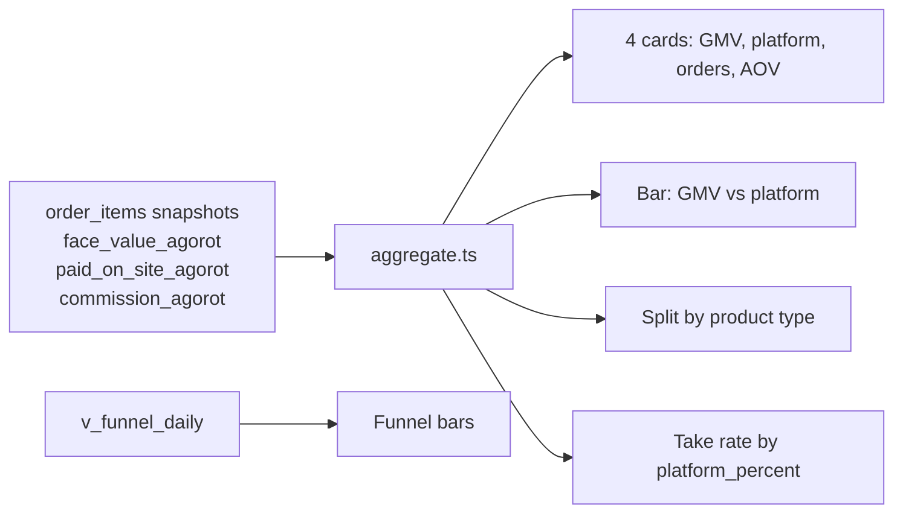

# Business KPIs (v1.2)

Standalone definitions for KenyonExpress. Money is integer **agorot** in the database (1 ₪ = 100 agorot). Dashboards convert once, at display. Never average floats along the money path.

Two different "GMV" numbers exist. Using the wrong one as take-rate denominator lies about coupons.

KenyonExpress is a platform. Coupon on-site cash is **platform revenue**, not a supplier payout. Physical residual after `platform_percent` is what a supplier might eventually be paid (T+3, min 100 ₪), and those payout tables are **not installed** in production.

---

## 0. Clock, grain, source of truth

| Rule | Value |
| --- | --- |
| Paid order | `orders.paid_at IS NOT NULL`. Redirect is not payment |
| Business day | `Asia/Jerusalem`. Weeks start Sunday |
| Snapshots | `order_items` freeze `platform_percent` / agorot columns at purchase. Changing a product today must not rewrite yesterday |
| Engine | `src/lib/analytics/aggregate.ts` (unit-tested). Load: `src/server/analytics/queries.ts` |
| Row cap | 20_000 lines per window. Over cap → truncated banner, totals understate |
| Who sees platform totals | Admin `/admin/analytics`. Suppliers do not see platform GMV |



---

## 1. Metric dictionary

All formulas first in agorot, then display ₪.

### 1.1 GMV (two definitions)

**A. Face-value GMV (what `/admin/analytics` labels "מחזור")**

```
GMV_face_agorot = sum(order_items.face_value_agorot)
                  for items whose parent order has paid_at in the window
                  and deleted_at is null
```

For a coupon this is the **deal face value** (on-site price + remainder at the till), not what Cardcom charged. Caption on the bar chart: "מחזור לפי שווי פנים".

**B. On-site GMV (KPI architecture doc; Cardcom-shaped)**

```
GMV_onsite_agorot = sum(order_items.paid_on_site_agorot)   -- preferred, snapshotted
                 or sum(orders.total_* agorot)             -- order grain
```

Use B when asking "how much money hit Cardcom". Use A when asking "how big were the deals". Do not mix them in one take-rate.

AOV on the live page:

```
AOV_ils = GMV_face_ils / count(distinct order_id)
```

### 1.2 Platform revenue (take)

```
platform_revenue_agorot = sum(order_items.commission_agorot)
```

That column is the snapshot of what the platform kept **from the on-site charge**, not from face value.

| Product kind | Customer pays on site | Platform keeps | Supplier from platform |
| --- | --- | --- | --- |
| `coupon` | `coupon_price` (`paid_on_site`) | **100% of on-site** | **0**. Remainder is cash at the till |
| `physical` | Full price | `platform_percent` of the charge | Residual. Eligible after T+3 and min 100 ₪ |
| `recurring` | `recurring_amount` per cycle | snapshotted `platform_percent` | Residual on `subscription_charges` (schema pending) |

There is **no default** `platform_percent`. Missing percent is a publish error, not 10.

**Take rate** as the dashboard computes it (`takeRateByPlatformPercent`):

```
take_rate_pct = 100 * platform_revenue / GMV_face
```

For coupons that ratio is **not** 100%, because the denominator still includes the till remainder. A coupon take rate vs on-site GMV is 100% by C11 (2026-07-28). Say which denominator you are using.

### 1.3 Redemption

```
issued     = count(vouchers) created in window
redeemed   = count(vouchers) with redeemed_at in window
             (or status redeemed; pick one and do not mix)
redeem_rate = redeemed / issued
```

Live `/admin/dashboard` shows issued vs redeemed **today**, not a trailing rate on `/admin/analytics`. Time-to-redeem and expiry rate are in the KPI architecture doc and **not** on the analytics page.

Expiry (C6): unredeemed past date → wallet credit of the **on-site** amount. That is not a refund to card and not platform "kept" in the customer-facing sense.

### 1.4 Refunds

```
refund_agorot = sum of completed refunds in window (card path via Cardcom RefundDeal)
refund_rate   = refund_agorot / GMV_onsite_agorot
              or count(refunded orders) / count(paid orders)
```

`/admin/reports` exposes `refundedAgorot` (partial). There is **no** refund-rate chart on `/admin/analytics`. Soft-launch: cancel unredeemed coupon within 14 days → card; redeemed → no ordinary cancel.

### 1.5 Payout lag

Policy (C8), not a live computed KPI:

- Eligibility clock starts at **delivery / fulfilment** of a **physical** line, not at payment.
- Hold: **T+3 Israeli business days** (Sun–Thu). `add_business_days` skips Fri and Sat in `Asia/Jerusalem`.
- Minimum statement: **100 ₪** (10000 agorot). Below that: rollover (`cancelled` + `rolled_over`), lines freed.
- Coupons: **zero** platform→supplier payout.

```
payout_lag_days = paid_at (statement) - available_at
                where available_at = add_business_days(delivered_at, 3)
```

Not implemented as a dashboard series. Admin `/admin/payouts` is the operator screen; RPCs missing in production (`NOT_INSTALLED`). Soft-launch: **manual** bank transfer, no weekly cron.

---

## 2. Dashboard spec

### 2.1 `/admin/analytics` (implemented)

Auth: `requireAdminPage()`. Never cached.

| Control | Spec |
| --- | --- |
| Periods | `?period=day` 30 days of daily bars (default); `week` 90 days; `month` 365 days |
| Card 1 | מחזור = GMV_face |
| Card 2 | הכנסות פלטפורמה = sum(commission) |
| Card 3 | הזמנות = distinct paid orders |
| Card 4 | ממוצע להזמנה = AOV from GMV_face |
| Bar chart | Primary GMV_face, secondary platform revenue |
| Funnel | From `v_funnel_daily` if the view exists; else unavailable copy, money cards still render. Purchases counted from orders, not events |
| Type split | `coupon` vs `physical` (labels in the page). Recurring is **not** a slice yet |
| Take rate panel | Grouped by snapshotted `platform_percent` |
| Top products | Top 10 by GMV_face |

Truncation: amber banner if 20k line cap hit. Next step is SQL aggregation, not raising the cap silently.

### 2.2 `/admin/dashboard` (implemented, operational)

Today's orders, on-site collected, coupons issued / redeemed. Not a trailing KPI studio.

### 2.3 `/admin/reports` (partial)

Includes refunded agorot. Settlement/payout reports are limited until migration 081 is applied.

### 2.4 `/supplier` (supplier-scoped)

Redemptions and "what we owe you" from order lines. Must **not** show platform take or other suppliers.

### 2.5 Missing vs the architecture KPI doc

| KPI | On `/admin/analytics` today? |
| --- | --- |
| GMV face | Yes |
| GMV on-site as its own card | No (column is loaded as `chargedOnSiteIls`, not a card) |
| Platform revenue | Yes |
| Take rate by percent | Yes |
| Type split coupon/physical | Yes |
| Recurring slice | No |
| Redeem rate / time-to-redeem | No (dashboard today-only) |
| Refund rate | No |
| Payout lag | No |
| Search zero-results | No |
| View→ATC→checkout funnel completeness | Partial; depends on `v_funnel_daily` |

---

## 3. How to read a coupon vs a physical row

Example, integer agorot only:

| | Coupon deal 200 ₪ face, 50 ₪ on site | Physical 200 ₪, 15% platform |
| --- | --- | --- |
| `face_value_agorot` | 20000 | 20000 |
| `paid_on_site_agorot` | 5000 | 20000 |
| `commission_agorot` | 5000 | 3000 |
| `supplier_immediate_agorot` | 0 | 17000 |
| GMV_face | 20000 | 20000 |
| GMV_onsite | 5000 | 20000 |
| Take vs face | 25% | 15% |
| Take vs on-site | 100% | 15% |
| Payout from platform | none | 17000 after T+3 and min 100 ₪ accrued |

---

## 4. Source files

- `src/lib/analytics/aggregate.ts`
- `src/server/analytics/queries.ts`
- `src/app/(admin)/admin/analytics/page.tsx`
- `docs/ARCHITECTURE-ANALYTICS-KPI.md`
- `docs/BUSINESS-MODEL.md`
- `docs/CONTRADICTIONS.md` (C1, C8, C11)
- `src/lib/commerce/money.ts` (`AGOROT_PER_ILS = 100`)
