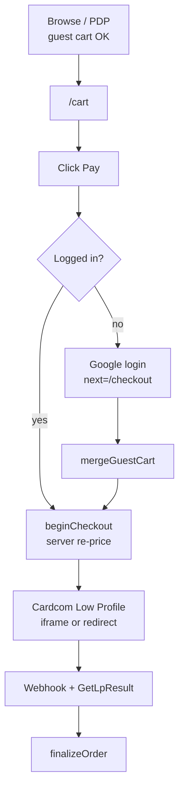

# Conversion playbook (v1.4)

Standalone conversion document for KenyonExpress. Funnel steps are from the live checkout code. Competitor notes are **market observation**, not measurements from this repository. Payment methods that are not in `src/lib/payments` are named as gaps, not as features.

KenyonExpress is a platform. The customer pays on the site; the supplier is named; PAN never hits our origin.

**Pixel gate:** storefront vs live KenyonExpress must stay under 11% (`scripts/compare.mjs`). Conversion copy that adds a new home strip can break that gate. See `docs/ELECTRO-COMPONENT-MAP.md`.

---

## 0. What ships today vs what Israelis expect

| Method | In this codebase | Israeli shopper expectation (market, not measured here) |
| --- | --- | --- |
| Credit card via Cardcom Low Profile | **Yes.** Only method on `/checkout` | Baseline |
| Saved Cardcom token | **Yes.** `ChargeAndCreateToken` / `ChargeToken` | Expected after first buy |
| Wallet credit as on-site discount | **Yes.** Never cashes out | Familiar on local marketplaces |
| **Bit** | **No.** Zero matches in payment adapter | Default at Zap, KSP, Super-Pharm class checkouts |
| **Installments (תשלומים)** | **No.** No `NumOfPayments` | Default on ₪200+ electronics and many deal sites |
| **Apple Pay** | **No** | Expected on Safari / iOS for national retailers |
| **Google Pay** | **No** | Secondary to Bit/card |
| Guest pay without login | **No.** Login at Pay (Google) | Mixed: Amazon-like 1-click vs IL coupon sites that force account |

Do not put Bit / Apple Pay / installment logos on the checkout until Cardcom actually charges them. A logo without a rail is a chargeback and a legal problem (offer that cannot be completed).

---

## 1. Shared funnel (all product kinds)

Implemented spine:

| Step | Code | Conversion note |
| --- | --- | --- |
| Guest browse + add to cart | Cart store + DB | Do not force login earlier. That is the documented model |
| Login at Pay | `CheckoutForm.tsx` UI; `beginCheckout` refuses guests | Copy must say why: "כדי לשמור את הקופון בחשבון" |
| Merge guest cart | `auth/callback` + `mergeGuestCart` | Silent. If merge drops a line, that is a conversion bug, not a feature |
| Server re-price | `beginCheckout` | Never trust client totals. Money is agorot |
| Cardcom hosted page | `cardcom.ts` Low Profile | Trust copy: payment on Cardcom, not on our form |
| Analytics | Client `checkout_step`: `identity` / `address` / `payment_redirect`. Server `begin_checkout`. Purchase from `orders.paid_at`, not from a pixel alone | |

Admin funnel: `/admin/analytics` reads `v_funnel_daily` when it exists. Purchases from orders.

---

## 2. Funnel per product kind

### 2.1 Coupon (live, soft-launch)

| Stage | What the customer must understand | Failure if omitted |
| --- | --- | --- |
| PDP | On-site price **and** till remainder. Named supplier. Expiry days (no default) | 14ג disclosure miss; till fight |
| Cart | Same two amounts. No shipping block | Surprise at Pay |
| Checkout | Contact only. No address. Card + optional wallet | Extra fields kill coupon conversion |
| After pay | QR in `/account/coupons` + email | "Charged, no coupon" support load |
| Redeem | Scan once at `/scan`. Remainder at till | Double-scan / overcharge |

Do not show a shipping progress bar. Do not say "הכסף אצל הספק בנאמנות".

### 2.2 Physical (code is first-class; business model still calls it a later stage)

| Stage | Behaviour in code |
| --- | --- |
| Checkout | `requiresAddress` when the cart has physical (`checkout.ts`) |
| After pay | Split by snapshotted `platform_percent`; supplier ships |
| Trust | Named supplier, Israel address, returns window on the legal page |

Conversion cost: every extra address field. Keep IL-only, no "company / VAT" unless invoicing needs it.

Tension to keep in this playbook: `BUSINESS-MODEL.md` still labels physical as future; checkout already branches on it. Marketing must not advertise nationwide delivery until ops actually ships.

### 2.3 Recurring

**Not a live checkout path.** Admin fields + `recurring.ts` + pending migration 135. `checkout.ts` / `finalize.ts` have no `recurring` branch. Do not run ads to a subscribe CTA that cannot insert a row.

When it exists: first charge on Low Profile + token; later cycles `ChargeToken` (see `docs/SUBSCRIPTIONS-ARCHITECTURE.md` if present on another docs branch). Cancel anytime, no refund of the paid period, in current cancel copy.

---

## 3. Israeli payment expectations (and what we do instead)

### 3.1 Bit

Market: Israelis pay friends and many retailers with Bit (Discount Bank rail). Zap and KSP-class checkouts put Bit next to card.

**Us:** Cardcom Low Profile card only. Affiliates docs explicitly forbid Bit for partner cash-out (wallet only). Same honesty at customer checkout: do not imply Bit.

If Cardcom later enables Bit on the same terminal, it still needs: env, Low Profile method flags, a test charge, and checkout UI that only appears when the terminal actually has the method. Until then the playbook is: **card + wallet**.

### 3.2 Installments (תשלומים)

Market: 3–36 payments, often "ללא ריבית" on a threshold. Electronics (KSP) and comparison (Zap) lead with the monthly number, not the cash price.

**Us:** no installment field is posted. Showing "3 תשלומים" would be a false offer. If we add it, the number of payments must come from Cardcom's allowed set for that terminal, and the legal price is still the cash total (חוק אשראי הוגן / disclosure of full cost).

Coupon economics: installment on a ₪49 on-site coupon is usually not worth the UI. Physical / high face-value is where it would matter.

### 3.3 Apple Pay / Google Pay

Market: Apple Pay on Safari is table stakes for national retailers. Google Pay is weaker in IL than Bit.

**Us:** PAN never on origin (SAQ-A via hosted page). Apple Pay would have to be Cardcom's hosted wallet, not a Stripe Payment Request Button. Do not add an Apple mark that opens the same card form.

### 3.4 What we already match

- PAN not on `kenyonexpress.co.il` (Cardcom domain).
- Hebrew RTL checkout.
- Wallet as partial tender.
- Login only at Pay (lower browse friction than forcing Google on first PDP).

---

## 4. Trust signals

| Signal | Status | Conversion use |
| --- | --- | --- |
| Named supplier + phone / Waze when present | **Live** `SupplierInfo` | Local coupon sites win on "עסק אמיתי". Required by business model |
| Header chips: פריסה ארצית / משלוח מהיר חינם / קניה בטוחה | **Live** | "משלוח מהיר חינם" is Electro-live copy. Soft-launch is coupons: do not amplify shipping claims in ads |
| BenefitBar USPs | **Live** | Marketing, not SSL |
| `InfoBar` quantified "99%" | **Dead. Must not revive** | Invented stats. Illegal-ish marketing and a pixel leftover |
| Star ratings / review count | **Not live.** Forbidden in JSON-LD | Do not fake Groupon-style "4.6 (2,104)" |
| Returns / 14-day | Legal page exists | Link from checkout, do not invent a TrustIcons row that the pixel gate did not measure |
| Cardcom by name on Pay | **Live** | Israelis know the brand more than "PCI" |

Fake social proof (invented buyer counts, competitor "beats Zap by 12%") is forbidden in growth docs. Post-redemption "איך היה?" is support, not a public star.

---

## 5. Benchmarks (market observation)

Not scraped from those sites in this run. Use as design contrast, not as a promise we copy pixel-for-pixel (our pixel authority is **our** live home, Electro-shaped).

| Site | What they train IL users to expect | What we copy | What we refuse |
| --- | --- | --- | --- |
| **Groupon** (deals) | Sold count, countdown, remaining at venue, "fine print" before pay | Till remainder + expiry **before** Pay (legal, not decorative). Named merchant | Fake sold-count; scraped WP reviews (324 comments, not imported) |
| **Zap** | Compare grid, many tenders, installment price as hero | Price honesty, category grid language | Bit/installments logos we cannot charge; review aggregation we do not have |
| **KSP** | Stock urgency, Bit, Apple Pay, 3 payments, pickup vs delivery | Supplier as the "store". Address only when physical | Inventory theatre on coupons; shipping SKUs we do not fulfil |
| **Amazon** | 1-click, returns, ratings, saved address | Guest cart; saved card token after first buy | Ratings; 1-click that skips Cardcom hosted page (PCI + IL cancellation disclosure) |

Conversion hierarchy for **us**, given the rails we actually have:

1. Disclose till remainder and supplier name (legal + conversion).
2. Keep login at Pay, not earlier.
3. Fast path: saved token + wallet.
4. Coupon email/QR reliability (`notifications` cron). A paid user with no voucher does not convert twice.
5. Do not add home modules that blow the 11% pixel gate (CityTags measured 21.65% with vs 9.77% without).

---

## 6. Anti-patterns

- Checkout fields that physical needs, shown on coupon-only carts.
- "החזר מיידי".
- Escrow / נאמן language.
- 10% first-order discount (not verified in checkout code).
- Subscribe CTA before 135 + insert path.
- Trust badges with numbers nobody measured.

---

## 7. Source files

- `src/app/(store)/checkout/CheckoutForm.tsx`
- `src/server/actions/payments/checkout.ts`
- `src/server/payments/finalize.ts`
- `src/lib/payments/cardcom.ts`
- `src/lib/analytics/events.ts`
- `docs/ARCHITECTURE-CART-CHECKOUT.md`
- `docs/ARCHITECTURE-CHECKOUT-CARDCOM.md`
- `docs/BUSINESS-MODEL.md`
- `src/components/storefront/SupplierInfo.tsx`
- `src/components/layout/InfoBar.tsx` (do not revive)
