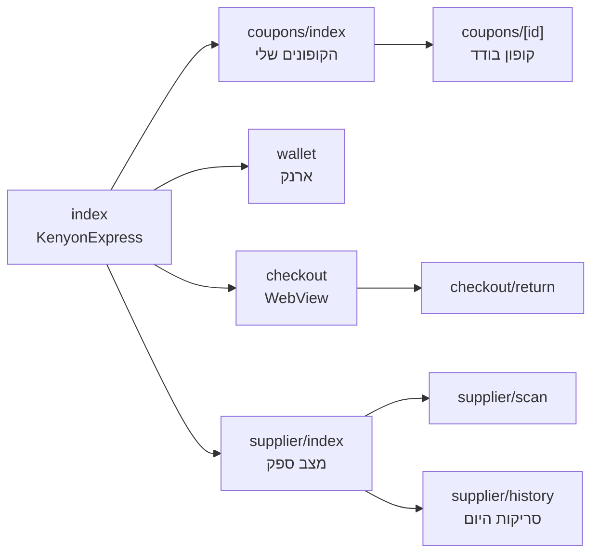
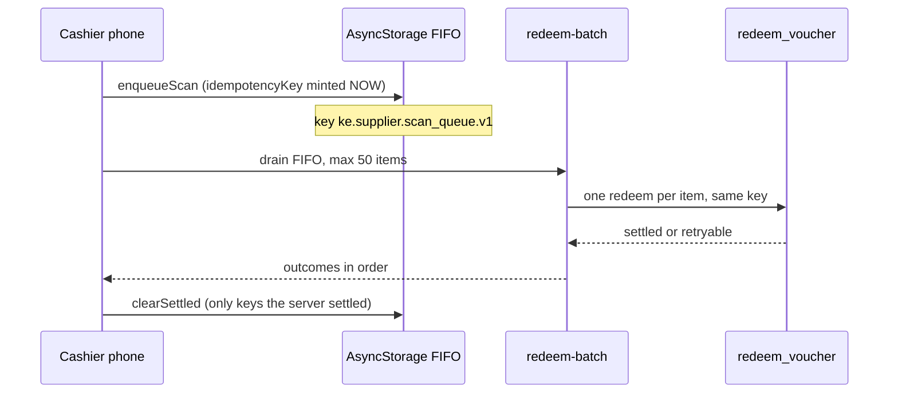

# Mobile supplier app (v1.2)

Standalone document of the Expo app under `apps/mobile`, focused on the supplier scanner. Ground truth is the app code and the server redeem path, not older "super-app" sketches that still list screens this tree does not ship.

**Status as of 2026-09-02:**

| Layer | Status |
| --- | --- |
| Expo Router app (`apps/mobile`) | Implemented in repo, version `0.2.0` |
| Supplier scan + offline queue | Implemented |
| Server idempotency + batch redeem | Implemented |
| Coupon QR drawn inside the app | **Not built.** Screen shows the code and opens the website QR |
| EAS build / App Store / Play submit | **Not done.** No `eas.json`, no credentials |
| In production stores | **Not submitted** |

The app is **outside** the root pnpm workspace on purpose. Root `pnpm test` / `pnpm type-check` / `pnpm lint` do not typecheck this tree. Server pieces that the app depends on (`src/lib/push/*`, `src/app/api/app/*`, `src/lib/vouchers/offline-scan.ts`) **are** gated at the root.

KenyonExpress is a platform. The mobile app does **not** reimplement money. Checkout runs in a WebView against the same `beginCheckout` / `submitCheckout` the browser uses.

---

## 1. Identity

| Field | Value |
| --- | --- |
| Name | KenyonExpress |
| Expo slug | `kenyonexpress` |
| Version | `0.2.0` (`apps/mobile/app.json`) |
| iOS bundle id | `co.il.kenyonexpress.app` |
| Android package | `co.il.kenyonexpress.app` |
| URL scheme | `kenyonexpress://` (internal only: payment return, OAuth) |
| Universal links | `https://kenyonexpress.co.il/...` |
| Expo SDK | `~52.0.0` |

Universal links go in email, push, and anything a human might share. The custom scheme must never appear in email. A phone without the app that receives `kenyonexpress://` shows an error.

---

## 2. Screens

Registered in `apps/mobile/app/_layout.tsx`.



| Route | Title | Who | Notes |
| --- | --- | --- | --- |
| `/` | KenyonExpress | Customer | Home |
| `/coupons` | הקופונים שלי | Customer | List. No local QR render |
| `/coupons/[id]` | coupon | Customer | Code + link to website QR page |
| `/wallet` | wallet | Customer | Internal credit. Never cashes out |
| `/checkout` | checkout | Customer | WebView of the site cart |
| `/checkout/return` | return | Customer | Reads order state from DB, not from URL `status` |
| `/supplier` | מצב ספק | Supplier | Three distinct empty states (see below) |
| `/supplier/scan` | scan | Supplier | Camera or manual code |
| `/supplier/history` | סריקות היום | Supplier | Settled (server) vs pending (device), never merged |

There is **no** catalogue and **no** cart in the app. The session bridge is `GET/POST /api/app/session`.

### 2.1 Supplier home: three states, not one

`suppliers.app_scanning_enabled` is born `false` (migration 115). The home screen does not collapse these:

1. The signed-in user is not a supplier member.
2. Scanning is disabled for this business.
3. No staff rows exist yet.

The screen gate is courtesy only. `redeem_voucher` derives the supplier from membership and refuses regardless of what the screen painted.

Staff PIN is **attribution, not authorization**. A wrong PIN does not block a scan; it leaves the scan unnamed. Businesses with no staff yet must still sell. PIN is bcrypt (`bf` cost 10), lockout per staff member, 15 attempts per hour on the route.

---

## 3. Offline queue

Source: `apps/mobile/src/lib/supplier/queue.ts`. Server twin: `src/lib/vouchers/offline-scan.ts`. Drain: `POST /api/supplier/vouchers/redeem-batch`.



### 3.1 Rules that are in the code

| Rule | Behaviour |
| --- | --- |
| Storage | AsyncStorage, not SecureStore. A day's queue is a list; SecureStore is one string under 2 KB per key |
| Key | Minted **at scan time**: `scan-${time}-${random}` |
| Order | FIFO. Two offline scans of the same voucher become success then `already_redeemed` |
| Dedupe on device | Same `idempotencyKey` twice is a double-tap, not two sales |
| Batch size | Max 50 items. **Not** all-or-nothing. Twenty scans are twenty facts |
| What leaves the queue | Only outcomes the server settled |
| Sign-out | Queue is wiped. Unsynced scans are lost on purpose: voucher codes of business A on a phone that changed hands is worse |

### 3.2 Settled vs retryable

From `src/lib/vouchers/offline-scan.ts`:

**Settled (leave the queue):**

`success`, `already_redeemed`, `expired`, `cancelled`, `refunded`, `not_found`, `wrong_supplier`, `invalid_signature`, `invalid_request`, `unauthorized`

**Retryable (stay in the queue):**

`error`, `rate_limited`

`expired` is settled. It is the outcome a real queue hits most after an outage. Retrying it forever is a pending count that never reaches zero.

Replay of the same key reports `replayed` / `already_redeemed`. The voucher burns exactly once even if the queue is drained twice, from two devices, or after the app was killed mid-request.

### 3.3 What the cashier sees

A scan saved offline is **not** shown as redeemed. Copy: "נשמר לסנכרון · השובר טרם מומש". History keeps settled rows (from the database) and pending rows (from the device) in two lists. Merging them is how a cashier comes to believe a sale went through.

Sound is the primary signal (phone held forward; haptic is missed). iOS plays even in silent mode, supplier mode only. Tones live as data URIs in `apps/mobile/src/lib/supplier/tones.ts`.

---

## 4. Sync conflicts

There is no separate "conflict UI". The server decides.

| Situation | Outcome |
| --- | --- |
| Same key drained twice | Second call is a replay. Voucher already burned. Item settled |
| Two keys, same voucher, FIFO | First `success`, second `already_redeemed` |
| Online scan while an offline copy of the same voucher sits in the queue | Online burns it. Offline drain later settles as `already_redeemed` |
| Network error / 429 | Item stays queued |
| Wrong supplier / bad signature / not found | Settled failure. Do not retry; it will not become a success |
| App killed mid-batch | Next drain resends remaining keys. Idempotency makes that safe |

The till must not invent a local success. Local success is how double-honour happens.

---

## 5. Day-to-day scanning (web is still the default)

Daily onboarding for a shop is **web** `/scan`, not this app. App scanning is off until `app_scanning_enabled` is flipped for that supplier.

Web paths (same redeem RPC):

- `https://kenyonexpress.vercel.app/scan` (current production origin)
- `https://kenyonexpress.co.il/scan` (after DNS cutover)
- `/supplier/scan` redirects to `/scan`

---

## 6. Store submission

**Not performed.** There is no `eas.json` under `apps/mobile`. README: "לא בוצע build. אין כאן EAS credentials."

### 6.1 What must exist before a store listing is even possible

1. Apple Developer account and Google Play Console account (owner, not an agent).
2. `eas init` so `extra.eas.projectId` is set. Without it `getExpoPushTokenAsync` fails.
3. `eas.json` profiles. Architecture draft (`docs/ARCHITECTURE-MOBILE-SUPERAPP.md` §7.1) names `development`, `preview`, `production`, OTA with `runtimeVersion: appVersion`. That file is a plan, not a config in this tree.
4. A device build that proves native modules. Coupon QR needs `react-native-qrcode-svg` + `react-native-svg`; those need a real binary.
5. Privacy nutrition labels: camera (scan), approximate location is **not** used by the supplier scanner (customer "near me" is website-only, URL query, see `docs/GEO-ARCHITECTURE.md` if present). Push requires the Expo project id and server `PUSH_ENABLED=true`.
6. Listing copy, screenshots, support URL (`https://kenyonexpress.co.il/contact`), privacy URL (`https://kenyonexpress.co.il/legal/privacy`). None of these assets live in the repo.

### 6.2 Suggested submit sequence (when credentials exist)

```
cd apps/mobile
pnpm install --ignore-workspace
pnpm type-check
eas build --profile production --platform ios
eas build --profile production --platform android
eas submit --platform ios
eas submit --platform android
```

Do not ship a binary that points checkout at WordPress. Until DNS cutover, `EXPO_PUBLIC` site origin must be the Next deployment (`https://kenyonexpress.vercel.app`), not the apex that still serves WordPress.

Universal link entitches (`apple-app-site-association`, Play assetlinks) must be served from the **same origin** the listing claims. Flipping DNS without those files installed is a store rejection on the next review.

### 6.3 What this document refuses to pretend

- There is no TestFlight build id to paste.
- There is no Play internal-testing track.
- Bundle id `co.il.kenyonexpress.app` is reserved in `app.json` only. Reservation at Apple/Google is an owner console action.

---

## 7. Environment the app needs

| Key | Where | Why |
| --- | --- | --- |
| `EXPO_PUBLIC_SUPABASE_URL` | app `.env` or `app.json` extra | No login without it |
| `EXPO_PUBLIC_SUPABASE_ANON_KEY` | same | Public anon key, same as the website |
| `extra.eas.projectId` | `app.json` after `eas init` | Push token |
| `PUSH_ENABLED=true` | **server**, not the app | Without it the server skips every push |

Deep link contract is duplicated: `src/lib/app/deep-links.ts` on the server and `app.json` here. Changing one without the other breaks the return from payment.

Checkout return:

1. `onShouldStartLoadWithRequest` catches `/checkout/app-return` and closes the WebView before paint.
2. If 3-D Secure bounced the user into the system browser, `/checkout/app-return` itself jumps to `kenyonexpress://`.

`status` on the return URL is decoration. Order state is webhook + `GetLpResult`.

---

## 8. Source files

- `apps/mobile/app.json`
- `apps/mobile/app/_layout.tsx`
- `apps/mobile/app/supplier/scan.tsx`
- `apps/mobile/app/supplier/history.tsx`
- `apps/mobile/src/lib/supplier/queue.ts`
- `apps/mobile/README.md`
- `src/lib/vouchers/offline-scan.ts`
- `src/app/api/supplier/vouchers/redeem-batch/route.ts`
- `docs/ARCHITECTURE-MOBILE-SUPERAPP.md` (plan, including EAS; not a substitute for `eas.json`)
