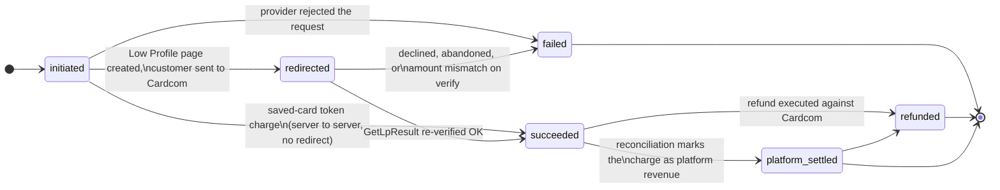
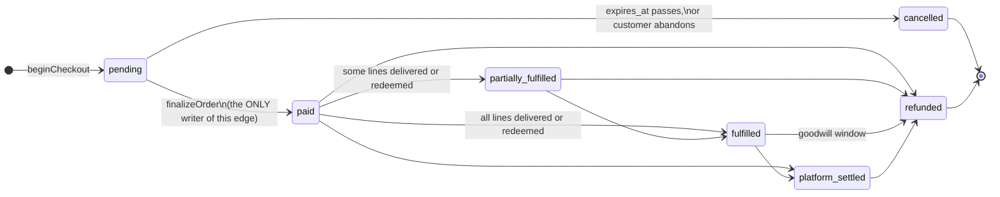
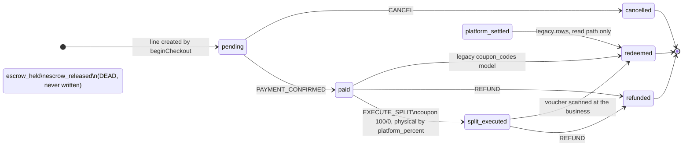
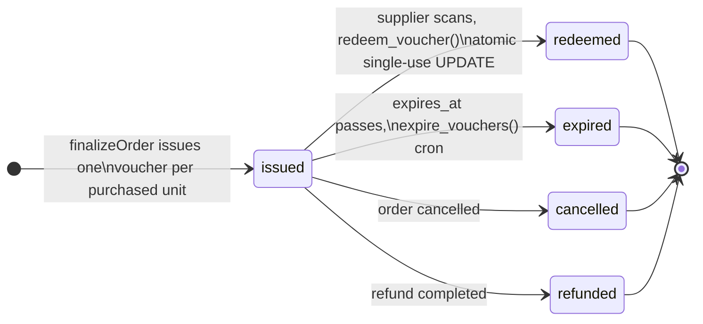
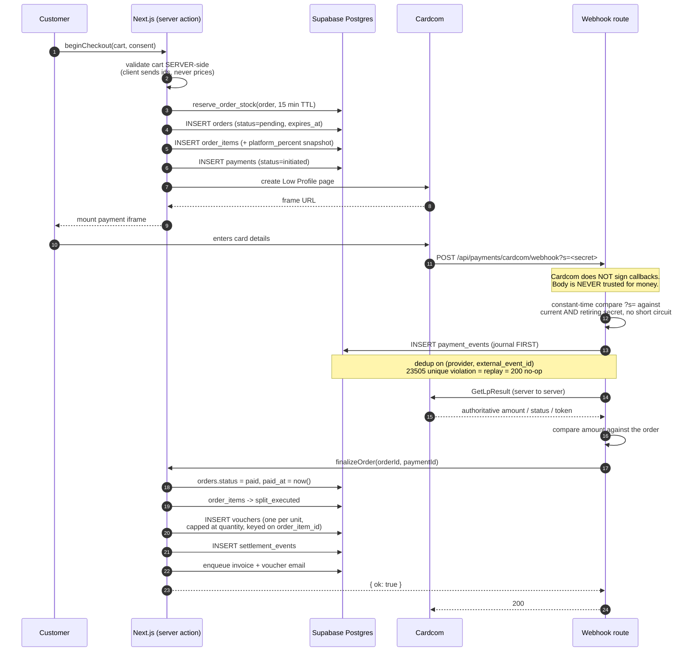

# Payment Flow

How money moves through KenyonExpress, from the cart to a settled order line.

**Every state name in this document is copied from the live enums in the
production database** (`ixvwfbuvfxxsjiywhbbb`, verified 2026-09-01). Where a
state machine in the code admits fewer values than the enum carries, that is
stated explicitly rather than smoothed over, because the difference is the
source of most of the confusion in the older documents.

Companion documents: `docs/ARCHITECTURE-OVERVIEW.md` (§3 money, §4 coupon
lifecycle), `docs/CARDCOM-ARCHITECTURE.md` (provider specifics),
`docs/VOUCHER-LIFECYCLE.md` (what happens after the money settles).

---

## 1. The money rule, in one paragraph

Money is an **integer number of agorot** (1 ₪ = 100 agorot). Rates are **integer
basis points** (10% = 1000 bp). No float touches a money value at any point on
this path. Everything routes through `src/lib/money.ts`. Rounding is integer
half-up and VAT (`VAT_RATE_BP = 1800`, 18%) is extracted from a gross amount by
subtracting the computed net, so `net + vat = gross` exactly.

For a **coupon**, the customer pays `products.coupon_price_ils` on the site, an
absolute admin-set amount, and **all of it stays with the platform
permanently**. The supplier collects the remaining balance in cash at the
counter. **There is no escrow**, no J5, no hold, and no payout to a supplier on
the coupon path. For a **physical** product the customer pays the full price and
the platform keeps `platform_percent` of it.

`platform_percent` is per product, mandatory, has no default anywhere, and is
**snapshotted onto `order_items` at purchase time**. Settlement never reads a
live percentage off a product row.

---

## 2. The live enums

These are the exact value sets production accepts. Writing anything else raises
`22P02` and fails the statement.

| Enum | Values |
|---|---|
| `orders.status` | `pending`, `paid`, `partially_fulfilled`, `fulfilled`, `cancelled`, `refunded`, `platform_settled` |
| `order_items.settlement_status` | `pending`, `paid`, `split_executed`, `escrow_held`, `escrow_released`, `redeemed`, `refunded`, `cancelled`, `platform_settled` |
| `payments.status` | `initiated`, `redirected`, `succeeded`, `failed`, `refunded`, `platform_settled` |
| `voucher_status` | `issued`, `redeemed`, `expired`, `cancelled`, `refunded` |

---

## 3. `payments.status`

The lifecycle of one charge attempt against Cardcom.



Two things this diagram encodes that are easy to get wrong:

- **A token charge never passes through `redirected`.** It is server to server
  and the charge response *is* the outcome, so it goes `initiated -> succeeded`
  or `initiated -> failed` directly.
- **`succeeded -> platform_settled` is a real transition.**
  `terminal-reconciliation.ts` treats `platform_settled` as the same outcome as
  `succeeded`. Any guard that omits it will reject rows the system legitimately
  produces. This was one of the four defects that blocked the first version of
  migration 137.

---

## 4. `orders.status`

The order as the customer sees it.



`src/server/payments/finalize.ts` is the **single writer** of the transition to
`paid`. Nothing else in the codebase may write it. That constraint is what makes
the webhook safe to replay: finalize is idempotent, checks `paid_at` first, and
returns `{ ok: true, replay: true }` rather than acting twice.

---

## 5. `order_items.settlement_status`

The money row. This is where the platform-versus-supplier split is recorded.



### The dead values

`escrow_held` and `escrow_released` are **live enum labels that nothing can
write**. They are residue of the pre-2026-07-24 escrow model, removed by
migration 125. `SettlementState` in
`src/server/domain/orders/state-machine.ts` deliberately does not admit them: a
value the TypeScript type refuses is a row this code can never produce. They
stay in Postgres because you do not drop an enum label from a production
database over a rule change.

### The `redeemed` edge, and why it matters

`redeemed` is reachable and it is terminal. It is written by
`src/server/domain/vouchers/mark-order-item-redeemed.ts` from:

```ts
REDEEMABLE_SETTLEMENT_STATUSES = ['platform_settled', 'paid', 'split_executed']
```

**`paid -> redeemed` is a legal transition and it is the coupon redemption
path.** A guard that forbids it breaks voucher scanning *after the customer has
already been charged*, which is the worst possible time to fail. This was the
first and most serious of the four defects in the original migration 137.

Note also that `redeem_voucher` (the SQL function) does **not** touch
`order_items` at all. The voucher row moves to `redeemed`; the order line is
moved separately by the application. Two different writers, two different
tables, and a guard has to know both.

---

## 6. `voucher_status`



**Every non-`issued` state is terminal.** Once a voucher leaves `issued` there
is nothing left to move: the value was consumed at the business, or the money
went back to the customer. Full detail in `docs/VOUCHER-LIFECYCLE.md`.

---

## 7. The sequence, end to end



### Why the webhook is shaped like this

1. **The POST body is a notification, never data.** Cardcom's legacy
   `/Interface/*.aspx` API does not sign its callbacks: there is no HMAC header
   to verify. Authenticity rests on an unguessable secret in the callback URL
   plus a mandatory server-to-server `GetLpResult` re-fetch. **The re-fetched
   result is the only trusted source of amount, status and token.**
2. **Both secrets are always compared, with no short circuit.** Returning on the
   first match would let response time reveal which secret was presented, which
   defeats the constant-time comparison it sits inside.
3. **Journal before acting.** Every event is written to `payment_events` before
   any decision. Deduplication is on `(provider, external_event_id)`; a
   `23505` unique violation means replay, which answers 200 and does nothing.
4. **Finalize is idempotent.** It checks `paid_at` first and returns
   `{ ok: true, replay: true }`. A webhook delivered five times issues one set
   of vouchers.

---

## 8. `payment_events`: the forensic record

Append-only, enforced by the `payment_events_append_only` trigger rather than by
convention: UPDATE and DELETE are refused. The `payment_event_type` enum carries
**38 values** covering the whole lifecycle:

```
checkout_started, order_created, stock_reserved, stock_reservation_failed,
low_profile_requested, low_profile_created, low_profile_failed, redirected,
token_charge_requested, token_charge_succeeded, token_charge_declined,
callback_received, callback_replay, callback_rejected, callback_unknown_payment,
callback_provider_failure, verify_requested, verify_succeeded, verify_failed,
verify_contradicted_callback, amount_mismatch, amount_unreadable,
finalize_started, finalize_succeeded, finalize_replay, finalize_failed,
voucher_issued, voucher_issue_refused, refund_requested, refund_succeeded,
refund_failed, cancellation_fee_applied, wallet_credited, dlq_replay_started,
reconciliation_matched, reconciliation_missing_locally,
reconciliation_missing_remotely, reconciliation_amount_differs
```

Four of these exist purely to record disagreement between sources, and they are
the ones to search for first when a payment is disputed:
`verify_contradicted_callback`, `amount_mismatch`,
`reconciliation_amount_differs`, `reconciliation_missing_remotely`.

The table is empty in production today because no customer has completed a
purchase yet.

---

## 9. Refunds

`src/server/actions/payments/refund.ts`. The controlling rule:

> **A card refund is legal only while every voucher on the line is still
> `issued`.**

Once one voucher is `redeemed` or `expired`, the value was consumed at the
business. The platform cannot un-consume it, and the supplier has already been
paid in cash by the customer. A goodwill refund after that point is a **wallet
credit**, which is a different money movement and does not touch the voucher
row.

Israeli consumer law is encoded as CHECK constraints on `refunds`, not as
application logic, so no code path can violate it:

```sql
refunds_fee_within_statutory_cap
  cancellation_fee_agorot <= LEAST((requested_agorot + 19) / 20, 10000)
  -- 5% of the transaction or ₪100, whichever is lower

refunds_no_fee_when_our_fault
  ground NOT IN ('defect','duplicate_charge') OR cancellation_fee_agorot = 0

refunds_completed_has_money
  state <> 'completed' OR (granted_agorot IS NOT NULL AND completed_at IS NOT NULL)
```

`refund_state` is `requested, approved, rejected, executing, completed, failed`.
`refund_ground` is `distance_sale_14d, defect, service_not_provided,
duplicate_charge, extended_window, goodwill`.

---

## 10. Conservation invariants

These are database CHECK constraints. They cannot be bypassed by any writer,
including the service role.

```sql
vouchers_conservation
  face_value_agorot = coupon_price_agorot + remaining_amount_due_agorot

split_executions_conservation
  face_value_agorot = commission_agorot + supplier_agorot

subscription_charges_split_is_exact
  platform_fee_agorot + supplier_due_agorot = amount_agorot

invoices_amounts_add_up
  net_agorot + vat_agorot = total_agorot

escrow_holds_conservation                        -- legacy table, 2 rows, no writer
  held_agorot = commission_agorot + release_agorot
```

Per line, at the application level:

- `face = paid_on_site + balance_due`
- coupon: `commission = paid_on_site`, `supplier_due = 0`
- physical: `commission + supplier_due = face`
- the supplier residual is `face - fee`, **never** a second percentage applied
  to the same base. Applying the mirror percent twice is how two halves come to
  disagree by one agora.

---

## 11. Known discrepancies

Recorded rather than fixed, because this is a documentation branch.

1. **`src/server/payments/README.md` is stale.** It describes the coupon line
   moving `paid -> platform_settled`. The code in `state-machine.ts` moves both
   coupon and physical lines `paid -> split_executed` and deliberately does not
   admit `platform_settled` as a writable state. The code is correct; the README
   describes an earlier rule.

2. **`finalize.ts` names two columns production does not have.** It selects
   `orders.cashback_applied_agorot` and `order_items.unit_price_agorot` as
   literals rather than through the generation probe in
   `src/lib/commerce/order-money-columns.ts`. Both were confirmed absent from
   production on 2026-09-01; the live names are `orders.cashback_applied_ils`
   and `order_items.unit_price_ils_agorot`. That select raises `42703` against
   the live schema. This is a code defect on the money path and is the highest
   priority item outside this branch's scope.

3. **Migration 137 is pending, not applied.** Nothing in the live database
   enforces the transition rules drawn in §3 through §6 today. They describe
   what the application writes, not what the database refuses. 137 was rewritten
   against the production enums at commit `37892b88d` and awaits approval.
