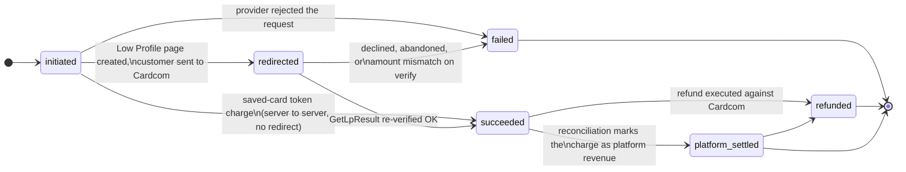
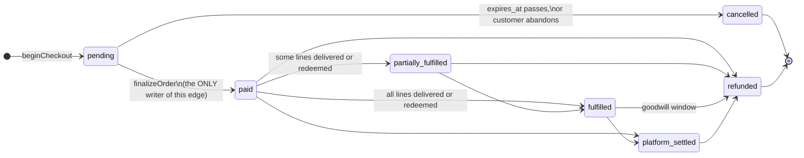
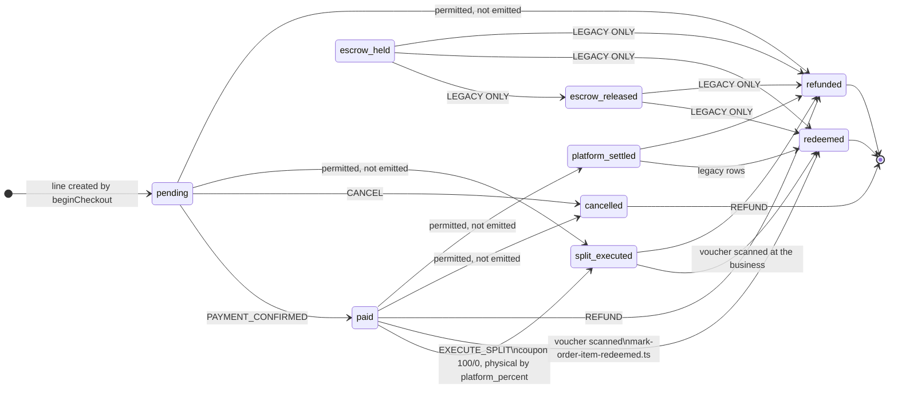
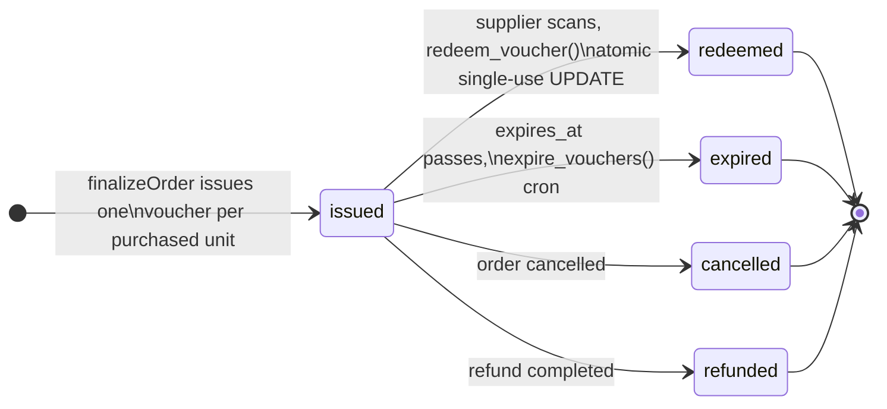
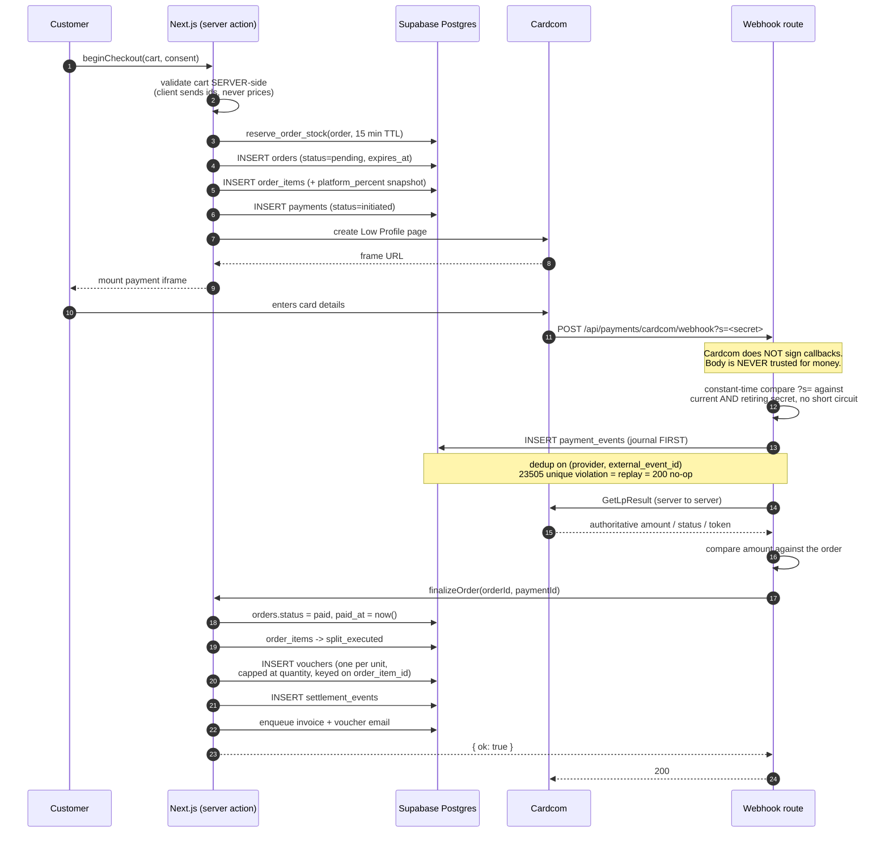

# Payment Flow

How money moves through KenyonExpress, from the cart to a settled order line.

**Every state name and every arrow in this document is copied from the live
production database** (`ixvwfbuvfxxsjiywhbbb`, verified 2026-09-01). The enums
come from `pg_type`; the transitions come from the bodies of the three guard
functions that production is running right now. Where a state machine in the
code admits fewer values than the enum carries, that is stated explicitly rather
than smoothed over, because the difference is the source of most of the
confusion in the older documents.

**The transition rules below are enforced by the database, not merely intended
by the application.** Migration `137_order_transition_guard.sql` is **applied**.
Three `BEFORE UPDATE ... FOR EACH ROW` triggers are live:

| Trigger | Table | Function |
|---|---|---|
| `tg_orders_status_guard` | `orders` | `fn_orders_status_guard()` |
| `tg_order_items_settlement_status_guard` | `order_items` | `fn_order_items_settlement_status_guard()` |
| `tg_payments_status_guard` | `payments` | `fn_payments_status_guard()` |

An illegal move raises `23514` with the message
`illegal <table>.<column> transition: <old> -> <new>`. The service role does not
escape it: a trigger is not a policy. `migrations/pending/` is empty and
everything through 146 is in production.

Companion documents: `docs/ARCHITECTURE-OVERVIEW.md` (§3 money, §4 coupon
lifecycle), `docs/CARDCOM-ARCHITECTURE.md` (provider specifics),
`docs/VOUCHER-LIFECYCLE.md` (what happens after the money settles).

---

## 1. The money rule, in one paragraph

Money is an **integer number of agorot** (1 ₪ = 100 agorot). Rates are **integer
basis points** (10% = 1000 bp). No float touches a money value at any point on
this path. Everything routes through `src/lib/money.ts`. Rounding is integer
half-up and VAT (`VAT_RATE_BP = 1800`, 18%) is extracted from a gross amount by
subtracting the computed net, so `net + vat = gross` exactly.

For a **coupon**, the customer pays `products.coupon_price_ils` on the site, an
absolute admin-set amount, and **all of it stays with the platform
permanently**. The supplier collects the remaining balance in cash at the
counter. **There is no escrow**, no J5, no hold, and no payout to a supplier on
the coupon path. For a **physical** product the customer pays the full price and
the platform keeps `platform_percent` of it.

`platform_percent` is per product, mandatory, has no default anywhere, and is
**snapshotted onto `order_items` at purchase time**. Settlement never reads a
live percentage off a product row.

---

## 2. The live enums

These are the exact value sets production accepts. Writing anything else raises
`22P02` and fails the statement.

| Enum | Values |
|---|---|
| `orders.status` | `pending`, `paid`, `partially_fulfilled`, `fulfilled`, `cancelled`, `refunded`, `platform_settled` |
| `order_items.settlement_status` | `pending`, `paid`, `split_executed`, `escrow_held`, `escrow_released`, `redeemed`, `refunded`, `cancelled`, `platform_settled` |
| `payments.status` | `initiated`, `redirected`, `succeeded`, `failed`, `refunded`, `platform_settled` |
| `voucher_status` | `issued`, `redeemed`, `expired`, `cancelled`, `refunded` |

`voucher_status` is the odd one out: it has **no** transition guard. Its
lifecycle is enforced by the `redeem_voucher()` function and by application
code, not by a trigger. The other three are guarded.

---

## 2.1 The applied transition tables

This is the whole of what production permits, read out of
`fn_orders_status_guard`, `fn_order_items_settlement_status_guard` and
`fn_payments_status_guard`. **Every diagram in every document must agree with
this section.** If a diagram shows an arrow that is not here, the diagram is
wrong.

```
orders.status
  fulfilled            -> platform_settled, refunded
  paid                 -> fulfilled, partially_fulfilled, platform_settled, refunded
  partially_fulfilled  -> fulfilled, refunded
  pending              -> cancelled, paid
  platform_settled     -> refunded
  terminal: cancelled, refunded

order_items.settlement_status
  escrow_held       -> escrow_released, redeemed, refunded
  escrow_released   -> redeemed, refunded
  paid              -> cancelled, platform_settled, redeemed, refunded, split_executed
  pending           -> cancelled, paid, refunded, split_executed
  platform_settled  -> redeemed, refunded
  split_executed    -> redeemed, refunded
  terminal: cancelled, redeemed, refunded

payments.status
  initiated         -> failed, redirected, succeeded
  platform_settled  -> refunded
  redirected        -> failed, succeeded
  succeeded         -> platform_settled, refunded
  terminal: failed, refunded
```

Three properties of these tables that are load-bearing and easy to lose:

1. **A no-op is always legal.** Each guard returns early when
   `NEW.<col> = OLD.<col>`, and again when either side is `NULL`. An `UPDATE`
   that touches an unrelated column never trips the guard. Without that, every
   `set_updated_at` write to `orders` would fail.
2. **Nothing ENTERS `escrow_held`.** It appears only on the left-hand side.
   Escrow is legacy under the no-escrow rule, and the outbound edges exist so
   that rows written before the 2026-07-24 cutover can still be moved out. See
   §5.
3. **The tables are a superset of what new code writes.**
   `src/server/domain/orders/state-machine.ts` is narrower on purpose: it
   refuses `escrow_held`, `escrow_released` and `platform_settled` as
   destinations, so no *new* row can enter them. The guard has to be wider,
   because it also governs rows that already exist.

The same table is held in the repository as
`src/server/domain/orders/status-transitions.json`, loaded by
`status-transitions.ts`, and `status-transitions.test.ts` fails if the two ever
diverge.

---

## 3. `payments.status`

The lifecycle of one charge attempt against Cardcom. Enforced by
`tg_payments_status_guard`.



Two things this diagram encodes that are easy to get wrong:

- **A token charge never passes through `redirected`.** It is server to server
  and the charge response *is* the outcome, so it goes `initiated -> succeeded`
  or `initiated -> failed` directly.
- **`succeeded -> platform_settled` is a real transition.**
  `terminal-reconciliation.ts` treats `platform_settled` as the same outcome as
  `succeeded`. A guard that omitted it would reject rows the system legitimately
  produces. This was one of the four defects that blocked the **first** version
  of migration 137; the version that shipped carries the edge.

---

## 4. `orders.status`

The order as the customer sees it. Enforced by `tg_orders_status_guard`.



`src/server/payments/finalize.ts` is the **single writer** of the transition to
`paid`. Nothing else in the codebase may write it. That constraint is what makes
the webhook safe to replay: finalize is idempotent, checks `paid_at` first, and
returns `{ ok: true, replay: true }` rather than acting twice.

---

## 5. `order_items.settlement_status`

The money row. This is where the platform-versus-supplier split is recorded, and
it is the widest of the three tables. Enforced by
`tg_order_items_settlement_status_guard`.



Two readings of this drawing that matter:

- **`escrow_held` has no inbound arrow.** That is not an omission in the
  drawing; it is the shape of the guard. Nothing enters escrow.
- **"permitted, not emitted" means exactly that.** The guard is a superset of
  the application state machine. `TRANSITIONS` in `state-machine.ts` emits only
  `pending -> paid`, `pending -> cancelled`, `paid -> split_executed`,
  `paid -> refunded` and `split_executed -> refunded`; `redeemed` is written
  separately by `mark-order-item-redeemed.ts`. The four edges labelled
  "permitted, not emitted" are legal at the database and unreachable from the
  current code. They are headroom for legacy rows and for repair scripts, not
  paths a customer can travel.

### The dead values

`escrow_held` and `escrow_released` are **live enum labels that nothing can
enter**. They are residue of the pre-2026-07-24 escrow model, removed by
migration 125. `SettlementState` in
`src/server/domain/orders/state-machine.ts` deliberately does not admit them: a
value the TypeScript type refuses is a row this code can never produce, and the
guard has no transition leading into either one, so the database refuses it too.
They stay in Postgres because you do not drop an enum label from a production
database over a rule change, and because rows written under the old model still
carry them.

The outbound edges are the entire reason those five arrows exist. A guard that
listed only the modern paths would not enforce the no-escrow rule; it would
strand every legacy row in place, unredeemable and unrefundable. Escrow is
legacy, not forbidden to leave.

### The `redeemed` edge, and why it matters

`redeemed` is reachable and it is terminal. It is written by
`src/server/domain/vouchers/mark-order-item-redeemed.ts` from:

```ts
REDEEMABLE_SETTLEMENT_STATUSES = ['platform_settled', 'paid', 'split_executed']
```

**`paid -> redeemed` is a legal transition and it is the coupon redemption
path.** A guard that forbade it would break voucher scanning *after the customer
has already been charged*, which is the worst possible time to fail. This was
the first and most serious of the four defects in the **original** migration
137. All three of `platform_settled`, `paid` and `split_executed` reach
`redeemed` in the applied guard, matching `REDEEMABLE_SETTLEMENT_STATUSES`
exactly.

Note also that `redeem_voucher` (the SQL function) does **not** touch
`order_items` at all. The voucher row moves to `redeemed`; the order line is
moved separately by the application. Two different writers, two different
tables, and a guard has to know both.

---

## 6. `voucher_status`

**There is no transition guard on `vouchers`.** The diagram below is the
application's contract, enforced by `redeem_voucher()` and by the cron that
expires vouchers, not by a trigger. It is the one state machine in this document
the database will not refuse on your behalf.



**Every non-`issued` state is terminal.** Once a voucher leaves `issued` there
is nothing left to move: the value was consumed at the business, or the money
went back to the customer. Full detail in `docs/VOUCHER-LIFECYCLE.md`.

---

## 7. The sequence, end to end



### Why the webhook is shaped like this

1. **The POST body is a notification, never data.** Cardcom's legacy
   `/Interface/*.aspx` API does not sign its callbacks: there is no HMAC header
   to verify. Authenticity rests on an unguessable secret in the callback URL
   plus a mandatory server-to-server `GetLpResult` re-fetch. **The re-fetched
   result is the only trusted source of amount, status and token.**
2. **Both secrets are always compared, with no short circuit.** Returning on the
   first match would let response time reveal which secret was presented, which
   defeats the constant-time comparison it sits inside.
3. **Journal before acting.** Every event is written to `payment_events` before
   any decision. Deduplication is on `(provider, external_event_id)`; a
   `23505` unique violation means replay, which answers 200 and does nothing.
4. **Finalize is idempotent.** It checks `paid_at` first and returns
   `{ ok: true, replay: true }`. A webhook delivered five times issues one set
   of vouchers.

---

## 8. `payment_events`: the forensic record

Append-only, enforced by the `payment_events_append_only` trigger rather than by
convention: UPDATE and DELETE are refused. The `payment_event_type` enum carries
**38 values** covering the whole lifecycle:

```
checkout_started, order_created, stock_reserved, stock_reservation_failed,
low_profile_requested, low_profile_created, low_profile_failed, redirected,
token_charge_requested, token_charge_succeeded, token_charge_declined,
callback_received, callback_replay, callback_rejected, callback_unknown_payment,
callback_provider_failure, verify_requested, verify_succeeded, verify_failed,
verify_contradicted_callback, amount_mismatch, amount_unreadable,
finalize_started, finalize_succeeded, finalize_replay, finalize_failed,
voucher_issued, voucher_issue_refused, refund_requested, refund_succeeded,
refund_failed, cancellation_fee_applied, wallet_credited, dlq_replay_started,
reconciliation_matched, reconciliation_missing_locally,
reconciliation_missing_remotely, reconciliation_amount_differs
```

Four of these exist purely to record disagreement between sources, and they are
the ones to search for first when a payment is disputed:
`verify_contradicted_callback`, `amount_mismatch`,
`reconciliation_amount_differs`, `reconciliation_missing_remotely`.

The table is empty in production today because **no customer has ever completed
a purchase**. The four orders that exist are E2E fixtures from 2026-07-21, and
zero vouchers have ever been issued.

---

## 9. Refunds

`src/server/actions/payments/refund.ts`. The controlling rule:

> **A card refund is legal only while every voucher on the line is still
> `issued`.**

Once one voucher is `redeemed` or `expired`, the value was consumed at the
business. The platform cannot un-consume it, and the supplier has already been
paid in cash by the customer. A goodwill refund after that point is a **wallet
credit**, which is a different money movement and does not touch the voucher
row.

Israeli consumer law is encoded as CHECK constraints on `refunds`, not as
application logic, so no code path can violate it:

```sql
refunds_fee_within_statutory_cap
  cancellation_fee_agorot <= LEAST((requested_agorot + 19) / 20, 10000)
  -- 5% of the transaction or ₪100, whichever is lower

refunds_no_fee_when_our_fault
  ground NOT IN ('defect','duplicate_charge') OR cancellation_fee_agorot = 0

refunds_completed_has_money
  state <> 'completed' OR (granted_agorot IS NOT NULL AND completed_at IS NOT NULL)
```

`refund_state` is `requested, approved, rejected, executing, completed, failed`.
`refund_ground` is `distance_sale_14d, defect, service_not_provided,
duplicate_charge, extended_window, goodwill`.

---

## 10. Conservation invariants

These are database CHECK constraints. They cannot be bypassed by any writer,
including the service role.

```sql
vouchers_conservation
  face_value_agorot = coupon_price_agorot + remaining_amount_due_agorot

split_executions_conservation
  face_value_agorot = commission_agorot + supplier_agorot

subscription_charges_split_is_exact
  platform_fee_agorot + supplier_due_agorot = amount_agorot

invoices_amounts_add_up
  net_agorot + vat_agorot = total_agorot

escrow_holds_conservation                        -- legacy table, 2 rows, no writer
  held_agorot = commission_agorot + release_agorot
```

Per line, at the application level:

- `face = paid_on_site + balance_due`
- coupon: `commission = paid_on_site`, `supplier_due = 0`
- physical: `commission + supplier_due = face`
- the supplier residual is `face - fee`, **never** a second percentage applied
  to the same base. Applying the mirror percent twice is how two halves come to
  disagree by one agora.

---

## 11. Known discrepancies

Recorded rather than fixed, because this is a documentation branch.

1. **`src/server/payments/README.md` is stale.** It describes the coupon line
   moving `paid -> platform_settled`. The code in `state-machine.ts` moves both
   coupon and physical lines `paid -> split_executed` and deliberately does not
   admit `platform_settled` as a writable state. The code is correct; the README
   describes an earlier rule.

2. **`finalize.ts` and `queries/orders.ts` name columns production does not
   have.** `finalize.ts:411` selects `orders.cashback_applied_agorot`;
   `finalize.ts:431` and `queries/orders.ts:215` select
   `order_items.unit_price_agorot`, and `queries/orders.ts:215` also selects
   `order_items.total_price_agorot`. All four are literals rather than reads
   through the generation probe in `src/lib/commerce/order-money-columns.ts`.
   Re-verified absent from production on 2026-09-01: the live names are
   `orders.cashback_applied_ils`, `order_items.unit_price_ils_agorot` and
   `order_items.total_price_ils_agorot`. Those selects raise `42703` against the
   live schema. This is a code defect on the money path and the highest priority
   item outside this branch's scope.

3. **`status-transitions.ts` still calls 137 pending in its docstring.** The
   header comment says `migrations/pending/137_order_transition_guard.sql`. The
   table it ships is correct and matches production exactly; only the prose
   around it is stale. Not fixed here, because this branch does not touch `.ts`.

4. **`migrations/pending/` still holds 23 `.sql` files on disk.** Nothing in it
   is outstanding: everything through 146, 137 included, is in production. The
   directory is empty as a statement of work remaining and non-empty as a fact
   about the filesystem, and `ls` is therefore not evidence. Read
   `docs/MIGRATION-BACKLOG.md` first.

5. **138 shipped as a collapsed variant, and two of its columns did not ship.**
   Six of the eight `_ils_agorot` columns in `138_money_agorot_money_path.sql`
   exist in production; `orders.discount_ils_agorot` and
   `order_items.supplier_payout_ils_agorot` do not (re-verified against
   `information_schema` on 2026-09-01). Consequently four money columns still
   convert in JavaScript rather than in Postgres: `orders.discount_ils`,
   `orders.cashback_applied_ils`, `order_items.supplier_payout_ils` and
   `order_items.cashback_earned_ils`. The header of the migration file itself
   says the same thing, and `src/lib/commerce/order-money-columns.ts` says it at
   the call site.
