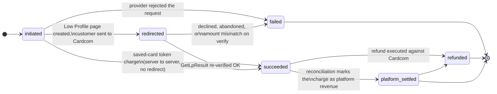
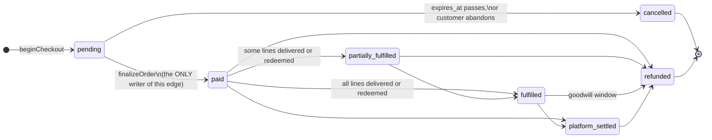
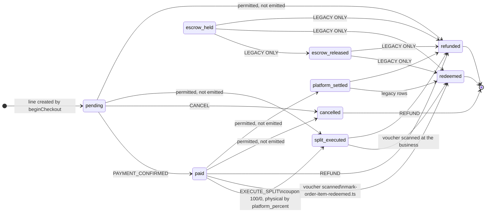
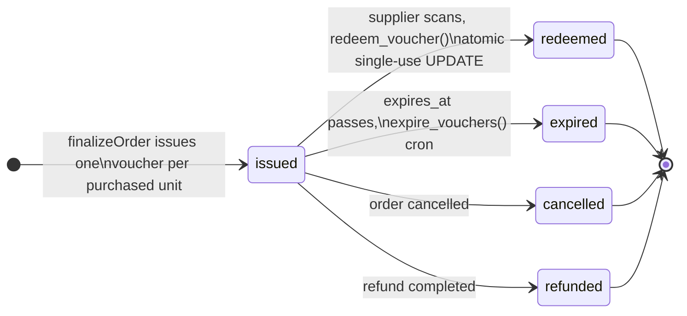
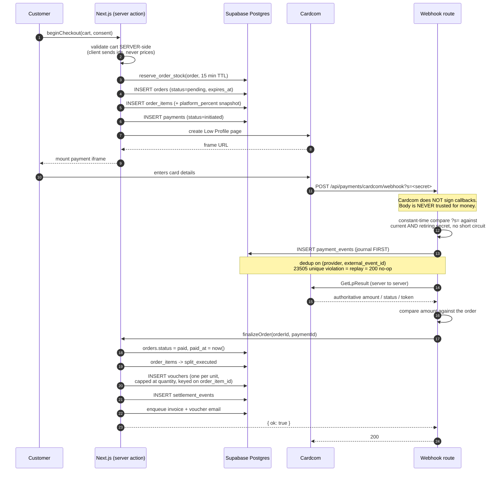

# Payment Flow

How money moves through KenyonExpress, from the cart to a settled order line.

**Every state name and every arrow in this document is copied from the live
production database** (`ixvwfbuvfxxsjiywhbbb`, verified 2026-09-01, guards and
migration state re-verified 2026-09-09). The enums
come from `pg_type`; the transitions come from the bodies of the three guard
functions that production is running right now. Where a state machine in the
code admits fewer values than the enum carries, that is stated explicitly rather
than smoothed over, because the difference is the source of most of the
confusion in the older documents.

**The transition rules below are enforced by the database, not merely intended
by the application.** Migration `137_order_transition_guard.sql` is **applied**.
Three `BEFORE UPDATE ... FOR EACH ROW` triggers are live:

| Trigger | Table | Function | From |
|---|---|---|---|
| `tg_orders_status_guard` | `orders` | `fn_orders_status_guard()` | 137 |
| `tg_order_items_settlement_status_guard` | `order_items` | `fn_order_items_settlement_status_guard()` | 137 |
| `tg_payments_status_guard` | `payments` | `fn_payments_status_guard()` | 137 |
| `tg_vouchers_status_guard` | `vouchers` | `fn_vouchers_status_guard()` | **166** |

An illegal move raises `23514` with the message
`illegal <table>.<column> transition: <old> -> <new>`. The service role does not
escape it: a trigger is not a policy.

> **Re-measured 2026-09-09, and the count was wrong.** `pg_trigger` returns
> **four** guard triggers, not three: `166_voucher_transition_guard.sql` applied
> on 2026-09-03 as `voucher_transition_guard_166` and added the voucher one.
> The repo's mirror, `src/server/domain/orders/status-transitions.json`, did not
> mention `vouchers.status` at all, so for six days the newest live guard was
> the one with no drift test. That is the same gap 137 nearly shipped on: a
> guard whose transition table has no test raises `23514` at runtime, on a path
> where the customer has already been charged. Both are covered now, and
> `status-transitions.test.ts` fails if a fifth guard appears without a mirror.
>
> The migration statement below it was also stale. `migrations/pending/` is
> **not** empty: it holds `162_cron_schedule` (blocked on vault seeding),
> `184_orders_monthly_partitioning` (deliberately unapplied, needs a maintenance
> window) and `188_pin_invoker_search_path` (written 2026-09-09, unapplied).
> Everything through **187** is in production, not everything through 146.

Companion documents: `docs/ARCHITECTURE-OVERVIEW.md` (§3 money, §4 coupon
lifecycle), `docs/CARDCOM-ARCHITECTURE.md` (provider specifics),
`docs/VOUCHER-LIFECYCLE.md` (what happens after the money settles).

---

## 1. The money rule, in one paragraph

Money is an **integer number of agorot** (1 ₪ = 100 agorot). Rates are **integer
basis points** (10% = 1000 bp). No float touches a money value at any point on
this path. Everything routes through `src/lib/money.ts`. Rounding is integer
half-up and VAT (`VAT_RATE_BP = 1800`, 18%) is extracted from a gross amount by
subtracting the computed net, so `net + vat = gross` exactly.

For a **coupon**, the customer pays `products.coupon_price_ils` on the site, an
absolute admin-set amount, and **all of it stays with the platform
permanently**. The supplier collects the remaining balance in cash at the
counter. **There is no escrow**, no J5, no hold, and no payout to a supplier on
the coupon path. For a **physical** product the customer pays the full price and
the platform keeps `platform_percent` of it.

`platform_percent` is per product, mandatory, has no default anywhere, and is
**snapshotted onto `order_items` at purchase time**. Settlement never reads a
live percentage off a product row.

---

## 2. The live enums

These are the exact value sets production accepts. Writing anything else raises
`22P02` and fails the statement.

| Enum | Values |
|---|---|
| `orders.status` | `pending`, `paid`, `partially_fulfilled`, `fulfilled`, `cancelled`, `refunded`, `platform_settled` |
| `order_items.settlement_status` | `pending`, `paid`, `split_executed`, `escrow_held`, `escrow_released`, `redeemed`, `refunded`, `cancelled`, `platform_settled` |
| `payments.status` | `initiated`, `redirected`, `succeeded`, `failed`, `refunded`, `platform_settled` |
| `voucher_status` | `issued`, `redeemed`, `expired`, `cancelled`, `refunded` |

`voucher_status` is the odd one out: it has **no** transition guard. Its
lifecycle is enforced by the `redeem_voucher()` function and by application
code, not by a trigger. The other three are guarded.

---

## 2.1 The applied transition tables

This is the whole of what production permits, read out of
`fn_orders_status_guard`, `fn_order_items_settlement_status_guard` and
`fn_payments_status_guard`. **Every diagram in every document must agree with
this section.** If a diagram shows an arrow that is not here, the diagram is
wrong.

```
orders.status
  fulfilled            -> platform_settled, refunded
  paid                 -> fulfilled, partially_fulfilled, platform_settled, refunded
  partially_fulfilled  -> fulfilled, refunded
  pending              -> cancelled, paid
  platform_settled     -> refunded
  terminal: cancelled, refunded

order_items.settlement_status
  escrow_held       -> escrow_released, redeemed, refunded
  escrow_released   -> redeemed, refunded
  paid              -> cancelled, platform_settled, redeemed, refunded, split_executed
  pending           -> cancelled, paid, refunded, split_executed
  platform_settled  -> redeemed, refunded
  split_executed    -> redeemed, refunded
  terminal: cancelled, redeemed, refunded

payments.status
  initiated         -> failed, redirected, succeeded
  platform_settled  -> refunded
  redirected        -> failed, succeeded
  succeeded         -> platform_settled, refunded
  terminal: failed, refunded
```

Three properties of these tables that are load-bearing and easy to lose:

1. **A no-op is always legal.** Each guard returns early when
   `NEW.<col> = OLD.<col>`, and again when either side is `NULL`. An `UPDATE`
   that touches an unrelated column never trips the guard. Without that, every
   `set_updated_at` write to `orders` would fail.
2. **Nothing ENTERS `escrow_held`.** It appears only on the left-hand side.
   Escrow is legacy under the no-escrow rule, and the outbound edges exist so
   that rows written before the 2026-07-24 cutover can still be moved out. See
   §5.
3. **The tables are a superset of what new code writes.**
   `src/server/domain/orders/state-machine.ts` is narrower on purpose: it
   refuses `escrow_held`, `escrow_released` and `platform_settled` as
   destinations, so no *new* row can enter them. The guard has to be wider,
   because it also governs rows that already exist.

The same table is held in the repository as
`src/server/domain/orders/status-transitions.json`, loaded by
`status-transitions.ts`, and `status-transitions.test.ts` fails if the two ever
diverge.

---

## 3. `payments.status`

The lifecycle of one charge attempt against Cardcom. Enforced by
`tg_payments_status_guard`.



Two things this diagram encodes that are easy to get wrong:

- **A token charge never passes through `redirected`.** It is server to server
  and the charge response *is* the outcome, so it goes `initiated -> succeeded`
  or `initiated -> failed` directly.
- **`succeeded -> platform_settled` is a real transition.**
  `terminal-reconciliation.ts` treats `platform_settled` as the same outcome as
  `succeeded`. A guard that omitted it would reject rows the system legitimately
  produces. This was one of the four defects that blocked the **first** version
  of migration 137; the version that shipped carries the edge.

---

## 4. `orders.status`

The order as the customer sees it. Enforced by `tg_orders_status_guard`.



`src/server/payments/finalize.ts` is the **single writer** of the transition to
`paid`. Nothing else in the codebase may write it. That constraint is what makes
the webhook safe to replay: finalize is idempotent, checks `paid_at` first, and
returns `{ ok: true, replay: true }` rather than acting twice.

---

## 5. `order_items.settlement_status`

The money row. This is where the platform-versus-supplier split is recorded, and
it is the widest of the three tables. Enforced by
`tg_order_items_settlement_status_guard`.



Two readings of this drawing that matter:

- **`escrow_held` has no inbound arrow.** That is not an omission in the
  drawing; it is the shape of the guard. Nothing enters escrow.
- **"permitted, not emitted" means exactly that.** The guard is a superset of
  the application state machine. `TRANSITIONS` in `state-machine.ts` emits only
  `pending -> paid`, `pending -> cancelled`, `paid -> split_executed`,
  `paid -> refunded` and `split_executed -> refunded`; `redeemed` is written
  separately by `mark-order-item-redeemed.ts`. The four edges labelled
  "permitted, not emitted" are legal at the database and unreachable from the
  current code. They are headroom for legacy rows and for repair scripts, not
  paths a customer can travel.

### The dead values

`escrow_held` and `escrow_released` are **live enum labels that nothing can
enter**. They are residue of the pre-2026-07-24 escrow model, removed by
migration 125. `SettlementState` in
`src/server/domain/orders/state-machine.ts` deliberately does not admit them: a
value the TypeScript type refuses is a row this code can never produce, and the
guard has no transition leading into either one, so the database refuses it too.
They stay in Postgres because you do not drop an enum label from a production
database over a rule change, and because rows written under the old model still
carry them.

The outbound edges are the entire reason those five arrows exist. A guard that
listed only the modern paths would not enforce the no-escrow rule; it would
strand every legacy row in place, unredeemable and unrefundable. Escrow is
legacy, not forbidden to leave.

### The `redeemed` edge, and why it matters

`redeemed` is reachable and it is terminal. It is written by
`src/server/domain/vouchers/mark-order-item-redeemed.ts` from:

```ts
REDEEMABLE_SETTLEMENT_STATUSES = ['platform_settled', 'paid', 'split_executed']
```

**`paid -> redeemed` is a legal transition and it is the coupon redemption
path.** A guard that forbade it would break voucher scanning *after the customer
has already been charged*, which is the worst possible time to fail. This was
the first and most serious of the four defects in the **original** migration
137. All three of `platform_settled`, `paid` and `split_executed` reach
`redeemed` in the applied guard, matching `REDEEMABLE_SETTLEMENT_STATUSES`
exactly.

Note also that `redeem_voucher` (the SQL function) does **not** touch
`order_items` at all. The voucher row moves to `redeemed`; the order line is
moved separately by the application. Two different writers, two different
tables, and a guard has to know both.

---

## 6. `voucher_status`

**There is no transition guard on `vouchers`.** The diagram below is the
application's contract, enforced by `redeem_voucher()` and by the cron that
expires vouchers, not by a trigger. It is the one state machine in this document
the database will not refuse on your behalf.



**Every non-`issued` state is terminal.** Once a voucher leaves `issued` there
is nothing left to move: the value was consumed at the business, or the money
went back to the customer. Full detail in `docs/VOUCHER-LIFECYCLE.md`.

---

## 7. The sequence, end to end



### Why the webhook is shaped like this

1. **The POST body is a notification, never data.** Cardcom's legacy
   `/Interface/*.aspx` API does not sign its callbacks: there is no HMAC header
   to verify. Authenticity rests on an unguessable secret in the callback URL
   plus a mandatory server-to-server `GetLpResult` re-fetch. **The re-fetched
   result is the only trusted source of amount, status and token.**
2. **Both secrets are always compared, with no short circuit.** Returning on the
   first match would let response time reveal which secret was presented, which
   defeats the constant-time comparison it sits inside.
3. **Journal before acting.** Every event is written to `payment_events` before
   any decision. Deduplication is on `(provider, external_event_id)`; a
   `23505` unique violation means replay, which answers 200 and does nothing.
4. **Finalize is idempotent.** It checks `paid_at` first and returns
   `{ ok: true, replay: true }`. A webhook delivered five times issues one set
   of vouchers.

---

## 8. `payment_events`: the forensic record

Append-only, enforced by the `payment_events_append_only` trigger rather than by
convention: UPDATE and DELETE are refused. The `payment_event_type` enum carries
**38 values** covering the whole lifecycle:

```
checkout_started, order_created, stock_reserved, stock_reservation_failed,
low_profile_requested, low_profile_created, low_profile_failed, redirected,
token_charge_requested, token_charge_succeeded, token_charge_declined,
callback_received, callback_replay, callback_rejected, callback_unknown_payment,
callback_provider_failure, verify_requested, verify_succeeded, verify_failed,
verify_contradicted_callback, amount_mismatch, amount_unreadable,
finalize_started, finalize_succeeded, finalize_replay, finalize_failed,
voucher_issued, voucher_issue_refused, refund_requested, refund_succeeded,
refund_failed, cancellation_fee_applied, wallet_credited, dlq_replay_started,
reconciliation_matched, reconciliation_missing_locally,
reconciliation_missing_remotely, reconciliation_amount_differs
```

Four of these exist purely to record disagreement between sources, and they are
the ones to search for first when a payment is disputed:
`verify_contradicted_callback`, `amount_mismatch`,
`reconciliation_amount_differs`, `reconciliation_missing_remotely`.

The table is empty in production today because **no customer has ever completed
a purchase**. The four orders that exist are E2E fixtures from 2026-07-21, and
zero vouchers have ever been issued.

---

## 9. Refunds

`src/server/actions/payments/refund.ts`. The controlling rule:

> **A card refund is legal only while every voucher on the line is still
> `issued`.**

Once one voucher is `redeemed` or `expired`, the value was consumed at the
business. The platform cannot un-consume it, and the supplier has already been
paid in cash by the customer. A goodwill refund after that point is a **wallet
credit**, which is a different money movement and does not touch the voucher
row.

Israeli consumer law is encoded as CHECK constraints on `refunds`, not as
application logic, so no code path can violate it:

```sql
refunds_fee_within_statutory_cap
  cancellation_fee_agorot <= LEAST((requested_agorot + 19) / 20, 10000)
  -- 5% of the transaction or ₪100, whichever is lower

refunds_no_fee_when_our_fault
  ground NOT IN ('defect','duplicate_charge') OR cancellation_fee_agorot = 0

refunds_completed_has_money
  state <> 'completed' OR (granted_agorot IS NOT NULL AND completed_at IS NOT NULL)
```

`refund_state` is `requested, approved, rejected, executing, completed, failed`.
`refund_ground` is `distance_sale_14d, defect, service_not_provided,
duplicate_charge, extended_window, goodwill`.

---

## 10. Conservation invariants

These are database CHECK constraints. They cannot be bypassed by any writer,
including the service role.

```sql
vouchers_conservation
  face_value_agorot = coupon_price_agorot + remaining_amount_due_agorot

split_executions_conservation
  face_value_agorot = commission_agorot + supplier_agorot

subscription_charges_split_is_exact
  platform_fee_agorot + supplier_due_agorot = amount_agorot

invoices_amounts_add_up
  net_agorot + vat_agorot = total_agorot

escrow_holds_conservation                        -- legacy table, 2 rows, no writer
  held_agorot = commission_agorot + release_agorot
```

Per line, at the application level:

- `face = paid_on_site + balance_due`
- coupon: `commission = paid_on_site`, `supplier_due = 0`
- physical: `commission + supplier_due = face`
- the supplier residual is `face - fee`, **never** a second percentage applied
  to the same base. Applying the mirror percent twice is how two halves come to
  disagree by one agora.

---

## 11. Phase 1: full charge on site, partial transfer to the supplier

**One charge, two owners.** The customer's card is charged the full price once,
by us, on our terminal. Nothing is charged by the supplier and nothing is split
at the terminal: Cardcom sees one transaction for the whole amount and has no
concept of who the money belongs to afterwards. The division happens in our
rows, and only in our rows.

That single fact is what section 12 exists for, and it is worth stating before
any of the mechanics: **the terminal cannot confirm the split, because the
terminal never knew about it.**

### What decides the division

`products.platform_percent`, **per product, snapshotted onto the order line at
purchase** into `order_items.platform_percent`. It is snapshotted rather than
read live because an admin editing a product tomorrow must not change what a
customer was charged today, and a supplier statement generated next month is
computed from the line, not from the product.

There is no default. `buildOrderItemSnapshot` refuses a line whose product
carries no percent rather than inventing one, which is why "all 44 active
products carry a `platform_percent`" is a fact worth measuring and is measured.

### The three numbers on every line

```
order_items.paid_on_site_agorot        what the customer paid for this line
order_items.commission_agorot          ours,   = paid_on_site x platform_percent
order_items.supplier_immediate_agorot  theirs, = paid_on_site - commission
```

The supplier's share is the **residual**, never a second percentage applied to
the same base. Applying the mirror percent independently is how two halves come
to disagree by one agora on a rounding boundary; subtracting cannot.

`escrow_release_agorot` is the legacy fourth column. The current engine leaves
it at zero on every line it writes. It is non-zero only on the pre-070 coupon
rows still in production, where the supplier's share sat in escrow instead of
being immediate, and it is counted into the supplier share wherever
conservation is checked so those rows are not reported for a model they were
never written under.

### The journal

`settlement_events` (migration 094, applied 2026-07-31) records what HAPPENED,
with a time on it, alongside `order_items`, which records what was AGREED.

- `charge_settled` -- one per line of a paid order, written by
  `buildChargeSettledEvents` and `recordSettlementEvents`. Carries its own copy
  of the percent it was computed under.
- `refund_issued` -- written by `refundOrder`, keyed
  `refund_issued:<payment_id>`.
- `supplier_debit` -- a supplier share that was already released and is being
  clawed back by a refund. The amount sits POSITIVE and the direction is the
  kind, because 094's CHECK refuses negatives on all four money columns on
  purpose.

**The journal write cannot throw.** It runs after the card has been charged and
the order closed, and a journal row is not worth unwinding a payment for. A
failure is logged and never reaches the caller.

### The supplier statement

`buildSettlementStatement` (`src/lib/invoices/settlement-statement.ts`) groups
a supplier's lines by Israeli calendar month and totals what they are owed. It
is computed from the SPLIT columns, not from the order total -- which is the
whole reason a wrong split is expensive: the statement, `/admin/reports` and
the payout that is actually wired are all downstream of the same three numbers,
and all three agree with each other while being wrong together.

### Refunds reverse it

`refundOrder` writes `refund_issued` and, where a supplier share had already
been released, `supplier_debit`. The customer's credit and the ledger reversal
are one path: a refund that credited the card and left the ledger alone would
leave a supplier owed money for a sale that no longer exists.

---

## 12. The job that checks the split

`/api/cron/settlement-reconcile`, daily at 04:20 UTC, twenty minutes after
`/api/cron/reconcile`.

**Two different questions, and the order between them is deliberate.**
`reconcile` asks the terminal what it charged and diffs that against
`payments`: did the right total move. This asks how that total was divided.
Running the split check first would report a split as wrong while the total it
is a split of was still unverified.

**Seven checks**, in `src/lib/payments/settlement-reconciliation.ts`, which is
pure and separate from the route so production numbers can be test fixtures
rather than paragraphs:

| finding | what it means |
| --- | --- |
| `split_not_conserved` | commission + supplier share is not what the customer paid |
| `percent_contradiction` | the snapshotted percent does not produce the commission on the same row |
| `percent_missing` | no `platform_percent`, so nothing justifies the split |
| `journal_drift` | journal and line both exist and disagree |
| `refund_unjournalled` | a completed refund with no `refund_issued` row |
| `journal_missing` | a paid line with no `charge_settled` row, on or after the epoch |
| `journal_orphan` | a `charge_settled` row whose line is not paid any more |

**The epoch.** `settlement_events` arrived on 2026-07-31 and all four
production orders were paid on 2026-07-21. Reporting those as unjournalled
would be true, unfixable and therefore noise, so lines paid before the journal
existed are counted as `beforeJournal` rather than dropped -- an exclusion
nobody can see is how a gate stops covering what it claims to cover. The
percent checks are NOT epoch-bound: those rows are wrong today, and a statement
generated today would use them.

**It reports and never repairs**, and that is not timidity. Whether a line
charged 5% against a 10% snapshot was sold at 5 or at 10 is not derivable from
the row: both numbers are on it and they contradict each other. A job that
guessed would turn one wrong number into one wrong number plus an audit trail
saying it was reviewed.

**The floor.** `supabase/settlement-known-issues.json` holds what is already
true of production, so a NEW finding is what pages. An entry that STOPS firing
is reported too, under `silenced`, because "somebody fixed the row" and "the
check broke" look identical from here.

**The alert** is `settlement_gap`, its own outbox kind and deliberately not
`reconciliation_gap`: the dedupe key is kind plus day and both jobs run within
twenty minutes, so sharing a name would make whichever enqueued second look
like a duplicate and send nothing. The kind needs
`migrations/pending/214_settlement_gap_kind.sql`; until it is applied the job
finds everything, fails the enqueue with 23514, reads that code and says so
rather than throwing in a cron at 04:20.

---

## 13. Known discrepancies

Recorded rather than fixed, because this is a documentation branch.

0. **The reconciliation cron found discrepancies and kept none of them.**
   **FIXED 2026-09-09.** `payment_discrepancies` is named by SECTIONS 28 and
   existed nowhere in this repo. `/api/cron/reconcile` pulled each terminal's
   `ListTransactions`, diffed it against `payments`, enqueued an admin alert
   capped at twenty rows, and logged `reconcile.gaps_found` with a COUNT. So the
   number of problems survived a run and the identity of the transactions did
   not, and `missing_remotely` -- deliberately outside the critical set, because
   the terminal parser has never been confirmed against a live wire format and
   that is where a parser mismatch would land -- was neither alerted nor logged
   individually nor stored at all. Not paging on it was right; keeping no record
   of it threw away the exact evidence that would settle the parser question on
   the first live run.

   The findings are now written before the alert is composed, every kind of
   them, keyed on `(kind, transaction_id, cardcom_account_id)` so the 48-hour
   overlap bumps `seen_count` instead of accumulating rows. The migration is
   `migrations/pending/191_payment_discrepancies.sql`, verified against
   production inside a rolled-back `DO` block and **not applied**. The route
   runs unchanged without it: `PGRST202` and `42883` are read as "not applied
   yet", said once per process, and never fatal.

1. **`src/server/payments/README.md` is stale.** It describes the coupon line
   moving `paid -> platform_settled`. The code in `state-machine.ts` moves both
   coupon and physical lines `paid -> split_executed` and deliberately does not
   admit `platform_settled` as a writable state. The code is correct; the README
   describes an earlier rule.

2. **`finalize.ts` and `queries/orders.ts` name columns production does not
   have.** `finalize.ts:411` selects `orders.cashback_applied_agorot`;
   `finalize.ts:431` and `queries/orders.ts:215` select
   `order_items.unit_price_agorot`, and `queries/orders.ts:215` also selects
   `order_items.total_price_agorot`. All four are literals rather than reads
   through the generation probe in `src/lib/commerce/order-money-columns.ts`.
   Re-verified absent from production on 2026-09-01: the live names are
   `orders.cashback_applied_ils`, `order_items.unit_price_ils_agorot` and
   `order_items.total_price_ils_agorot`. Those selects raise `42703` against the
   live schema.

   **FIXED, re-measured 2026-09-09.** `queries/orders.ts` no longer names the
   post-059 columns bare: it resolves the generation with
   `resolveOrderItemGeneration` and builds the list through
   `orderItemPriceSelect`, which aliases the generated `*_ils_agorot` twins back
   to the short names. The bare literals survive only in the TypeScript row
   type, which describes the ALIASED shape and is therefore correct.

3. **`status-transitions.ts` still calls 137 pending in its docstring.** The
   header comment said `migrations/pending/137_order_transition_guard.sql`.
   **FIXED 2026-09-09**: the file moved to `applied/` on 2026-09-03 and the
   docstring now says so. The table it ships was correct throughout.

4. **`migrations/pending/` still holds 23 `.sql` files on disk.**

   **NO LONGER TRUE, re-measured 2026-09-09.** The applied files moved to
   `migrations/applied/`, and `pending/` held three migrations and two
   preflights at that moment. **Re-counted the same evening: 29 migrations and
   the two preflights**, 162 through 214, because a section's worth of work
   landed between the two readings. The count is not the point and never was;
   `src/__tests__/pending-migrations-inventory.test.ts` names every file and
   fails on an unlisted one, which is what makes `ls` on that directory
   evidence. All three are genuinely outstanding, which is the opposite of
   the situation this note was written about: `162_cron_schedule` (approved,
   blocked on vault seeding), `184_orders_monthly_partitioning` (deliberately
   unapplied, needs a maintenance window) and `188_pin_invoker_search_path`
   (written 2026-09-09). `ls` on that directory IS evidence again.

5. **138 shipped as a collapsed variant, and two of its columns did not ship.**
   Six of the eight `_ils_agorot` columns in `138_money_agorot_money_path.sql`
   exist in production; `orders.discount_ils_agorot` and
   `order_items.supplier_payout_ils_agorot` do not (re-verified against
   `information_schema` on 2026-09-01).

   **BOTH EXIST NOW, re-measured 2026-09-09** against `information_schema`, so
   all eight of 138's columns are live. The four JavaScript conversions named
   below are worth re-checking against that: two of them had no generated twin
   to read, and now they do. Consequently four money columns still
   convert in JavaScript rather than in Postgres: `orders.discount_ils`,
   `orders.cashback_applied_ils`, `order_items.supplier_payout_ils` and
   `order_items.cashback_earned_ils`. The header of the migration file itself
   says the same thing, and `src/lib/commerce/order-money-columns.ts` says it at
   the call site.

6. **All three paid lines in production are split at a flat 5%, against
   snapshots that say something else.** Measured 2026-09-09, and this is the
   finding that `/api/cron/settlement-reconcile` was built by:

   ```
   ₪18 coupon,   platform_percent 10.00, commission ₪0.90   → 5%
   ₪18 coupon,   platform_percent 10.00, commission ₪0.90   → 5%
   ₪799 physical, platform_percent 100.00, commission ₪39.95 → 5%
   ```

   5% is the fixed commission that 070 removed from the money path and that
   this codebase says has no default; it is left on rows written before it. The
   snapshot and the money are two different answers on one row, and the row is
   what a supplier statement is built from: read the percent and the ₪799
   supplier is owed ₪0, read the money and they are owed ₪759.05.

   Conservation holds on all three, which is why nothing caught them: the
   columns add up, they just add up to a division nobody agreed to. Not fixed
   here, because choosing which of the two numbers is the real one is the
   operator's call and acting on it is a write to production money rows. The
   three are the entire contents of
   `supabase/settlement-known-issues.json`, so a fourth is what pages.

   `settlement_events` holds 0 rows and `refunds` holds 0, both re-read the
   same day. Every one of these three predates the journal epoch, so the
   journal checks are silent on them and the percent checks are not.
