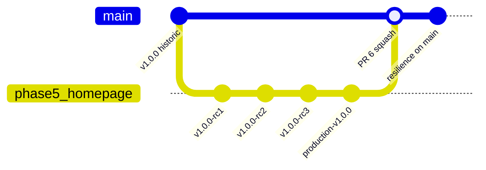
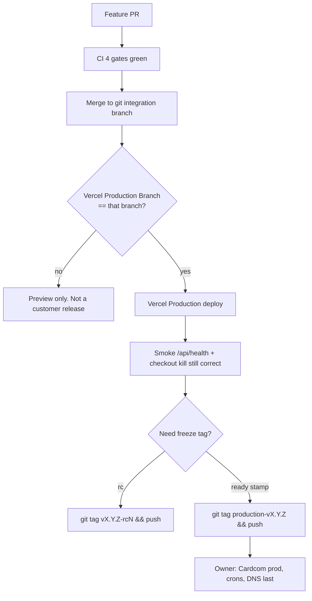
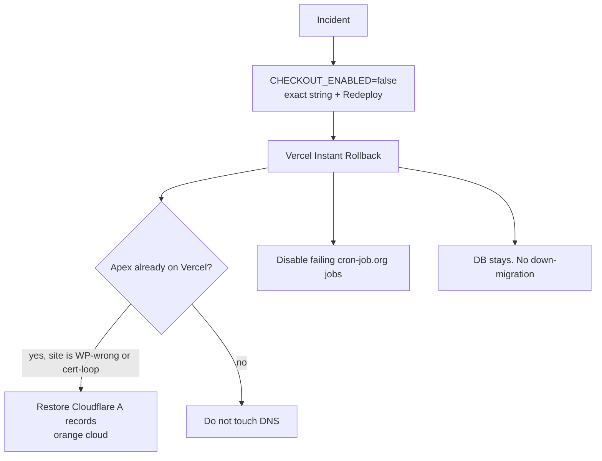

# Release process (v1.2)

Standalone release and rollback document for KenyonExpress. Ground truth is git tags, `STATE.md`, CI workflows, and the ops runbooks. Older checklists that still say "merge PR #6" are stale.

**Never run the DNS cutover from this document.** That is an owner-only step.

---

## 0. What "production" actually is

| Fact | Value | Status |
| --- | --- | --- |
| Default GitHub branch | `main` (after PR #6) | Measured in `STATE.md` 2026-08-31 |
| Vercel **Production Branch** of the live project `kenyonexpress` | `phase5/homepage` | Measured in `STATE.md`. A merge to `main` produced a **Preview**, not Production |
| Live URL until DNS | `https://kenyonexpress.vercel.app/` | Owner checklist |
| Apex `kenyonexpress.co.il` | Still WordPress until owner DNS cutover | Do not point crons at it yet |
| Deploy mechanism | Vercel GitHub App. There is **no** `deploy.yml` | `.github/workflows/README.md` |
| `git push origin main` | Does **not** by itself ship the live shop, because Production Branch is not `main` | Measured |

If GitHub default and Vercel Production Branch disagree, a green merge can look like a release and change nothing the customer sees. Confirm both before tagging a "release":

Chrome: GitHub → Settings → General → Default branch

Chrome: Vercel → project `kenyonexpress` → Settings → Git → Production Branch

There is a second Vercel project name in circulation (`kenyonexpress-web`) that is the **wrong** repo. Do not roll that one back. Confirm the project that actually serves `kenyonexpress.vercel.app`.

---

## 1. Tags that already exist

Do **not** move tags that have been pushed. `docs/DECISIONS.md`: `v1.0.0` (10.08, old commit) and `v1.3.0` stay where they are. Moving them is rewriting shared history.

Measured on this clone, 2026-09-02:

```
v1.0.0
v1.0.0-rc1
v1.0.0-rc2
v1.0.0-rc3
v1.0.0-final
v1.3.0
production-v1.0.0
```

| Tag | Meaning |
| --- | --- |
| `v1.0.0-rc1` / `rc2` / `rc3` | Release-candidate line used during freeze. The real pre-prod line |
| `v1.0.0-final` | Named freeze point |
| `production-v1.0.0` | `STATE.md` "Production Ready" stamp (2026-08-31). **Not** "DNS is live" |
| `v1.0.0`, `v1.3.0` | Historical. Do not retarget |

There is **no** `release/x.y` branch model. Work historically lived on `phase5/homepage` and merged to `main`. Future work uses feature branches and PRs into the branch Vercel actually builds.



---

## 2. PR #6 flow (done)

| Source | Claim | Verdict |
| --- | --- | --- |
| `STATE.md` | PR #6 squash-merged to `main` 2026-08-31 21:41 UTC (~345 commits) | **Authoritative. Done.** |
| `docs/OWNER-CHECKLIST.md` item 4 | Still lists merge PR #6 as open | **Stale.** Do not merge it again |

What that merge was for: `main` lagged the product. GitHub default, clones, and CI that follow `main` were looking at a shop that no longer existed. After the squash, `main` describes the product.

What that merge was **not**: a Vercel Production promote. Production Branch stayed `phase5/homepage`.

### 2.1 How a future merge should look (the PR #6 pattern)

1. Feature branch. Never commit to `main` from an agent unless the owner said this is the production git branch **and** Vercel Production Branch is `main` (today it is not).
2. PR into the intended integration branch (`main` for git history; confirm Vercel separately).
3. Four CI checks must be green, by the **`name:`** field in `.github/workflows/ci.yml`, not the job id:
   - `Diff-scoped lint gates`
   - `Typecheck (changed files)`
   - `Unit tests + money coverage floors`
   - `Build`
4. Do **not** require `E2E (Playwright)` until its secrets are set; it skips itself.
5. Squash or merge per GitHub UI. No force-push to `main`. No `db push`.
6. Annotate a tag only after CI is green on the merge commit:

```bash
git fetch origin
git tag -a production-v1.0.1 -m "production-v1.0.1"
git push origin production-v1.0.1
```

7. Confirm the Vercel deployment that customers hit. If Production Branch is still `phase5/homepage`, merging `main` is not enough: merge or cherry-pick onto that branch, or change the Production Branch (owner).

---

## 3. Release candidate loop

Use when the shop is supposed to freeze, not for ordinary docs PRs.

1. **Freeze the production git branch** (today: whatever Vercel Production Branch is). Stop mixing unrelated features.
2. **Tag** `vX.Y.Z-rcN` annotated, push the tag. Do not move older rc tags.
3. **Prove the build** on `https://kenyonexpress.vercel.app` (or the Preview URL of that tag).
4. **Smoke:** `/api/health` → `{"ok":true,"database":"ok"}`. One cheap coupon path in Cardcom **test** terminal if `CHECKOUT_ENABLED` is not yet production-true.
5. **External crons** must actually be scheduled (`docs/CRON-EXTERNAL.md`). Routes that exist but are never called are not a release.
6. **Promote** by letting Vercel build the Production Branch, or Instant Rollback back if the build is bad.
7. **DNS last.** Owner only. After DNS, retarget the ten cron URLs from `kenyonexpress.vercel.app` to `kenyonexpress.co.il`.

Rollback of an rc tag that was never used in Production: delete the tag locally and on origin. Do not delete `production-v*` tags that already named a live deploy.



---

## 4. CI that is part of a release (and CI that is not)

| Workflow | Role in a release | Status |
| --- | --- | --- |
| `ci.yml` | Blocks the PR | Implemented |
| `production-smoke.yml` | Daily curl floor on the default branch | Exists; needs default branch to contain the file (PR #6 did that) |
| `cron.yml` | Optional scheduler | **Off** until GitHub variable `CRON_SCHEDULER_ENABLED=true` and secret `CRON_SECRET` |
| `commit-monitor.yml` / `dependabot-auto-merge.yml` / `load.yml` | Not a release gate | Ignore for cutover |

There is no release-please, no auto-changelog, no auto-tag.

---

## 5. Rollback per component

Order in a money incident: **kill checkout first**, then app rollback, then DNS if the apex is already cut over. Never down-migrate.



### 5.1 Checkout kill (app stays up)

Chrome: Vercel → `kenyonexpress` → Settings → Environment Variables → Production

```
CHECKOUT_ENABLED=false
```

Redeploy Production. A hot lambda can still have `true` until a new instance. After Ready: Pay must refuse.

To turn on again: the string must be exactly `true`. Empty / `TRUE` / `1` all mean off in production.

### 5.2 Vercel Instant Rollback (code)

Chrome: Vercel → Deployments → previous **Ready** row marked Production → ⋮ → Instant Rollback / Promote to Production.

CLI, from the machine that is logged into the same Vercel account:

```bash
npx --yes vercel@latest ls kenyonexpress
npx --yes vercel@latest rollback https://<deployment-id>.vercel.app --yes
```

Instant Rollback does **not** undo SQL. It does **not** move DNS. It does **not** restore R2 objects.

Forbidden:

```bash
git push --force origin main
npx supabase db push
```

### 5.3 Migrations / Postgres

**No down-migrations.** A bad migration that already applied is SEV1, not a Vercel rollback. Stop. Owner approval. Forward fix only, via Supabase MCP `apply_migration`, one file, after a `BEGIN`/`ROLLBACK` dry run in SQL Editor.

`service_role` bypasses RLS. Do not "fix prod" with ad-hoc DML from an agent.

### 5.4 Meilisearch

Storefront search is Postgres `ILIKE` (`src/app/api/search/route.ts`). Meilisearch is an indexer + settings file; the query path is off until `MEILISEARCH_HOST` + `MEILISEARCH_API_KEY` are set. There is nothing to roll back on the customer search box for a Meili outage. Optional: `KILL_SWITCH_SEARCH=1` makes search return empty rather than 500.

### 5.5 R2 (media)

If `R2_*` vars are absent or signing fails, uploads fall back to Supabase Storage (`isR2Configured()`). Rolling back a Vercel deploy does not restore deleted objects. Corruption restore is a bucket/version problem (`docs/ARCHITECTURE-BACKUP-DR.md`), not a git revert.

### 5.6 DNS (owner only)

Only after a cutover that went wrong. Restore the pre-cutover Cloudflare A records (proxied / orange cloud) that were saved to disk **before** the cutover. TTL should have been dropped to 2 minutes the day before. Do not recreate AAAA by hand; Cloudflare publishes IPv6 for Proxied records.

Leave the domain attached in Vercel during DNS rollback. An attached domain with no records pointing at it is free and avoids re-issuing the certificate next time.

### 5.7 Cardcom / webhooks

A webhook secret mismatch that answers 200 is the silent-loss case (Cardcom stops retrying, card charged, order open). Dual-key rotation:

1. `CARDCOM_WEBHOOK_SECRET_PREVIOUS` = old value
2. `CARDCOM_WEBHOOK_SECRET` = new value
3. Redeploy
4. Update IndicatorUrl `?s=`
5. Drop PREVIOUS after open Low Profile pages expire

Never retry `ChargeToken.aspx` or `RefundDeal.aspx` on timeout.

### 5.8 Cron scheduler

Jobs are not in `vercel.json`. If cron-job.org is wrong, disable the job in that UI. Unset `CRON_SECRET` fail-closes every route with 401 (safe, silent).

---

## 6. Release checklist (short)

1. CI green on the PR.
2. Know which Vercel project and which Production Branch you are shipping.
3. `CHECKOUT_ENABLED` is the string you intend (`true` only when Cardcom prod + first real charge already worked on `vercel.app`).
4. Tag after the deploy you trust, not before a broken build.
5. Crons scheduled and returning 200 with the bearer secret.
6. DNS last, owner only, images already on R2.
7. Rollback drill: you can find Instant Rollback and the checkout kill without opening this file.

---

## 7. Source files

- `STATE.md` (PR #6 merged; Production Branch)
- `docs/DECISIONS.md` (do not move `v1.0.0` / `v1.3.0`)
- `docs/OWNER-CHECKLIST.md` (stale on PR #6; still right on DNS/cron/Cardcom)
- `docs/RUNBOOK-OPS.md` §§4–7
- `docs/RUNBOOK.md`
- `docs/LAUNCH-RUNBOOK.md`
- `docs/CRON-EXTERNAL.md`
- `docs/GITHUB-SETTINGS.md`
- `docs/CI-AND-BRANCH-PROTECTION.md`
- `.github/workflows/README.md`
