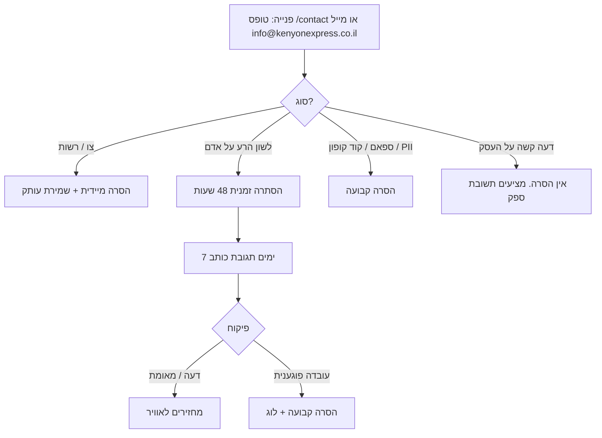

# מדיניות ביקורות (לשון הרע, פיקוח, תשובת ספק)

מסמך עצמאי בעברית. **אין מערכת ביקורות חיה באתר.** המדיניות הזאת קובעת: (א) מה אסור לעשות היום, (ב) מה יחול אם וכאשר יופעל מוצר ביקורות.

עודכן: 2026-09-02.
אינו ייעוץ משפטי. נוסח סופי: עו"ד.

---

## 0. מצב נוכחי (מחייב)

| פריט | סטטוס |
| --- | --- |
| טבלת ביקורות מוצר / כוכבים / תשובת ספק | **לא קיימת** ב-`src/` |
| `aggregateRating` / `review` ב-JSON-LD | **אסור**. נעול בטסטים ובמסמכי SEO |
| ייבוא 324 ביקורות WooCommerce | **לא נטען** (M17) |
| PDP live (Electro) | בלי טאב ביקורות |
| אחרי מימוש | CTA לשירות, לא דירוג פומבי |
| מיון "דירוג" בקטגוריה | דירוג קטלוג פנימי, לא כוכבי לקוחות |

אסור להציג מספר כוכבים, "2,104 ביקורות", או דירוג מיובא מוורדפרס. זה גם סיכון לשון הרע (ייחוס דעה שלא נאמרה) וגם הטעיה שיווקית.

שאריות בתקנון הוורדפרס הישן (`wp-migrated.ts`) מדברות על "הערות" באתר. **אין מוצר הערות שמחובר אליהן.** אל תסתמכו על הנוסח הזה כמדיניות ביקורות.

---

## 1. מי רשאי לכתוב ביקורת (כשיופעל)

רק **רוכש מאומת**: הזמנה עם `paid_at`, על אותו `product_id` (או שובר שהונפק ממנו), בחשבון Google שהזמין.

| מצב | רשאי? |
| --- | --- |
| קופון ששולם, גם לפני מימוש | כן, ביקורת על העסקה באתר (מחיר, הנפקה, תוקף). לא על "החוויה בעסק" עד מימוש |
| קופון שמומש | כן, גם על השירות בעסק |
| קופון שבוטל / זוכה | לא, אלא אם הביקורת היא על תהליך הביטול |
| אורח בלי חשבון | לא. אין לאנונימי משטח כתיבה |
| ספק / עובד הספק / אדמין על המוצר של עצמם | לא כביקורת לקוח. תשובת ספק נפרדת (§3) |
| מתחרה, בוט, חשבון שנוצר אחרי הסירוב | לא |

ביקורת אחת לפריט הזמנה. עריכה בתוך 48 שעות או עד תשובת הספק, המוקדם. אחרי זה: בקשת תיקון דרך תמיכה, לא עריכה חופשית (ראיות לשון הרע).

אין דירוג בלי טקסט. אין טקסט בלי רכישה מאומתת.

---

## 2. כללי פיקוח (moderation)

פרסום **אחרי** תור פיקוח, לא לפני. ב-soft-launch: אדם (אדמין/תמיכה). אין סוכן AI שמפרסם ביקורת.

### 2.1 מסירים או דוחים

- לשון הרע על אדם מזוהה (עובד, בעלים, לקוח אחר) לפי חוק איסור לשון הרע, התשכ"ה-1965: ייחוס עובדה שעלולה להשפיל, לבזות, או לפגוע בעיסוק.
- דברי שטנה, איומים, תוכן מיני, פרטי קטינים.
- PAN, קוד קופון מלא, צילום QR, כתובת מגורים של לקוח אחר, מספר טלפון של אדם פרטי שלא הסכים.
- פרסומת למתחרה, קישורים זדוניים, סחיטה ("תמחקו או אפרסם").
- ביקורת על מוצר אחר / עסק אחר מזה שנרכש.
- תוכן שקרי ביודעין על עובדה (למשל "לא קיבלתי קופון" כשהשובר מופיע בחשבון), אחרי בדיקת מערכת.

### 2.2 משאירים (גם אם קשים לספק)

- דעה על טעם, מחיר, יחס בקופה, המתנה, ניקיון, "לא שווה את היתרה".
- ציון שהיתרה בקופה הייתה גבוהה ממה שהוצג, **אם** זה תיאור חוויה. תמיכה בודקת מול מסך הסריקה בנפרד.
- דירוג נמוך בלי קללות.

דעה קשה אינה לשון הרע רק כי הספק לא אוהב אותה. עובדה שקרית על אדם מזוהה כן.

### 2.3 סימון

ביקורות מאומתות נושאות "רכישה מאומתת". אין "מומלץ על ידי האתר". אין מחיקת דירוג נמוך כדי להעלות ממוצע.

---

## 3. תשובת ספק

רק `owner` או `manager` של **אותו** `supplier_id`. תשובה אחת לכל ביקורת, ציבורית, עם חותמת זמן.

אסור בתשובה:

- לחשוף שם מלא, טלפון, או אימייל של הלקוח.
- להאשים את הלקוח בעבירה ("גנב", "שיכור", "לא שילם") בלי פסק דין.
- להציע "תמחק את הביקורת ונקבל אותך בחזרה" כסחר מכר.
- להתחזות ללקוח אחר.

מותר: התנצלות, הסבר על שעות, הזמנה לבירור בפרטי (וואטסאפ העסק), תיקון עובדתי על מחיר/תוקף כפי שמופיע באתר.

תשובה שעוברת על §2.1: האדמין מסיר את התשובה, לא את הביקורת, אלא אם הביקורת עצמה פסולה.

---

## 4. לשון הרע (מסגרת הפעלה, לא חוות דעת)

חוק איסור לשון הרע, התשכ"ה-1965. פרסום באתר הוא פרסום. הגנות טיפוסיות (אמת ועיניין ציבורי, תום לב) הן לבית משפט, לא לנציג.

כללי תפעול:

1. פנייה של מי שטוען שנפגע: מסירים **זמנית** תוך 48 שעות אם יש זיהוי אדם + טענת עובדה (לא "האוכל גרוע").
2. מודיעים לכותב. נותנים 7 ימים להגיב בכתב.
3. מחזירים לאוויר רק אם הפיקוח קובע שזו דעה / רכישה מאומתת בלי ייחוס עובדה פלילית לאדם.
4. צו בית משפט או דרישת רשות: מסירים מיד, שומרים עותק פנימי 7 שנים עם הרשומה הכספית.
5. לא דורשים מהלקוח "להוכיח בבית משפט" לפני הסרה זמנית כשיש שם עובד + האשמת גניבה.

האתר אינו מתחייב לייצג את הספק או את הלקוח בהליך לשון הרע.

---

## 5. תהליך הסרה

פנייה חייבת: URL או מזהה ביקורת, מה המשפט הפוגע, מי הפונה (נפגע / ספק / כותב), האם יש צו.

תשובה לפונה: מה הוסר, מה לא, בלי לחשוף PII של הצד השני.

אדמין: בלי `UPDATE` על הזמנות. הסתרת ביקורת היא סטטוס על שורת הביקורת (כשתתקיים), לא מחיקת היסטוריה כספית.

---

## 6. SEO ושיווק

- אסור `aggregateRating` כל עוד אין מדגם אמיתי ומאומת.
- אסור להציג ממוצע כוכבים ב-PDP לפני שיש מוצר ביקורות כבוי-ברירת-מחדל עם פיקוח.
- איסור לזייף "4.8 מתוך 5 כמו ב-Groupon".
- סיכום AI של ביקורות: רק אחרי שער אישור אנושי, בלי PII. אין runtime כזה היום.

---

## 7. מקורות בריפו

- `docs/ARCHITECTURE-PERFORMANCE-SEO.md` (אין ביקורות, אין JSON-LD דירוג)
- `docs/ARCHITECTURE-WP-MIGRATION.md` M17
- `docs/ARCHITECTURE-GROWTH-SEO.md` (post_redemption ≠ דירוג)
- `src/components/storefront/ProductInfo.tsx` (אין כוכבים מפוברקים)
- `src/content/legal/wp-migrated.ts` (שאריות "הערות", לא מוצר)
- חוק איסור לשון הרע, התשכ"ה-1965 (מחוץ לריפו; ייעוץ עו"ד)
