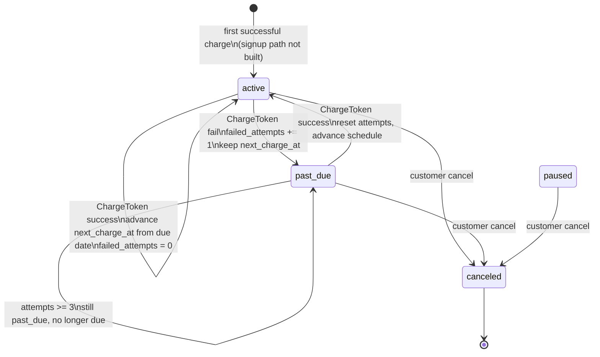
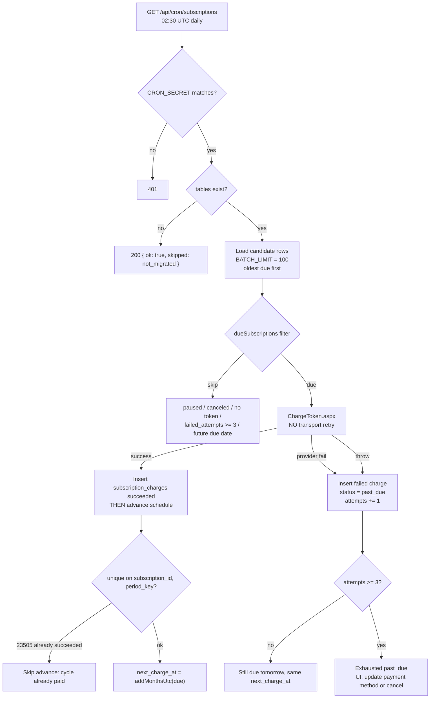
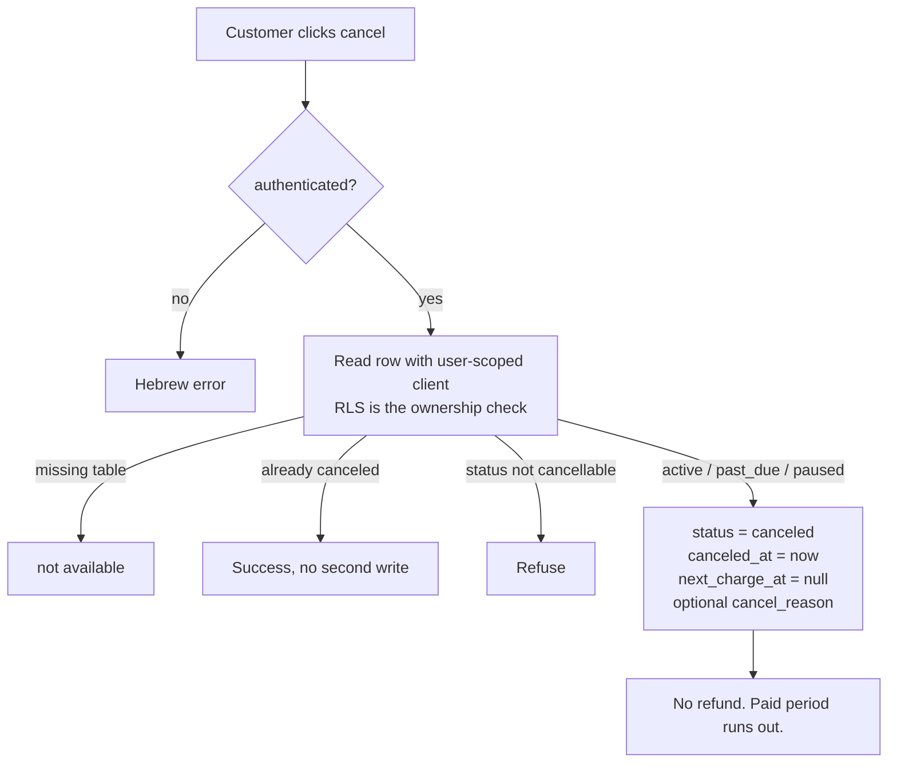
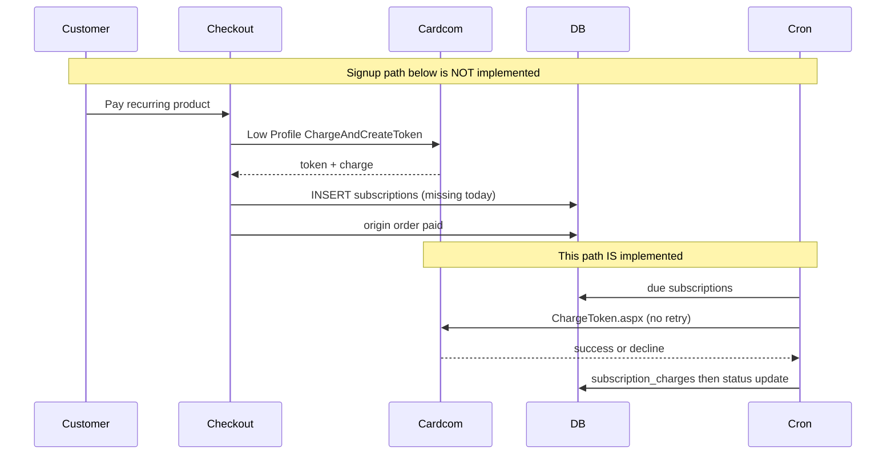

# Subscriptions architecture (v1.1)

Standalone document. Ground truth is the code and the pending SQL, not older architecture sketches that disagree with them.

KenyonExpress is a platform. A recurring product bills `recurring_amount_agorot` per cycle and splits **that** amount by the snapshotted `platform_percent`. There is no default commission anywhere, and there is no second subscription-only commission.

**Status as of 2026-09-02 (measured against this repository):**

| Layer | Status |
| --- | --- |
| Pure billing policy (`src/lib/commerce/recurring.ts`) | Implemented and tested |
| Daily billing cron (`GET /api/cron/subscriptions`) | Implemented; no-ops until the schema exists |
| Admin catalog fields (amount, interval, interval count) | Implemented in the product form |
| Customer list + cancel UI (`/account/subscriptions`) | Implemented; empty until the schema exists |
| Tables `subscriptions`, `subscription_charges` | Pending only (`migrations/pending/135a`, `135b`). Not applied. Agents do not apply them. |
| Create / activate a subscription after first payment | **Does not exist.** No insert on the checkout or finalize path. |
| Cardcom named Recurring / standing-order API | **Not used.** Renewals call ordinary `ChargeToken.aspx` against a token in `payment_tokens`. |
| Dunning emails, pause/resume actions, `SUBSCRIPTIONS_ENABLED` | **Not in code.** |

Until 135a/135b are applied by a human and a signup path is written, nobody can start a subscription in the product. The rest of this document describes the engine that is already written, the intended schema, and the gaps that still block go-live.

---

## 1. What "Cardcom Recurring Token" means here

Two different things share that phrase in this repository. They must not be mixed.

### 1.1 What the application actually charges

First purchase (ordinary checkout, not subscription-specific) uses Cardcom Low Profile with `ChargeAndCreateToken`. The token is stored in `payment_tokens`. Never a PAN.

A later cycle does this, in `src/app/api/cron/subscriptions/route.ts`:

1. Select due rows (status `active` or `past_due`, token present, `failed_attempts < 3`, `next_charge_at <= now`).
2. Call `provider.chargeWithToken(...)` which POSTs to `/Interface/ChargeToken.aspx` with `TerminalNumber`, `ApiName`, `Token`, `Amount`, `CoinId`, `ProductName`.
3. Write a `subscription_charges` row, then advance or mark `past_due`.

There is no RecurringPayments module, no BillGold standing order, and no Cardcom "create recurring series" call. `BillGoldPost.aspx` is invoice/document issuance only.

`ChargeToken.aspx` is **never retried** on transport failure. A timeout may already have charged the card; a second POST is a second charge. The legacy `/Interface/*.aspx` surface has no idempotency key. See `docs/RUNBOOK.md`.

### 1.2 What Cardcom sells as a commercial add-on

`docs/CARDCOM-ARCHITECTURE.md` describes a merchant "subscriptions module" that extends refund-token retention beyond six months, out to card expiry. That is a **commercial Cardcom product**, not an application API. It matters if we need to refund a cycle more than six months after the original charge. It is not what the cron calls.

### 1.3 Honest label

KenyonExpress recurring billing = **saved Cardcom token + `ChargeToken.aspx` + our schedule**. The phrase "Cardcom Recurring Token" in business docs is that saved token, not Cardcom's named Recurring API.

---

## 2. Money

All amounts that are charged are integer agorot and travel through `src/lib/commerce/money.ts`. Shekel values on the admin form are display and input only.

Per cycle:

```
charge_agorot          = recurring_amount_agorot (snapshotted onto the subscription row)
platform_fee_agorot    = round(charge_agorot * platform_percent / 100)
supplier_due_agorot    = charge_agorot - platform_fee_agorot
```

The percent is snapshotted onto `subscriptions.platform_percent` at creation time (once that insert exists). The cron must not re-read `products.platform_percent` at charge time. A later catalog edit must not rewrite history.

A cycle charge does **not** create an order and does **not** move money into the customer wallet. The supplier share is recorded on `subscription_charges` for settlement to read. Building an order per cycle would create a second definition of what an order is.

Cadence is calendar months, not "every 30 days":

| `billing_interval` | `billing_interval_count` | Meaning |
| --- | --- | --- |
| `monthly` | 1 | every month |
| `monthly` | 3 | quarterly, still anchored to the day of month |
| `yearly` | 1 | every year |

Advancing uses `addMonthsUtc` with **day clamp**: a subscription sold on 31 January bills on 28 (or 29) February and returns to 31 March. Adding 30 days would walk the billing date backwards through the year.

A late cron must advance from the **due date**, not from `now`. A run four hours late must not push every subsequent cycle four hours later.

---

## 3. State machine

Source of truth: `src/lib/commerce/recurring.ts`.

```
status ∈ { active, past_due, paused, canceled }
MAX_CHARGE_ATTEMPTS = 3
```



### 3.1 What each status means in code

| Status | Billable? | Notes |
| --- | --- | --- |
| `active` | Yes, when `next_charge_at <= now` | Healthy. |
| `past_due` | Yes, until `failed_attempts >= 3` | Recoverable. A declined card is not a cancellation. |
| `paused` | No | Status exists; **there is no pause or resume server action**. |
| `canceled` | No | Terminal. `canceled_at` set, `next_charge_at` null. |

`isExhausted` is `failed_attempts >= 3`. Exhaustion is **not a fourth status**. The row stays `past_due`, drops out of `dueSubscriptions`, and waits for a human or a new card.

### 3.2 Contradiction with older docs (do not "fix" the code to match them)

`docs/MASTER-ARCHITECTURE.md` §1.41 / D17 says three failed attempts then `paused`. **The code never sets `paused` on failure.** Auto-cancelling or auto-pausing a paying customer over an expired Tuesday card is a business decision, and it is not one a cron job gets to make. This document follows the code.

---

## 4. Retry policy (what exists instead of dunning)

The word `dunning` appears in product-type planning docs. There is **no dunning subsystem**: no dunning table, no dunning emails, no dunning UI.

What exists is a **charge-attempt ceiling** plus a daily cron.



| Rule | Value | Where |
| --- | --- | --- |
| Max consecutive failures | 3 | `MAX_CHARGE_ATTEMPTS` |
| Retry cadence | Same `next_charge_at`, retried on each daily run | Cron `30 2 * * *` UTC |
| Backoff | None. No exponential delay, no skip-days | Code |
| Success | Reset attempts to 0, advance from due date | `applyChargeOutcome` |
| Failure | `past_due`, keep `next_charge_at`, never cancel | `applyChargeOutcome` |
| Batch | 100 per run, oldest first | `BATCH_LIMIT` |
| Missing token | Never due | `dueSubscriptions` |
| Cron auth | `Authorization: Bearer CRON_SECRET` | All ten jobs |

Customer copy when exhausted (`SubscriptionList.tsx`): the charge failed three times; update the payment method or cancel.

There is **no** "update payment method" flow wired to a `past_due` subscription yet. Replacing the token is the ordinary saved-card path plus a human, until someone writes the recovery action.

---

## 5. Cancellation semantics

Server action: `src/server/actions/subscriptions.ts`.



| Rule | Behaviour |
| --- | --- |
| Who | The owner, via RLS. No extra `user_id` filter in the action. |
| Cancellable statuses | `active`, `past_due`, `paused` (`canCancel`) |
| Idempotent | Already canceled returns success without a second write |
| Money | Stops the **next** charge only. No refund of the current cycle. |
| Notice | `cancellationNotice`: no further charge; active until the paid-through date; no refund for the paid period |
| DB guard (135b) | `canceled` implies `canceled_at IS NOT NULL AND next_charge_at IS NULL` |

Legal plan (not code): Consumer Protection Regulations on continuous transactions (14ג1): cancel anytime, disconnect within three business days, pro-rata only. `docs/ARCHITECTURE-LEGAL-COMPLIANCE.md` defers that until subscriptions actually exist. Live legal copy on `/legal/returns` already says a recurring charge can be cancelled anytime; that copy must not be read as a refund engine.

There is no supplier-initiated cancel, no admin cancel action in this path, and no "cancel at period end" versus "cancel now" distinction beyond the notice above. Cancel now means: no further `ChargeToken`; access until the paid-through date.

---

## 6. Schema (pending 135)

Files (not in the applied `supabase/migrations/` chain):

- `migrations/pending/135a_product_type_recurring.sql` adds enum value `recurring`
- `migrations/pending/135b_recurring_subscriptions.sql` adds product columns and the two tables

Header of 135b: **NOT APPLIED; awaits explicit approval; no `db push`.**

Production `products.type` historically includes `coupon`, `physical`, and a legacy `subscription` value from 066/067 (schema-only rename from `service`). The implemented product type for this engine is **`recurring`**, not `subscription`. Do not mix the two names.

### 6.1 Product columns (nullable until publish)

| Column | Rule |
| --- | --- |
| `recurring_amount_agorot` | integer > 0, or null |
| `billing_interval` | `monthly` or `yearly`, or null |
| `billing_interval_count` | integer >= 1, or null |

The admin form refuses to publish a recurring product with those fields missing. `src/types/database.ts` is generated from production and does **not** include these columns. `readRecurringProductFields` reads them defensively and returns nulls until 135 lands.

### 6.2 `subscriptions`

| Column | Notes |
| --- | --- |
| `id` | uuid PK |
| `user_id` | → `profiles` ON DELETE CASCADE |
| `product_id` | → `products` RESTRICT |
| `supplier_id` | SET NULL |
| `origin_order_id` | first order only, SET NULL |
| `status` | `active` \| `past_due` \| `paused` \| `canceled` |
| `amount_agorot` | integer > 0, snapshotted |
| `platform_percent` | snapshot 0–100 |
| `billing_interval` / `billing_interval_count` | monthly/yearly |
| `payment_token_id` | → `payment_tokens` **RESTRICT** |
| `next_charge_at`, `last_charge_at` | timestamptz |
| `failed_attempts` | integer >= 0, default 0 |
| `canceled_at`, `cancel_reason` | |

Index: `subscriptions_due_idx` on `next_charge_at` WHERE status in (`active`, `past_due`).

RLS: owner SELECT/UPDATE. **No customer INSERT.** Service role is expected to create the row. That insert is the missing signup path.

The token is **not** copied onto the subscription. The cron joins `payment_tokens`. A revoked or deleted token makes the row never due.

### 6.3 `subscription_charges`

| Column | Notes |
| --- | --- |
| `subscription_id` | CASCADE |
| `period_key` | timestamptz: identity of the cycle, not `now()` |
| `status` | `succeeded` \| `failed` |
| `amount_agorot`, `platform_fee_agorot`, `supplier_due_agorot` | exact split CHECK |
| `cardcom_transaction_id`, failure fields | |

Unique partial index: `(subscription_id, period_key) WHERE status = 'succeeded'`.

That index is the real double-charge defence. The charge row is inserted **before** the subscription is advanced. If the process dies between the two, the next run sees the succeeded charge for that period and skips it.

---

## 7. Intended first-purchase flow (not built)

Older commerce docs sketch: subscribe CTA → login → tokenise → first charge → insert `subscriptions` → monthly cron. **None of the insert exists** on `finalize` or checkout.

A complete signup, when written, must do all of the following in one money transaction or an equivalent recoverable journal:

1. Ordinary checkout against a `recurring` product (no mix with voucher cart unless a later spec explicitly allows it).
2. Tokenise the card (`ChargeAndCreateToken`).
3. Snapshot `amount_agorot`, `platform_percent`, interval fields, `payment_token_id`, `origin_order_id`.
4. Set `status = active`, `next_charge_at = nextChargeAt(paid_at, interval, count)`, `failed_attempts = 0`.
5. Record the first cycle as a succeeded `subscription_charges` row with `period_key` = the first due instant, **or** treat the origin order as cycle zero and set `next_charge_at` to the second cycle. Pick one and test it. Do not do both.
6. Fail closed if the token is missing. A subscription without a token is a row the cron will never bill.

Until that exists, the cron, the cancel button, and the admin fields are a closed loop with no entrance.



---

## 8. Edge cases (encoded in code)

1. **Migration absent.** Cron returns `{ ok: true, skipped: 'not_migrated' }`. Account list returns `[]`. Cancel returns "not available". Schema errors on the admin form are translated by `recurring-schema-error.ts`.
2. **Double charge.** Unique success per `(subscription_id, period_key)`. Insert charge before advance. `23505` → skip advance.
3. **`period_key` is the due cycle**, never `now()`. Two overlapping runs produce the same key.
4. **Late cron must not drift the schedule.** Advance from due date.
5. **Month-end clamp.** 31 Jan → 28 Feb → 31 Mar. Anchor day is preserved.
6. **Missing token → never due.** Including a token deleted by account-deletion policy.
7. **`paused` and `canceled` are never charged.**
8. **Exhausted stays `past_due`**, not `canceled`, not `paused`.
9. **Token lives on `payment_tokens`**, joined at cron time.
10. **No order and no wallet on renew.**
11. **Enum naming drift.** Live/legacy docs say `subscription` / `service`. Implemented type is `recurring`. 066 added `subscription`; 135a adds `recurring`.
12. **Provider throw is a failed charge**, not an abort of the batch. One dead token must not stop the other 99.
13. **ChargeToken timeout.** May have charged. Do not retry. Reconcile via `ListTransactions.aspx` / stranded-payments / the unique index. See the incident runbook.
14. **Two crons overlapping.** The unique index, not the route, is the lock.
15. **`max_billing_cycles` / limited series.** Documented in `docs/BUSINESS-MODEL.md`, **absent from 135b**. Unlimited until someone adds a column and a stop condition.
16. **`SUBSCRIPTIONS_ENABLED`.** Documented in product-types. **Zero matches in code.** Shipping the catalog fields without a flag means a published recurring product is live the moment 135 is applied and a signup path exists.

---

## 9. Surfaces

| Path | Role |
| --- | --- |
| `src/lib/commerce/recurring.ts` | State, due selection, outcomes, cancel helpers |
| `src/app/api/cron/subscriptions/route.ts` | Daily charger |
| `src/server/actions/subscriptions.ts` | Customer cancel + list |
| `src/components/admin/ProductForm.tsx` | Type "חיוב חודשי קבוע" |
| `src/app/(account)/account/subscriptions/page.tsx` | Customer page |
| `src/components/account/SubscriptionList.tsx` | List + confirm cancel |
| Legal returns copy | §14ח cancel anytime (copy, not an engine) |

Cron schedule (UTC): `30 2 * * *`. Wired in `docs/CRON-EXTERNAL.md` as job 7. Nothing calls it until cron-job.org (or the GitHub Actions scheduler) is switched on. See `docs/OWNER-HANDBOOK.md`.

---

## 10. Go-live checklist (subscriptions specifically)

These are not done. Do not mark subscriptions launched because the cron file exists.

1. Human approval, then apply `135a` then `135b` via Supabase MCP `apply_migration`. Never `db push`.
2. Regenerate `src/types/database.ts` after apply.
3. Implement signup: token + first charge + `INSERT` into `subscriptions` + first `subscription_charges` row, with a tested choice of cycle-zero accounting.
4. Decide pause-after-N versus exhausted `past_due` (code already chose the latter) and update MASTER §1.41 so it stops lying.
5. Recovery: replace `payment_token_id` on `past_due` without opening a double-charge window.
6. Optional Cardcom commercial subscriptions module if refunds beyond six months matter.
7. Confirm job 7 is actually scheduled (cron-job.org), not only deployed.
8. Legal: continuous-transaction copy, 3-business-day disconnect, whether pro-rata refunds are in or out. Counsel, not an agent.
9. Threat model that MASTER §1.41 asked for before this left the "out of sequence" bin: stolen token, cron replay, overlapping runs, exhausted-card hammering.

---

## 11. Source files

- `src/lib/commerce/recurring.ts`
- `src/lib/commerce/recurring.test.ts`
- `src/app/api/cron/subscriptions/route.ts`
- `src/server/actions/subscriptions.ts`
- `src/lib/payments/cardcom.ts` (`chargeWithToken` → `ChargeToken.aspx`)
- `migrations/pending/135a_product_type_recurring.sql`
- `migrations/pending/135b_recurring_subscriptions.sql`
- `docs/CRON-EXTERNAL.md`
- `docs/RUNBOOK.md` (ChargeToken never retried)
- `docs/CARDCOM-ARCHITECTURE.md` (commercial module vs API)
- `docs/BUSINESS-MODEL.md` (product category)
