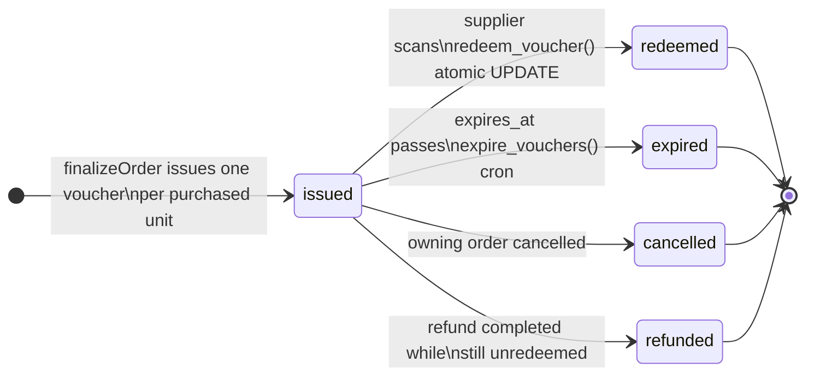
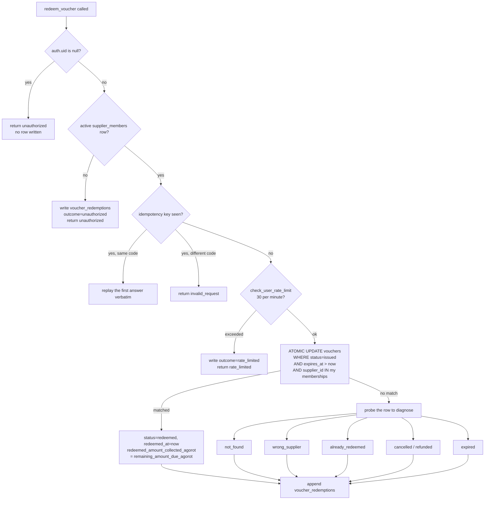

# Voucher Lifecycle

A voucher is what the customer actually buys. It is created when an order is
finalized, it is scanned once at the supplier's counter, and every state it can
reach after `issued` is terminal.

Verified against production (`ixvwfbuvfxxsjiywhbbb`) on **2026-09-01**. The
`voucher_status` values below are the live enum, not a design.

Companion documents: `docs/PAYMENT-FLOW.md` (how the money got here),
`docs/SUPPLIER-PAGE.md` (the scanning surface),
`docs/ARCHITECTURE-OVERVIEW.md` §4.

---

## 1. The states



`voucher_status` in production is exactly: `issued`, `redeemed`, `expired`,
`cancelled`, `refunded`.

**There is no transition guard on `vouchers`.** Migration 137 is applied and
guards `orders`, `order_items` and `payments`; it never covered this table and
production carries no trigger on it (checked against `pg_trigger`, 2026-09-01).
The diagram above is therefore an application contract, held up by the atomic
`UPDATE ... WHERE status = 'issued'` in §3 and by the cron in §5, not by
anything the database will refuse on your behalf. A `service_role` statement can
put a voucher into any state the enum carries.

**Every non-`issued` state is terminal, and that is a deliberate property rather
than an omission.** Once a voucher leaves `issued` there is nothing left to
move: either the value was consumed at the business, or the money went back to
the customer. There is no "un-redeem", no reactivation of an expired voucher,
and no path back from `refunded`. A customer who needs value restored after a
terminal state gets a **wallet credit**, which is a different money movement
against a different table.

---

## 2. Issue

`finalizeOrder` (`src/server/payments/finalize.ts`) issues vouchers as part of
the same transaction that moves the order to `paid`. Three properties matter:

**One voucher per purchased unit.** A line with `quantity = 3` produces three
vouchers, each independently scannable, because three people may walk into the
business on three different days.

**Issuing is idempotent.** Vouchers are keyed on `order_item_id` and the count
is capped at `quantity`. A webhook Cardcom delivers five times issues one set of
vouchers, not five. `UNIQUE(code)` is the backstop.

**The money is split per unit, with the first unit absorbing the remainder.**
Splitting 1000 agorot across 3 units gives 334 / 333 / 333, never 333.33. This
keeps the conservation CHECK satisfiable in integers.

Each voucher freezes its own money at issue time:

| Column | Meaning |
|---|---|
| `face_value_agorot` | the full value of the deal at the business |
| `coupon_price_agorot` | what was already paid on the site |
| `remaining_amount_due_agorot` | what the business collects in cash |
| `platform_percent` | the rate snapshot, `numeric` whole percent |

Bound by a database CHECK that no writer can bypass:

```sql
vouchers_conservation
  face_value_agorot = coupon_price_agorot + remaining_amount_due_agorot
```

Also frozen at issue: `offer_valid_until` (the deal's own deadline) and
`expires_at` (this voucher's deadline). They are separate columns because a deal
can stop being offered while vouchers already sold under it remain valid.

---

## 3. The code and the QR

### The short code

Ten symbols of **Crockford base32 with `I`, `L`, `O` and `U` removed**:

```
alphabet  0123456789ABCDEFGHJKMNPQRSTVWXYZ
pattern   ^[0-9A-HJKMNP-TV-Z]{10}$          (matches the DB CHECK exactly)
space     32^10 = 2^50 ~ 1.1e15
```

The removed letters are the ones that get misheard and mistyped. This code is
**read aloud across a counter and typed by hand**, so it is displayed grouped in
fives and stored without the separator. `normalizeVoucherCode` strips separators
and whitespace and upper-cases before lookup.

Generation rejects bytes at or above 256 (the largest multiple of 32 that fits
in a byte) so no symbol is favoured. A bare `byte % 32` would bias the symbols
`0` through `7`, which is the classic modulo-bias bug and would shrink the
effective code space.

### The QR payload

```
KEV1.<base64url(JSON payload)>.<base64url(HMAC-SHA256)>
```

The payload carries `{ v, c: code, s: supplier_id, u: user_id, e: expiry_unix,
k: key_id }`. The MAC covers the **full `KEV1.<payload>` prefix**, so the
version byte cannot be swapped without breaking the signature.

**The QR proves the platform minted it. It is not an authorization token.**
Single use is decided by the database, never by possession of a valid payload.
Someone who screenshots a valid QR and presents it twice gets `already_redeemed`
on the second scan, because the guard is a conditional UPDATE and not a
signature check.

`k` (key id) exists so `VOUCHER_QR_SECRET` can be rotated with
`VOUCHER_QR_SECRET_PREVIOUS` accepted during the window. This deliberately does
not reuse `src/server/domain/orders/redemption.ts`, whose digest is a bare
unsigned SHA-256 and is forgeable by anyone with a copy of the repository.

---

## 4. Redemption

Redemption happens entirely inside **`redeem_voucher()`**, a `SECURITY DEFINER`
Postgres function with a pinned `search_path`. It is the only path to the
terminal `redeemed` state. Its signature:

```sql
redeem_voucher(
  p_code             text,
  p_scan_method      text default 'manual',   -- 'camera' | 'manual'
  p_idempotency_key  text default null,
  p_ip               text default null,
  p_user_agent       text default null
) returns jsonb
```

`EXECUTE` is granted to `authenticated` and `service_role`, never to `anon`.

### The guard order, which is the design



Six properties worth naming, because each one is load-bearing:

1. **Authentication first, membership second.** A caller who is not an active
   supplier member has their attempt **written to `voucher_redemptions` before
   the refusal returns**, so probing by a logged-in stranger is recorded rather
   than silently rejected.

2. **Idempotency is checked before the rate limit.** A retried request under the
   same key replays the first answer verbatim and does not consume rate-limit
   budget. A replay under the same key with a *different* code returns
   `invalid_request` rather than answering about the new code, which stops an
   idempotency key from being reused as an oracle.

3. **Rate limit: 30 scans per user per minute**, via `check_user_rate_limit`.
   The code space is 2^50, so this is not the primary defence, but it caps an
   automated sweep at a rate a human at a counter never reaches.

4. **Single use is one conditional UPDATE**, not a read followed by a write:

   ```sql
   UPDATE vouchers SET status = 'redeemed', ...
   WHERE code = v_code
     AND status = 'issued'
     AND expires_at > now()
     AND supplier_id IN (SELECT supplier_id FROM supplier_members
                         WHERE user_id = v_uid AND is_active)
   ```

   Two concurrent scans of the same code cannot both succeed, because the second
   one's `status = 'issued'` predicate no longer matches. There is no window
   between the check and the write in which a race could fit.

5. **Diagnosis happens only after failure.** The function probes the row to
   distinguish `not_found`, `wrong_supplier`, `already_redeemed`, `cancelled`,
   `refunded` and `expired` **only if the UPDATE matched nothing**. The happy
   path does one statement.

6. **`wrong_supplier` reveals nothing else.** When the scanning member does not
   belong to the voucher's supplier, the function returns `wrong_supplier` and
   sets `v_supplier_id := NULL` on the audit row. It does not leak the status,
   the value, or the real supplier of someone else's voucher.

### `voucher_scan_outcome`

Every attempt, successful or not, appends a row to `voucher_redemptions` with
the outcome, IP address, user agent, scan method and idempotency key. The enum
has eleven values and is the complete vocabulary of what a scan can mean:

```
success, already_redeemed, expired, cancelled, refunded, wrong_supplier,
not_found, invalid_signature, invalid_request, unauthorized, rate_limited
```

### There is no money leg

`redeem_voucher` moves no money and **does not touch `order_items`**. From the
function body:

> No money leg. The whole prepayment settled to the platform when the order was
> paid, and `remaining_amount_due_agorot` is collected by the business in cash
> and never reaches us.

The order line is moved to `settlement_status = 'redeemed'` separately, by
`src/server/domain/vouchers/mark-order-item-redeemed.ts`, from
`REDEEMABLE_SETTLEMENT_STATUSES = platform_settled, paid, split_executed`.

**Two writers, two tables.** Any transition guard has to know both, and the
first version of migration 137 did not: it had no rule reaching `redeemed` at
all, so every scan would have raised `23514` after the customer had already been
charged. That is why it was blocked and rewritten. The version now applied
carries `platform_settled -> redeemed`, `paid -> redeemed` and
`split_executed -> redeemed`, which is `REDEEMABLE_SETTLEMENT_STATUSES` exactly.
See `docs/PAYMENT-FLOW.md` §2.1.

---

## 5. Expiry

Two deadlines, deliberately separate:

| Column | Meaning |
|---|---|
| `offer_valid_until` | the deal stopped being offered |
| `expires_at` | this voucher stops being redeemable |

The sweep is `expire_vouchers()`, reached through the Vercel cron route
`/api/cron/expire-vouchers`. Two companions:

- `enqueue_expiring_voucher_notices()` warns holders before the deadline, via
  `notification_outbox`.
- `credit_expired_vouchers()` handles the goodwill credit path for vouchers that
  expired unredeemed.

Migration `125_expire_vouchers_drop_escrow` rewrote `expire_vouchers()` to drop
the escrow leg, because there is no escrow to release.

> **Operational warning.** No scheduler is currently running. The cron routes
> exist and are correct, but they were removed from `vercel.json` on purpose
> (see `docs/RUNBOOK.md` §2 and `docs/CRON-EXTERNAL.md`). Until a scheduler is
> switched on, **vouchers do not expire on their own and expiry warnings are
> never sent.** This is the highest-impact consequence of the unscheduled cron
> situation on the voucher path.

---

## 6. Cancellation and refund

`cancel_vouchers_for_order(order_id)` and `refund_vouchers_for_order(order_id)`
are both `SECURITY DEFINER`, `service_role` only, and drive the whole order's
vouchers together.

The controlling refund rule lives in
`src/server/actions/payments/refund.ts`:

> A card refund is legal only while **every** voucher on the line is still
> `issued`.

Once one voucher is `redeemed` or `expired`, the value was consumed at the
business and the supplier has already been paid in cash by the customer. The
platform cannot un-consume it. A goodwill gesture after that point is a wallet
credit and does not touch the voucher row.

---

## 7. Gift vouchers

`vouchers` carries a gift block: `gift_recipient_name`, `gift_recipient_email`,
`gift_message`, `gift_claim_token_hash`, `gift_sent_at`, `gift_claimed_at`,
`gifted_by_user_id`. `orders` carries the matching intent fields captured at
checkout.

The claim token is stored **hashed**, not in plain text, so a database read does
not hand over the ability to claim outstanding gifts. Implementation:
`src/server/payments/gift-vouchers.ts`. Migration `108_gift_vouchers`.

---

## 8. Who can see a voucher

```sql
vouchers_select_unified   -- SELECT, role authenticated
  is_admin()
  OR user_id = (SELECT auth.uid())
  OR (redeemed_by_supplier_id IS NOT NULL
      AND is_supplier_member(redeemed_by_supplier_id))
```

Note the third clause: a supplier member can read a voucher **only after it has
been redeemed by their supplier**. A supplier cannot enumerate outstanding
vouchers issued against their business, which stops a supplier from learning how
much unredeemed liability is walking around and from correlating it to
individual customers.

`voucher_redemptions` has one policy and is otherwise server-side only.

---

## 9. Current production state

| | |
|---|---|
| `vouchers` rows | **0** |
| `voucher_redemptions` rows | **0** |
| `coupon_codes` rows | 2 (pre-voucher model) |
| Indexes on `vouchers` | 13, of which 8 never scanned |

No customer has completed a coupon purchase yet. The unused indexes on
`vouchers` are indexes for traffic that has not happened, not dead weight; see
`docs/INDEX-USAGE-REPORT.md` §1 before dropping any of them.

`coupon_codes` holds two rows from the model that predates vouchers, which
recorded consumption on the order line rather than on a voucher. That is why
`settlement_status = 'redeemed'` is reachable from `paid` and why
`REDEEMABLE_SETTLEMENT_STATUSES` still includes `platform_settled`.
